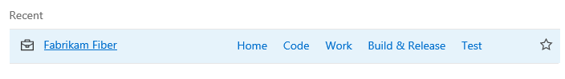
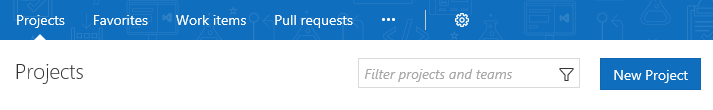
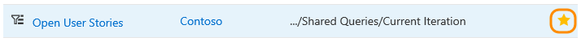
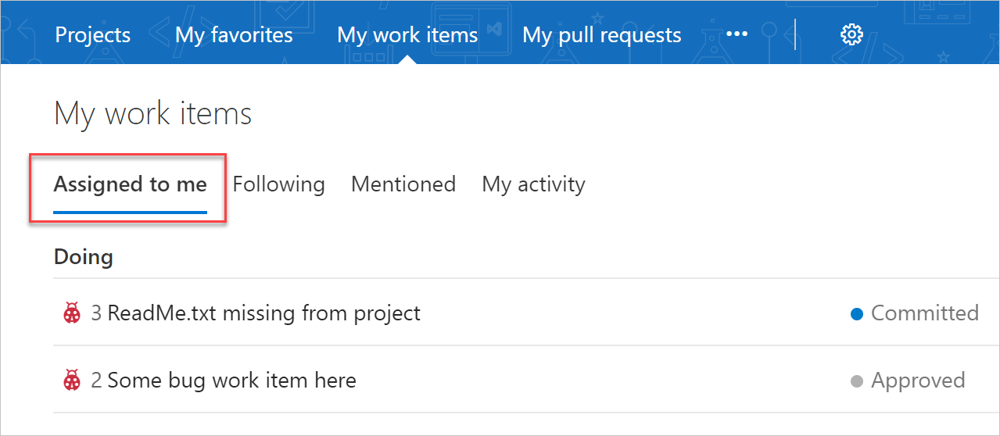
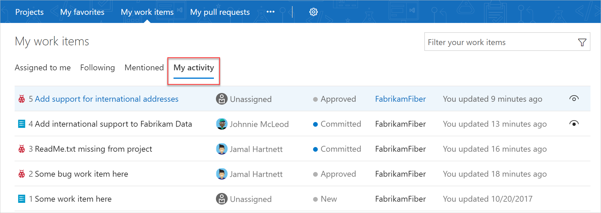
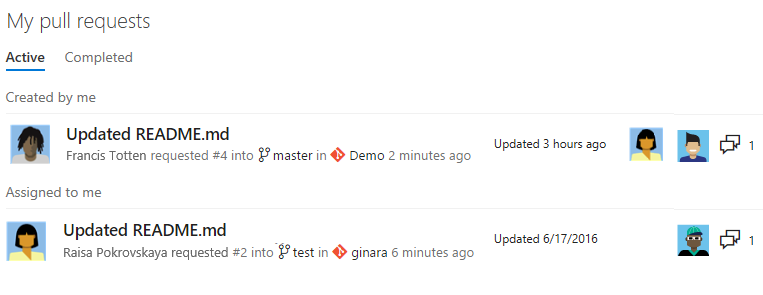
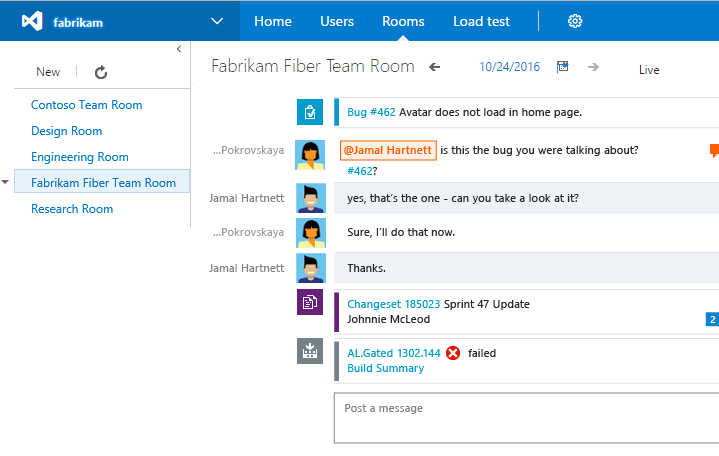

# Work effectively from your account hub

**VSTS | TFS 2018 | TFS 2017.1**

From your account, you gain access to a number of page views that are particularly helpful if you work in several team projects. These pages provide quick access and filter functions to support your work within a single team project or  work you're doing across several projects.  

For example, you can quickly access and navigate to work of interest from the following Account hubs:

::: moniker range="vsts"

- **Projects**: Team projects and teams within the projects that you work in  
- **My Favorites**: Items&mdash;such as build definitions, repositories, shared queries, and more &mdash;that you've favorited  
- **My work items**: Work items assigned to you, that you're following, or that you've recently viewed or updated  
- **My pull requests**: Pull requests you've initiated or that are relevant to you across all team projects you work in

::: moniker-end

::: moniker range="tfs-2018"
- **Projects**: Team projects and teams within the projects that you work in  
- **Favorites**: Items&mdash;such as build definitions, repositories, shared queries, and more &mdash;that you've favorited  
- **Work items**: Work items assigned to you, that you're following, or that you've recently viewed or updated  
- **Pull requests**: Pull requests you've initiated or that are relevant to you across all team projects you work in   

::: moniker-end

::: moniker range="tfs-2017"
- **Projects**: Team projects and teams within the projects that you work in  
- **Favorites**: Items&mdash;such as build definitions, repositories, shared queries, and more &mdash;that you've favorited  
- **Work items**: Work items assigned to you, that you're following, or that you've recently viewed or updated  
- **Pull requests**: Pull requests you've initiated or that are relevant to you across all team projects you work in   
- **Rooms**: Team rooms you use to collaborate with other team members.  

> [!NOTE]  
> The features described in this article require TFS 2017.1 and later versions. To upgrade to TFS 2017.1, go to the [Visual Studio downloads page](https://visualstudio.microsoft.com/downloads/download-visual-studio-vs).  

::: moniker-end

To access these pages, sign in to your VSTS organization and choose the  VSTS icon. The URL follows this pattern: 

<b>https://<i>AccountName</i>.visualstudio.com/_projects</b>

You'll see something similar to the following welcome page.

::: moniker range="vsts"
> [!div class="mx-imgBorder"]  
 
::: moniker-end

::: moniker range=">= tfs-2017 <= tfs-2018"
> [!div class="mx-imgBorder"]  
> 
::: moniker-end

## Projects: Navigate to a team project

From the **Projects** page you can quickly navigate to a team project or a team that you've accessed or worked in previously. Projects are listed in the order you've last accessed, with the most recent five projects accessed appearing first. All projects you've accessed are listed within the **All** section.  

::: moniker range="vsts"
> [!div class="mx-imgBorder"]  
> 
::: moniker-end

::: moniker range=">= tfs-2017 <= tfs-2018"
> [!div class="mx-imgBorder"]  
> 
::: moniker-end

As you hover over the project, you can choose one of the links to go to the Dashboards, Code, Work, Build and Release, Test, or Wiki of the team project. Choose the  star icon to mark the team project as a favorite.

### Filter projects and teams

If a project isn't listed, you can find it by searching for it using the *Filter projects and teams* search box. Simply type a keyword contained within the name of a team project or team. Here we type **Fabrikam** to find all projects and teams with *Fabrikam* in their title. 

> [!div class="mx-imgBorder"]  
>   

### Add a team project

If you're an account administrator or are a member of the Project Collection Administrators group, the New Project button is shown. Choose **New Project** to [add a team project](../organizations/accounts/create-team-project.md).

::: moniker range="vsts"

::: moniker-end

::: moniker range=">= tfs-2017 <= tfs-2018"

::: moniker-end

## Favorites: Open items you've marked as Favorites  

::: moniker range="vsts"
Open the **My favorites** page to quickly access any object or item that you've marked as a favorite.
::: moniker-end

::: moniker range=">= tfs-2017 <= tfs-2018"
Open the **Favorites** page to quickly access any object or item that you've marked as a favorite.
::: moniker-end

> [!div class="mx-imgBorder"]  
> 

Favorited objects can include the following:

- Team projects
- Repositories
- Work item queries
- Plans (requires installation of the [Delivery Plans extension](../work/scale/review-team-plans.md))
- Build definitions  
- Test plans

### Mark an object as a favorite

To mark any object as a favorite, choose the  next to the object.

### Remove an item from your favorites list

To remove an item from your favorites list, choose the favorited icon.

### Filter the list of favorites

To filter the list, type a keyword in the *Filter favorites* box. The list will filter based on keyword matches to the title or team project name associated with the favorited item.

## Work: View and open work items

::: moniker range="vsts"
Open the **My work items** hub to access the set of work items assigned to you or followed by you. The lists available from each page span all team projects that you work in.
::: moniker-end

::: moniker range=">= tfs-2017 <= tfs-2018"
Open the **Work items** hub to access the set of work items assigned to you or followed by you. The lists available from each page span all team projects that you work in.
::: moniker-end

::: moniker range=">= tfs-2018"
> [!NOTE]  
> You can also access the **My work items** hub [from a mobile device](../project/navigation/mobile-work.md).
::: moniker-end

### View your assigned work items

The **Assigned to me** page lists all work items assigned to you in the order they were last updated. To open or update a work item, choose its title.

::: moniker range="vsts"
> [!div class="mx-imgBorder"]  
>   
::: moniker-end

::: moniker range=">= tfs-2017 <= tfs-2018"
 
::: moniker-end

### Work you're following

Choose **Following** to open the page that lists all the work items [you've marked to follow](../work/work-items/follow-work-items.md).

::: moniker range="vsts"
> [!div class="mx-imgBorder"]  
>   
::: moniker-end

::: moniker range=">= tfs-2017 <= tfs-2018"
 
::: moniker-end

To stop following an item and remove it from your list, choose the  following icon.

::: moniker range="vsts"
### My activity

Choose **My activity** to open the page that lists all work items that you have recently viewed or updated.  

> [!div class="mx-imgBorder"]  
>  

::: moniker-end 

### Filter the list of work items

Similar to the Favorites page, you can filter the work pages by typing a keyword in the *Filter your work items...* box. The list will filter based on keyword matches to the work item ID, title, state, or team project name.

## Pull requests: View and open pull requests

Open the **Pull requests** page to access any pull request that's relevant to you across all team projects you work in. Choose **Active** or **Completed** to pivot between the active or completed set of pull requests. To initiate a pull request, choose **New pull request**.

::: moniker range="vsts"
> [!div class="mx-imgBorder"]  
>   
::: moniker-end

::: moniker range=">= tfs-2017 <= tfs-2018"
 
::: moniker-end

From each page, you're one choice away from navigating to the branch or repository for a pull request. This mirrors capabilities on the  project **Code>Pull Requests** page.

### Filter the list of pull requests

Similar to the Favorites page, you can filter the list by typing a keyword in the *Filter pull requests* box.

::: moniker range="tfs-2017"
## Rooms: Navigate to a team room

To open a team room, choose **Rooms**. You'll see all the team rooms defined for the account. Choose the name of a team room which you have access. You only have access to those team rooms of which you are a team member.  

   

To learn more about team rooms, see [Collaborate in a team room](../notifications/collaborate-in-a-team-room.md).

> [!NOTE]  
> Team Rooms have been deprecated for VSTS and TFS 2018 and later versions as described in this blog post, [Deprecation of the Team Rooms in VSTS and TFS](https://blogs.msdn.microsoft.com/devops/2017/01/04/deprecation-of-the-team-rooms-in-team-services-and-tfs/). Several good solutions are available that integrate well with TFS that support notifications and chat, such as [Microsoft Teams](../service-hooks/services/teams.md) and [Slack](../service-hooks/services/slack.md). As a result, the Team Room feature will be deprecated from both Visual Studio Team Services (VSTS) and Team Foundation Server (TFS).  
 
::: moniker-end

## Related notes

- [Enable preview features](../project/navigation/preview-features.md)  
- [Work in the web portal](work-web-portal.md)
- [Connect to team projects](connect-team-projects.md)  
