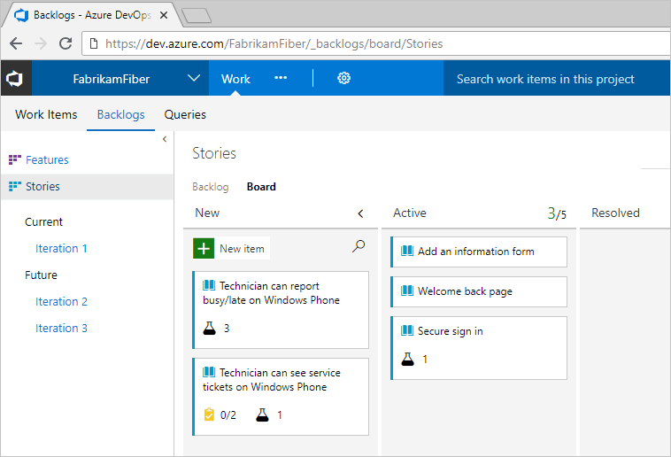
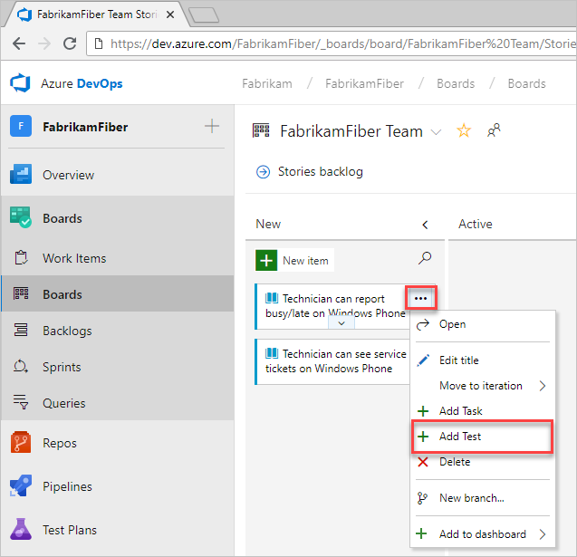
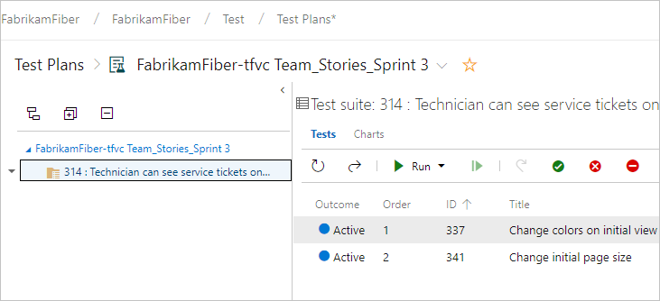
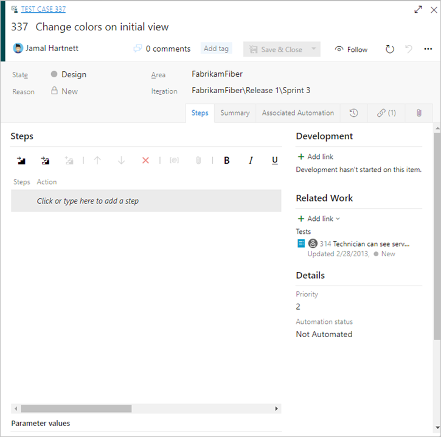
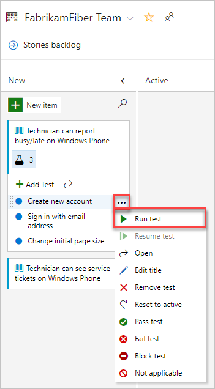
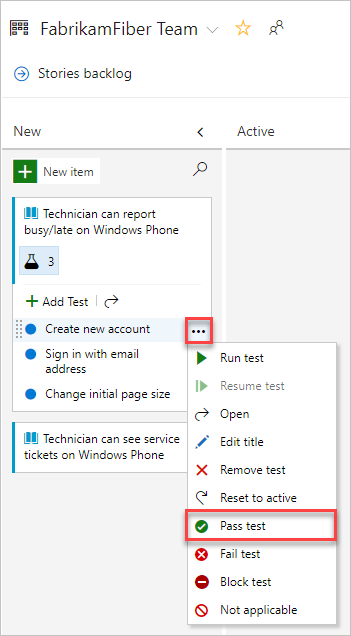
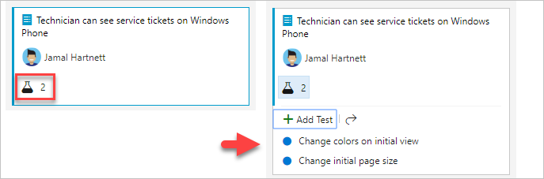

# Add, run, update inline tests

[!INCLUDE [version-tfs-2017-through-vsts](../includes/version-tfs-2017-through-vsts.md)]

Learn how to add, run, update, and expand and collapse inline tests in Azure DevOps.

To start manual testing, add the test to the user story or bug that you want to test. From the Kanban board, you can define inline tests or a set of manual tests for a backlog item. You also can run these tests and update their status. If you're new to working with the Kanban board, see the [Kanban quickstart](../boards/boards/kanban-quickstart.md).

Tests you create from the Kanban board are automatically linked to the user story or backlog item.  

## Open your Kanban board

::: moniker range=">= azure-devops-2019"

1. From your web browser, open the project for your organization and select **Azure Boards**. If you don't have a project, [create one now](sign-up-invite-teammates.md). If you haven't been added as a team member, [get invited now](sign-up-invite-teammates.md#invite-others).

	The URL follows this pattern: ```https://dev.azure.com/fabrikamfiber/_boards/board```  

	If you don't see the team or project you want, select  **Azure DevOps** to [browse all projects and teams](../project/navigation/work-across-projects.md).  

2. Select **Boards** to open the Kanban board.

   

::: moniker-end

::: moniker range="<= tfs-2018"

1. From your web browser, open the project for your organization and select **Azure Boards**. If you don't have a project, [create one now](sign-up-invite-teammates.md). If you haven't been added as a team member, [get invited now](sign-up-invite-teammates.md#invite-others).

	The URL follows this pattern: ```https://dev.azure.com/fabrikamfiber/_backlogs/board```  

	If you don't see the team or project you want, select  **Azure DevOps** to [browse all projects and teams](../project/navigation/work-across-projects.md).  

2. Select **Board** to open the Kanban board.

    

::: moniker-end

## Add tests

::: moniker range=">= azure-devops-2019"

1. To add tests, open the menu for a work item.

   

   Inline tests are the same as test cases in a test suite. A default test plan and test suite automatically get created under which the manual test cases are grouped.  

	For example, a test suite is created for the following user story, and inline tests are added to that suite. User story 314 is highlighted. It has two manual tests defined with the IDs 337 and 341.  

   

2. If you have a number of tests to add, enter each title and select **Enter**.

   

	To add details to the test case, open it. You can select the title, double-select the inline item, or open the context menu and choose **Open**.

   

To learn more about how to define tests, see [Create manual tests](../test/create-test-cases.md).

Before you run the test, you must add details.

::: moniker-end

::: moniker range="<= tfs-2018"

1. To add tests, open the menu for the work item.

	

	Inline tests are the same as test cases in a test suite. A default test plan and test suite automatically get created under which the manual test cases are grouped. 

	For example, a test suite gets created for each user story, and all inline tests are added to that suite. The following user story 152 is highlighted. It has three manual tests defined with the IDs 153, 155, and 161.  

	 

	To learn more about test plans and test suites, see [Plan your tests](../test/create-a-test-plan.md).  

2. If you have a number of tests to add, enter each title and select **Enter**.

	   

	To add details to the test case, open it. You can select the title, double-select the inline item, or open the context menu and choose **Open**.

	

To learn more about how to define tests, see [Create manual tests](../test/create-test-cases.md).

Before you run the test, you must add details.

::: moniker-end

---

## Run a test

::: moniker range=">= azure-devops-2019"

Run the test by selecting  **Run test** from the  actions menu for the inline test.



Microsoft Test Runner starts in a new browser instance. For information on how to run a test, see [Run manual tests](../test/run-manual-tests.md).
::: moniker-end

::: moniker range="<= tfs-2018"

Run the test by selecting  **Run test** from the  actions menu for the inline test.  

  

Microsoft Test Runner starts in a new browser instance. For information on how to run a test, see [Run manual tests](../test/run-manual-tests.md).
::: moniker-end

## Update the status of a test

::: moniker range=">= azure-devops-2019"

You can update the status of the test from the  actions menu.



When you update the status of tests, you can [track test results](../test/track-test-status.md).

::: moniker-end

::: moniker range="<= tfs-2018"

You can update the status of the test from the  actions menu.

   

When you update the status of tests, you can [track test results](../test/track-test-status.md).  

::: moniker-end

## Expand or collapse inline tests

::: moniker range=">= azure-devops-2019"

When you first open the Kanban board, you'll see an unexpanded view of checklists and tests.

   

Select the inline test summary to expand a collapsed set of tests. Select the same summary to collapse an expanded list.



::: moniker-end

::: moniker range="<= tfs-2018"  

When you first open the Kanban board, you'll see an unexpanded view of checklists.

   

Select the inline test summary to expand a collapsed set of tests. Select the same summary to collapse an expanded list.

   

::: moniker-end

## Next steps
  
> [!div class="nextstepaction"]
> [Kanban quickstart](../boards/boards/kanban-quickstart.md)

## Related articles
- [Learn more about test case management](../test/create-test-cases.md)
- [Exploratory test your web app directly in your browser](../test/perform-exploratory-tests.md)
- [Essential services](services.md)
- [Client-server tools](tools.md)
- [Software development roles](roles.md)


