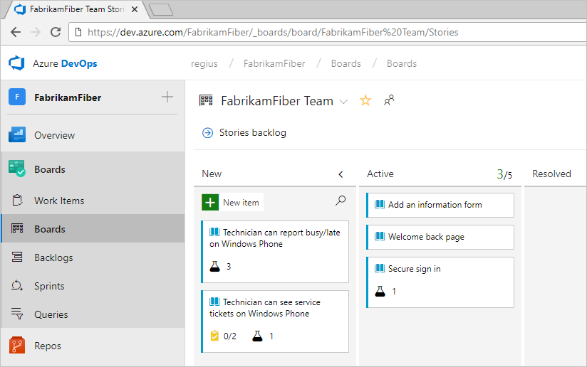
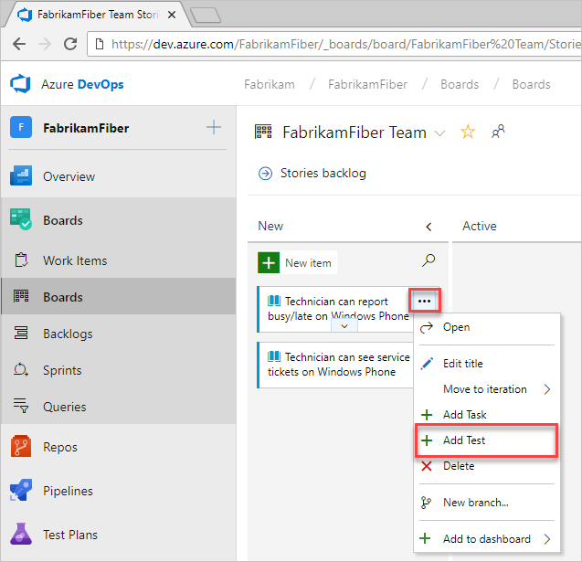
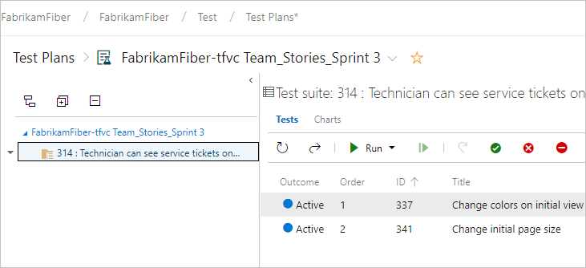
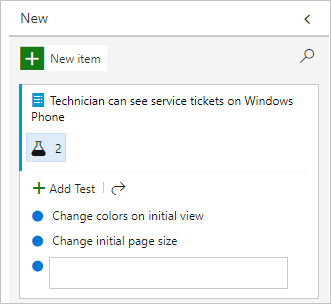
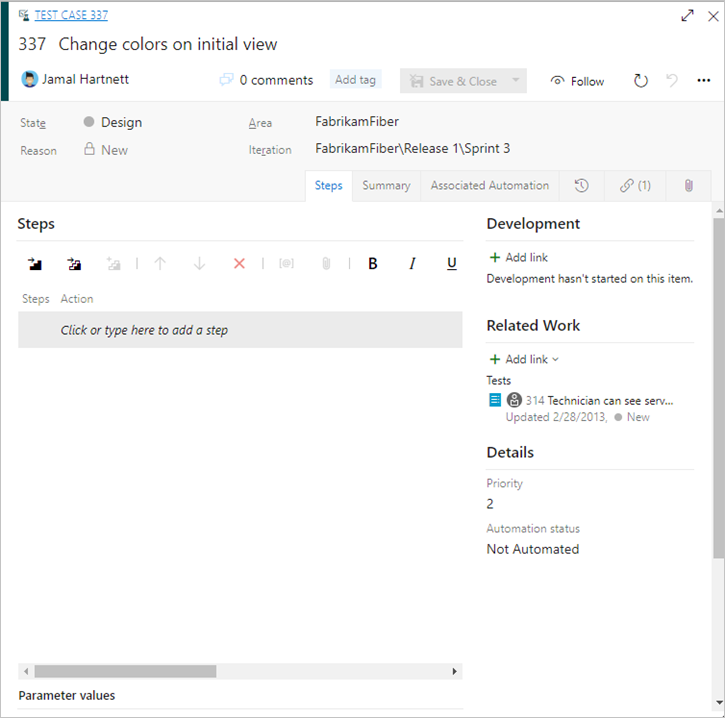
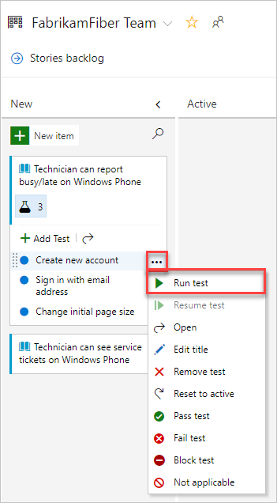
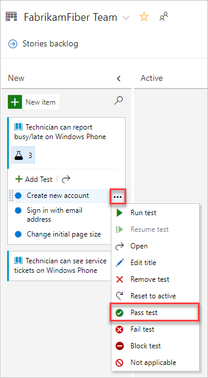
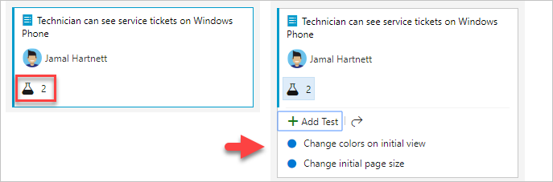

# Manage manual inline tests

[!INCLUDE [version-lt-eq-azure-devops](../includes/version-lt-eq-azure-devops.md)]

Inline tests let you add, run, and track manual test cases directly from your [board](../boards/boards/kanban-quickstart.md). Each test you create automatically links to its parent user story or bug, so test coverage stays visible alongside your work.  

[!INCLUDE [ai-assistance-mcp-server-tip](../includes/ai-assistance-mcp-server-tip.md)]

## Prerequisites

[!INCLUDE [prerequisites-project-member-only](../includes/prerequisites-project-member-only.md)]

## Open your board

::: moniker range="<=azure-devops"

1. From your web browser, open the project for your organization and select **Azure Boards**. If you don't have a project, [create one now](../organizations/projects/create-project.md). If you aren't a team member, [get invited now](../organizations/security/add-users-team-project.md).

	The URL follows this pattern: ```https://dev.azure.com/fabrikamfiber/_boards/board```  

	If you don't see the team or project you want, select  **Azure DevOps** to [browse all projects and teams](../project/navigation/work-across-projects.md).  

2. Select **Boards** to open the board.

   

::: moniker-end

## Add tests

::: moniker range="<=azure-devops"

1. To add tests, open the menu for a work item.

   

   Inline tests are the same as test cases in a test suite. A default test plan and test suite automatically get created under which the manual test cases are grouped. You can find the auto-created test plan in **Test Plans** > **Mine**.

	For example, a test suite is created for the following user story, and inline tests are added to that suite. User story 314 is highlighted. It has two manual tests defined with the IDs 337 and 341.  

   

2. If you need to add many tests, enter each title and select **Enter**.

   

	To add details to the test case, open it. You can select the title, double-select the inline item, or open the context menu and choose **Open**. From the test case form, you can add test steps, expected results, and attachments.

   

   For more information about defining tests, see [Create manual tests](../test/create-test-cases.md).

::: moniker-end

## Run a test

::: moniker range="<=azure-devops"

Run the test by selecting  **Run test** from the  actions menu for the inline test.



Microsoft Test Runner starts in a new browser instance. For information on how to run a test, see [Run manual tests](../test/run-manual-tests.md).
::: moniker-end

## Update the status of a test

::: moniker range="<=azure-devops"

You can update the status of the test from the  actions menu.



When you update the status of tests, you can [track test results](../test/track-test-status.md).

::: moniker-end

## Delete a test

::: moniker range="<=azure-devops"

To remove an inline test, open the  actions menu for the test and select **Delete**. Deleting a test permanently removes the test case work item and its link to the parent user story or bug.

::: moniker-end

## Expand or collapse inline tests

::: moniker range="<=azure-devops"

When you first open the board, you see a view of checklists and tests that isn't expanded.

   

Select the inline test summary to expand a set of tests that you collapsed. Select the same summary to collapse a list that you expanded.



::: moniker-end

::: moniker range="azure-devops"

<a id="use-ai-assistance"></a>

## Use AI to manage inline tests

If you configure the [Azure DevOps MCP Server](../mcp-server/mcp-server-overview.md), you can use AI assistants to manage test cases through natural language prompts.

### Example prompts for inline test management

| Task | Example prompt |
|------|----------------|
| View test cases | `List test cases linked to user story <1234> in <Contoso> project` |
| Check test status | `Show test results for the latest test run in <Contoso> project` |
| Find untested items | `List user stories in <Contoso> that have no linked test cases` |
| Review test coverage | `Show all backlog items in <Contoso> with failing inline tests` |
| Find test gaps | `List active user stories in area path <Contoso\Backend> that have zero test cases` |
| Prep for a sprint review | `Summarize test pass rates for all user stories in the current sprint for <Contoso> project` |
| Spot regressions | `List test cases in <Contoso> that passed last sprint but failed in the current sprint` |
| Prioritize testing | `Show the highest-priority user stories in <Contoso> that still have untested test cases` |

::: moniker-end

## Next step
  
> [!div class="nextstepaction"]
> [Create manual tests](../test/create-test-cases.md)

## Related content
- [Run manual tests](../test/run-manual-tests.md)
- [Exploratory test your web app directly in your browser](../test/perform-exploratory-tests.md)
- [Essential services](services.md)
- [Client-server tools](tools.md)
- [Software development roles](roles.md)
