# What are the features in Azure DevOps?

[!INCLUDE [temp](../_shared/version-vsts-tfs-all-versions.md)]

Learn about all the features available to help you plan and track your projects and code, build, test, and release your software applications in Azure DevOps.  

If you're new to Azure DevOps, see our overview articles that are designed to give beginners an understanding of the server-client structure and tools supported. For a description of the core services supported through the web portal, see [Essential services](services.md).

> [!NOTE]  
> Some features are platform-dependent, based on the following two platforms:
> 
>- **Azure DevOps Services** - cloud service
>- **Azure DevOps Server** - on-premises

## Access and supported clients

<table>
<tbody>
<tr valign="top">
<td width="30%">

<b>Browsers</b>

[Connect to the web portal](../organizations/projects/connect-to-projects.md) from the latest versions of these supported browsers:  
- Chrome  
- Microsoft Edge    
- Firefox   
- Internet Explorer   
- Safari (Mac)        
 

<b>Integrated Development Environments (IDE)
</b>

Track work and integrate with your code, build, and test environments from the following clients:   
- [Eclipse (Team Explorer Everywhere)](/../java/download-eclipse-plug-in)       
- [Visual Studio](https://visualstudio.microsoft.com/downloads/)      
- [Android Studio](/../java/download-android-studio-plug-in)     
- [IntelliJ](/../java/download-intellij-plug-in)   
- [Visual Studio Code](/../java/vscode-extension)   
 
To learn how to connect, see [Connect to a project](../organizations/projects/connect-to-projects.md).  
 

<b>Office integration clients</b>

Use features supported by these familiar clients to manage your project and illustrate your requirements.  
- [Excel](../boards/backlogs/office/bulk-add-modify-work-items-excel.md)  
- [Project](../boards/backlogs/office/create-your-backlog-tasks-using-project.md)  
- [PowerPoint - Storyboarding](../boards/backlogs/office/storyboard-your-ideas-using-powerpoint.md)   

</td>
<td width="30%">

<b>Manage users and groups</b>

Add members to your project adds them to the Contributor group. When managing a large group of users, use [built-in groups to manage users and their permissions](../organizations/security/permissions.md).

 

<b>Add team members </b>

To share and contribute to your project, add users to [Azure DevOps Services](../organizations/accounts/add-team-members.md) or your [TFS](../organizations/settings/add-teams.md#add-team-members).

  
 

<b>Azure Active Directory (Azure AD) (Azure DevOps Services)</b>

Control who can access your team's critical resources and key business assets by [managing access with Azure Active Directory groups](../organizations/accounts/manage-azure-active-directory-groups.md). 

</td>
<td width="30%">

<b>Access levels</b>

All users that you add to your Azure DevOps organization or to your TFS project have access to Basic features by default, except [Stakeholders](../organizations/security/get-started-stakeholder.md) who have access to a limited set of features, or those added to the Advanced access level in TFS.

- [Manage users (Azure DevOps Services)](../organizations/accounts/add-organization-users.md)
- [Change access levels (TFS)](../organizations/security/change-access-levels.md)  
 

<b>Permissions</b>

Control access to specific features by setting permissions for a user or group.

- [Area and iteration paths](../organizations/security/set-permissions-access-work-tracking.md)  
- [Build & Release](../pipelines/policies/set-permissions.md)  
- [Git](../organizations/security/set-git-tfvc-repository-permissions.md)  
- [TFVC](../organizations/security/set-git-tfvc-repository-permissions.md)  
- [Dashboards](../report/dashboard-permissions.md)   
- [Queries](../boards/queries/set-query-permissions.md)   
- [Manage teams and configure team tools](../organizations/settings/manage-teams.md)  
- [Test](../organizations/security/set-project-collection-level-permissions.md)  
- [Work item tags](../organizations/security/permissions.md#tags)  

</td>
</tr>
</tbody>
</table>

##Agile tools to plan and track work  

###Backlogs

<table>
<tbody>
<tr valign="top">
<td width="320">

<b>Create your backlog</b>

Plan your project by [adding a work item for each user story or requirement](../boards/backlogs/create-your-backlog.md) you plan to develop.  

  
  

<b>Organize your backlog</b>

[Group items into a hierarchical list using portfolio backlogs](../boards/backlogs/organize-backlog.md) and quickly reorder and re-parent items to effectively manage your deliverables. 

<b>Forecast</b>

Use the [forecast](../boards/sprints/forecast.md) tool to estimate work to be completed in future sprints. 

  

<b>Storyboard</b>

Visualize your ideas and user stories and support greater understanding of them by [storyboarding them with PowerPoint](../boards/backlogs/office/storyboard-your-ideas-using-powerpoint.md), also link your storyboards to your backlog work items.  

</td>
<td width="320">

<b>Move work item to a different project (Azure DevOps Services)</b>

Choose the  Change project menu option,  Actions menu in a work item form to [move the work item to a different project](../boards/backlogs/remove-delete-work-items.md#move). 

<b>Full screen mode</b>

Choose  or   to enter or exit full screen mode.  

<b>Backlog and board settings</b>

Choose   to configure team backlogs and boards, including [show bugs on backlogs and boards](../organizations/settings/show-bugs-on-backlog.md) and [set team backlog levels](../organizations/settings/select-backlog-navigation-levels.md).  

  
 

<b>View portfolio backlog hierarchy</b>

Use [**Parents Show/Hide**](../boards/backlogs/organize-backlog.md) to drill down into the backlog hierarchy.   

<b>Multi-team backlog ownership</b>

Easily view and track items [owned by other teams](../boards/backlogs/backlogs-overview.md#multi-team) and quickly reorder and re-parent items to effectively manage your backlog. 

</td>

<td width="30%">

<b>Change work item type (Azure DevOps Services)</b>

If you added a task instead of a bug and want to change the work item type to bug, you can. Choose the  Change type option from the  Actions menu in a work item form to [change the work item type](../boards/backlogs/remove-delete-work-items.md#change-type). 

<b>Filter your backlog</b>

Use **Show/Hide in progress** to only show or hide items which have moved from the new or proposed state to active or in progress state.     

Additionally, you can list a subset of items based on keywords [keywords](../boards/backlogs/filter-backlogs.md) or [tags](../boards/queries/add-tags-to-work-items.md). 

  
  

<b>Request feedback</b>

[Request feedback on working software](../project/feedback/get-feedback.md) and easily track responses that capture interaction with video, verbal, or type-written comments.  

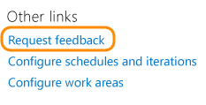  
  

<b>Feedback client</b>

Provide the free [Microsoft feedback client](../project/feedback/give-feedback.md) to capture their responses to your feedback requests. 

</td>
</tr>
</tbody>
</table>

### Bug, task, and issue tracking

<table>
<tbody>
<tr valign="top">
<td width="33%">

<b>Track issues and other types of work</b>

Different types of work items [track different types of work](../boards/backlogs/add-work-items.md) - such as bugs, test cases, risks, issues, and more. 

  

  

<b>Bulk modify</b>

Quickly change one or more fields in several work items using [bulk modify in the web portal](../boards/backlogs/bulk-modify-work-items.md) or [bulk modify using Excel](../boards/backlogs/office/bulk-add-modify-work-items-excel.md). 

<b>Copy or clone a work item</b>

[Copy an existing work item](../boards/backlogs/copy-clone-work-items.md#copy-clone) or bulk copy several using [Excel](../boards/backlogs/office/bulk-add-modify-work-items-excel.md).

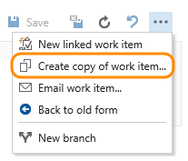  
  

<b>Follow a work item </b>

Choose the / Follow/Following icons to quickly [start or stop tracking changes made to a work item](../boards/work-items/follow-work-items.md).  

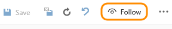  
 

<b>Rich text comments</b>

Describe and comment on work using [formatted text, hyperlinks, and inline images](../boards/backlogs/add-work-items.md). Choose  or   to expand or contract the viewing area. 

<b>Clear HTML formatting </b>

Use the  icon or CTRL+Spacebar to remove formatting from highlighted text.

<b>Attachments</b>

To support collaboration of work in progress, [add emails, documents, images, log files, or other file types](../boards/queries/share-plans.md#attach-files) to work items.  

</td>
<td width="33%">

<b>Estimates and time tracking</b>

Track [estimated, completed, and remaining work](https://msdn.microsoft.com/library/dd997792.aspx) for tasks and other work items. Several reports and dashboards provide charts that display data based on team capacity and remaining work.

<b>New work item experience</b>

The [new work item experience](../reference/process/new-work-item-experience.md) provides access to a more modern form, additional features, and the ability to add fields and apply other customizations to the work item type. 

<b>Manage bugs</b>

[Capture and triage bugs](../boards/backlogs/manage-bugs.md) using different kinds of tools. 

<b>Choose how you want to track bugs</b>

Each team can [choose to manage bugs on their backlog or along with tasks](../organizations/settings/show-bugs-on-backlog.md). 

<b>Share plans and information</b>

Share information using work items and [generate summary lists with links to backlogs or queries](../boards/queries/share-plans.md). 

<b>Remove or delete a work item</b>

Remove work items from the backlog by changing their State to Removed. Or, [move them to the recycle bin or permanently delete them](../boards/backlogs/remove-delete-work-items.md).

  
  

<b>Tags</b>

[Add tags to work items](../boards/queries/add-tags-to-work-items.md) to filter backlogs and queries. [Bulk update work items](../boards/backlogs/bulk-modify-work-items.md#tags) or [use work item templates](../boards/backlogs/work-item-template.md) to add or remove tags. 

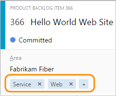  
 

<b>Work item templates</b>

Quickly add new work items based on templates [with  pre-populate values for your team's commonly used fields](../boards/backlogs/work-item-template.md). 

<b>History & auditing</b>

Review and query [work item change history](../boards/queries/history-and-auditing.md) to learn of past decisions and support future ones.

</td>
<td width="33%">

<b>Discussion </b>

[Add or review comments](../boards/backlogs/add-work-items.md) added to a work item. Start by choosing the  discussion icon.  

<b>Integrate Git development with work tracking </b>

Drive Git development and stay in sync as a team to complete backlog items and tasks using the [Git Development section](../boards/backlogs/connect-work-items-to-git-dev-ops.md). Add branches, create pull requests, and view all development done to support the specific work item.  

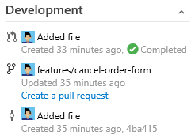  
 

<b>Verify a bug, rerun test case</b>

Choose the **Verify** option from the bug work item form context menu to launch the relevant test case in the web runner. For more information, see [Run tests for web apps](../test/run-manual-tests.md). 

<b>Link work items  </b>

Track related work, dependencies, and changes made over time by [linking work items](../boards/queries/link-work-items-support-traceability.md). 

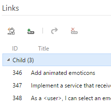  
 

<b>Add or modify a field </b>

Add a custom field ([Azure DevOps Services](../organizations/settings/work/customize-process.md) | [TFS](../reference/add-modify-field.md) to support tracking additional data requirements or modify an existing field to apply optional rules. 

<b>Restrict access</b>

[Limit who can create or modify work items or a work item field](https://msdn.microsoft.com/library/dn249791.aspx) based on area path, work item type, or based on your specific conditions. 

<b>Field index </b>

Find descriptions and usage information for each field from the [work item field index](../boards/work-items/guidance/work-item-field.md). 

</td>
</tr>
</tbody>
</table>

::: moniker range="azure-devops"

### Customize (Azure DevOps Services)

<table>
<tbody>
<tr valign="top">
<td width="33%">

<b>Create an inherited process</b>

The first step in customizing a project is to [create an inherited process](../organizations/settings/work/manage-process.md#create-inherited-process). You can only customize inherited processes.  

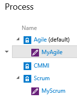   
 

<b>New work item experience </b>

The [new work item experience](../reference/process/new-work-item-experience.md) provides access to a more modern form, additional features, and the ability to add fields and apply other customizations to the work item type. 

<b>Customize a process</b>

Customizations you make to an inherited process automatically update all team projects that reference that process. You can customize your project as follows:

<ul>
<li>[Add and modify fields](../organizations/settings/work/customize-process-field.md)</li>
<li>[Modify the web form layout](../organizations/settings/work/customize-process-form.md)</li>
<li>[Modify the workflow states](../organizations/settings/work/customize-process-workflow.md) </li>
<li>[Add a custom work item type](../organizations/settings/work/customize-process-wit.md) </li>
<li>[Add a custom control](../organizations/settings/work/custom-controls-process.md) </li>
</ul>

<b>Change the process used by a project</b>

To apply customizations to one or more team projects, you [change the process they reference to a customized inherited process](../organizations/settings/work/manage-process.md#migrate).  

<b>Enable/disable a process</b>

To make sure no one creates a project from a process that you don't want used, [you can disable it](../organizations/settings/work/manage-process.md#enable-process).  

</td>

<td width="33%">

<b>Add or modify a field</b>

[Add a custom field](../organizations/settings/work/customize-process-field.md) to support tracking additional data requirements or modify an existing field to apply optional rules. 

   
 

<b>Remove a field from a form</b>

You can [remove a custom field and select inherited fields from a work item form](../organizations/settings/work/customize-process-field.md#remove-field). You can also [relabel the fields](../organizations/settings/work/customize-process-field.md#rename-field) that appear on the form.   

<b>Area path pick lists</b>

Change the [pick list of area paths](../organizations/settings/set-area-paths.md) to support grouping work items by team, product, or feature area. 

   
 

<b>Sprint/iteration pick lists</b>

Change the [pick list of iteration paths](../boards/sprints/define-sprints.md) to support grouping work into sprints, milestones, or other event-specific or time-related period. Activate sprints for each team. 

  
 
</td>

<td width="33%">

<b>Review fields</b>

You can [review the list of fields](../organizations/settings/work/customize-process-field.md#review-fields) defined for a process, their data type, and the WITs which reference them. For descriptions and usage of each field, see [Work item field index](../boards/work-items/guidance/work-item-field.md). 

<b>Delete a field from the collection</b>

You can [delete a custom field](../organizations/settings/work/customize-process-field.md#delete-field) if you find it's no longer required. 

<b>Customize the web form</b>

For each work item type, you can [add custom pages to group additional custom fields](../organizations/settings/work/customize-process-form.md) and you can organize your forms by placing logically related groups and HTML fields on separate pages within a form.    

   
 

<b>Add a custom work item type</b>

You can [add and modify a custom work item type](../organizations/settings/work/customize-process-wit.md).    

<b>Customize the workflow</b>

For each work item type, you can [add custom workflow states to support your business tracking needs](../organizations/settings/work/customize-process-workflow.md).    

<b>Delete a process</b>

Delete those inherited processes that you no longer want used. Simply choose the Delete option from its context menu.  

<b>Set process permissions</b>

To customize a process, add custom fields, or change the layout of a work item form, you must be a member of the Project Collection Administrators group or be [granted explicit permissions to edit a specific process](../organizations/security/set-permissions-access-work-tracking.md#process-permissions).  

</td>

</tr>
</tbody>
</table>

::: moniker-end

::: moniker range=">= tfs-2013 <= tfs-2018"

### Customize (TFS)

<table>
<tbody>
<tr valign="top">
<td width="33%">

<b>Add or modify a field </b>

[Add or modify a field](../reference/add-modify-field.md) to support work tracking and reporting by editing the WIT definition.

<b>Add rules to a field </b>

Apply [various rules to custom fields](../reference/xml/apply-rule-work-item-field.md) to qualify the value it can have, to copy a value, to specify a default, to restrict who can modify it, to enforce pattern matching, or to enforce conditional values.  

<b>Remove a field </b>

[Stop tracking a field by removing the field](../reference/add-modify-field.md) from the work item form of select work item types. 

</td>
<td width="33%">

<b>Area path pick lists</b>

Change the [pick list of area paths](../organizations/settings/set-area-paths.md) to support grouping work items by team, product, or feature area. 

<b>Sprint/iteration pick lists</b>

Change the [pick list of iteration paths](../boards/sprints/define-sprints.md) to support grouping work into sprints, milestones, or other event-specific or time-related period.

<b>Custom pick lists </b>

[Define or modify pick list values](https://msdn.microsoft.com/library/ms194947.aspx) by editing the work item type definition.

</td>
<td width="33%">

<b>Modify the workflow </b>

[Design your custom workflow](https://msdn.microsoft.com/library/ms194981.aspx) by adding states, transitions, reasons, and optional actions.

<b>Change the work item form </b>

[Change the layout of your work item form](https://msdn.microsoft.com/library/ms194952.aspx) by adding fields, custom controls, or tabs.

<b>Add a custom work item type </b>

[Add a custom work item type](https://msdn.microsoft.com/library/ms404855.aspx) to track different data requirements.

</td>
</tr>
</tbody>
</table>

::: moniker-end

### Kanban

<table>
<tbody>
<tr valign="top">
<td width="33%">

<b>Kanban basics</b>

Use your Kanban board to [visualize and track the flow of work](../boards/boards/kanban-basics.md) from idea to completion as well as quickly update work item fields

  
 

<b>Drag-n-drop</b>

[Drag and drop items](../boards/boards/reorder-cards.md) on the Kanban board to update status and to reorder and reparent items.  

<b>Add task checklists</b>

Add and mark tasks as done with [lightweight tasks checklists](../boards/boards/add-task-checklists.md). 

  
 

<b>Filter</b>

[Use key words to filter and find items](../boards/boards/filter-kanban-board.md#text-filter) on the Kanban board.

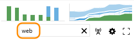  
 

</td>
<td width="33%">

<b>Set WIP limits</b>

[Set constraints on the amount of work your team undertakes at each work stage](../boards/boards/wip-limits.md) to gain access to sprint backlogs and task boards.

<b>Split columns</b>

Turn on split columns to [track the lag between when items are done in one state and work actually starts in a new state](../boards/boards/split-columns.md). 

<b>Map your workflow</b>

[Customize columns to support your team's workflow](../boards/boards/add-columns.md) and track work from start to finish. 

  
 

<b>Expedite work with swimlanes </b>

Use [swimlanes](../boards/boards/expedite-work.md) to track work at different service-level classes. 

<b>Definition of done</b>

Support your team to be in sync by [specifying requirements to fulfill prior to handoff of items to a downstream work stage](../boards/boards/definition-of-done.md).
  

<b>Filter by field values or parent work items</b>

Choose the  field filter icon to [filter the board based on assignment, iteration, work item type, or tags](../boards/boards/filter-kanban-board.md#field-filter). 

  
 

<b>Cumulative Flow Diagram </b>

With the CFD, you can [monitor the count of work items as they progressively move through various states which you define](../report/dashboards/cumulative-flow.md).  

</td>

<td width="33%">

<b>Customize cards</b>

[Add fields to cards](../boards/boards/customize-cards.md) that you can edit directly on your Kanban and task boards.
  
  
 

<b>Live updates </b>

[Enable live updates](../boards/boards/kanban-basics.md#live-updates) to automatically refresh your Kanban board when changes are made by others or to the board settings. 

  
 

<b>Add inline tests </b>

[Add, run, and update tests](../boards/boards/add-run-update-tests.md) with inline test on your Kanban board.   

<b>Add checklists to features and epics</b>

Add and mark user stories and other work items as done from your [Kanban features or epics boards](../boards/boards/kanban-epics-features-stories.md). 

<b>Set team's card reorder preference </b>

You can preserve the backlog priority when you move a card to a new column by setting your team's [Kanban board card reordering setting](../boards/boards/reorder-cards.md).  

<b>Enable/disable card annotations</b>

Turn on or off [task checklists or inline tests](../boards/boards/customize-cards.md#annotations) for your Kanban board. 

<b>Configure inline tests</b>

Configure how new inline tests are added to the Kanban board: [create a new test plan/test suite or choose an existing test plan](../boards/boards/customize-cards.md#tests). 

</td>

</tr>
</tbody>
</table>

###Scale

<table>
<tbody>
<tr valign="top">
<td width="33%">

<b>Add another team</b>

[Add and structure teams](../organizations/settings/add-teams.md) and organize work to support team autonomy and organizational alignment. Teams can manage their work independently of one another while the organization gains visibility across all teams. 

  
 

<b>Set team defaults</b>

Several Agile tools reference the team's default area path, iteration path, and activated sprints to automatically filter the set of work items they display. [Understand how defaults are used](../organizations/settings/about-teams-and-settings.md).

</td>
<td width="33%">

<b>Set up a team hierarchy</b>

By [configuring your teams and backlogs into an hierarchical structure](../boards/plans/portfolio-management.md), program owners can more easily track progress across teams, manage portfolios, and generate rollup data. 

<b>Autonomy and alignment</b>

As your organization grows, your tools can grow to support a [culture of team autonomy and organizational alignment](../boards/plans/agile-culture.md). 

<b>Scale your tools and practices</b>

Incrementally adopt [practices that scale](../boards/plans/practices-that-scale.md) to create greater rhythm and flow within your organization, engage customers, improve project visibility, and develop a productive workforce.

</td>
<td width="33%">

<b>Portfolio management</b>

Manage a [portfolio of backlogs](../boards/plans/portfolio-management.md) and gain insight into each team's progress as well as the progress of all programs.

 

<b>Scaled Agile Framework</b>

Structure team projects to support [epics, release trains, and multiple backlogs to support the Scaled Agile Framework](../boards/plans/scaled-agile-framework.md). 

</td>
</tr>
</tbody>
</table>  

###Scrum

<table>
<tbody>
<tr valign="top">
<td width="33%">

<b>Define sprints</b>

[Schedule and activate your team's sprints](../boards/sprints/define-sprints.md) to gain access to sprint backlogs and task boards.

<b>Select team sprints, set team defaults</b>

Several tools reference the team's default and active iteration paths or sprints. For the Agile tools to work best, each team needs to [set their team area path(s)](../organizations/settings/set-area-paths.md) and [iteration paths](../organizations/settings/set-iteration-paths-sprints.md) to support their work tracking activities. 

<b>Plan sprints</b>

Build your sprint backlog, add tasks, and load balance work across your team as you [plan your sprint](../boards/sprints/assign-work-sprint.md).

<b>Track work on your task board</b>

Use your [task board](../boards/sprints/task-board.md) during your daily Scrum meetings to view  and update progress.  

</td>
<td width="33%">

<b>Velocity & forecasting</b>

Use [velocity charts](../report/dashboards/team-velocity.md) and [forecast](../boards/sprints/forecast.md) tools  to estimate work that can be completed in future sprints. 

  
 

<b>Sprint burndown charts</b>

Monitor progress and review team patterns from [sprint burndown charts](../boards/sprints/sprint-burndown.md).

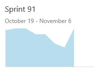   

</td>
<td width="33%">

<b>Manage resources</b>

Use [capacity planning tools](../boards/sprints/set-capacity.md) to track individual, team, and activity over and under capacity for a sprint.

  

</td>
</tr>
</tbody>
</table>

### Workflow

<table>
<tbody>
<tr valign="top">
<td width="33%">

<b>What is workflow? </b>

You use workflow to track the progress of work as it moves from new, active, to complete or closed. Each workflow consists of a set of states, the valid transitions between the states, and the reasons for transitioning the work item to the selected state.  

   

 

<b>Default workflows</b>

Each process [defines the workflow](../boards/work-items/guidance/choose-process.md#main-distinctions) for each work item type to track progress from newly defined, to in progress, to completed or closed. 

</td>
<td width="33%">

<b>Kanban workflow</b>

You can fully customize your Kanban board to map the workflow your team uses by [adding and renaming columns](../boards/boards/add-columns.md)

  
 

<b>Customize the workflow</b>

For Azure DevOps Services: [add custom workflow states to support your business tracking needs](../organizations/settings/work/customize-process-workflow.md).  For TFS: [Design your custom workflow](https://msdn.microsoft.com/library/ms194981.aspx) by adding states, transitions, reasons, and optional actions.

 
<b>States  </b>

States allow you to [track the status of work](https://msdn.microsoft.com/library/ms194981.aspx). For  example, a bug moves from **Active**, **Resolved**, and **Closed** to correspond to when it's defined, fixed, and verified as fixed.

<b>Transitions</b>

Transitions specify the [valid progressions and regressions from state to state](https://msdn.microsoft.com/library/ms194981.aspx) for a work item type.

<b>Reasons</b>

Each transition [specifies a default reason as well as optional reasons](https://msdn.microsoft.com/library/ms194981.aspx) for tracking the change in state.  

</td>
<td width="33%">

<b>Update fields during workflow changes (TFS)  </b>

You can [define rules that change a field value](https://msdn.microsoft.com/library/ms194981.aspx) whenever you change the state, perform a transition, or select a reason.   

<b>Apply workflow conditional field rules (TFS)  </b>

You can define rules that [change a field value based on the contents of other fields](../reference/xml/apply-rule-work-item-field.md) during workflow changes. 

<b>Restrict who can make changes during workflow transitions (TFS)  </b>

Set a condition field rule that applies to a group to [restrict who can make changes to a workflow or a field](../reference/xml/apply-rule-work-item-field.md).  

<b>Event-generated workflow changes or field assignments (TFS)</b>

[Add an action](https://msdn.microsoft.com/library/ms194990.aspx) to a custom workflow definition to automatically transition work items or specify a field value based on an internal TFS event or external event. 

<b>Visual workflow design tool (TFS)</b>

You can change the workflow or view the workflow state diagram  by using the [Process Editor](https://visualstudiogallery.msdn.microsoft.com/898a828a-af00-42c6-bbb2-530dc7b8f2e1), a power tool for Visual Studio. 

</td>
</tr>
</tbody>
</table>  

## Alerts and notifications

<table>
<tbody>
<tr valign="top">
<td width="30%">

<b>Personal and team notifications or alerts</b>

Get notified as changes occur to work items, code reviews, source control files, and builds by setting [personal notifications](../notifications/howto-manage-personal-notifications.md) or [team notifications](../notifications/howto-manage-team-notifications.md).

  
 

<b>Share queries and sprint plans</b>

Email a query or [sprint plan](../boards/sprints/assign-work-sprint.md).  

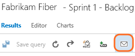  
 

<b>Quick alerts to team members  </b>

Use the **@mention** control to send email to team members to bring them into a discussion around work changes, pull requests, or other items.  

  

<b>Client feature flag updates</b>

Alert flag within the IDE automatically notifies you of the latest client changes.

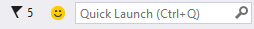  
 

</td>
<td width="30%">

<b>Follow a work item </b>

Choose the / icons to quickly [start or stop tracking changes made to a work item](../boards/work-items/follow-work-items.md).  

  
 

<b>Follow a pull request</b>

To [track the progress of a single pull request](../boards/work-items/follow-work-items.md), choose the  option from the context menu. 

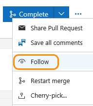  
 

<b>Manage work items you follow  </b>

From the **Work>Queries** page you can view the list of work items that you're following.  

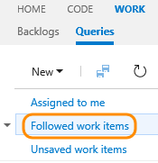  
 

<b>Frequent on-line feature updates</b>

Check the [News](/visualstudio/releasenotes/vs2017-relnotes) for product updates, or read about them by accessing the News link in your web portal.

  

</td>

</tr>
</tbody>
</table>

## Code

### Code: Git

<table>
<tbody>
<tr valign="top">
<td width="33%">

<b>Get started with Git in Visual Studio </b>

To get started working with Git, [clone a repository, add code, and create branches in Azure DevOps Services](../repos/git/create-new-repo.md) or [Visual Studio](../repos/git/gitquickstart.md). Learn how to commit, publish, and conduct a pull request of your changes. 

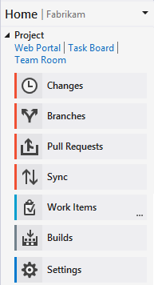  
 

<b>Clone repositories</b>

To work locally, you [clone a repository](../repos/git/clone.md). 

<b>Commit changes</b>

Enter commit messages and [quickly push your local changes to the shared repo](../repos/git/pushing.md).

  
 

<b>Pull requests</b>

Use [pull requests to review and merge branch code to a master branch](../repos/git/pull-requests.md).   

<b>Sync</b>

Quickly [sync your local branch with a shared repo](../repos/git/pulling.md).

</td>
<td width="33%">

<b>Get started using Eclipse</b>

[Work with Git repositories](../repos/git/share-your-code-in-git-eclipse.md) using the Team Explorer Everywhere IDE for Eclipse.  

<b>Add reviewers to get feedback </b>

Use the [**@mention** control to add reviewers](../notifications/at-mentions.md) to your pull request to get their feedback about your changes.  

  
 

<b>Resolve Git merge conflicts</b>

Merge conflicts occur when commits have changes to the same files as other newer commits in the branch history. Learn how to [prevent and resolve merge conflicts](../repos/git/merging.md).   

<b>Code search</b>

Maximize cross-team collaboration and code sharing by finding code across all the projects to which you have access. Narrow down your results and focus in on code by using [filters, preview code, view history, compare versions, and more](../project/search/overview.md) 

  

<b>Get notified about pull requests</b>

Subscribe to email alerts to get notified about [new pull requests, changes, approvals, and rejections](../repos/git/pull-requests.md#notifications).

<b>Set branch policies </b>

To improve code quality, [set branch policies to require code reviews or  automatically add reviewers](../repos/git/branch-policies.md). 

<b>Automatically build pull requests </b>

Set a branch policy to [automatically generate a build for a pull request to selected branches](../repos/git/branch-policies.md).

<b>Create Git repositories </b>

When you create a project with Git as your version control system, you automatically create a Git repo. You can [Create additional Git repos](../repos/git/repo-rename.md) from the admin context. 

<b>Rename a Git repository </b>

[Rename Git repos](../repos/git/repo-rename.md) from the admin context. 

</td>
<td width="33%">

<b>Integrate Git development with work tracking  </b>

Drive Git development and stay in sync as a team to complete backlog items and tasks using the [Git Development section](../boards/backlogs/connect-work-items-to-git-dev-ops.md). Add branches, create pull requests, and view all development performed to support the specific work item.  

  
 

<b>Quickly link work items to pull requests </b>

Use the [**#ID** control to link work items](../notifications/add-links-to-work-items.md) to your pull request to support tracking work.    

<b>Get started using Xcode </b>

[Work with Git repositories](../repos/git/share-your-code-in-git-xcode.md) using the Xcode IDE.  

<b>Git commands</b>

Use [Git command line tools](../repos/git/command-prompt.md) when you need to perform select manual tasks or to automate work using a script.

<b>Bypass a branch policy</b>

Grant an [Exempt from policy enforcement permission](../repos/git/branch-policies.md) to a user or group.

<b>Rebase a branch</b>

Before merging a branch into master, you may choose to first [rebase your branch onto the latest commit in master](../repos/git/rebase.md).

<b>Git permissions</b>

Set permissions on a [Git project, repository, or branch](../organizations/security/permissions.md#git-repo) from the context menu or from the web portal administration page.

</td>
</tr>
</tbody>
</table>

### Code: TFVC

<table>
<tbody>
<tr valign="top">
<td width="33%">

<b>Get started with TFVC in Visual Studio </b>

[Develop and share your code](../repos/tfvc/share-your-code-in-tfvc-vs.md). Learn how to configure your workspace, check-in your code, compare file changes, and view file history. 

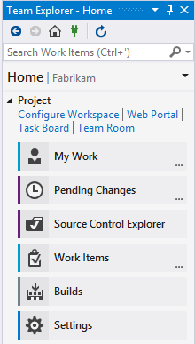  
 

<b>Set up local or server workspaces</b>

[Create a local workspace](https://msdn.microsoft.com/library/ms181384.aspx) that maps to the code base of interest. 

<b>Resolve conflicts</b>

[Support for Resolve conflicts that arise](https://msdn.microsoft.com/library/ms181432.aspx) when several people work concurrently on a file.

<b>Compare files and folders</b>

[Compare server folders and local folders](https://msdn.microsoft.com/library/bb385981.aspx) to each other, and view the differences between the contents of each folder.

</td>
<td width="33%">

<b>Track changesets</b>

Find information about which [branches have received a particular set of changes and when those changes were merged](https://msdn.microsoft.com/library/dd405662.aspx).

<b>Request code review</b>

Increase overall code quality and reduce the risk of creating bugs by [requesting a code review when you check-in code](https://msdn.microsoft.com/library/hh474795.aspx#code_review_request).

<b>Review history of a file</b>

[Get detailed information about what changes have been made to your files](https://msdn.microsoft.com/library/ms245475.aspx).

<b>Suspend work</b>

[Use shelvesets](https://msdn.microsoft.com/library/ms181403.aspx) when you need to set aside some or all of your work in progress. 

<b>Manage branches, isolate risk</b>

Use branches and locks to [isolate risk introduced by work done by different teams](https://msdn.microsoft.com/library/ms181423.aspx).

<b>Merge branches</b>

[Integrate work completed in different branches](https://msdn.microsoft.com/library/ms181428.aspx) during certain phases of your project.

<b>Set check-in and check-out policies</b>

Enforce practices that lead to better code and more efficient group development by [setting check-in/check-out rules](https://msdn.microsoft.com/library/ms182076.aspx).

</td>
<td width="33%">

<b>Code search</b>

Find code across all the projects to which you have access. Narrow down your results and focus in on code by using [filters, preview code, view history, compare versions, and more](../project/search/overview.md) 

  
 

<b>Subscribe to alerts when check-ins occur</b>

Get notified when someone checks in code to your TFVC project by [subscribing to receive email alerts](https://msdn.microsoft.com/library/ms181407.aspx#alerts).

<b>Version control locks</b>

[Lock files or folders](https://msdn.microsoft.com/library/ms181418.aspx) when you need to prevent them from being checked out or modified. 

<b>Download files from the server</b>

[Get the latest files from the server](https://msdn.microsoft.com/library/ms181387.aspx) on a regular basis so that the code you develop is compatible with the code developed by others on your team.

<b>TFVC permissions</b>

Set permissions on [select code management tasks](../organizations/security/permissions.md#tfvc) from the context menu for TFVC files or folders or the admin context for the project.

</td>
</tr>
</tbody>
</table>

::: moniker range="azure-devops"

## Azure Artifacts (Azure DevOps Services)

<table>
<tbody>
<tr valign="top">
<td width="33%">

<b>What is Azure Artifacts?</b>

Azure Artifacts is the new name for what was previously Package Management. Azure Artifacts helps you [manage code sharing by automating common tasks for discovering, consuming, and sharing components](../artifacts/overview.md).

<b>Create feeds </b>

[Create feeds](../artifacts/feeds/create-feed.md) to share code through packages.

<b>Move existing file shares to the cloud</b>

Eliminate dependencies on on-premises file shares and hosted instances of NuGet.Server by [moving your packages to Azure DevOps Services](../artifacts/nuget/move-from-fileshares.md).

</td>
<td width="33%">

<b>Discover and consume packages </b>

[Consume packages](../artifacts/nuget/consume.md) by connecting to a feed.

<b>Publish packages to feeds</b>

[Publish packages](../artifacts/nuget/publish.md) to share code with your team and your organization.

<b>Add identities to your feeds </b>

[Give teams and service identities](../artifacts/feeds/feed-permissions.md) access to your feeds.

</td>
<td width="33%">

<b>Bootstrap the developer environment</b>

Increase your team's velocity and decrease the amount of code duplication across your organization. Access a set of tools and conventions for integrating Azure DevOps Services NuGet into your workflow by [getting the NuGet VSS.PackageManagement.Bootstrap package](../artifacts/nuget/bootstrap-nuget.md).

<b>Remove a NuGet package from a feed </b>

[Unlist or remove a package][Delete packages and recover deleted packages from the recycle bin in Azure Artifacts](../artifacts/how-to/delete-and-recover-packages.md) you no longer want users to discover.

<b>Secure feeds </b>

Control who can [contribute to or consume from a feed](../artifacts/feeds/feed-permissions.md).

</td>
</tr>
</tbody>
</table>

::: moniker-end

## Continuous delivery

### Build

<table>
<tbody>
<tr valign="top">
<td width="32%">

<b>Define builds</b>

Start from a build template and customize your build from there. Build for [Windows](../pipelines/apps/windows/dot-net.md), [iOS](../pipelines/apps/mobile/xcode-ios.md), Android, Java (Ant, Maven, or Gradle), or Linux using the same domain-specific languages you use every day on your dev machine. [Build Xamarin apps](../pipelines/apps/mobile/xamarin.md) for both iOS and Android and run tests on the Xamarin Test Cloud as part of the build.

<b>Customize build process using scripts</b>

[Use a script](../pipelines/scripts/powershell.md) to add your team's business logic to your build process.

<b>Build agents and agent pools </b>

At least one [agent](../pipelines/agents/agents.md) is require to build your code. As you scale your system with more code, people, and builds, you'll need more build agents organized within [agent pools](../pipelines/agents/pools-queues.md). You can use both on-premises or Microsoft-hosted agent pools.

<b>Gated check-in (TFVC, Azure DevOps Services) </b>

Use [gated check-in](../pipelines/build/triggers.md#gated) to protect against breaking changes when checking code into TFVC.  

<b>Branch policies (Git)</b>

Improve code quality by [setting branch policies](../repos/git/branch-policies.md) to ensure build are never broken or getting the right people to review changes. 

</td>
<td width="38%">

<b>Specify your build steps</b>

Add steps to specify what you [want to build](../pipelines/tasks/index.md#build), the [tests to run](../pipelines/tasks/index.md#test), and [all the other steps](../pipelines/tasks/index.md) needed to complete the process.

pipelines\tasks\build\_img

&#160;&#160;[Build an Android app using Gradle](../pipelines/tasks/build/gradle.md)

&#160;&#160;[Sign and align Android APK files](../pipelines/tasks/build/android-signing.md)

&#160;&#160;[Build with Apache Ant](../pipelines/tasks/build/ant.md) 

&#160;&#160;[Build using a Gradle wrapper script](../pipelines/tasks/build/gradle.md)  

&#160;&#160;[Grunt: The JavaScript Task Runner](../pipelines/tasks/build/grunt.md) 

&#160;&#160;[Gulp: Node.js task-based build system](../pipelines/tasks/build/gulp.md)

&#160;&#160;[Index source code and publish symbols](../pipelines/tasks/build/index-sources-publish-symbols.md)

&#160;&#160;[Build with Apache Maven](../pipelines/tasks/build/maven.md)

&#160;&#160;[Build with MSbuild](../pipelines/tasks/build/msbuild.md)

&#160;&#160;[SonarQube for MSbuild](http://go.microsoft.com/fwlink/?LinkId=620063)

&#160;&#160;[Visual Studio and MSbuild](../pipelines/tasks/build/visual-studio-build.md)

&#160;&#160;[Build an Android app with Xamarin](../pipelines/tasks/build/xamarin-android.md) 

&#160;&#160;[Build an iOS app with Xamarin on macOS](../pipelines/tasks/build/xamarin-ios.md) 

<b>Build variables</b>

Use [predefined variables](../pipelines/build/variables.md) or add your custom variables when configuring your build definition or your build scripts.

</td>
<td width="30%">

<b>Continuous integration builds</b>

[Define a CI build](../pipelines/build/triggers.md#ci) that compiles and tests your solutions whenever your team checks in code.

<b>Build summary charts</b>

View real-time build status and [add build summary charts to your dashboards](../report/add-widget-to-dashboard.md).  

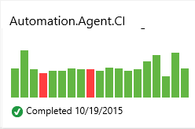  
 

<b>Code coverage charts </b>

From the Code Coverage tab on a Build summary page, you can view percentage of code coverage as well as upload code coverage data in Jacoco or Cobertura formats.

<b>Audit changes </b>

Determine who [changed what in the build definition and when they did it](../pipelines/build/history.md). 

<b>Build retention policies</b>

[Define policies to automatically delete old completed builds ](../pipelines/policies/retention.md) to minimize clutter.

<b>Build permissions</b>

Determine who can [define, delete, and manage builds](../organizations/security/permissions.md#build).

</td>
</tr>
</tbody>
</table>

### Release

<table>
<tbody>
<tr valign="top">
<td width="33%">

<b>Automate deployments</b>

Reduce time-to-market and respond to customer feedback with greater agility by [automating your release process](../pipelines/overview.md). Deploy applications across platforms to all environments of the pipeline with just one selection.

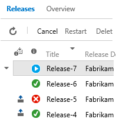  
 

<b>When to use Azure Pipelines or Build &amp; Release in TFS?</b>

Evaluate how Azure Pipelines and Build &amp; Release in TFS can help you in [your development and deployment efforts](../pipelines/overview.md).

<b>Release definitions</b>

Add a release definition by [choosing the build version, target release environments, and tasks](../pipelines/apps/cd/deploy-webdeploy-webapps.md).

<b>Release environments</b>

[Define and clone release environments](../pipelines/release/environments.md), logical entities that represent where you want to deploy a release, such as a collection of servers, a cloud, multiple clouds, or an app store.

<b>Artifacts</b>

A release is fundamentally defined by [versioned artifacts that make up the release](../pipelines/release/artifacts.md). As you deploy the release to various environments, you deploy and validate the same artifacts on all environments. 

<b>Tasks</b>

Automate release deployment by [defining the events that trigger a release](../pipelines/release/triggers.md#release-triggers).

<b>Agents and agent pools</b>

Agent pools are the execution containers that specify the security context and runtime environment for the [agents that run when you deploy a release](../pipelines/agents/agents.md).

</td>
<td width="33%">

<b>Works for any app</b>

Deploy [any type of application across multiple platforms](../pipelines/overview.md) including Windows and Linux, whether on-premises or in the cloud.

<b>Approval workflows</b>

Streamline your application release workflow by [routing pre- and post-deployment approvals](../pipelines/release/approvals/index.md) to multiple approvers or teams.

<b>Release notifications</b>

Receive email messages as releases occur. Approvers receive notifications automatically when a release is waiting for approval. 

<b>Full traceability</b>

Monitor the status of your release pipelines and track every deployment in each of the environments. Retain full audit history of all activities performed on a release with detailed release logs and approval tracking.

<b>Release logs</b>

View or download log files as zip files. Log files contain the status for each step or task of a release, for each of the environments in the release definition. Each completed release--succeeded, failed, or abandoned--[includes a live log file, details, and history for each step or task](../pipelines/release/define-multistage-release-process.md#monitor-and-track-deployments).

<b>Triggers</b>

Automate release deployment by [defining the events that trigger a release](../pipelines/release/triggers.md#release-triggers).

<b>Variables</b>

Lookup the description for all [release system, global, and agent variables](../pipelines/process/tasks.md).

</td>
<td width="33%">

<b>Release names </b>

Specify the [naming and numbering scheme you want used when adding releases](../pipelines/release/index.md#numbering).

<b>Global configuration properties</b>

Simplify management of custom values that you use to configure multiple releases by [specifying custom values for any of the tasks in any of the environments of a release definition](../pipelines/release/variables.md).

<b>View test results</b>

Open the **Tests** tab to view a summary of the test results, including pass/fail percentages and run duration. Sort the test results into groups or filter the results to show just passed, failed, or other results.

 

<b>Add release summary to dashboard (Azure DevOps Services) </b>

[Add a release summary chart](../report/dashboards/widget-catalog.md#release-definition-widget) to a team dashboard. 

<b>Extend and customize</b>

[Create workflows tailored to your process](../pipelines/release/index.md) by customizing our tasks, or extend with your own custom tasks.

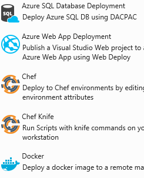  
 

<b>Manage permissions</b>

Grant or deny permissions to [manage release definitions, environments approvers, or release permissions](../pipelines/policies/permissions.md#release-permissions). Set permissions for users, groups, or per release definition. 

</td>
</tr>
</tbody>
</table>

### Test

<table>
<tbody>
<tr valign="top">
<td width="33%">

<b>Comprehensive testing</b>

[Perform exploratory, manual, system, and user acceptance tests for any app, in any language](../test/index.md). Using Visual Studio or 3rd-party test frameworks, you can include automated tests with builds and releases for continuous integration and deployment. 

<b>Unit testing with Git</b>

Create [unit tests](/visualstudio/test/create-unit-tests-menu) and run them frequently to make sure your code is working properly.

  
 

<b>Manual test plans and test cases</b>

Get started by [creating test plans and test cases](../test/create-test-cases.md) to track manual testing for sprints or milestones.

<b>Shared steps and shared parameters</b>

[Create shared steps](https://msdn.microsoft.com/library/dd286655.aspx) to include often repeated sequence of steps in your manual test cases, such as logging in. Repeat manual tests with different data using [shared parameters](../test/repeat-test-with-different-data.md). 

</td>
<td width="33%">

<b>Coded UI testing</b>

Use Visual Studio to create [coded UI tests](https://msdn.microsoft.com/library/dd286726.aspx) to test your application's user interface.

<b>Run test with your builds for continuous integration</b>

Use continuous integration builds to [run tests automatically](../pipelines/languages/dotnet-core.md#run-your-tests).

<b>Review automated test results after a build</b>

[Review your test results](../pipelines/test/review-continuous-test-results-after-build.md) to analyze any problems that were found.

<b>Quickly assign configurations to test plan, test suite, or test case  </b>

From the context menu of a test plan, test suite, or test case, you can assign a configuration.  

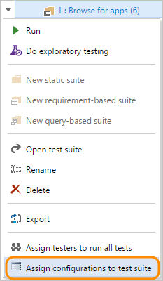  
 

</td>
<td width="33%">

<b>Exploratory testing</b>

Explore user stories without test cases or test steps using [Test Manager and exploratory testing](../test/index.md).

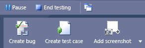  
 

Or, [download and install the Test &amp; Feedback extension](../test/perform-exploratory-tests.md). Capture screenshots, annotate them, and submit bugs while you explore your web app - all directly from your Chrome browser. 

<b>Record and play back manual tests</b>

With Microsoft Test Manager, you can [record your keystrokes and gestures while you test an application](../test/mtm/record-play-back-manual-tests.md). The next time you run the test, you can play back your actions quickly and accurately.

<b>Track test status and test results</b>

Quickly [view the status](../test/track-test-status.md) of your testing using lightweight charts.

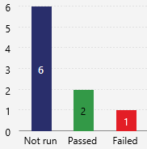  
 

<b>Test environments</b>

[Specify a combination of hardware and software](../test/test-different-configurations.md) that represents a user or machine environment in which your app runs.

<b>Test permissions</b>

Set permissions on who can [manage test configurations, test environments, and publish and delete test results](../organizations/security/set-project-collection-level-permissions.md).

</td>
</tr>
</tbody>
</table>

##Dashboards and reports  

### Charts and dashboards

<table>
<tbody>
<tr valign="top">
<td width="33%">

<b>Multiple team dashboards</b>

Each team can create several [team dashboards](../report/dashboards/dashboards.md) to help keep both the team and stakeholders in sync. Each dashboard tile provides quick access to the progress of builds, status of work items, or latest code changes. 

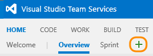  
  

<b>Build history charts</b>

[Add build history charts to your dashboards](../report/dashboards/add-charts-to-dashboard.md#build-history).  

  
  

<b>Test charts</b>

Track the status of your [test progress and test runs](../test/track-test-status.md). Optionally add these charts to a dashboard.  

  
  

<b>Test quality trend charts</b>

Add [failure and duration charts for tests run as part of your build](../report/dashboards/add-charts-to-dashboard.md#test-quality) to your team dashboard. 

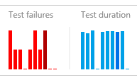  
  

</td>
<td width="33%">

<b>Restrict or allow team members to manage dashboards (Azure DevOps Services)</b>

Set permissions to [restrict or allow team members to manage dashboards](../report/dashboards/dashboards.md#manage).  

<b>Capacity planning and tracking</b>

Easily track how much work your team has completed and has left to do in a sprint by adding the [sprint capacity chart widget](../report/dashboards/widget-catalog.md#sprint-capacity-widget) to your dashboard.  

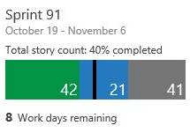  
 

<b>Share dashboards with stakeholders</b>

Grant non-licensed users access as Stakeholders ([Azure DevOps Services](../organizations/accounts/add-organization-users.md) | [TFS](../organizations/security/change-access-levels.md)) so they can view progress, run queries, and contribute ideas.  

<b>Velocity charts</b>

[Team velocity](../report/dashboards/team-velocity.md) tracks the total estimated effort (story points or size) of backlog items (user stories or requirements) completed or still in progress within each sprint. 

  

 

<b>Sprint burndown charts</b>

Monitor progress and review team patterns from [sprint burndown charts](../boards/sprints/sprint-burndown.md)

  
 

<b>Add release summary to dashboard (Azure DevOps Services) </b>

[Add a release summary chart](../report/dashboards/widget-catalog.md#release-definition-widget) to a team dashboard. 

</td>
<td width="33%">

<b>Edit dashboard mode</b>

Add, remove, move, and configure widgets by [choosing the Edit dashboard icon](../report/dashboards/dashboards.md). Choose the checkmark icon to exit.  

 |   
 

<b>Auto-refresh dashboards </b>

You can [enable auto-refresh for any team dashboard](../report/dashboards/dashboards.md#manage), and it automatically updates every five minutes. This is a useful feature for when your dashboard serves as a team wallboard.   

<b>Widget catalog</b>

Add [widgets](../report/dashboards/widget-catalog.md) to your dashboard to provide  information and monitor the data your team needs.

  
 

<b>Work item query charts</b>

View the status of work in progress by [charting the results of a flat-list query](../report/dashboards/charts.md). You can create several types of charts&mdash;such as pie, column, or trend&mdash;for the same query. Optionally add these charts to a dashboard.

<b>Drag-n-drop layout</b>

Configure the layout to your specifications by [dragging tiles into the sequence you want](../report/dashboards/dashboards.md). 

<b>Cumulative flow diagrams</b>

Track the progress of work on your backlogs [through the CFD charts](../report/dashboards/cumulative-flow.md).  

<b>Power BI dashboards (Azure DevOps Services)</b>

You can create dashboards, individual reports, or explore data collected for your Visual Studio Online account once you [connect to Power BI](../report/powerbi/report-on-vso-with-power-bi-vs.md). 

</td>
</tr>
</tbody>
</table>

::: moniker range="azure-devops"

### Power BI dashboards and reports (Azure DevOps Services)

<table>
<tbody>
<tr valign="top">
<td width="50%">

<b>Basic Power BI concepts</b>

The 3 major building blocks of Power BI are [dashboards, reports, and datasets](https://powerbi.microsoft.com/documentation/powerbi-service-basic-concepts/). 

<b>Get started </b>

You can [create dashboards, individual reports, or explore data](../report/powerbi/report-on-vso-with-power-bi-vs.md) collected for your organization once you connect to Power BI. 

 

</td>
<td width="50%">

<b>Connect to Power BI</b>

[Steps required to authorize Power BI to access your organization](../report/powerbi/data-connector-connect.md).

<b>Available data</b>

The [Power BI Data Connector](../report/powerbi/data-connector-connect.md) supports building reports to track status and trend work items.

</td>

</tr>
</tbody>
</table>

::: moniker-end

::: moniker range=">= tfs-2013"

### SQL Server Reports (TFS)

<table>
<tbody>
<tr valign="top">
<td width="33%">

<b>Reporting Services reports</b>

You can [analyze the progress and quality of your project by using the out-of-the-box reports in SQL Server Reporting Services](https://msdn.microsoft.com/library/dd380714.aspx). These reports aggregate metrics from work items, version control, test results, and builds. They are uploaded when you create a project based on the process - [Agile, Scrum, or CMMI](../boards/work-items/guidance/choose-process.md) - that you choose.   

<b>Add Reporting Services reports</b>

If you need to add reporting services to a project or on-premises TFS after you've created your team projects, you can by [adding a report server and uploading reports](../report/admin/add-reports-to-a-team-project.md).

<b>Manage the data warehouse</b>

The reporting warehouse is a traditional data warehouse that consists of a [relational database and an Analysis Services database](../report/admin/manage-reports-data-warehouse-cube.md). You manage it through the following activities:

- [Manually process the data warehouse](../report/admin/manually-process-data-warehouse-and-cube.md)  
- [Rebuild the data warehouse](../report/admin/rebuild-data-warehouse-and-cube.md)  
- [Resolve schema conflicts](../report/admin/resolve-schema-conflicts.md)  
- [Change a process control setting](../report/admin/change-a-process-control-setting.md)  
 
</td>
<td width="33%">

<b>Build reports</b>

Build reports track the quality of software under development. By defining tests to run automatically as part of each build definition and instrumenting tests to gather code coverage data, you can gain insight about the quality of the builds, tests, and code.

- [Build Quality Indicators](https://msdn.microsoft.com/library/dd380683.aspx) (Agile & CMMI)  
- [Build Success Over Time](https://msdn.microsoft.com/library/dd380643.aspx)  
- [Build Summary](https://msdn.microsoft.com/library/dd380708.aspx)  

 

<b>Test and bug reports</b>

Test planning reports support monitoring the test progress and coverage of backlog items or user stories. Bug tracking reports illustrate the team's capacity to find and resolve bugs.

- [Test Case Readiness](https://msdn.microsoft.com/library/dd380713.aspx)  
- [Test Plan Progress](https://msdn.microsoft.com/library/dd380702.aspx)  
- [Bug Status](https://msdn.microsoft.com/library/dd380736.aspx) (Agile & CMMI)  
- [Bug Trends](https://msdn.microsoft.com/library/dd380674.aspx) (Agile & CMMI)  
- [Reactivations](https://msdn.microsoft.com/library/dd380731.aspx) (Agile & CMMI)  

 

<b>Required team activities to generate useful reports</b>

To gain useful, actionable information from your reports, [team members must perform certain activities](../report/admin/review-team-activities-for-useful-reports.md). 

</td>
<td width="33%">

<b>Project management </b>

Project management reports provide insight into how much work the team is tackling within a sprint or release, and the rate of their progress. By linking work items and updating specific fields as work is performed, you can track the progress of individual stories and be able to more accurately estimate future activities. 

*Scrum reports*

- <a href="https://msdn.microsoft.com/library/dn641200.aspx">Backlog Overview</a>  
- <a href="https://msdn.microsoft.com/library/ff731579.aspx">Release Burndown</a>  
- <a href="https://msdn.microsoft.com/library/ff731588.aspx">Sprint Burndown</a>  
- <a href="https://msdn.microsoft.com/library/ff731575.aspx">Velocity</a>  
 

*Agile and CMMI*

- <a href="https://msdn.microsoft.com/library/dd380678.aspx">Burndown and Burn Rate</a>  
- <a href="https://msdn.microsoft.com/library/dd380673.aspx">Remaining Work</a>  
- <a href="https://msdn.microsoft.com/library/ee461517.aspx">Requirements Overview</a> (CMMI)  
- <a href="https://msdn.microsoft.com/library/ee461582.aspx">Requirements Progress</a> (CMMI)  
- <a href="https://msdn.microsoft.com/library/dd380706.aspx">Status of All Iterations</a> (similar to Velocity)  
- <a href="https://msdn.microsoft.com/library/dd380641.aspx">Stories Overview</a>   (Agile)   
- <a href="https://msdn.microsoft.com/library/dd380641.aspx">Stories Progress</a> (Agile)  
- <a href="https://msdn.microsoft.com/library/ee707132.aspx">Unplanned Work</a>  

 

<b>Set permissions to view or create reports</b>

Enable members of your team to [view or manage Reporting Services reports](../report/admin/grant-permissions-to-reports.md). To create or modify reports, you need to grant them access to read databases. 

</td>
</tr>
</tbody>
</table>

::: moniker-end

### Widgets

<table>
<tbody>
<tr valign="top">
<td width="33%">

<b>What is a widget?</b>

You build your dashboards by adding information tiles or widgets. The [widget catalog](../report/dashboards/widget-catalog.md) provides a number of predefined widgets.

<b>Drag-and-drop widgets</b>

Drag widgets, tiles, or charts anywhere on a dashboard to [configure the layout you want](../report/dashboards/dashboards.md). 

<h4><i>Informational content and other links</i></h4>

<b>Markdown widget</b>

Adds a configurable tile to your dashboard to [display any type of information, guidance, or links](../report/dashboards/widget-catalog.md#markdown-widget) that you want using markdown syntax.   

  
 

<b>Team member </b>

Opens the team's quick dialog to [add or remove team members](../report/dashboards/widget-catalog.md#team-members-widget).

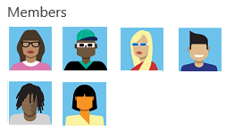  

<b>Team rooms </b>

Provides [status and access to a team room](../report/dashboards/widget-catalog.md#team-room-widget), an archived space to discuss work in progress, ask questions, share status, and clarify issues that arise.  

<b>Visual Studio widget</b>

[Provides links to open or download Visual Studio](../report/dashboards/widget-catalog.md#visual-studio-widget). The Visual Studio IDE client comes with the Team Explorer plug-in which provides quick access to several features (some of which aren't available through the web portal). 

<b>Welcome widget</b>

Provides quick access to [getting started info on how to track work, code, build, and test](../report/dashboards/widget-catalog.md#how-to-widget). 

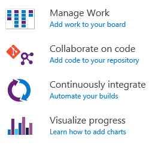  
 

<h4><i>Code widgets</i></h4>

<b>Code tile </b>

Configurable tile to display [status and links to a Git or TFVC code repository, branch, or folder](../report/dashboards/widget-catalog.md#code-tile-widget).
 

<b>Pull request </b>

Adds a configurable tile to display [active pull requests requested by the team, or assigned to or requested by the person logged in](../report/dashboards/widget-catalog.md#pull-request-widget). You select the Git repository for the pull requests of interest.  

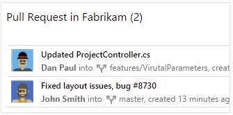

</td>
<td width="33%">

<h4><i>Plan and track work</i></h4>

<b>Assigned to me widget  </b>

Provides quick access to [work items assigned to the logged in user](../report/dashboards/widget-catalog.md#assigned-to-me-widget). 

<b>Chart for work items</b>

Adds a configurable tile to display the [chart for a shared query](../report/dashboards/widget-catalog.md#chart-wit-widget).  

  
 

<b>New work item </b>

[Add work items](../report/dashboards/widget-catalog.md#new-work-item-widget) pre-scoped to your team's default area and iteration paths.

  
 

<b>Other links widget</b>

Provides quick access links from a team dashboard to [request feedback, define sprints, and modify your team's area paths](../report/dashboards/widget-catalog.md#other-links-widget).

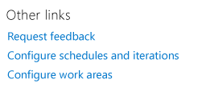  
 

<b>Query tile </b>

Configurable tile to display the [results and link to a shared query](../report/dashboards/widget-catalog.md#query-tile-widget). 

  
 

<b>Query results </b>

Adds a configurable [query results list](../report/dashboards/widget-catalog.md#query-results-widget) to a team dashboard. 

<b>Requirements quality </b>

Displays a configurable widget that you can use to [track quality continuously from a build or release definition](../report/dashboards/widget-catalog.md#requirements-quality-widget).

</td>
<td width="33%">

<h4><i>Plan and track work (continued)</i></h4>

<!---

<b>Cumulative flow diagram (Azure DevOps Services)  </b>

Configurable tile to display the [cumulative flow for a product or portfolio backlog](../report/dashboards/cumulative-flow.md).

-->

<b>Sprint burndown </b>

Adds [a burndown chart](../report/dashboards/widget-catalog.md#sprint-burndown-widget) for tracking a team's Scrum progress for the current sprint. 

<b>Sprint capacity </b>

Adds [a chart for tracking remaining capacity](../report/dashboards/widget-catalog.md#sprint-capacity-widget) when tracking a team's Scrum progress for the current sprint. 

  
 

<b>Sprint overview </b>

Displays a visual overview of the [current sprint progress](../report/dashboards/widget-catalog.md#sprint-overview-widget) for tracking a team's Scrum progress for the current sprint, indicating the number of backlog items in progress, completed, or not started.

<b>Work links </b>

Provides quick access links from a team dashboard to open the [team backlog, Kanban board, task board, and queries](../report/dashboards/widget-catalog.md#work-links-widget).   

<h4><i>Build and test widgets</i></h4>

<b>Chart for build history </b>

Configurable tile to display the [histogram for a specific build definition](../report/dashboards/widget-catalog.md#build-history-widget).
 

<b>Deployment status (Azure DevOps Services)</b>

Configurable tile that shows you a consolidated view of the [deployment status and test pass rate across multiple environments for a recent set of builds](../report/dashboards/widget-catalog.md#deployment-status-widget).  
 

<b>Release definition overview</b>

Configurable tile to view and track the status of a release definition. The widget [shows the release as a series of environments, with the name of the release and the date or time it was started](../report/dashboards/widget-catalog.md#release-definition-widget).
 

<b>Test trend results </b>

Provides [trend of test results](../report/dashboards/widget-catalog.md#test-results-widget), such as passed or failed tests, for a selected build definition.

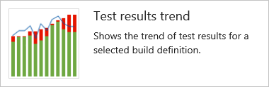
 

<h4><i>Extensibility</i></h4>

<b>Marketplace widgets</b>

You can find additional widgets by browsing the [Marketplace](https://marketplace.visualstudio.com/search?term=webpage%20widget&target=vsts&sortby=relevance.)

<b>Dashboard widget SDK  </b>

[Create a dashboard widget](../extend/develop/add-dashboard-widget.md) using the REST API service. 

</td>
</tr>
</tbody>
</table>

## Extensibility

### Marketplace

<blockquote style="font-size: 13px"><b>Feature availability: </b>You can add Marketplace extensions from the web portal for Azure DevOps Services or TFS 2015.2 or later version or for Visual Studio or Visual Studio Code.
</blockquote> 

<table>
<tbody>
<tr valign="top">
<td width="55%">

<b>What is the Marketplace?</b>

From the [Marketplace](https://marketplace.visualstudio.com/), you can extend the functionality available to you by installing free extensions or purchasing a subscription or paid extension. Extensions support adding new capabilities to Visual Studio, Visual Studio Code, Azure DevOps Services, or TFS.  

</td>
<td width="45%">

<b>Subscriptions</b>

[Visual Studio subscriptions](https://visualstudio.microsoft.com/products/how-to-buy-vs) are a way for you to get the Visual Studio IDE, team collaboration benefits like Azure DevOps Services and TFS, and subscriber benefits like dev/test use of Windows, Windows Server, and SQL Server. 

<b>Extensions</b>

You can [get and quickly install extensions](../marketplace/get-vsts-extensions.md) to add functionality to Visual Studio, Visual Studio Code, or Azure DevOps Services.

<b>Try extensions for free</b>

You can [start a trial extension for free](../billing/try-additional-features-vs.md).

<b>Get extensions for...</b>

<ul>
<li>[Azure DevOps Services](https://marketplace.visualstudio.com/#vsts)</li>
<li>[Visual Studio](https://marketplace.visualstudio.com/#vs)</li>
<li>[Visual Studio Code](https://marketplace.visualstudio.com/#vscode)</li>
</ul>
 

<b>Get cloud subscriptions</b>

Buy [cloud subscriptions](https://marketplace.visualstudio.com/#VSSubscriptions) in the Marketplace.

</td>

</tr>
</tbody>
</table>

### REST APIs

<table>
<tbody>
<tr valign="top">
<td width="33%">

<b>Get started with REST APIs</b>

Learn the basic patterns for [using the REST APIs](../integrate/get-started/rest/basics.md) for Azure DevOps Services and TFS.

<b>Authorization</b>

Get authorization from your customers to access Azure DevOps Services resources using [OAuth 2.0](../integrate/get-started/Authentication/oauth.md).

<b>REST API reference</b>

Use the [REST APIs](../integrate/index.md) to work with Azure DevOps Services and TFS resources.

</td>
<td width="33%">

<b>.NET client libraries</b>

For .NET developers building Windows apps and services that integrate with Visual Studio Online,
[client libraries](../integrate/get-started/client-libraries/dotnet.md) are available
for integrating with work item tracking, version control, build, and other services are now available.
These packages replace the traditional TFS Client OM installer and make it easy to acquire and redistribute
the libraries needed by your app or service.

</td>
<td width="33%">

<b>REST API samples</b>

Here are a number of [samples](https://github.com/Microsoft/vso-extension-samples) that work with the REST APIs directly.

<b>C# client library samples</b>

Here are a few quick [samples](../integrate/get-started/client-libraries/samples.md) to help you get started with the client libraries.

</td>
</tr>
</tbody>
</table>

### Service hooks

<table>
<tbody>
<tr valign="top">
<td width="33%">

<b>Integrate with service hooks</b>

[Service hooks](../service-hooks/overview.md) enable you to perform tasks on other services
when events happen in your Visual Studio Online projects

<b>Create integrations</b>

Integrate other services like [HipChat](../service-hooks/services/hipchat.md),
[Slack](../service-hooks/services/slack.md),
and [UserVoice](../service-hooks/services/uservoice.md) with Azure DevOps
using [service hooks](../service-hooks/overview.md).

</td>

<td width="33%">

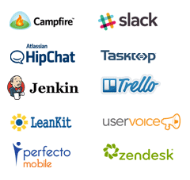

</td>
<td width="33%">

<b>Authorize</b>

[Authorize](../service-hooks/authorize.md) other services to access your organization using the industry standard OAuth 2.0.
Oauth 2.0 provides safe, secure access to your resources like work items, source code and build results by those other services.

</td>
</tr>
</tbody>
</table>

## Global

<table>
<tbody>
<tr valign="top">
<td width="33%">

<b>Web portal preferences </b>

Choose your name to access [your profile settings](../organizations/settings/set-your-preferences.md) and set your web portal preferences which include language (currently only English is supported for Azure DevOps), date and time pattern, and time zone.

  
 

<b>Language Interface Packs (LIPs)</b>

By using a [Windows Language Interface Pack (LIP)](https://msdn.microsoft.com/library/ms246590.aspx), you can install a language version of Windows, and then install various User Interface Language Packs. Language packs switch your English Visual Studio Professional user interface into any of these languages and have a majority of the user interface localized. 

</td>
<td width="33%">

<b>Localized content</b>

Most content that supports Azure DevOps Services and TFS is localized into the following 14 languages.

<ul>
<li>[English](https://msdn.microsoft.com/library/fda2bad5.aspx)</li>
<li>[Brazilian Portuguese](https://msdn.microsoft.com/pt-br/library/fda2bad5.aspx)</li>
<li>[Chinese Simplified](https://msdn.microsoft.com/v/library/fda2bad5.aspx)</li>
<li>[Chinese Traditional](https://msdn.microsoft.com/zh-tw/library/fda2bad5.aspx)</li>
<li>[Czech](https://msdn.microsoft.com/cs-cz/library/fda2bad5.aspx)</li>
<li>[German](https://msdn.microsoft.com/de-de/library/fda2bad5.aspx)</li>
<li>[French](https://msdn.microsoft.com/fr-fr/library/fda2bad5.aspx)</li>
<li>[Italian](https://msdn.microsoft.com/it-it/library/fda2bad5.aspx)</li>
<li>[Japanese](https://msdn.microsoft.com/ja-jp/library/fda2bad5.aspx)</li>
<li>[Korean](https://msdn.microsoft.com/ko-kr/library/fda2bad5.aspx)</li>
<li>[Polish](https://msdn.microsoft.com/pl-pl/library/fda2bad5.aspx)</li>
<li>[Russian](https://msdn.microsoft.com/ru-ru/library/fda2bad5.aspx)</li>
<li>[Spanish](https://msdn.microsoft.com/es-es/library/fda2bad5.aspx)</li>
<li>[Turkish](https://msdn.microsoft.com/tr-tr/library/fda2bad5.aspx)</li>
</ul>

 
<blockquote>Currently, the visualstudio.com content is only available in English.</blockquote>

</td>
<td width="33%">

<b>Visual Studio language pack</b>

Install the [language pack](http://www.microsoft.com/download/details.aspx?id=48157) to [switch the UI display to different languages](https://msdn.microsoft.com/library/ms246590.aspx).  Visual Studio provides localized UI support for these 14 languages.

<ul>
<li><a href="http://msdn.microsoft.com/library/dd831853.aspx">English</a></li>
<li><a href="http://msdn.microsoft.com/pt-br/library/dd831853.aspx">Brazilian Portuguese</a></li>
<li><a href="http://msdn.microsoft.com/zh-cn/library/dd831853.aspx">Chinese Simplified</a></li>
<li><a href="http://msdn.microsoft.com/zh-tw/library/dd831853.aspx">Chinese Traditional</a></li>
<li><a href="http://msdn.microsoft.com/cs-cz/library/dd831853.aspx">Czech</a></li>
<li><a href="http://msdn.microsoft.com/de-de/library/dd831853.aspx">German</a></li>
<li><a href="http://msdn.microsoft.com/fr-fr/library/dd831853.aspx">French</a></li>
<li><a href="http://msdn.microsoft.com/it-it/library/dd831853.aspx">Italian</a></li>
<li><a href="http://msdn.microsoft.com/ja-jp/library/dd831853.aspx">Japanese</a></li>
<li><a href="http://msdn.microsoft.com/ko-kr/library/dd831853.aspx">Korean</a></li>
<li><a href="http://msdn.microsoft.com/pl-pl/library/dd831853.aspx">Polish</a></li>
<li><a href="http://msdn.microsoft.com/ru-ru/library/dd831853.aspx">Russian</a></li>
<li><a href="http://msdn.microsoft.com/es-es/library/dd831853.aspx">Spanish</a></li>
<li><a href="http://msdn.microsoft.com/tr-tr/library/dd831853.aspx">Turkish</a></li>
</ul>
 

<b>Eclipse plug-in language support </b>

[Install Team Explorer Everywhere](https://visualstudio.microsoft.com/downloads/download-visual-studio-vs#d-team-explorer-everywhere), which includes language support for English, French, German, Japanese, and Simplified Chinese.   

</td>
</tr>
</tbody>
</table>

## Monitor

### Application Insights (Preview)

<table>
<tbody>
<tr valign="top">
<td width="33%">

<b>What is Application Insights</b>

Application Insights, an extensible analytics service that monitors your live web application, supports developers to continuously improve the performance and usability of apps. With it you can [detect and diagnose performance issues, and understand what users actually do with your app](https://azure.microsoft.com/en-in/documentation/articles/app-insights-overview/). 

<b>Web site availability monitoring </b>

Know when your site or service goes down by [setting up tests and performance thresholds to monitor both uptime and responsiveness](https://azure.microsoft.com/documentation/articles/app-insights-monitor-web-app-availability/). 

<b>Web site performance & usage </b>

Open the Performance blade to see [request, response time, dependency and other data](https://azure.microsoft.com/documentation/articles/app-insights-monitor-performance-live-website-now/#view-performance-telemetry).

<b>Power BI integration</b>

[Get even more flexible views of your telemetry](https://azure.microsoft.com/blog/application-insights-content-pack-for-power-bi/), and present your web app telemetry alongside data from devices and other business sources.

</td>
<td width="33%">

<b>Dashboard</b>

Get the full picture with [customizable dashboards that track application health alongside usage metrics and app crashes](/azure/application-insights/app-insights-overview). Within the dashboard, you can filter, search, and drill down to an event instance for more detail or to segment data.

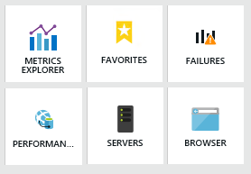  
 

<b>Diagnose failures and exceptions</b>

Quickly diagnose causes and [correlate failed requests with exceptions and other events at both the client and server](https://azure.microsoft.com/documentation/articles/app-insights-asp-net-exceptions/).

</td>
<td width="33%">

<b>Usage analysis</b>

Gain a clear view of [where your users are coming from and how they use your app ](https://azure.microsoft.com/documentation/articles/app-insights-overview-usage/). Add custom instrumentation to determine usage patterns and next version investment areas.  

<b>Diagnose dependency issues</b>

See how long your application [waits for dependencies and how often a dependency call fails](https://azure.microsoft.com/en-in/documentation/articles/app-insights-dependencies/). Dependencies are external components that your app calls such as an HTTP service, database, or file system. 

<b>Custom data collectors </b>

Add custom data collectors to your app using the [Application Insights API to customize your telemetry data](https://azure.microsoft.com/documentation/articles/app-insights-api-custom-events-metrics/).   

<b>Continuous data export</b>

Perform custom analysis on your telemetry through [continuous export of your data](https://azure.microsoft.com/documentation/articles/app-insights-export-telemetry/). 

</td>
</tr>
</tbody>
</table>

### HockeyApp

<table>
<tbody>
<tr valign="top">
<td width="33%">

<b>Get HockeyApp for mobile app development</b>

Distribute mobile apps for testing, collect user metrics and feedback, and respond to crashes more easily by [adding HockeyApp to your Agile, continuous integration, and continuous delivery workflows](https://visualstudio.microsoft.com/app-center/). 

<b>Simplified distribution </b>

[Manage distribution of development and production versions of your apps](http://support.hockeyapp.net/kb/app-management-2/how-to-organize-development-and-production-apps-for-distribution) and use independent bundle identifiers that can run in parallel on the same device.

<b>Integrate with Azure DevOps Services and TFS</b>

[Integrate HockeyApp directly in Azure DevOps Services or TFS](https://visualstudio.microsoft.com/app-center/) to upload your Android, iOS, or Windows builds. 

</td>
<td width="33%">

<b>Comprehensive dashboard </b>

Manage all your apps, users, and devices from a single dashboard. Monitor crashes and feedback as well. As an admin, you'll have full control over which user can see and install which app. 

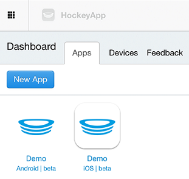  
 

</td>
<td width="33%">

<b>Invite or recruit testers</b>

[Invite beta testers and distribute your beta versions](http://support.hockeyapp.net/kb/app-management-2/how-to-invite-beta-testers) through the dashboard.

<b>Usage</b>

[Get advanced metrics](http://support.hockeyapp.net/kb/third-party-bug-trackers-services-and-webhooks/how-to-use-hockeyapp-with-status-board) to understand the testing performed on your app. See which devices were tested, which testers used the app for how long, and which language was tested. 

<b>Crash reports</b>

Get the information you need to analyze and respond to crashes by getting [symbolicated stack traces and environment details](http://support.hockeyapp.net/kb/app-management-2/what-data-is-collected-with-crash-reports).
 

<b>Webhooks</b>

Use webhooks to [receive notifications about new versions, crash groups, and feedback](http://support.hockeyapp.net/kb/third-party-bug-trackers-services-and-webhooks/how-to-use-hockeyapp-webhooks). 

</td>
</tr>
</tbody>
</table>

## Navigation

### Web portal

<table>
<tbody>
<tr valign="top">
<td width="33%">

<b>Operational hubs</b>

Each hub&mdash;[Home, Code, Work, build, and Test](../project/navigation/index.md)&mdash;supports specialized functions to share information, view and create dashboards, collaborate on code, plan and track work, build and test your applications, plus much, much more.

  
 

<b>Project page </b>

To view and quickly navigate to teams, team projects, branches, work items, pull requests and other objects that are relevant to you, use your [Project page](../project/navigation/work-across-projects.md). 

<b>Your profile and preferences</b>

Choose your name to access [your profile settings](../organizations/settings/set-your-preferences.md), set preferences, [create personal access tokens (Azure DevOps Services)](../repos/git/command-prompt.md#pat), [set alerts](../boards/queries/alerts-and-notifications.md), and log-in or out.

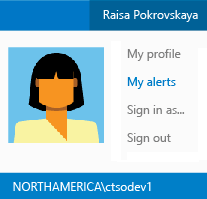  
 

<b>Switch team context</b>

Navigate to a different team or project from the top row.

  
 

<b>Change team settings</b>

Customize features to meet your team needs by [configuring your team assets](../organizations/settings/manage-teams.md).

  
 

<b>Keyboard shortcuts</b>

Increase your productivity by working with [hot keys and shortcuts](../project/navigation/keyboard-shortcuts.md).

</td>
<td width="33%">

<b>Home</b>

Provide team guidance through [Welcome](../project/wiki/markdown-guidance.md) (Markdown format) pages and add team [dashboards](../report/dashboards/dashboards.md) to monitor progress and trends. 

<b>Code</b>

Manage source code using distributed [Git repositories](../repos/git/index.md) or [Team Foundation version control](../repos/tfvc/index.md).  to 

<b>Work</b>

Plan and track work by [creating a product backlog](../boards/backlogs/create-your-backlog.md), and managing work using [Kanban](../boards/boards/kanban-basics.md) or [Scrum](../boards/sprints/assign-work-sprint.md) processes. Find work items you want to review or update by [creating queries](../boards/queries/using-queries.md), or visualize progress by [creating query-based charts](../report/dashboards/charts.md)  

<b>Build</b>

[Define and monitor builds](../pipelines/overview.md) and set up continuous builds to improve the quality of your app. 

<b>Test</b>

[Create and run manual tests](../test/create-a-test-plan.md) for your app.

<b>Package (Azure DevOps Services, Preview)</b>

Share code as binary assets and control dependencies by [subscribing to and working with Azure Artifacts feeds](../artifacts/overview.md).

<b>Release (Azure DevOps Services, Preview)</b>

Manage the release of your app by [deploying it to a specific environment for each separate release step](../pipelines/overview.md), and by controlling the process through approvals for each step.

<b>Code search</b>

[Search within your code branches (TFVC) and repositories (Git)](../project/search/overview.md) to find files, commits, and more using powerful filters to obtain rich results. 

  
 

<b>Find work items</b>

When in the Work hub, [enter IDs or keywords to start a query](../boards/queries/using-queries.md) to find  work items that you want to review, triage, or update.

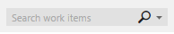  
 

</td>
<td width="33%">

<b>Collection-project-team structure</b>

The [collection-project-team structure](../organizations/projects/about-projects.md) provides teams a high-level of autonomy to configure their tools in ways that work for them. It also supports administrative tasks to occur at the appropriate level.

 

<b>My favorites</b>

From any context, you can drag folders, queries, or builds to My favorites when working in the Code, Work, or Build hubs to provide quick access to those items. 

<b>Team favorites</b>

From your team context, drag shared queries, builds, and folders to Team favorites to provide quick access to those items. 

  
 

<b>Project admin context</b>

Open the admin context to [add teams](../organizations/settings/add-teams.md) and [manage permissions](../organizations/security/change-individual-permissions.md). From any project hub, choose the  gear icon to open the admin context.

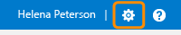  
 

<b>Project collection admin context</b>

From the collection admin context, you can [manage collection-level permissions](../organizations/security/set-project-collection-level-permissions.md), and set build policies, and [manage extensions](../extend/overview.md). Choose the  gear icon to open the admin context, and then choose DefaultCollection. 

</td>
</tr>
</tbody>
</table>

## Search, queries, and filters

<table>
<tbody>
<tr valign="top">
<td width="33%">

<b>Quick work item search</b>

Find work items based on [ID, assignment, changed date, or keyword](http://msdn.microsoft.com/library/cc668120.aspx). 

  
 

<b>Code search</b>

[Find code based on keywords and semantic search filters](../project/search/overview.md) across your Git repositories.

  

<b>CodeLens search</b>

[Find references and changes to your code, linked bugs, work items, code reviews, and unit tests](http://msdn.microsoft.com/library/dn269218.aspx).

<b>Work item queries</b>

Open shared queries or create your own query using the query editor [to list work items or show hierarchical or dependent items](../boards/queries/using-queries.md).  

><b>Manage risks and dependencies</b>

Link work items to [track related work, dependencies, and changes made over time](../boards/queries/link-work-items-support-traceability.md).

<b>History & auditing</b>

Review and query [work item change history](../boards/queries/history-and-auditing.md) to learn of past decisions and support future ones.

<b>Bulk add or modify using Excel </b>

[Bulk add items to track or modify multiple field values](../boards/backlogs/office/bulk-add-modify-work-items-excel.md) using Excel.

</td>
<td width="33%">

<b>Charts</b>

[Turn your queries into a status or trend chart](../report/dashboards/charts.md) and share them with your team, organization, and stakeholders.

  
 

<b>Tags</b>

[Add tags to work items](../boards/queries/add-tags-to-work-items.md) to filter backlogs and queries. Bulk update work items to add or remove tags: [Azure DevOps Services](../boards/backlogs/bulk-modify-work-items.md#tags) | [TFS](../boards/backlogs/office/bulk-add-modify-work-items-excel.md). 

  
 

<td width="33%">

<b>Bulk modify</b>

[Edit or update multiple work items](../boards/backlogs/bulk-modify-work-items.md) from any backlog or query result. Supported tasks include:  

<ul>
<li style="margin-bottom:0px">Modify field values </li>
<li style="margin-bottom:0px">Add or remove tags  </li>
<li style="margin-bottom:0px">Reassign </li>
<li style="margin-bottom:0px">Move to an iteration</li>
<li style="margin-bottom:0px">Delete</li>
<li style="margin-bottom:0px">Link to a new or existing work item </li>
<li style="margin-bottom:0px">Change work item type </li>
<li style="margin-bottom:0px">Move to another project</li>
<li style="margin-bottom:0px">Create a new Git branch</li>
</ul>
 

<b>Query by date or current iteration</b>

List work items based on [when changes occurred or if they belong to the team's current sprint](../boards/queries/query-by-date-or-current-iteration.md). 

<b>Query by workflow</b>

[Find and list work items based on their current state](../boards/queries/query-by-workflow-changes.md), such as new, in progress, resolved, done, or closed. 

<b>Query by Kanban board change</b> 

Track status and trends of work items based on [changes made to the Kanban board](../boards/queries/query-by-workflow-changes.md). 

</td>
</tr>
</tbody>
</table>

## Security

<table>
<tbody>
<tr valign="top">
<td width="33%">

<b>Manage users and groups</b>

[Add users to built-in groups](../organizations/security/permissions.md) to grant them access to your project. Optionally, create groups to customize access based on your business requirements.

<b>Permission states</b>

Understand how [Allow, Deny, Not set and other permissions states](../organizations/security/about-permissions.md) control access to features and objects. 

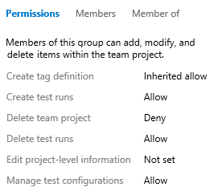  
 

<b>Manage work access (Azure DevOps Services)</b>

[Control user access with a directory](../organizations/accounts/manage-azure-active-directory-groups.md) to enforce policies about accessing company resources.  

<b>Azure Active Directory (Azure DevOps Services) </b>

Easily control access to your team's critical resources and key business assets with [Azure Active Directory groups](../organizations/accounts/manage-azure-active-directory-groups.md).

<b>Set up groups (TFS)</b>

[Create Windows or Active Directory groups](/azure/devops/server/admin/setup-ad-groups) to manage access to your team projects and collections.  

<b>Built-in groups</b>

Understand the [permissions granted to built-in groups](../organizations/security/permissions.md#groups) and use them to manage access to your team projects and collections.

</td>
<td width="33%">

<b>DevOps permissions</b>

Grant or restrict access to: 

<ul>
<li>[Git repositories](../organizations/security/set-git-tfvc-repository-permissions.md)</li>
<li>[Git branches](../repos/git/branch-permissions.md)</li>
<li>[TFVC source code and folders](../organizations/security/set-git-tfvc-repository-permissions.md)</li>
<li>[Build](../pipelines/policies/set-permissions.md)</li>
<li>[Test](../organizations/security/set-project-collection-level-permissions.md))</li>
<li>[Release](../pipelines/policies/set-permissions.md)</li>
</ul>
 

<b>Work item tracking permissions</b>

Control access to specific features by setting permissions for a user or group.

<ul>
<li>[Area and iteration paths](../organizations/security/set-permissions-access-work-tracking.md)</li>
<li>[Query permissions](../boards/queries/set-query-permissions.md)</li>
<li>[Work item tags](../organizations/security/permissions.md#tags)</li>
<li>[Move work items to another project](../organizations/security/set-permissions-access-work-tracking.md#move-delete-permissions)</li>
<li>[Permanently delete work items](../organizations/security/set-permissions-access-work-tracking.md#move-delete-permissions)</li>
<li>[Provide feedback through the Microsoft Feedback client](../project/feedback/give-permissions-feedback.md)</li>
</ul>
 

<b>Team admin role and permissions</b>

Add users as team administrators to enable them to [configure team settings and manage team assets](../organizations/settings/manage-teams.md).

<b>Manage administrative permissions </b>

[Add users to one of the following built-in groups] to provide them permissions assigned to that group: 

<ul>
<li>[Project Administrators](../organizations/security/set-project-collection-level-permissions.md), who manage shared features for a project </li>
<li>[Project Collection Administrators](../organizations/security/set-project-collection-level-permissions.md), who manage collection-level features </li>
<li>[Team Foundation Server Administrators](/azure/devops/server/admin/add-administrator-tfs), who manage on-premises application servers </li>
</ul>
 

<b>Restrict access</b>

You can restrict access to several features and tasks by setting the permission state to Deny to individual users or a security group.

</td>
<td width="33%">

<b>Stakeholder access</b>

[Grant stakeholders, non-licensed users, limited access](../organizations/security/change-access-levels.md) to contribute ideas and access team dashboards.

<b>Query permissions</b>

Grant permissions to [create shared queries and query folders](../boards/queries/set-query-permissions.md).

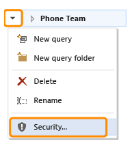  
 

<b>Process permissions</b>

To customize a process, add custom fields, or change the layout of a work item form, you must be a member of the Project Collection Administrators group or be [granted explicit permissions to edit a specific process](../organizations/security/set-permissions-access-work-tracking.md#process-permissions).  

<b>Valid users</b>

Understand how [valid user groups are populated and the permissions they're granted](../organizations/security/about-permissions.md#validusers).

<b>Permission reference</b>

[Provide or restrict access](../organizations/security/permissions.md) for practically any feature, function, or object at the collection or project level. 

<b>SharePoint permissions (TFS)</b>

Grant permissions to [view and contribute to SharePoint project portals](https://msdn.microsoft.com/library/bb558971.aspx).

<b>SQL Server reporting permissions (TFS)</b>

Grant permissions to [view and author Excel and SQL Server reports](../report/admin/grant-permissions-to-reports.md).

</td>
</tr>
</tbody>
</table>

## Set up and installation

<table>
<tbody>
<tr valign="top">
<td width="33%">

<b>Free developer offers</b>

To get started, [download and install Visual Studio](https://visualstudio.microsoft.com/products/free-developer-offers-vs.aspx) an integrated development environment (IDE) that works with Azure DevOps Services and TFS. 

<b>Migrate from on-premises to hosted</b>

You can [migrate source code and work items](https://visualstudio.microsoft.com/articles/adopting-vsts) from an on-premises TFS to the cloud. 

</td>
<td width="33%">

<b>Sign up for Azure DevOps Services </b>

[Store your code, tests, and test results in the cloud with Azure DevOps Services](https://visualstudio.microsoft.com/docs/setup-admin/team-services/sign-up-for-visual-studio-team-services), as well as plan your project and track progress. 

<b>Install TFS </b>

[Download and install the latest version of Team Foundation Server](https://visualstudio.microsoft.com/downloads). TFS provides the collaboration hub to support your teams DevOps tasks. at the center of the Microsoft devops solution. 

</td>
<td width="33%">

<b>Email configuration (TFS)</b>

For feedback requests, alerts, and other special controls to work, you must [configure an SMTP server](/azure/devops/server/admin/setup-customize-alerts) for your on-premises TFS. 

<b>Automated, scheduled backups (TFS)</b>

Reduce the risk of lost data by [scheduling automated backups of the data store](/azure/devops/server/admin/backup/config-backup-sched-plan).

<b>Built-in SQL Server database (TFS)</b>

For small teams, you can install [TFS using SQL Server Express which installs with TFS](/azure/devops/server/install/single-server).  

</td>
</tr>
</tbody>
</table>

## Teams, team projects, and processes

### Processes and process guidance

<table>
<tbody>
<tr valign="top">
<td width="33%">

<b>What is a process?</b>

A [process defines the building blocks](../boards/work-items/guidance/choose-process.md) of the work item tracking system as well as other sub-systems you access through your project.  

<b>Compare and choose a process</b>

Compare the three core system processes--[Agile, Scrum, CMMI](../boards/work-items/guidance/choose-process.md)--before you choose one to create a project. 

<b>Agile process </b>

Choose [Agile](../boards/work-items/guidance/agile-process.md) when your team uses Agile planning methods, including Scrum, and tracks development and test activities separately. With Agile, you can track user stories and bugs on the Kanban board, or track bugs and tasks on the task board.

  
 

<b>Customize a process (Azure DevOps Services) </b>

Customizations you make to an inherited process automatically update all team projects that reference that process. You can customize your project as follows:

<ul>
<li>[Add and modify fields](../organizations/settings/work/customize-process-field.md)</li>
<li>[Modify the web form layout](../organizations/settings/work/customize-process-form.md)</li>
<li>[Modify the workflow states](../organizations/settings/work/customize-process-workflow.md) </li>
<li>[Add a custom work item type](../organizations/settings/work/customize-process-wit.md) </li>
</ul>

<b>Manage processes (Azure DevOps Services) </b>

[Create inherited processes and migrate team projects to use them](../organizations/settings/work/manage-process.md). Set the default process and enable, disable, or delete processes you no longer want to use.   

</td>
<td width="33%">

<b>Kanban process tools</b>

You can use the Kanban board with any process--Agile, Scrum, CMMI--or project that you select or create. Agile Kanban tools support working with the [Kanban board](../boards/boards/kanban-basics.md), [adding task checklists](../boards/boards/add-task-checklists.md), [setting WIP limits](../boards/boards/wip-limits.md), [custom columns](../boards/boards/add-columns.md), [split columns](../boards/boards/split-columns.md), [custom swimlanes](../boards/boards/expedite-work.md), and [customizing cards](../boards/boards/customize-cards.md). 

<b>Scrum process</b>

Choose [Scrum](../boards/work-items/guidance/scrum-process.md) when your team practices Scrum and you want to track product backlog items (PBIs) and bugs on the Kanban board, or break PBIs and bugs down into tasks on the task board. 

   
 

<b>Scrum work items and workflow process guidance</b>

Plan and track your work using the [work item types and workflow supported by the Scrum process](../boards/work-items/guidance/scrum-process-workflow.md).  

<b>Agile work items and workflow process guidance</b>

Plan and track your work using the [work item types and workflow supported by the Agile process](../boards/work-items/guidance/agile-process-workflow.md).  

<b>Work item field index</b>

For descriptions and usage of each field used by the core and inherited processes, see [Work item field index](../boards/work-items/guidance/work-item-field.md).   

</td>
<td width="33%">

<b>Scrum process tools</b>

Scrum processes can be used with any process--Agile, Scrum, CMMI--or project that you select or create. Agile Scrum tools support [sprint planning](../boards/sprints/assign-work-sprint.md), [capacity planning](../boards/sprints/set-capacity.md), [task boards](../boards/sprints/task-board.md), and [burndown charts](../boards/sprints/sprint-burndown.md).  

<b>Manage processes (Azure DevOps Services) </b>

[Add users to built-in groups](../organizations/security/permissions.md) to grant them access to your project. Optionally, create groups to customize access based on your business requirements.

<b>CMMI process</b>

Choose [CMMI](../boards/work-items/guidance/cmmi-process.md) when your team follows more formal project methods that require a framework for process improvement and an auditable record of decisions. CMMI supports tracking requirements, change requests, risks, and reviews.

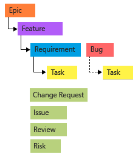  
 

<b>CMMI work items and workflow process guidance</b>

Plan and track your work using the [work item types and workflow supported by the CMMI process](../boards/work-items/guidance/cmmi-process-workflow.md).  

</td>
</tr>
</tbody>
</table>

::: moniker range=">= tfs-2013 <= tfs-2018"

### Process templates (TFS)

<table>
<tbody>
<tr valign="top">
<td width="33%">

<b>What is a process template?</b>

A process template is the forerunner and on-premises version of a process. It provides the  building blocks of the work item tracking system as well as other sub-systems you access through your project. Process templates support full [customization of all its objects](https://msdn.microsoft.com/library/ms243782.aspx). 

<b>Manage process templates </b>

[Download and upload process templates](../boards/work-items/guidance/manage-process-templates.md) to support customization and upgrade of your work tracking experience and team projects. 

</td>

<td width="33%">

<b>Process template files</b>

You customize the initial configuration of team projects by [customizing one or more process template files](https://msdn.microsoft.com/library/ms243856.aspx). By customizing these files, you can define the initial configuration of all team projects that are created from the process template. 

<b>Configure Features Wizard</b>

Use the Configure Features Wizard to [configure team projects after a TFS upgrade to access new features](../reference/configure-features-after-upgrade.md).  

</td>
<td width="33%">

<b>Changes made to process templates</b>

For a catalog of changes, see [Changes made to process templates](../boards/work-items/guidance/changes-to-process-templates.md).

<b>Customize the Microsoft Project field mapping file </b>

You can [customize how work item fields that are defined in Team Foundation map to fields in Microsoft Project](https://msdn.microsoft.com/library/ms404686.aspx). And, you can change how specific fields are published.  

</td>
</tr>
</tbody>
</table>

::: moniker-end

### Team projects

<table>
<tbody>
<tr valign="top">
<td width="33%">

<b>What is a project?</b>

A [project](../organizations/projects/create-project.md) provides a repository for source code and a place for a group of developers to plan, track progress, and collaborate on building software solutions. A project lives within a project collection. You can grant permissions to and customize a project to support your business needs. 

<b>Create a project </b>

You can [create a project hosted in the cloud (Azure DevOps Services)](sign-up-invite-teammates.md), avoiding maintenance and administrative overhead, or [create a project on an on-premises TFS](../organizations/projects/create-project.md).

<b>Rename a project</b>

[Rename a project](../organizations/projects/rename-project.md) as needed to reflect changes that occur within your org.

<b>Delete a project</b>

Simplify the navigation to team projects that are in use by [deleting team projects you no longer use](../organizations/projects/delete-project.md). 

</td>
<td width="33%">

<b>Collection-project-team structure</b>

The [collection-project-team structure](../organizations/projects/about-projects.md) provides teams a high-level of autonomy to configure their tools in ways that work for them. It also supports administrative tasks to occur at the appropriate level.

 

<b>Change the process (Azure DevOps Services) </b>

You [change the process of a project](../organizations/settings/work/manage-process.md) to apply customizations you've made to an inherited process. You can [add and modify fields and modify the layout of each work item type](../organizations/settings/work/customize-process.md) defined for that process.  

</td>
<td width="33%">

<b>View your work across teams and team projects</b>

From your [Project page](../project/navigation/work-across-projects.md), you can view and quickly navigate to teams, team projects, branches, work items, pull requests and other objects that are relevant to you and that are stored in different team projects within the organization or collection. 

<b>Customize a project (TFS) </b>

You customize a project defined on an on-premises TFS by [modifying definition files for work item types or process configuration, or changing field attributes](../reference/customize-work.md).  

<b>Update a project after an upgrade (TFS)</b>

Some features added when you upgrade your on-premises application server may require you to [configure features to access them](../reference/configure-features-after-upgrade.md). 

<b>Upload reports (TFS) </b>

[Upload the latest reports provided for your process](../report/admin/upload-reports.md) or add reports after you've already created a project by adding SQL Server Reporting Services.  

</td>
</tr>
</tbody>
</table>

### Teams

<table>
<tbody>
<tr valign="top">
<td width="33%">

<b>What is a team?</b>

A team is an organizing unit used to support a number of [team-configurable tools](../organizations/settings/manage-teams.md) to plan and manage work and facilitate collaboration.  

<b>Add team members</b>

Add organizations-[Azure DevOps Services](../organizations/accounts/add-team-members.md) | [TFS](../organizations/security/add-users-team-project.md)--to a team to enable users to share code, plan and track work, and access other team assets and resources. 

  
 

<b>Add a team</b>

As your organization grows, consider moving from your [default team of one to two or more teams](../organizations/settings/add-teams.md) to support feature-focused groups within your org.

<b>Add a team admin</b>

Add users to the team admin role to enable them to [Manage teams and configure team tools](../organizations/settings/add-team-administrator.md). Team settings can only be configured by a team or project admin. 

<b>Support stakeholders</b>

Members within your org who don't have a license or contribute to developing the code base [can track project priorities and provide direction, feature ideas, and business alignment to a team](../organizations/security/get-started-stakeholder.md).  

</td>
<td width="33%">

<b>Team dashboards</b>

Share progress, status, and guidance with your team using [configurable team dashboards](../report/dashboards/dashboards.md).  

   
 

<b>Team welcome page</b>

Provide in-project guidance through the [Welcome page and other pages you format using Markdown](../project/wiki/markdown-guidance.md).  

<b>Setup a team hierarchy</b>

By [configuring your teams and backlogs into an hierarchical structure](../boards/plans/portfolio-management.md), program owners can more easily track progress across teams, manage portfolios, and generate rollup data. 

<b>Set team defaults</b>

Several Agile tools reference the team's default area path, iteration path, and activated sprints to automatically filter the set of work items they display. Understand how defaults are used](../organizations/settings/about-teams-and-settings.md).

<b>Select team sprints</b>

[Select your team's sprints](../boards/sprints/define-sprints.md) to gain access to sprint backlogs and task boards.

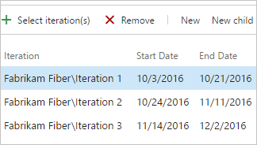  
 
</td>
<td width="33%">

<b>Configure team settings</b>

Configure, customize, and manage all [team-related activities](../organizations/settings/manage-teams.md)

<b>Team alerts</b>

As changes occur to work items, code reviews, source control files, and builds, your team can automatically [receive email notifications for alerts](../boards/queries/alerts-and-notifications.md) that you define.  

<b>Team rooms</b>

Team rooms, like chat rooms, provide teams with a [space to discuss work in progress, ask questions, share status, and clarify issues](../notifications/collaborate-in-a-team-room.md) that arise. Use team rooms to foster and capture communication among team members, both near and far.

<b>Team groups</b>

A [team group is created](../organizations/settings/about-teams-and-settings.md#team-group) when you create a team. Use this group in queries or to set permissions for your team.  

</td>
</tr>
</tbody>
</table>

##Traceability

<table>
<tbody>
<tr valign="top">
<td width="50%">

<b>Work item history & auditing</b>

Review and query [work item change history](../boards/queries/history-and-auditing.md) to learn of past decisions and support future ones. 

<b>Manage risks and dependencies</b>

Link work items to [track related work, dependencies, and changes made over time](../boards/queries/link-work-items-support-traceability.md). [Create queries](../boards/queries/using-queries.md) based on link type to monitor dependencies.

  
 

<b>Rich text comments</b>

Describe and comment on work to perform using [formatted text, hyperlinks, and inline images](../boards/backlogs/add-work-items.md).  

<b>Discussion (Azure DevOps Services) </b>

[Add or review comments](../boards/backlogs/add-work-items.md) added to a work item. Start by choosing the  discussion icon.  

  
 

<b>Storyboard</b>

[Link your storyboards to you backlog work items](../boards/backlogs/office/storyboard-your-ideas-using-powerpoint.md).  

</td>

<td width="50%">

<b>Git code changes </b>

[Get detailed information about what changes have been made to your local and centralized branches and repositories](../repos/git/history.md), compare files and folders, review history of commits and file changes. 

<b>Integrate Git development with work tracking (Azure DevOps Services) </b>

Drive Git development and stay in sync as a team to complete backlog items and tasks using the [Git Development section](../boards/backlogs/connect-work-items-to-git-dev-ops.md). Add branches, create pull requests, and view all development performed to support the specific work item.  

  
 

<b>TFVC code changes </b>

[Get detailed information about what changes have been made to your files](https://msdn.microsoft.com/library/ms245475.aspx), compare files and folders, view where and when changesets have been merged, and view file changes using annotate.

<b>Build changes</b>

Determine who [changed what in the build definition and when they did it](../pipelines/build/history.md).

<b>Release audit history</b>

Retain full audit history of all activities performed on a release with detailed release logs and approval tracking.

<b>Release logs</b>

View or download log files as zip files. Log files contain the status for each step or task of a release, for each of the environments in the release definition. Each completed release--succeeded, failed, or abandoned--[includes a live log file, details, and history for each step or task](../pipelines/release/define-multistage-release-process.md#monitor-and-track-deployments). 

</td>
</tr>
</tbody>
</table>

## Related articles

We add new features frequently. We'll work to keep this list up-to-date. Other resources you might want to bookmark:
- [Azure DevOps Services - Features update](/../../release-notes.md)
- [Microsoft devops blog](https://blogs.msdn.microsoft.com/devops/)  

 
Get started today using our cloud offering, [Azure DevOps Services](https://visualstudio.microsoft.com/team-services/), or our [on-premises TFS server](https://visualstudio.microsoft.com/downloads/).  

<!---   
### We welcome your feedback

Send suggestions on **[UserVoice](https://developercommunity.visualstudio.com/content/idea/post.html?space=21)**, and follow us on **[Twitter](https://twitter.com/AzureDevOps) @AzureDevOps**.

See also our [comprehensive feedback and support page](provide-feedback.md).

--> 
