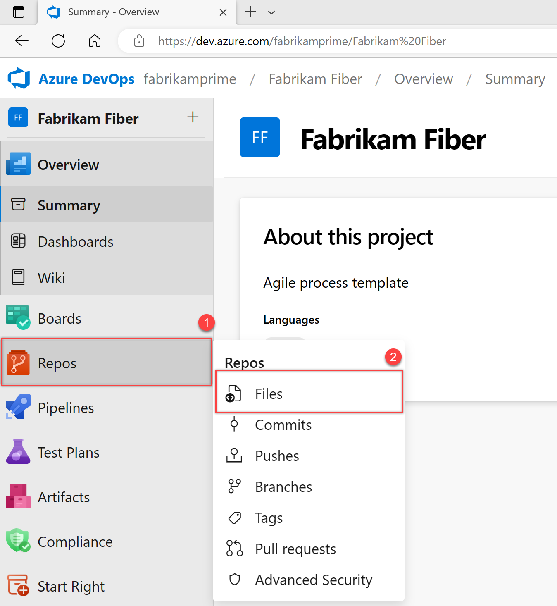
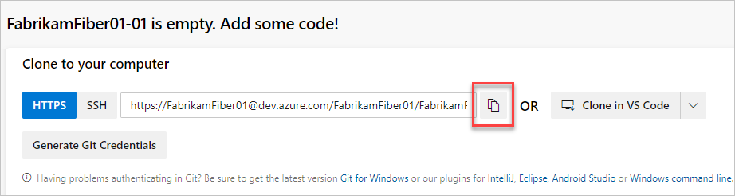
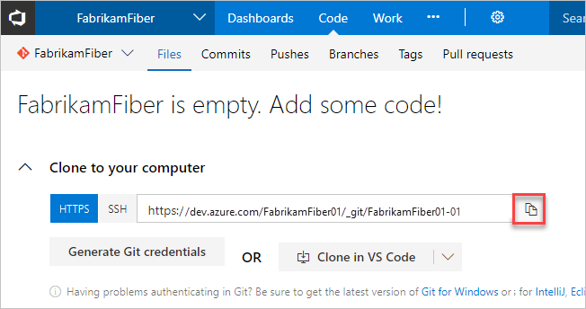
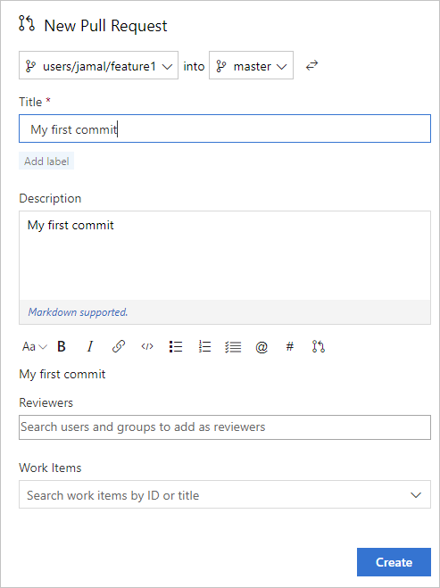
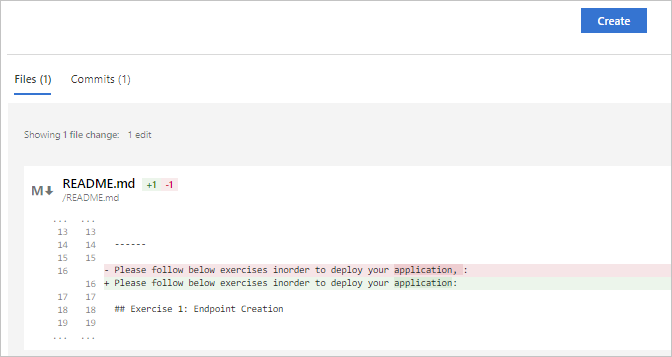
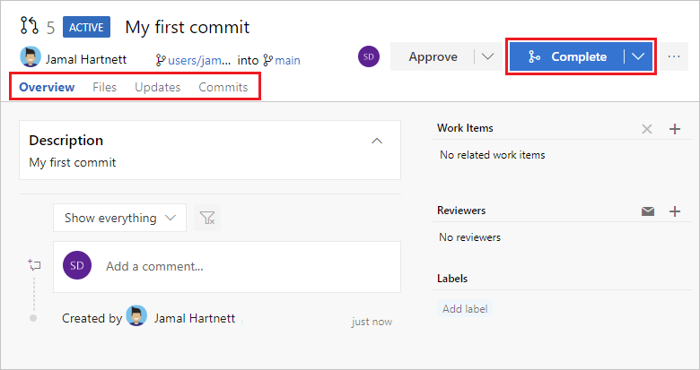

# Code with Git

[!INCLUDE [version-lt-eq-azure-devops](../includes/version-lt-eq-azure-devops.md)]

Learn how to share your code with others when you use a Git repository. 

## Prerequisites

You must have an [organization](../organizations/accounts/create-organization.md) and [project](../organizations/projects/create-project.md) in Azure DevOps. When you create a project, Azure DevOps automatically creates an empty repository in Repos.

## 1. Install Git command-line tools

Install one of the following Git command-line tools:

   - To install Git for Windows, including Git Credential Manager, see [Install the Git Credential Manager](../repos/git/set-up-credential-managers.md).
   - To install on macOS or Linux, check out the [Installing Git](https://git-scm.com/book/en/v2/Getting-Started-Installing-Git) chapter in the open-source _Pro Git_ book. For macOS and Linux, we recommend that you [configure SSH authentication](../repos/git/use-ssh-keys-to-authenticate.md).

## 2. Clone the repo to your computer

To work with a Git repo, you clone it to your computer, which creates a complete local copy of the repo for you to work with. Your code might be in one of several places. 

::: moniker range=">= azure-devops-2019"

1. Complete the following step that's applicable to your scenario:

   - If **You don't have any code yet**, first [Create a new Git repo in your project](../repos/git/create-new-repo.md#create-a-repo-using-the-web-portal), and then complete the next step.
   - If **the code is in another Git repo**, such as a GitHub repo or a different Azure Repo instance, [import it into a new or existing empty Git repo](../repos/git/import-git-repository.md), and then complete the next step.
   - If **the code is on your local computer and not yet in version control**, either [create a new Git repo in your project](../repos/git/create-new-repo.md#create-a-repo-using-the-web-portal) or add your code to an existing repository.

2. From your web browser, open the team project for your organization and select **Repos** > **Files**.

   

3. Select **Clone** in the upper-right corner of the **Code** window and copy the URL.
  
   

4. Open the Git command window (Git Bash on Git for Windows). Go to the folder where you want the code from the repo stored on your computer, and run `git clone`, followed by the path copied from **Clone URL** in the previous step. See the following example:

   ```
   git clone https://FabrikamFiber01@dev.azure.com/FabrikamFiber01/FabrikamFiber01-01/_git/FabrikamFiber01-01
   ```
  
   Git downloads a copy of the code, including all [commits](../repos/git/commits.md), and [branches](../repos/git/branch-policies-overview.md) from the repo, into a new folder for you to work with.

5. Switch your directory to the repository that you cloned.

   ```
   cd fabrikam-web
   ```

   Keep this command window open to work in a branch.

::: moniker-end

::: moniker range="tfs-2018"

1. Complete the following step that's applicable to your scenario:

   - If **You don't have any code yet**, first [Create a new Git repo in your project](../repos/git/create-new-repo.md#create-a-repo-using-the-web-portal), and then complete the next step.
   - If **the code is in another Git repo**, such as a GitHub repo or a different Azure Repo instance, [import it into a new or existing empty Git repo](../repos/git/import-git-repository.md), and then complete the next step.
   - If **the code is on your local computer and not yet in version control**, either [create a new Git repo in your project](../repos/git/create-new-repo.md#create-a-repo-using-the-web-portal) or add your code to an existing repository.

2. From your web browser, open the project for your organization, and select **Code**.

3. Select **Clone** in the upper-right corner of the Code window, and copy the URL.

   

4. Open the Git command window (Git Bash on Git for Windows). Go to the folder where you want the code from the repo stored on your computer, and run `git clone`, followed by the path copied from **Clone URL** in the previous step. See the following example:

   ```
   git clone https://contoso-ltd.visualstudio.com/MyFirstProject/_git/contoso-demo
   ```
  
   Git downloads a copy of the code in a new folder for you to work with. The download includes all [commits](../repos/git/commits.md) and [branches](../repos/git/branch-policies-overview.md) from the repo.

5. Switch your directory to the repository that you cloned.

   ```
   cd contoso-demo
   ```

   Keep the command window open to work in a branch.

::: moniker-end

## 3. Work in a branch

Git [branches](../repos/git/branch-policies-overview.md) isolate your changes from other work being done in the project. We recommend using the [Git workflow](../repos/git/gitworkflow.md), which uses a new branch for every feature or fix that you work on. For our examples, we use the branch, `users/jamal/feature1`.

1. Create a branch with the `branch` command.
   
   ```
   git branch users/jamal/feature1
   ```
   This command creates a reference in Git for the new branch. It also creates a pointer back to the parent commit so Git can keep a history of changes as you add commits to the branch.

   > [!TIP]
   > If you're working with a previously cloned repository, ensure that you've checked out the right branch (`git checkout main`) and that it's up to date (`git pull origin main`) before you create your new branch.

2. Use `checkout` to switch to that branch.

   ```
   git checkout users/jamal/feature1
   ```
   Git changes the files on your computer to match the latest commit on the checked-out branch.

   > [!TIP]
   > When you create a branch from the command line, the branch is based on the currently checked-out branch. When you clone the repository, the default branch (typically `main`) gets checked out. Because you cloned, your local copy of `main` has the latest changes.
   >  ```
   >  git checkout main
   >  git pull origin main
   >  git branch users/jamal/feature1
   >  git checkout users/jamal/feature1
   >  ```
   > You can replace the first three commands in the previous example with the following command, which creates a new branch named `users/jamal/feature1` based on the latest `main` branch.
   >
   >  ```
   >  git pull origin main:users/jamal/feature1
   >  ```
   > Switch back to the Git Bash window that you used in the previous section. Run the following commands to create and check out a new branch based on the main branch.
   >
   >  ```
   >  git pull origin main:users/jamal/feature1
   >  git checkout feature1
   >  ```

## 4. Work with the code

In the following steps, we make a change to the files on your computer, commit the changes locally, and then push the commit to the repo stored on the server.

1. Browse to the folder on your computer where you cloned the repo, open the `README.md` file in your editor of choice, and make some changes. Then, **Save** and close the file.

2. In the Git command window, go to the `contoso-demo` directory by entering the following command:

   ```
   cd contoso-demo
   ```

3. Commit your changes by entering the following commands in the Git command window:

   ```
   git add .
   git commit -m "My first commit"
   ```

   The `git add .` command stages any new or changed files, and `git commit -m` creates a commit with the specified commit message.
   
   > [!TIP]
   > Check what branch you're working on before you commit, so that you don't commit changes to the wrong branch. Git always adds new commits to the current local branch.

4. Push your changes to the Git repo on the server. Enter the following command into the Git command window:

   ```
   git push origin users/jamal/feature1
   ```

Your code is now shared to the remote repository, in a branch named `users/jamal/feature1`. To merge the code from your working branch into the `main` branch, use a pull request.

## 5. Merge your changes with a pull request

Pull requests combine the review and merge of your code into a single collaborative process. After you’re done fixing a bug or new feature in a branch, create a new pull request. Add the members of the team to the pull request so they can review and vote on your changes. Use pull requests to review works in progress and get early feedback on changes. There’s no commitment to merge the changes because you can abandon the pull request at any time.

The following example shows the basic steps of creating and completing a pull request.

::: moniker range=">= azure-devops-2019"

1. Open the team project for your organization in your web browser and select **Repos** > **Files**. If you kept your browser open after getting the clone URL, you can just switch back to it.

   

2. Select **Create a pull request** in the upper-right corner of the **Files** window. If you don't see a message like **You updated users/jamal/feature1 just now**, refresh your browser.

   

   New pull requests are configured to merge your branch into the default branch, which in this example is `main`. The title and description are pre-populated with your commit message.

   

   You can [add reviewers](../repos/git/pull-requests.md#add-and-remove-reviewers) and [link work items](../repos/git/pull-requests.md#link-work-items) to your pull request.

   You can review the files included in the pull request at the bottom of the **New Pull Request** window.

   

3. Select **Create**.

   View the details of your pull request from the **Overview** tab. You can also view the changed files, updates, and commits in your pull request from the other tabs. 

4. Select **Complete** to begin the process of completing the pull request.

   

5. Select **Complete merge** to complete the pull request and merge your code into the `main` branch.

   

   >[!NOTE]
   >This example shows the basic steps of creating and completing a pull request. For more information, see [Create, view, and manage pull requests](../repos/git/pull-requests.md).

::: moniker-end

::: moniker range="tfs-2018"

1. Open the team project for your organization from your web browser and select the **Code** page.

2. Select **Clone** in the upper-right corner of the **Code** page and copy the **Clone URL**.

   

3. Open the Git command window, for example Git Bash on Git for Windows, and browse to the folder where the repo is stored on your computer. 
   
   Run `git clone` followed by the path copied from the **Clone URL** in the previous section, as shown in the following example.

   ```
   git clone https://dev.azure.com/contoso-ltd/MyFirstProject/_git/contoso-demo
   ```

   Git downloads a copy of the code into a new folder for you to work with. The download includes all [commits](../repos/git/commits.md) and [branches](../repos/git/branch-policies-overview.md) from the repo.

4. Switch your directory to the repository that you cloned.

   ```
   cd fabrikam-web
   ```

   Keep this command window open, because you'll use it in the following steps.

::: moniker-end

Your changes are now merged into the `main` branch, and your `users/jamal/feature1` branch is deleted on the remote repository. 

## View history

::: moniker range=">= azure-devops-2019"

1. Switch back to the web portal and select **History** from the **Code** page to view your new commit.

   

2. Switch to the **Files** tab, and select the README file to view your changes.

   

::: moniker-end

::: moniker range="tfs-2018"

1. Switch back to the web portal, and select **History** from the **Code** tab to view your new commit. Two commits appear: the first commit, where the README and .gitignore were added upon repo creation, and the commit you just made.

   

2. Switch to the **Files** tab, and select the README file to view your changes.

     

::: moniker-end

## Clean up

Switch back to your Git Bash command prompt and run the following command to delete your local copy of the branch.

```
git checkout main
git pull origin main
git branch -d users/jamal/feature1
```

This action completes the following tasks:
- The `git checkout main` command switches you to the `main` branch.
- The `git pull origin main` command pulls down the latest version of the code in the main branch, including your changes and the fact that `users/jamal/feature1` was merged.
- The `git branch -d users/jamal/feature1` command deletes your local copy of that branch.

## Next steps  

> [!div class="nextstepaction"]
> [Set up continuous integration & delivery](../pipelines/create-first-pipeline.md?bc=%252fazure%252fdevops%252fuser-guide%252fbreadcrumb%252ftoc.json&toc=%252fazure%252fdevops%252fuser-guide%252ftoc.json)
> 
## Related articles

- [Key concepts for new users to Azure Pipelines](../pipelines/get-started/key-pipelines-concepts.md)
- [What is Azure Repos?](../repos/get-started/what-is-repos.md)
- [Learn more about working with a Git repo](../repos/git/index.yml)
- [What is source control?](source-control.md)
