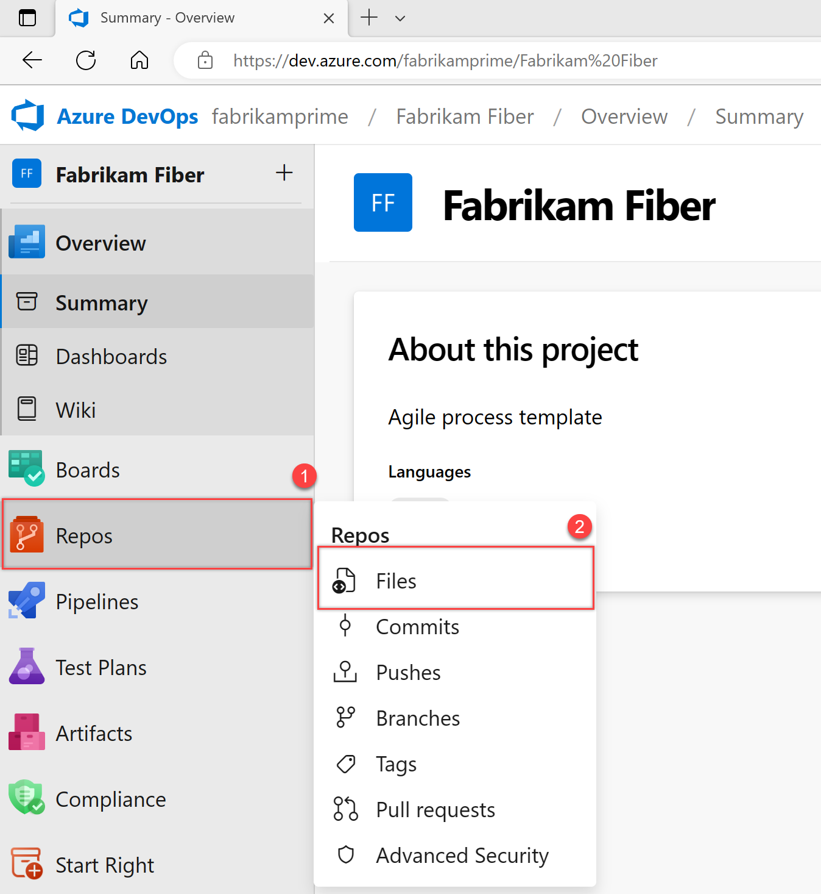
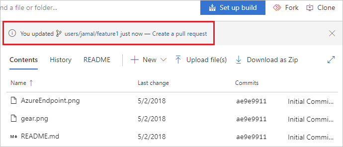
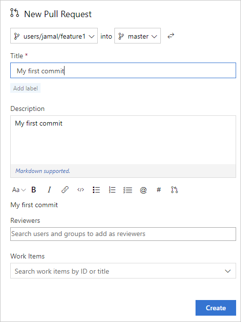
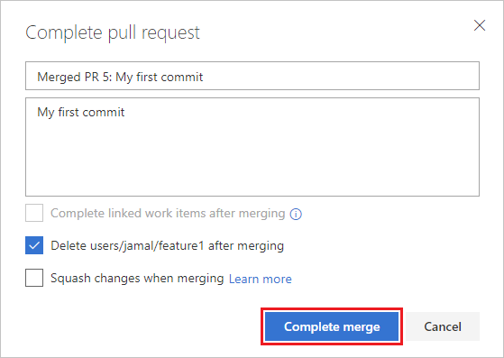
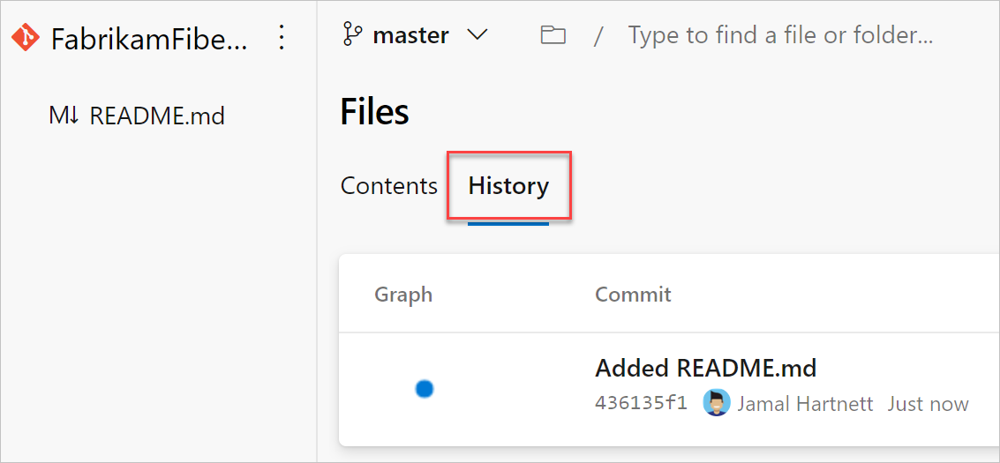
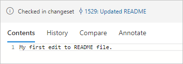

# Share your code by using Git

[!INCLUDE [version-lt-eq-azure-devops](../includes/version-lt-eq-azure-devops.md)]

Share your code with others in Azure DevOps by using a Git repository. Clone the repo to your computer, create a branch for your changes, commit your work, and open a pull request to merge it back into the main branch.

[!INCLUDE [ai-assistance-mcp-server-tip](../includes/ai-assistance-mcp-server-tip.md)]

## Prerequisites

| Category | Requirements |
|--------------|-------------|
| **Project access** | [Project member](../organizations/security/add-users-team-project.md). |
|**Git command-line tool** | One of the following Git command-line tools:<br>- [Git for Windows and Git Credential Manager](../repos/git/set-up-credential-managers.md).<br>- [Git for macOS or Linux](https://git-scm.com/book/en/v2/Getting-Started-Installing-Git). For macOS and Linux, we recommend that you [configure SSH authentication](../repos/git/use-ssh-keys-to-authenticate.md).|

## 1. Clone the repo to your computer

When you clone a repo, you create a complete local copy so you can work offline and push changes back later. Before you clone, ensure your code is in an Azure Repos Git repository:

- **No code yet** — [Create a new Git repo](../repos/git/create-new-repo.md#create-a-repo-using-the-web-portal).
- **Code in another Git repo** (for example, GitHub) — [Import it into Azure Repos](../repos/git/import-git-repository.md).
- **Code on your local computer** — [Create a repo](../repos/git/create-new-repo.md#create-a-repo-using-the-web-portal), then push your code after cloning.

1. From your web browser, open the team project for your organization and select **Repos** > **Files**.

   

1. Select **Clone**, and then **Copy** the URL.

   :::image type="content" source="media/clone-repo/repos-files-clone-button.png" alt-text="Screenshot shows highlighted clone button in repos files.":::

1. Open your Git command window (Git Bash on Windows) and go to the folder where you want to store the repo. Run `git clone` with the URL you copied:

   ```
   git clone https://FabrikamFiber01@dev.azure.com/FabrikamFiber01/FabrikamFiber01-01/_git/FabrikamFiber01-01
   ```
  
   Git downloads a copy of the code, including all [commits](../repos/git/commits.md) and [branches](../repos/git/branch-policies-overview.md), into a new folder.

1. Switch to the cloned repository directory:

   ```
   cd fabrikam-web
   ```

   Keep this command window open to work in a branch.

## 2. Work in a branch

Git [branches](../repos/git/branch-policies-overview.md) isolate your changes from other work in the project. The recommended [Git workflow](../repos/git/gitworkflow.md) creates a new branch for every feature or fix. The examples in this article use the branch `users/jamal/feature1`.

1. Create a branch with the `branch` command.
   
   ```
   git branch users/jamal/feature1
   ```

1. Use `checkout` to switch to that branch.

   ```
   git checkout users/jamal/feature1
   ```

   > [!TIP]
   > Create and switch in one step with `git checkout -b users/jamal/feature1`. If you're working with a previously cloned repo, run `git pull origin main` first to ensure your branch starts from the latest code.

## 3. Work with the code

Edit files locally, commit your changes, and push the commit to the server.

1. Open the `README.md` file in the cloned repo folder, make some changes, and **Save** the file.

1. Stage and commit your changes:

   ```
   git add .
   git commit -m "My first commit"
   ```

   `git add .` stages new and changed files. `git commit -m` saves them as a commit with the specified message. Git always commits to the current branch, so verify you're on the right one before committing.

1. Push your commit to the server:

   ```
   git push origin users/jamal/feature1
   ```

Your code is now in the remote repository on the `users/jamal/feature1` branch. To merge it into `main`, create a pull request.

## 4. Merge your changes with a pull request

Pull requests let your team review and approve code before it merges. Create a pull request when your branch is ready for feedback - you can abandon it at any time.

1. In your web browser, go to your project and select **Repos** > **Files**.

1. Select **Create a pull request** in the upper-right corner. If you don't see a message like **You updated users/jamal/feature1 just now**, refresh your browser.

   

   The pull request targets the default branch (`main`). The title and description come from your commit message. You can [add reviewers](../repos/git/pull-requests.md#add-and-remove-reviewers) and [link work items](../repos/git/pull-requests.md#link-work-items) before creating.

   

1. Select **Create**.

1. Review the **Overview** tab, and then select **Complete** > **Complete merge** to merge your code into `main`.

   

> [!NOTE]
> For more information, see [Create, view, and manage pull requests](../repos/git/pull-requests.md).

Your changes are now in `main`, and the `users/jamal/feature1` branch is deleted from the remote repository. 

## View history

To see your merged changes, go to **Repos** > **Files** in the web portal and select **History**.

   

Select the **Files** tab and then the README file to view your changes.

   

## Clean up

Delete your local copy of the branch after the merge completes:

```
git checkout main
git pull origin main
git branch -d users/jamal/feature1
```

These commands switch to `main`, pull the latest code (including your merged changes), and delete the local `users/jamal/feature1` branch.

::: moniker range="azure-devops"

<a id="use-ai-assistance"></a>

## Use AI to manage Git repositories

If you configure the [Azure DevOps MCP Server](../mcp-server/mcp-server-overview.md), you can use AI assistants to manage your Git repositories and pull requests through natural language prompts.

### Example prompts for Git management

| Task | Example prompt |
|------|----------------|
| List repositories | `List all Git repositories in <Contoso> project` |
| View pull requests | `Show my open pull requests in <Contoso> project` |
| Check PR status | `Get the status of pull request <456> in <Contoso> project` |
| Find active branches | `List branches with active pull requests in the <webapp> repo in <Contoso>` |
| Review PR details | `Show the files changed in pull request <456> in <Contoso>` |
| Check build status | `Show the build status for pull request <456> in <Contoso>` |
| Summarize PR activity | `List all pull requests merged into <main> in the <webapp> repo in <Contoso> this week` |
| Find stale branches | `List branches in the <webapp> repo in <Contoso> that have had no commits in the last <30> days` |
| Review reviewer workload | `Show how many open pull requests each team member is reviewing in <Contoso> project` |

::: moniker-end

## Next step  

> [!div class="nextstepaction"]
> [Set up continuous integration & delivery](../pipelines/create-first-pipeline.md?bc=%252fazure%252fdevops%252fuser-guide%252fbreadcrumb%252ftoc.json&toc=%252fazure%252fdevops%252fuser-guide%252ftoc.json)
> 

## Related content

- [Key concepts for Azure Pipelines](../pipelines/get-started/key-pipelines-concepts.md)
- [What is Azure Repos?](../repos/get-started/what-is-repos.md)
- [Work with a Git repo](../repos/git/index.yml)
- [Source control overview](source-control.md)
