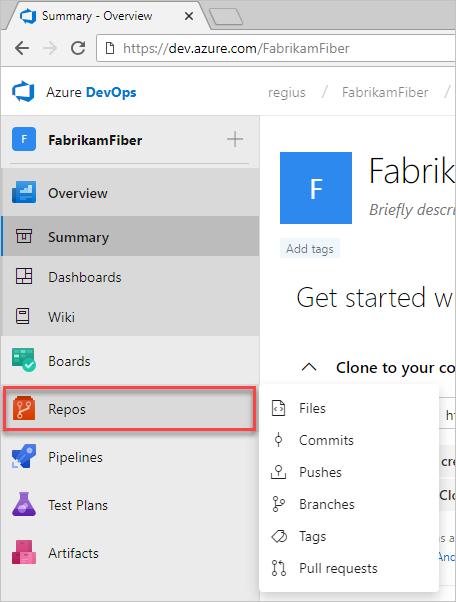
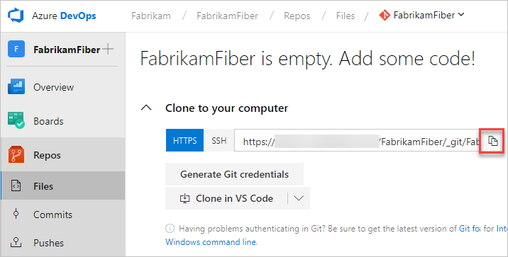

# Quickstart: Code with Git in Azure DevOps

[!INCLUDE [temp](../_shared/version-vsts-tfs-all-versions.md)]

In this quickstart, you learn how to share your code with others. After you create a new organization and project in Azure DevOps, you can begin coding with Git.

To work with a Git repo, you clone it to your computer. Cloning a repo creates a complete local copy of the repo for you to work with, and downloads all [commits](../repos/git/commits.md) and [branches](../repos/git/branches.md) in the repo and sets up a named relationship with the repo on the server. Use this relationship to interact with the existing repo, pushing and pulling changes to share code with your team.

## Install Git command line tools

1. Install one of the following Git command line tools:

  >- To install Git for Windows, including Git Credential Manager, see [Install the Git Credential Manager - Windows](../repos/git/set-up-credential-managers.md#windows)
  >- To install Git for macOS and Linux, see [Install the Git Credential Manager - macOS and Linux](../repos/git/set-up-credential-managers.md#macos-and-linux)

## Clone the repo to your computer

[!INCLUDE [temp](../boards/_shared/new-agile-hubs-feature.md)]

# [New navigation](#tab/new-nav)

1. From your web browser, open the project for your organization and select **Repos**. If you don't have a project, [create one now](sign-up-invite-teammates.md).

   

2. Select **Clone** in the upper-right corner of the Code window and **copy** the URL.
  
   

# [Previous navigation](#tab/previous-nav)

1. From your web browser, open the project for your organization and select **Code**. If you don't have a project, [create one now](sign-up-invite-teammates.md).

2. Select **Clone** in the upper-right corner of the Code window and **copy** the URL.

	

---

3. Open the Git command window (Git Bash on Git for Windows), navigate to the folder where you want the code from the repo stored on your computer, and run `git clone` followed by the path copied from the **Clone URL** in the previous step, as shown in the following example.

  >```
  >git clone >https://contoso-ltd.visualstudio.com/MyFirstProject/_git/contoso->demo
  >```
  A copy of the code is downloaded in Git, including all [commits](../repos/git/commits.md) and [branches](../repos/git/branches.md) from the repo, into a new folder for you to work with.

  Keep this command window open, as you'll use it in the following steps.


## Work with the code

In the following steps, we'll make a change to the files on your computer, commit the changes locally, push the commit to the repo that is stored on the server, and view the changes there.

1. Browse to the folder on your computer where you cloned the repo, open the `README.md` file in your editor of choice, make some changes, and save and close the file.

2. In the Git command window, navigate to the `contoso-demo` directory by entering the following command: 

   > ```
   > cd contoso-demo
   > ```

3. Commit your changes by entering the following command in the Git command window:

    >```
    >git commit -a -m "My first commit"
    >```

   >When you're using `git commit`, `-a` means to commit all changed files, and `-m` specifies a commit message.

4. Push your changes up to the Git repo on the server by entering the following command into the Git command window:

    >```
    >git push
    >```

## View history 

# [New navigation](#tab/new-nav)

1. Switch back to the web portal and select **History** from the Code page to view your new commit. 

   

2. Switch to the **Files** tab and select the README file to view your changes.

   

# [Previous navigation](#tab/previous-nav)

1. Switch back to the web portal and select **History** from the **Code** tab to view your new commit. The new repo has two commits: the first commit where the README and .gitignore were added when the repo was created, and the commit you just made.

   >

2. Switch to the **Files** tab and select the README file to view your changes.

   >  

---

## Next steps  

> [!div class="nextstepaction"]
> [Set up continuous integration & delivery](../pipelines/get-started-designer.md?toc=/azure/devops/user-guide/toc.json&bc=/azure/devops/user-guide/breadcrumb/toc.json)
> or
> [Plan & track work](plan-track-work.md)

Or, [learn more about working with a Git repo](../repos/git/index.md)
