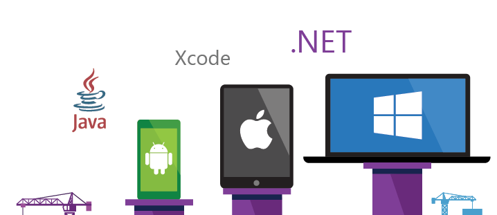

# Key concepts for working with Azure DevOps Services and TFS

[!INCLUDE [temp](../_shared/version-vsts-tfs-all-versions.md)]

The set of platforms, services, and tools you have access to through Azure DevOps Services can be overwhelming. Before you start using our products, you'll want to become familiar with how they fit together. You'll gain that understanding here as well as pointers to additional topics and tutorials to gain confidence in using our products to develop your software.

## Collaborative, integrated software development

Azure DevOps Services, our hosted cloud offering, and Team Foundation Server (TFS), our on-premises platform, provide small teams as well as enterprises the services and tools to support developing and continuously deploying software. Even sole developers can use our platforms to manage their software and deploy their apps. 

The three main areas that support software development include:

- Source control to manage versioning of software files
- Tracking tools to support planning and tracking work, code defects, issues and more
- DevOps tools to support building, testing, and continuous release of software apps.

## Source control

Source or version control systems allow developers to collaborate on code and track changes made to the code base. Source control is an essential tool for multi-developer projects.  

Our systems support two types of source control: Git (distributed) or Team Foundation Version Control (TFVC), a centralized, client-server system. Both systems enable you to check-in files and organize files within folders, branches, and repositories. 

With Git, each developer has a copy on their dev machine of the source repository including all branch and history information. Each developer works directly with his or her own local repository, and changes are shared between repositories as a separate step.

Developers can commit each set of changes and perform version control operations such as history and compare without a network connection. Branches are lightweight. When developers need to switch contexts, they create a private local branch. Developers can quickly switch from one branch to another to pivot among different variations of the codebase. Later, they can merge, publish, or dispose of the branch.

>[!NOTE]
>Git in Azure DevOps Services and TFS is standard Git. You can use Visual Studio with third-party Git services, and you can also use third-party Git clients with TFS.

With TFVC, developers have only one version of each file on their dev machines. Historical data is maintained only on the server. Branches are path-based and created on the server.

## Work tracking and Agile tools

Software development projects require ways to easily share information and track the status of work, tasks, issues, or code defects. In the past, you might have planned and track work using one or more tools such as Microsoft Excel, Microsoft Project, a bug tracking system, or a combination of tools. Now, many teams have adopted Agile methods and practices to support planning and development.

Our systems provide several types of work items which you use to track features, requirements, user stories, tasks, bugs, and issues. Each work item is associated with a work item type and a set of fields that team members update as information becomes available and progress is made.

For planning purposes, you have access to several types of backlogs and boards to support the main Agile methods&mdash;Scrum, Kanban, or Scrumban.

- Product backlog, used to create and prioritize stories or requirements  
- Kanban, used to visualize and manage the flow of work as it moves from inception to in progress to done 
- Sprint backlogs, used to plan work to complete during a sprint cycle, a regular 2 to 4 week cadence teams use when implementing Scrum 
- Task board, used during daily Scrum meetings to review work completed, remaining, or blocked
 
Project managers and developers share information by tracking work items  on the backlogs and boards. Useful charts and dashboards round out the picture helping teams monitor progress and trends. 

## DevOps and continuous integration

Rapid and reliable release of software comes from automating as many processes as possible. Our systems support build, test, and release automation.

- You can define builds to automatically run whenever a team member checks in code changes
- Your build pipelines can include instructions to run tests after the build runs
- Release pipelines support managing deployment of your software builds to staging or production environments

## Scaling

Both Azure DevOps Services and TFS are enterprise-ready, supporting teams of any size, from tens to thousands. Azure DevOps Services provides a scalable, reliable, and globally available hosted service. It is backed by a 99.9% SLA, monitored by our 24x7 operations team, and available in local data centers around the world.

To learn more, see [About projects and scaling your organization](../organizations/projects/about-projects.md). Also, for stories and short videos on how Microsoft transitioned from waterfall to Agile, see [Scaling Agile Across the Enterprise](https://stories.visualstudio.com/scaling-agile-across-the-enterprise/).

## Customization and configuration of resources

You can configure and customize most services and applications to support your business needs or the way your teams work. For a comprehensive view of what resources can be configured, see [About team, project, and organizational-level settings](../organizations/settings/about-settings.md). 

::: moniker range="vsts"

- **Dashboards**: Each team can [configure their set of dashboards](../report/dashboards/dashboards.md) to share information and monitor their progress. 
- **Source control**: For each [Git repository](../repos/git/index.md), you can apply branch policies and define branch permissions. For TFVC repositories, you can [set check-in policies](../repos/tfvc/add-check-policies.md).
- **Work tracking**: You can add fields, change the workflow, add custom rules, and add custom pages to the work item form of most work item types. You can also add custom work item types. For details, see [Customize an inheritance process](../organizations/settings/work/inheritance-process-model.md). 
- **Build and release**: You can fully customize your build and release pipelines, define build steps, release environments, and deployment schedule. For details, see [Azure Pipelines](../pipelines/index.md).  
- **Test**: You can define and configure test plans, test suites, and test cases as well as configure test environments; additionally you can add test steps within your build pipelines. For details, see [Exploratory & Manual Testing](../test/index.md), [Load testing](../test/load-test/index.md), and [et up continuous testing for your builds](../pipelines/test/set-up-continuous-testing-builds.md).

::: moniker-end

::: moniker range=">= tfs-2013 <= tfs-2018"

- **Dashboards**: Each team can [configure their set of dashboards](../report/dashboards/dashboards.md) to share information and monitor their progress.
- **Source control**: For each [Git repository](../repos/git/index.md), you can apply branch policies and define branch permissions. For TFVC repositories, you can [set check-in policies](../repos/tfvc/add-check-policies.md).
- **Work tracking**: You can add fields, change the workflow, add custom rules, and add custom pages to the work item form of most work item types. You can also add custom work item types. For details, see [Customize the On-premises XML process model](../reference/on-premises-xml-process-model.md).
- **Build and release**: You can fully customize your build and release pipelines, define build steps, release environments, and deployment schedule. For details, see [Azure Pipelines](../pipelines/index.md).  
- **Test**: You can define and configure test plans, test suites, and test cases as well as configure test environments; additionally you can add test steps within your build pipelines. For details, see [Exploratory & Manual Testing](../test/index.md), [Load testing](../test/load-test/index.md), and [et up continuous testing for your builds](../pipelines/test/set-up-continuous-testing-builds.md).

::: moniker-end

 
## Extensibility

In addition to all the pre-built functionality available to you, you can add to it in the following  ways:

- [Visual Studio Marketplace](https://marketplace.visualstudio.com) : Provides extensions that you can install either on your organization, server, or Visual Studio client
- [Service hooks](../service-hooks/index.md): Enable you to perform tasks on other services when events happen within your project hosted on Azure DevOps Services or TFS 
- [REST APIs](/rest/api/vsts/): Provide the ability to create custom extensions that plug into Azure DevOps Services or TFS
- [Visual Studio SDK](https://msdn.microsoft.com/library/bb166441.aspx): Helps you extend Visual Studio features or integrate new features into Visual Studio. You can distribute your extensions to other users, as well as to the Visual Studio Marketplace.

## Resources

- [Pricing](https://visualstudio.microsoft.com/team-services/pricing/)
