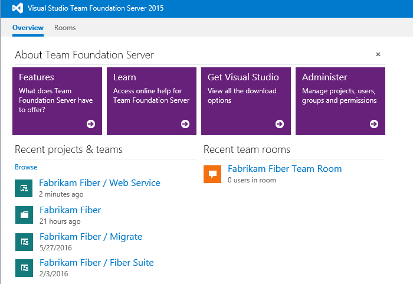
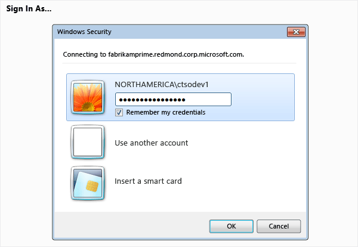
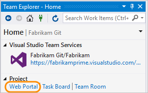
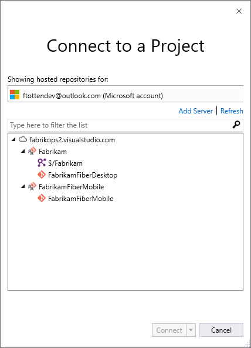
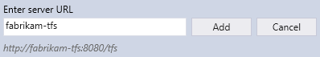
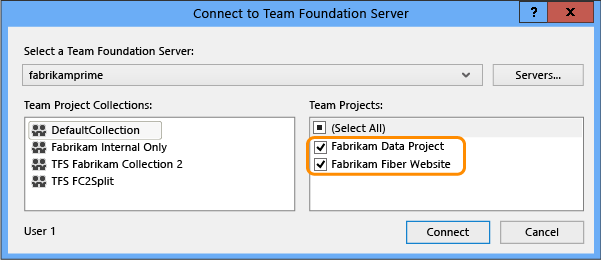
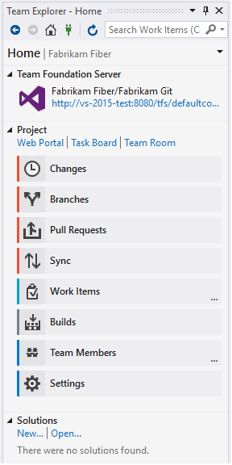
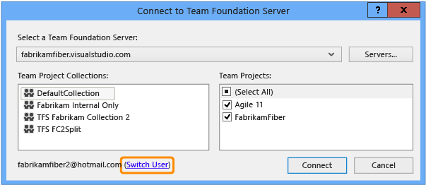
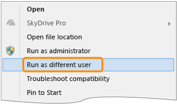

# Connect to team projects 

[!INCLUDE [temp](../_shared/version-vsts-tfs-all-versions.md)]

To share code, build apps, track work, and collaborate with team members, you connect to a team project from one of the following clients:  
- [Web portal](#web-portal)  
- [Visual Studio or Team Explorer](#visual-studio)  
- [Eclipse/Team Explorer Everywhere](../git/share-your-code-in-git-eclipse.md)
- [Android Studio with the VSTS Plugin for Android Studio](http://java.visualstudio.com/Docs/tools/androidstudio)  
- [IntelliJ with the VSTS Plugin for IntelliJ](http://java.visualstudio.com/Docs/tools/intellij) 
- [Visual Studio Code](http://java.visualstudio.com/Docs/tools/vscode)    

>[!NOTE]
>A team project defines a process and data storage in which you manage your software projects from planning to deployment. You or a team member create a team project either on VSTS or an on-premises TFS. When you connect to a team project, you connect to an account or team project collection. Within that collection, one or more team projects may be defined. At a minimum, at least one team project must be created in order to use the system. 

If you don't have a team project yet, create one in [VSTS](../accounts/set-up-vs.md) or set one up in an [on-premises TFS](../accounts/create-team-project.md). If you need to add a team, see [Multiple teams](../work/scale/multiple-teams.md). If you don't have access to the team project, [get invited to the team](../work/scale/multiple-teams.md#add-team-members). 

From each of these clients, you can quickly switch context to a different team project and connect under a different account name. If you work remotely, you can configure your client to [connect to a TFS Proxy server](#proxy).

To get started with a code base, [set up Git](../git/gitquickstart.md) or [set up TFVC](../tfvc/overview.md).

## Connect from the web portal

1.  If you're not a member of a VSTS or TFS security group, ask your account or project admin to add you.  

2.  Open a browser window and type a URL that uses the following form:

	**VSTS:** 
	<pre><code>https://<i>AccountName</i>.visualstudio.com/<i>ProjectName</i> </code></pre>

	**TFS (on-premises):**   
	<pre><code>http://<i>ServerName</i>:8080/tfs/DefaultCollection/<i>ProjectName</i></code></pre> 

    For example, to connect to the server named **FabrikamPrime**, type: **http://FabrikamPrime:8080/tfs/**.

    The default Port is 8080. Specify the port number and directory for your server if defaults aren't used.

3.  When you access the server for the first time, a Windows Identity dialog box will appear. Fill in your credentials and choose the **OK** button.

    >[!TIP]
    >If you select the **Remember me** check box you won't have to enter your credentials the next time you connect.

4.  Choose your team project or team from the set of available links, or choose Browse to access all team projects and teams. 

	 

To learn more about each hub and the tasks you can perform, see [Work in the web portal](work-web-portal.md).

### To log on with different credentials

1.  Open Windows Security from the context menu associated with your name.

    

2.  Enter your credentials.

    

### To open the web portal from Team Explorer

-   Open the web portal  from the home page.

    

## Connect from Visual Studio or Team Explorer

1.  If you haven't already, [download and install a version of Visual Studio](https://www.visualstudio.com/downloads/download-visual-studio-vs).

2.  If you're not a member of a TFS security group, [get added as one](../security/add-users-team-project.md).

3.  Check with a team member to determine the names of the server, team project collection, and team project that you will connect to.

<a id="vs-2017-connect-dialog" />

### Visual Studio 2017 
Select the connect icon in Team Explorer to open up the **Connect** page. Choose the **Connect to Team Project** link to select a team project to connect to.

  

The **Connect to a Project** dialog will appear and show the team projects you can connect to, along with the repos in those projects.

Select the **Add Server** link to connect to a team project in Team Foundation Server. Enter the URL to your TFS server and select **Add**. 

Select a team project from the list and select **Connect**. 
      

<a id="connect-dialog" /> 
<a id="vs-2015-connect-dialog" /> 

### Visual Studio 2015 
From the Connect page, choose the **Connect to Team Project** link to select a different account, TFS, or team project to connect to.

  

Select the team projects that you will work on.   

   

If it's your first time connecting, add TFS to the list of recognized servers.   

   

If you selected just one team project, you'll see the Home page for that project. The pages that appear differ based on the resources enabled and the source control system selected for your team project.
	
   

Team Explorer will display the Home page for that project. The pages that appear differ based on the resources enabled and the source control system selected for your team project.

> [!div class="mx-tdBreakAll"]  
> |Home page with Git  |Home page with TFVC  |
> |-------------|----------|
> |||

To learn more about each page and the tasks you can perform, see [Work in Team Explorer](work-team-explorer.md).   
   
Your client remembers the set of connections you've configured. You can quickly switch from one team project to another from the Connect page.   

### To change accounts when connecting to VSTS
 
<a id="connect-account-dialog" /> 
<a id="vs-2015-connect-account-dialog" /> 
 
### Visual Studio 2017 

1. From the Connect page, choose the **Connect to Team Project** link to log on with different credentials.

	  

	Select a different user from the drop-down or select **Add an account...** to access a team project using a different account.

	 

2. Sign on using a valid Microsoft account—an account that is associated with a VSTS team project. 

### Visual Studio 2015 

1. From the Connect page, choose the **Connect to Team Project** link to log on with different credentials.

	  

	The **Switch User** link appears only when you are actively connected to a team project hosted on VSTS.  

	 

2. Sign on using a valid Microsoft account—an account that is associated with a VSTS team project. 

### To change accounts 

To run Visual Studio under an account that is different from your logged on Windows account, open the context menu for **devenv.exe** to access your run as options.

You can locate the executable in the following folder: *Drive*:\\Program Files (x86)\Microsoft Visual Studio 12.0\Common7\IDE\.

## Connect from Microsoft Excel or Project 

To add or modify work items by using Excel or Project, you connect your worksheet or project plan to a team project. Establishing this connection binds the document to the hosted account or selected TFS, team project collection, and team project to exchange information. 
 

> [!NOTE]  
> You can't use Office Project 365 to connect to VSTS or TFS.
 
### Connect from a worksheet or project plan 

To follow these procedures, you must be a member of the **Readers** group or have your **View work items in this node** permission set to **Allow**. See [Permission reference](../security/permissions.md) for details.

1.  If you don't have Office Excel 2007 or a more recent version, [install it](https://products.office.com/excel). For VSTS or TFS 2017, you'll need Project 2010 or a more recent version. For client compatibility, see [Requirements](../accounts/requirements.md)

2.  If you haven't installed a version of [Visual Studio (2010 or later)](https://www.visualstudio.com/downloads/download-visual-studio-vs) or [Team Foundation Server Standalone Office Integration 2015 (free)](https://www.visualstudio.com/downloads/#team-foundation-server-office-integration-2015-update-3-1), you'll need to install one of these versions to connect to a team project hosted on VSTS or an on-premises TFS. 

	> [!NOTE]  
	> **Feature availability:** The only way to get the Team Foundation add-in to Excel is by installing one of the latest editions of Visual Studio or  TFS Standalone Office Integration.   

3.  Start with a blank worksheet or project plan. If you don't see the **Team** ribbon (or the **Team** menu if you use Excel 2007 or Project 2007), see step 2.

    

    > [!TIP]    
    > If the **Team** ribbon no longer appears, you might need to [re-enable it](https://msdn.microsoft.com/library/vstudio/ms268871.aspx).

4.  Connect to VSTS account or a TFS instance and the team project. If you can't connect, [get added as a team member](../security/add-users-team-project.md).

    

    If it is your first time connecting from Excel or Project, you might have to add the VSTS account or TFS server to the list of recognized servers.

    

5.  Your worksheet or project plan is now bound to your team project. What this means is that you can add work items to the team project from the Office document or add work items to the Office document from the team project.

    To learn more, see [Bulk add work items with Excel](../work/backlogs/office/bulk-add-modify-work-items-excel.md) or [Create your backlog and tasks using Project](../work/backlogs/office/create-your-backlog-tasks-using-project.md).

>[!NOTE]  
>If the team project is moved to a different team project collection in the same instance of TFS, your documents will automatically be reconnected. However, if the team project is moved to a different instance of TFS, you must manually reconnect your documents to the new server.

### Work offline  

An advantage to using Excel or Project is that you can work offline to add or modify work items. Complete the following procedures to disconnect an Excel worksheet or Project plan and later reconnect to synchronize your updates with the work item database.

### To disconnect the document from a team project

1.  Open the document that you want to change while you are offline.

2.  Follow one of the following steps:

    -   If you are using Excel, on the **Team** ribbon, in the **Work Items** group, choose **Refresh**.

    -   If you are using Project, on the **Team** menu, choose **Refresh**.

    This step refreshes the work item list to retrieve the latest information from the work item database.

3.  If you are using Excel, add to the work item list the columns for all fields that you want to modify.

    You cannot add columns when the work item list is not connected to TFS.

4.  Save your Excel or Project file. You can now modify the information even if you are offline, disconnected from the team project or network. 

5.  Change the work item list as needed.

	>[!NOTE]  
	>You cannot create most types of links between work items when the work item document is not connected to the team project. The exceptions are parent-child links in an Excel tree list and both parent-child and predecessor-successor links in a Project plan.

#### To reconnect the document to the team project

1.  Make sure your computer is online.  

2.  If you changed the document while you were offline, follow one of these steps:

    -   If you are using Excel, on the **Team** ribbon, in the **Work Items** group, choose **Publish**.

    -   If you are using Project, on the **Team** menu, choose **Publish Changes**.

3.  If you did not change the document while you were offline, follow one of these steps:

    -   If you are using Excel, on the **Team** ribbon, in the **Work Items** group, choose **Refresh**.

    -   If you are using Project, on the **Team** menu, choose **Refresh**.

4.  Resolve any data validation errors or conflicts that occur.

## Related notes  

Additional resources you may find of interest: 

- [Work in web portal](work-web-portal.md)  
- [Work in Team Explorer](work-web-portal.md)  
- [Troubleshoot connection](troubleshoot-connection.md)  

If all you need is a code repository and bug tracking solution, then start with the [Git get started guide](../git/gitquickstart.md) and [Manage bugs](../work/backlogs/manage-bugs.md).  

To start planning and tracking work, see [Get started with Agile tools to plan and track work](../work/backlogs/overview.md). 

### User accounts and licensing  

To connect to a team project, you need your user account added to the team project. This is typically done by the [account owner (VSTS)](../accounts/add-account-users-assign-access-levels.md) or a [project administrator](../security/set-project-collection-level-permissions.md). 

VSTS provides access to the first 5 account users free. After that, you need to [pay for more users (VSTS)](../billing/buy-basic-access-add-users.md). For on-premises TFS, each user account must have a TFS client access license (CAL). All Visual Studio subscriptions and paid VSTS users include a TFS CAL. Find out more about licensing from the [Team Foundation Server pricing page](https://www.visualstudio.com/team-services/tfs-pricing).

In addition, you can provide access to stakeholders in your organization who will have limited access to select features as described in [Work as a Stakeholder](../security/get-started-stakeholder.md?toc=/vsts/user-guide/toc.json&bc=/vsts/user-guide/breadcrumb/toc.json).

## Configure Visual Studio to connect to TFS Proxy

If your remote team uses a [TFS Proxy server](../tfs-server/install/install-proxy-setup-remote.md) to cache files, you can configure Visual Studio to connect through that proxy server and download files under Team Foundation version control.

1.  First, make sure that you have connected to TFS as described [in the previous section](#visual-studio).

2.  From the Visual Studio **Tools** menu, open the Options dialog and expand the Source Control folder. On the Plug-in Selection page, confirm that Visual Studio Team Foundation Server is selected.

    

3.  On the Visual Studio Team Foundation Server page, enter the name and port number for the TFS Proxy server. Select the **Use SSL encryption (https) to connect** checkbox.

    

    Make sure you specify the port number that your administrator assigned to TFS Proxy.

To **Configure User Tools** to associate a file type with a compare or merge tool, see [Associate a file type with a file-comparison tool](../tfvc/associate-file-type-file-comparison-tool.md) or [Associate a file type with a merge tool](../tfvc/associate-file-type-merge-tool.md).

###What other clients support connection to TFS?

In addition to connecting through a web browser, Visual Studio, Eclipse, Excel, and Project you can connect to a team project from these clients: 

- [Visual Studio Code](https://code.visualstudio.com/Docs)
- [Visual Studio Community](https://www.visualstudio.com/products/visual-studio-community-vs.aspx) 
- [Eclipse: Team Explorer Everywhere](http://java.visualstudio.com/Docs/tools/eclipse) 
- [PowerPoint Storyboarding](../work/backlogs/office/storyboard-your-ideas-using-powerpoint.md) 
- [Microsoft Test Manager](https://msdn.microsoft.com/library/jj635157.aspx)
- [Microsoft Feedback Client](../feedback/give-feedback.md) 

### Requirements and client compatibility 

Some tasks or features aren't available when you connect to a later version of TFS than which your client supports. For more information, see [Requirements and compatibility](../accounts/requirements.md).

### Determine your platform or TFS version 

See [Feedback and support](provide-feedback.md#platform-version) 

