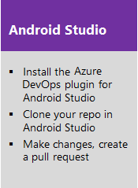
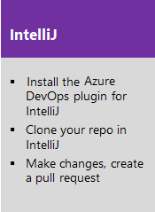
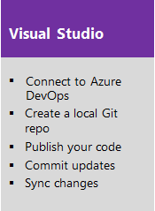
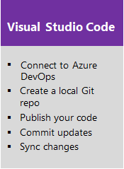
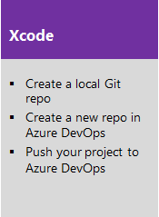
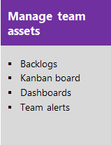

# DevOps tools overview for Azure DevOps

[!INCLUDE [temp](../_shared/version-vsts-tfs-all-versions.md)]

Learn how to use our integrated tool set to speed the development and delivery of your software applications. Build better apps for any platform, including Android, iOS, Linux, macOS, or Windows.  
 
  

Azure DevOps Services and Azure cloud services help remove barriers between teams, encourage collaboration, and improve the flow of value to your customers. Or, use our on-premises server, Team Foundation Server (TFS), when you want to maintain your data within your network. 

Both options are enterprise-ready, supporting teams of any size, from tens to thousands. Azure DevOps Services provides a scalable, reliable, and globally available hosted service. It is backed by a 99.9% SLA, monitored by our 24-7 operations team, and available in local data centers around the world.

Also, you can quickly expand the power of these tools through integration with other services and tools using service hooks and extensions.  

For the key differences between Azure DevOps Services and Azure DevOps Server, see [Understand the differences between Azure DevOps Services and Azure DevOps Server](about-azure-devops-services-tfs.md).

## Get started in the cloud or on-premises

Whether you work in the cloud, on-premises, or a hybrid of each, you have a comprehensive set of DevOps and Agile tools to support team collaboration throughout the cycles of planning, development and test, and continuous delivery.

### Work in the cloud

Choose Azure DevOps Services when you want quick setup, maintenance-free operations, easy collaboration across domains, elastic scale, and rock solid security. You'll also have access to continuous testing, cloud build servers, and application insights. [Small teams can start for free!](https://visualstudio.microsoft.com/products/visual-studio-team-services-vs.aspx)  

   

### Work on-premises

Choose on-premises when you need your data to stay within your network or you want access to SharePoint sites and SQL Server reporting services that integrate with data and tools.  

 

## Develop code using your IDE of choice

Azure DevOps Services supports two types of version control Git and Team Foundation Version Control (TFVC). Use Git, Team Foundation version control (TFVC) or both to store code for your app and give you access to different versions of your code. 

Depending on whether you use Git or TFVC as a repo, you can develop your code in Android Studio, Eclipse, IntelliJ, Visual Studio, Visual Studio Code, or Xcode.  

### Git

Git is a distributed version control system. Each developer has a copy of the source repository on their dev machine. Developers can commit each set of changes on their dev machine and perform version control operations such as history and compare without a network connection. Branches are lightweight. 

&#160;&#160;&#160;&#160;&#160;&#160;&#160;&#160;&#160;&#160;&#160;&#160;  

 
&#160;&#160;&#160;&#160;&#160;&#160;&#160;&#160;&#160;&#160;&#160;&#160;  

### TFVC

TFVC is a centralized version control system that lets you apply granular permissions and restrict access down to a file level. Typically, team members have only one version of each file on their dev machines. Historical data is maintained only on the server. Branches are path-based and created on the server.

You can use TFVC to scale from small to large projects, and by using server work spaces, you can scale up to very large code bases with millions of files per branch and large binary files. And with compare and annotate you can identify the exact changes that they made.

&#160;&#160;&#160;&#160;&#160;&#160;&#160;&#160;&#160;&#160;&#160;&#160;  

### Package management and code search 

Software development teams often rely on re-using libraries or providing libraries for others to re-use. Package management supports code sharing as binary components across organizations and within teams. With it, you can build projects to produce packages and update projects that consume updated packages. Our Azure Artifacts extension enables plugging in existing package management services you already use, such as local NuGet servers for IP protection, NuGet, MyGet, or Artifactory.  

- [Azure Artifacts overview](../artifacts/overview.md) 
- [Search across all your code](../project/search/overview.md)

Code Search provides a comprehensive solution to all your code exploration and troubleshooting needs. From discovering examples of API implementation to searching for error text, Code Search offers a fast and powerful way to find code. Search across one or more projects, with semantic ranking and rich search results to ensure you find what you need and can focus in to understand your code. Code Search lets you filter your results based on code types such as definitions, comments, and references; filter by path, file extension, or repository; and use logical operators such as AND, OR, NOT to refine your query and get the results you need.  

Code Search also makes team collaboration easier and helps maximize developer efficiency. View history and annotations to see who last changed a line of code, and what they changed. Search locally within code files, and find references or definitions of Code Search matches, when debugging or exploring your code. Add your comments and then communicate the results to team members easily by sharing the query URL.  

## Plan and track work with Agile tools

 Use Agile tools to plan and track work using Scrum and Kanban processes or a mix of both. Scrum tools support defining and managing work within sprints, setting capacity, and tracking tasks. Kanban tools allow you to manage a continuous flow of work via an interactive sign board. In addition, configurable charts, dashboards, and reports help teams monitor and share progress. 

&#160;&#160;&#160;&#160;&#160;&#160; &#160;&#160;&#160;&#160;&#160;&#160;

You also gain access to a [rich set of customization capabilities](../reference/customize-work.md).
 
## DevOps: Build - Test - Release

Help your team continuously deliver software at a faster pace and with lower risk, while improving efficiency and collaboration between all teams that participate in release processes. Set up continuous integration builds for your app that run with every check in. Multi-platform build agents support Android, iOS, Java, .NET, and other applications. Easily provision test environments. Track when the quality is sufficient to release to the customer.  

   

<!---

Agile methodologies speed up the development and test cycle and make sure that you can deliver real value to your customers on a regular basis.

No matter what platform you target or language you use, you can simplify the continuous integration of your apps that build on Linux, macOS, or Windows. And, you can seamless integrate information about your builds with work, code, test, and release.  
-->

In addition to continuous integration testing, you can create [test plans](../test/create-a-test-plan.md), [perform manual testing](../test/index.md), and [run unit tests](/visualstudio/test/developer-testing-scenarios). 

Azure Pipelines, and Build &amp; Release in TFS, help you automate the deployment and testing of your software in multiple environments. With it, you can either fully automate the delivery of your software all the way to production, or set up semi-automated processes with approvals and on-demand deployments.  

 
## Scale up

As your team grows, your tools grow. You can easily add teams which can focus on their set of backlog stories. Each team you create gets access to their set of dashboards, Agile planning tools, and other collaborative tools.  

  

 
## Related articles

Once you've signed up for Azure DevOps Services or installed Azure DevOps Server, get familiar with the [web portal and working in the user and admin contexts](../project/navigation/index.md).

- [About Azure DevOps](about-azure-devops-services-tfs.md)
- [Essential services](services.md)
- [Client-server tools](tools.md)
- [Software development roles](roles.md)

### Azure DevOps Server updates

- [What's new](/azure/devops/server/whats-new)
- [Migrate data from TFS to Azure DevOps Services](../migrate/migrate-from-tfs.md)

### Pricing, costs, and licenses

[Azure DevOps Services Pricing](https://visualstudio.microsoft.com/team-services/pricing/) provides per user costs. Small teams (5 users or fewer) can start for free. Unlimited Visual Studio subscribers are free.

On-premises Azure DevOps Server provides three access levels: [Stakeholder, Basic, and Advanced](../organizations/security/change-access-levels.md). You don't need to buy additional licenses for Visual Studio subscribers. Use the [Team Foundation Server pricing page](https://visualstudio.microsoft.com/team-services/tfs-pricing) to plan your licensing requirements.

### Extensibility: Create first-class integration experiences

Our extensibility framework enables you to build integrations directly within Azure DevOps to create first-class, seamless connections between different tools and services.  

With Marketplace extensions (currently in private preview), you can create first-class integration experiences, such as a simple context menu or toolbar action. Or, you can create a complex, powerful full UI experience that seamlessly lights up within the Azure DevOps Services web portal.  

- [Find marketplace extensions](../marketplace/index.md)
- [Get extensions](../marketplace/install-extension.md)</li>
- [Using service hooks](../service-hooks/index.md)
- [Get started with REST APIs](../integrate/get-started/rest/basics.md)

 
Service hooks enable integration scenarios between other applications and Azure DevOps by subscribing to events instead of constantly polling for them. Service hooks provide a more efficient way to drive activities when events happen in your projects. For example, you can send a push notification to your team's mobile devices when a build fails, or create a card in Trello when a work item is created. Some of the services you can easily integrate with are UserVoice, Zendesk, Trello, Slack, and HipChat.

Industry-standard RESTful APIs extend the power of Azure DevOps from your apps and services. With them, you can integrate from virtually any device, platform, or technology stack, including Android, iOS, Node.js, .NET, and more.  

### Analytics: Monitor your apps to gain insight  

Monitor your web and device apps to gain actionable insight to improve performance, determine usage patterns, and plan for the next version of your software.  

[Use Application Insights](http://azure.microsoft.com/documentation/services/application-insights/) to understand how your app is being used and to make sure it is performing well. Detect issues, diagnose crashes and track usage of your mobile apps, and web apps hosted from Azure, or your own IIS or Java EE servers.  

[Use HockeyApp](http://hockeyapp.net/features/) to distribute beta versions of your apps on Android, iOS, macOS, and Windows, collect live crash reports, get feedback from users, recruit new testers, and analyze test coverage.
 
 
