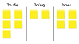
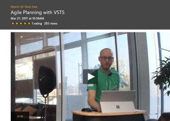
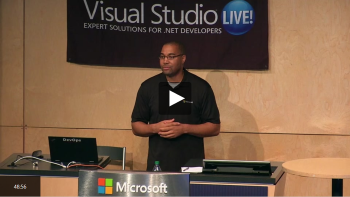

# Guide for users new to VSTS and TFS

New to Visual Studio Team Services (VSTS) and Team Foundation Server (TFS)? We'll walk you through the basics of the web interface and some common tasks.  

<!---
## Overview
[What is VSTS?](what-is-vsts.md)
[What is TFS?](what-is-tfs.md)
[Overview of services](../services.md)
-->

## 5-Minute Quickstarts

Get started with a free account, share your code using Git, and track your work using a Kanban board.  

&nbsp;&nbsp;&nbsp;&nbsp;&nbsp;&nbsp;&nbsp;&nbsp;&nbsp;&nbsp;&nbsp;&nbsp;   

- [Set up/sign up with Team Services](/vsts/accounts/team-services/sign-up-for-visual-studio-team-services?toc=/vsts/user-guide/toc.json&bc=/vsts/breadcrumb/toc.json)  
- [Code with Git](/vsts/git/create-new-repo?toc=/vsts/user-guide/toc.json&bc=/vsts/breadcrumb/toc.json)
- [Track work via Kanban](/vsts/work/kanban/kanban-quickstart?toc=/vsts/user-guide/toc.json&bc=/vsts/breadcrumb/toc.json)

## Step-by-Step Tutorials  

- [Set favorites](/vsts/collaborate/set-favorites?toc=/vsts/user-guide/toc.json) 
- [Follow work and pull requests](/vsts/collaborate/follow-work-items?toc=/vsts/user-guide/toc.json)  
- [Enable preview features](/vsts/collaborate/preview-features?toc=/vsts/user-guide/toc.json)  
 

## Videos

      

## Concepts  

- [Key concepts](../concepts.md)    
- [Clients and tools](../tools.md)     
- [Software development roles](../roles.md)   
- [FAQs](../faqs.md)- 
- [What's the difference between VSTS and TFS?](../about-vsts-tfs.md)  
- Accounts and tenants (TBW)  
- Licensing (TBW) 

## Reference
- [Permissions and access](/vsts/setup-admin/permissions-access?toc=/vsts/user-guide/toc.json)      
- [Keyboard shortcuts](/vsts/reference/keyboard-shortcuts?toc=/vsts/user-guide/toc.json)
- [Markdown guidance](/vsts/reference/markdown-guidance?toc=/vsts/user-guide/toc.json)

## Resources

- VSCOM_RESOURCE_LINKS_HERE