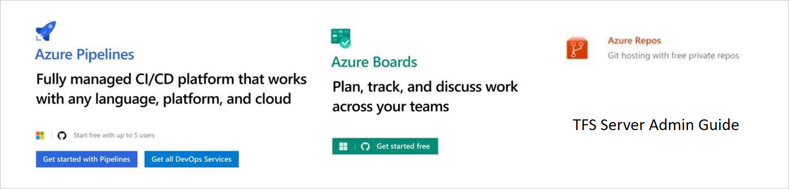

# Start using Azure DevOps Services

New to  Azure DevOps Services?

We'll walk you through the basics of the web interface and some common tasks.
Get started with a free organization, share your code using Git, and track your work using a Kanban board.

|5-Minute Quickstarts  | Step-by-Step Tutorials  |Concepts  |
|---------|---------|---------|
|[Sign up and invite some teammates](sign-up-invite-teammates.md)     | [Set favorites](/vsts/project/navigation/set-favorites?toc=/vsts/user-guide/toc.json&bc=/vsts/user-guide/breadcrumb/toc.json) | [Key concepts](concepts.md)        |
|[Code with Git](code-with-git.md)    |[Follow work and pull requests](../boards/work-items/follow-work-items.md?toc=/vsts/user-guide/toc.json&bc=/vsts/user-guide/breadcrumb/toc.json)         |[Source control](source-control.md)         |
|[Set up continuous integration & delivery](../pipelines/get-started-designer.md?toc=/vsts/user-guide/toc.json&bc=/vsts/user-guide/breadcrumb/toc.json)     | [Get started as a Stakeholder](../organizations/security/get-started-stakeholder.md)        | [Kanban & Agile tools](../work/backlogs/overview.md?toc=/vsts/user-guide/toc.json&bc=/vsts/user-guide/breadcrumb/toc.json)        |
|[Plan & track work](plan-track-work.md)    |Admin-[Add and manage users](../organizations/accounts/add-organization-users-from-user-hub.md?toc=/vsts/user-guide/toc.json&bc=/vsts/user-guide/breadcrumb/toc.json)         | [Clients and tools](tools.md?toc=/vsts/user-guide/toc.json&bc=/vsts/user-guide/breadcrumb/toc.json)        |
|[Add and run manual tests](add-run-manual-tests.md)     |Admin-[Change individual permissions](../organizations/security/change-individual-permissions.md)        |[Software development roles](roles.md?toc=/vsts/user-guide/toc.json&bc=/vsts/user-guide/breadcrumb/toc.json)         |
|[Install a Marketplace extension](../marketplace/install-vsts-extension.md)    |Admin-[Grant or restrict permissions to select tasks](../organizations/security/restrict-access.md)         | [What's the difference between VSTS and TFS?](about-vsts-tfs.md?toc=/vsts/user-guide/toc.json&bc=/vsts/user-guide/breadcrumb/toc.json)        |
|[View permissions](../organizations/security/view-permissions.md) |Admin-[Customize a project](../organizations/settings/work/customize-process.md)    |About individual, team, project, and organization settings   |
|Manage a project |   |   |
| Get started as an admin |   |   |

|How-to Guides  |Reference  |Resources  |
|---------|---------|---------|
|[Sign in to the web or a client](../organizations/projects/connect-to-projects.md) | [Keyboard shortcuts](../project/navigation/keyboard-shortcuts.md)        | [Navigation basics](../project/navigation/index.md)        |
|Row2     |[Markdown guidance](../project/wiki/markdown-guidance.md)         | [Project Management](../organizations/projects/index.md)        |
|Row3     |[Navigate in Team Explorer](work-team-explorer.md)        |[Security & Identity](../organizations/security/index.md)         |
|Row4     | [FAQs ](faqs.md)       | [Visual Studio IDE](https://docs.microsoft.com/visualstudio/?view=vsts)        |
|Row5     |         | [Visual Studio Code](https://code.visualstudio.com/docs)        |
|Row6     |         | [Visual Studio for Mac](https://docs.microsoft.com/visualstudio/mac?view=vsts)        |

