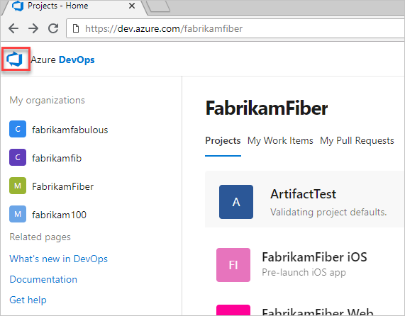
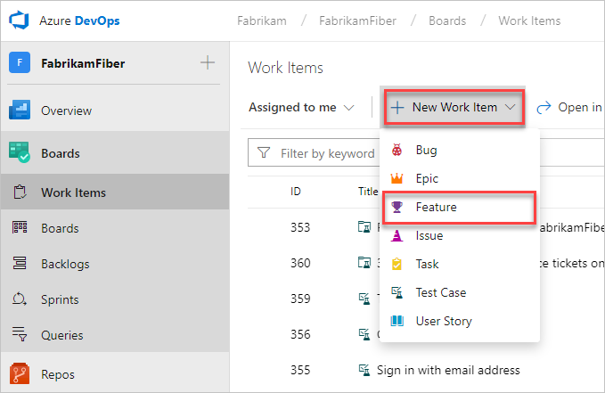

# Quickstart: Plan and track your work

[!INCLUDE [temp](../_shared/version-vsts-tfs-all-versions.md)]

In this quickstart, you learn how to add work items from the web portal and view work items that you've created for your project. Use different types of work items to track different types of work&mdash;such as user stories or product backlog items, tasks, bugs, or issues. You can describe the work to be done, assign work, track status, and coordinate efforts within your team.

<a id="define-new-work">  </a>

## Prerequisites

You can add work items after you connect to a project. If you don't have an organization or project yet, create one in [Azure DevOps](sign-up-invite-teammates.md).

## Add a work item

::: moniker range=">= azure-devops-2019"

1. From your web browser, open the project for your organization. If you don't have a project, [create one now](sign-up-invite-teammates.md). If you haven't been added as a team member, [get invited now](sign-up-invite-teammates.md#invite-others).

	The web browser URL follows this pattern: ```https://dev.azure.com/{yourorganization}/{yourproject}```  

	You can use this URL to quickly open the project. Replace {yourorganization} and {yourproject} with your specific organization and project name, and remove the braces.

	If you don't see the project that you want, choose the  Azure DevOps icon to [browse all projects and teams](../project/navigation/work-across-projects.md).  

	

2.	Select **Azure Boards** > **Work Items**.

    >

3. Choose **New Work Item** and select the work item type that you want. Here, we choose to create a **Feature**.

   >

4. Enter a title, and then **Save** the work item. Before you can change the **State** from its initial default value, you must save it.  

	That's it!

::: moniker-end

::: moniker range="<= tfs-2018"

1. From your web browser, open the project for your organization. If you don't have a project, [create one now](sign-up-invite-teammates.md). If you haven't been added as a team member, [get invited now](sign-up-invite-teammates.md#invite-others).

	The web browser URL follows this pattern: ```https://dev.azure.com/{yourorganization}/{yourproject}```  

	You can use this URL to quickly open the project. Replace the {organization name} and {project name} with your specific organization and project name, and remove the braces. 

	If you don't see the team or project that you want, choose the  Azure DevOps icon to [browse all projects and teams](../project/navigation/work-across-projects.md).  

2.	Select **Work** > **New Work Items** and choose the work item type that you want. Here, we choose to create a **User Story**. 

	 

	If you don't see the **Work** option, your screen size might be reduced. Select the ellipsis (...) (), then choose **Work** > **New Work Items**, and then choose the work item type that you want.

	 

3. Enter a title, and then save the work item. Before you can change the **State** from its initial default value, you must save it.  

	  

	That's it!

::: moniker-end

Create as many work items as you need. Use the types that you need to track the work that you want to manage.  

>[!NOTE]  
>Depending on the process that was chosen when the project was created&mdash;[Scrum](../boards/work-items/guidance/scrum-process.md), 
[Agile](../boards/work-items/guidance/agile-process.md), or [CMMI](../boards/work-items/guidance/cmmi-process.md)&mdash;the types of work items that you can create differ. For example, backlog items might be called product backlog items (Scrum), user stories (Agile), or requirements (CMMI). All three types are similar: they describe the customer value to deliver and the work to perform.
>
> For an overview of all three processes, see [Choose a process](../boards/work-items/guidance/choose-process.md).

## View your created work items  

::: moniker range=">= azure-devops-2019"

1. Go to your project and select **Azure Boards** > **Work Items**.

   

2. To view any work item in the list, select the title.

::: moniker-end

::: moniker range="<= tfs-2018"

1. Select **Work** > **Work Items** > **My activity**. This page lists all of the work items that you recently viewed, created, or modified.

	

2. To view any work item in the list, select the title.

::: moniker-end

For more information on how to use the **Work Items** page, see [View and add work items](../boards/work-items/view-add-work-items.md).

## Next steps

> [!div class="nextstepaction"]
> [Add and run manual tests](add-run-manual-tests.md)

To quickly add backlog items, such as user stories or requirements, see these articles:  
> [!div class="nextstepaction"]
> [Create your backlog](../boards/backlogs/create-your-backlog.md)
> [Kanban quickstart](../boards/boards/kanban-quickstart.md)

## Related articles

- Learn more about [planning and tracking work](../boards/work-items/index.md).
