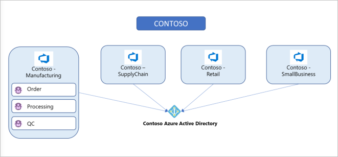
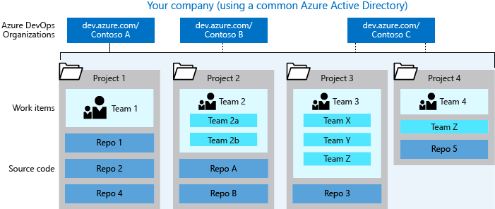

# Plan your organizational structure

[!INCLUDE [version-vsts-tfs-all-versions](../_shared/version-vsts-tfs-all-versions.md)]

Your business structure should act as a guide to the number of organizations, projects, and teams that you create in Azure DevOps.  

Consider the following structures for your business or collaborative work in Azure DevOps:

* Quantity of organizations
* Quantity of projects under an organization

You also may want to plan for the following scenarios:

* Mapping your organizations and projects in Azure DevOps to your enterprise, business unit, and team structure
* Structuring your repositories (repos)
* Structuring your teams - it can either help or hinder teams to be Agile and autonomous
* Managing access to data - who needs to have access and who doesn't?
* Reporting needs
* Promoting common practices - learn more about [foundational elements you need to create an agile mindset and culture](../boards/plans/agile-culture.md).

## Structure your organization

You need to have at least one organization, which may represent your company, your larger collection of code projects, or even multiple related business units.

### What is an organization?

An organization in Azure DevOps is a mechanism for organizing and connecting groups of related projects. Examples are business divisions, regional divisions, or other enterprise structure. You can choose one organization for your entire company, or separate organizations for specific business units, or an organization just for you.

Each organization gets its own free tier of Azure DevOps services (up to five users for each service type) as follows.

* Azure Pipelines: One hosted job with 1,800 minutes per month for CI/CD and one self-hosted job
* Azure Boards: Work item tracking and Kanban boards
* Azure Repos: Unlimited private Git repos
* Azure Artifacts: Package management
* Load testing (20,000 VUMs per month)
* Unlimited stakeholders

[!INCLUDE [loadtest-deprecated-include](../test/_shared/loadtest-deprecated-include.md)]

### How many organizations do you need?

When you're starting out with Azure DevOps, begin with one organization. Then, you can add additional organizations&mdash;which may require different security models&mdash;later. If you only have a single code repo or project, you don't need more than one organization. If you have separate teams that need to work on code or other projects in isolation from one another, consider creating separate organizations for those teams. They'll have different URLs. Add projects, teams, and repos, as necessary, before you add another organization.

Take some time to review your work structure and the different business groups and participants to be managed. Read further in this article for more information on the [advantages and disadvantages of having multiple organizations](#mapping-organizations-to-business-units) and [structure considerations](#more-about-organizational-structure).

## Structure your projects

### What is a project?

A project in Azure DevOps contains the following set of features:

* Boards and backlogs for agile planning
* Pipelines for continuous integration and deployment
* Repos for version control and management of source code and artifacts
* Continuous test integration throughout the project life cycle Each organization contains one or more projects

In the following image, the Contoso company has three projects within their Contoso-Manufacturing organization.

### How many projects do you need?

You need at least one project to start using an Azure DevOps service, such as Azure Boards, Azure Repos, or Azure Pipelines. When you create your organization, a default project is created for you. In your default project, you have a code repo to start working in, a backlog that you can use to track work, and at least one pipeline, depending on your license, to begin automating build and release of your code.

Within an organization, you can do either of the following approaches:

* Create a single project that contains many repos and teams
* Create many projects, each with its own set of teams, repos, builds, work items, and other elements

Even if you have many teams working on hundreds of different applications and software projects, you can manage them within a single project in Azure DevOps. However, if you want to manage more granular security between your software projects and their teams, consider using many projects. At the highest level of isolation is an organization, where each organization is connected to a single Azure AD tenant. A single Azure AD tenant can be connected to many Azure DevOps organizations.

#### Single project

A single project puts all of the work at the same "portfolio" level for the entire organization. Your work has the same set of repos and iteration paths. A single project allows teams to share source repos, build definitions, release definitions, reports, and package feeds. You might have a large product or service that's managed by many teams. Those teams have tight inter-dependencies on each other across the product life cycle. You create a project and divide the work using teams and area paths. This setup gives your teams visibility into each other's work, so the organization stays aligned. Your teams use the same taxonomy for work item tracking, making it easier to communicate and stay consistent.

> [!TIP]
> When multiple teams work on the same product, having all teams on the same iteration schedule helps keep your teams aligned and delivering value on the same cadence. For example, the organization in Azure DevOps has over 40 feature teams and 500 users within a single project - this works well because we're all working on a common product set with common goals and a common release schedule.

A high volume of queries and boards can make it hard to find what you're looking for. Depending on the architecture of your product, this difficulty can bleed into other areas such as builds, releases, and repos. Make sure to use good naming conventions and a simple folder structure. When you add a repo to your project, consider your strategy and determine whether that repo could be placed into its own project.

#### Many projects

Project structure is best determined by how you ship the product. Having several projects shifts the administration burden and gives your teams more autonomy to manage the project as the team decides. It also provides greater control of security and access to assets across the different projects. Having team independence with many projects creates some alignment challenges, however. If each project is using a different process or iteration schedule, it can make communication and collaboration difficult if the taxonomies aren't the same.

> [!TIP]
> If you use the same process and iteration schedules across all your projects, your ability to roll-up data and report across teams is improved.

Azure DevOps provides cross-project experiences when it comes to managing work.

You may want to add another project due to the following scenarios:

* To prohibit or manage access to the information within a project
* To support custom work tracking processes for specific business units within your organization
* To support entirely separate business units that have their own administrative policies and administrators
* To support testing customization activities or adding extensions before rolling out changes to the working project

When you're considering many projects, keep in mind that Git repo portability makes it easy to move a repo between projects, which allows you to still have full-fidelity commit history. Other history can't be migrated between projects. Examples are push and pull request history.

When you map projects to business units, your company gets a single organization and sets up many projects with one or more projects representing a business unit. All Azure DevOps assets of the company are contained within this organization and located within a given region (for example, Western Europe). Consider the following advantages and disadvantages of mapping your projects to business units:

|Many projects             |               |
|---------|---------|
|**Advantages**  |**Disadvantages**  |
|Works well if all business units of your company are in the same geographical area. (for example, the entire company is in North America)    | Business units can't administer their own users, policies, access management, or billing practices and require shared ownership of the organization        |
|Works well if you don't need to track budgets or spending per business unit    | Business units must share resources, like Azure Pipelines (for CI/CD)        |
|Works well if you don't have any regulatory or compliance needs for geographical isolation of your Azure DevOps assets    | Business units can't track spending and billing separately        |
| You can easily create cross-project queries and move work items from one project to another | Doesn't work if you're migrating from on-premises with multiple collections, since you end up with multiple organizations and each collection on-premises mapped to a separate organization  |

## Structure your teams, repos, and version control within a project

Consider the specific strategic work scoped to one of the organizations you created previously and who should have access. Use this information to name and [create a project](../organizations/projects/create-project.md). This project has a URL defined under the organization you created it in and can be accessed at https://dev.azure.com/{organization-name}/{project-name}.

Configure your project by visiting its URL and select the **Project settings** button at the lower right of the page.

Learn more about [managing projects](../organizations/projects/index.md).

### What is a team?

A team is a unit that support many [team-configurable tools](../organizations/settings/manage-teams.md), which help you plan and manage work, and facilitate collaboration.

#### Creating a team for each distinct product or feature team

Every team owns their own backlog, to create a new backlog you create a new team. By [configuring teams and backlogs into a hierarchical structure](../boards/plans/configure-hierarchical-teams.md), program owners can more easily track progress across teams, manage portfolios, and generate rollup data. A team group is created when you create a team. You can use this group in queries or to set permissions for your team.

### Managing version control

In projects where the Azure Repos service is enabled, version control repos can store and revise code. Consider the following options when you're configuring repos.

#### Git vs. Team Foundation Version Control (TFVC)

Azure Repos offers the following version control systems for teams to choose from:

- Git and TFVC. Projects can have repos of each type. By default, new projects have an empty Git repo. Git enables a great amount of flexibility in developer workflows and integrates with nearly every relevant tool in the developer ecosystem. Any project can use Git repos. There's no limit on the number of Git repos that can be added to a project.

TFVC is a centralized version control system that is also available. Unlike Git, only one TFVC repository is created for a project. But, within that repo, folders and branches are used to organize code for multiple products and services if desired.  

#### One vs. many repos

Customers who need multiple repos often ask whether to set up multiple repos in a single project or have a repo set up per project. The following guidance relates to the planning and administration functions across those repos.  

Starting with a single project containing multiple repos is reasonable, especially if the products/services are working on a coordinated release schedule. If developers are frequently working with multiple repos, keeping them in a single project encourages the processes to remain shared and consistent. Administering repo access is simpler in a single project, as access controls and options like case enforcement and max file size can be set at the project level. Note that repos can have these access controls and settings managed individually, even if they're in a single project.

If the products stored in multiple repos are working on independent schedules or processes, you can split them into multiple projects. Keep in mind that Git repo portability makes it easy to move a repo between projects and still keep full-fidelity commit history. Other history like push and pull request history cannot be migrated between projects.

Your decision for one vs. many repos should be largely based on code dependencies and architecture. A good first rule to apply is to put each independently deploy-able product or service in its own repo. Don't separate a codebase into many repos if you expect to make coordinated code changes across those repos, as there are no tools to assist in coordinating those changes. If your codebase is already a monolith, keep it in one repo. For more details about monolithic repos, see [Git at Scale](https://docs.microsoft.com/en-us/azure/devops/learn/git/git-at-scale) articles. If you have many disconnected services, one repo per service can be a good strategy.  

> [!Note]
> Consider [managing your permissions](../organizations/security/permissions.md) so not everyone in your organization can [create a repo](../repos/git/create-new-repo.md). One of the big challenges a growing team or company faces is the rapid proliferation of repos. If you have too many of them, it's very hard to keep track of who owns what code or other content stored in those repos.

#### Shared repo vs. forked repos

We recommend a shared repo approach within a trusted organization. In this model, developers use branches to maintain isolation of their changes from one another. Used with a good branching and release strategy, a single repo can scale to support concurrent development for more than a thousand developers. For more information about branching and release strategy, see [Adopt a Git branching strategy and Release Flow: Our Branching Strategy](../repos/tfvc/branch-strategically.md).

Forks can be useful when you're working with vendor teams that should not have direct access to update the main repository. Forks can also be useful in scenarios where many developers contribute infrequently, such as in an open-source project.  When you're working with forks, it may be useful to maintain a separate project to isolate the forked repos from the main repo.  There may be added administrative overhead, but it keeps the main project cleaner. For more information, see the [Forks article](../repos/git/forks.md).

The following image displays a sample of how "your company" could structure its organizations, projects, work items, teams, and repos.

## More about organizational structure

### Choosing your organization admin account type

When you create an organization, the identity that you're signed in with defines the identity provider that the organization uses, such as your Azure Active Directory or Microsoft account. Your organization can be created by using a Microsoft account or with an Azure Active Directory account. This account provides the credentials to sign in as an admin to your new organization at https://dev.azure.com/{yourorganization}.

#### Using your Microsoft account

Use your Microsoft account if you don't need to authenticate users for an organization with Azure AD. All users must sign in to your organization with a Microsoft account. If you don't have a Microsoft account, you can [create a Microsoft account](https://login.live.com/login.srf?lw=1) at this time.

   

If you don't have an Azure Active Directory instance, create one for free from the [Azure portal](https://ms.portal.azure.com/) or use your Microsoft account to create an organization. Then, you can [connect the organization to Azure AD](../organizations/accounts/connect-organization-to-azure-ad.md).

#### Using your Azure Active Directory account

You might have an Azure AD account already if you use Azure or Office 365. If you work for a company that uses Azure AD to manage user permissions, you probably have an Azure AD account. Contact your company's Azure administrator to gain permissions to [create an organization](../organizations/accounts/create-organization.md) or to have them create one for you.

If you don't have an Azure AD account, learn how to [sign up for Azure AD](https://ms.portal.azure.com/) to automatically connect your organization to your Azure AD. All users must be members in that directory to access your organization. To add users from other organizations, use [Azure AD B2B collaboration](https://docs.microsoft.com/azure/active-directory/b2b/add-users-administrator).

Azure DevOps authenticates users through your Azure AD, so that only users who are members in that directory have access to your organization. When you remove users from that directory, they can no longer access your organization. Only specific [Azure AD administrators](https://azure.microsoft.com/documentation/articles/active-directory-assign-admin-roles/) manage users in your directory, so administrators control who accesses your organization.

After you create your Azure account, only members of that directory  can access your organization, or you must use [Azure AD business-to-business (B2B) collaboration](/azure/active-directory/active-directory-b2b-what-is-azure-ad-b2b) to add users from other organizations.

Learn more about how to [manage users in Azure DevOps](../organizations/accounts/manage-users-table-view.md).

### Mapping organizations to business units

When you map organizations to business units, each business unit within your company gets its own organization in Azure DevOps, along with its own Azure Active Directory tenant. [Projects](#what-is-a-project) are set up within those individual organizations, as required, based on teams or ongoing work.

For a larger company, you can create multiple organizations using different user accounts (most likely Azure Active Directory accounts). Consider what groups and users share strategies and work, and group them into specific organizations. For example, the (fictional) Fabrikam company might create three organizations: Fabrikam-Marketing, Fabrikam-Engineering, and Fabrikam-Sales. Each organization has a separate URL, such as https://dev.azure.com/Fabrikam-Marketing, https://dev.azure.com/Fabrikam-Engineering, and https://dev.azure.com/Fabrikam-Sales. The organizations are all for the same company but are mostly isolated from each other. You don't need to have anything separated, however you should only create boundaries when it makes sense to your business. You can more easily partition an existing organization with projects, than combine different organizations.

|Mapping organizations to business units        |    |
|-------------------|---------|---------|
|Challenges   |Advantages |     |
You can't link a work item from one organization to another organization within your company.  |  Strong isolation and regional separation of your business unit assets. Each organization can be set up in any of the supported regions. You can set up one organization in the Western US and another organization in Europe, in proximity to where your business unit is located.   |
|You can't move a project from one organization to another organization within your company        | Resources can be shared across teams within organizations.       |
|If you have external stakeholders with MSAs, you can manage them as internal Azure AD users.      |Access to organizations can be restricted to users within those organizations.     |
|            | Each business unit can administer its own users, policies, access management, and billing practices for its organization. |
|         |   Each business unit can buy resources, like Azure Pipelines (for CI/CD), and use them exclusively, managing costs independently.           |     |
|     |        |

## Try next  

> [!div class="nextstepaction"]
> [Create an organization](../organizations/accounts/create-organization.md)
> or
> [Create a project](../organizations/projects/create-project.md)

Or, after you've created a new organization and project, you can begin sharing your code with others: [Code with git](code-with-git.md).
