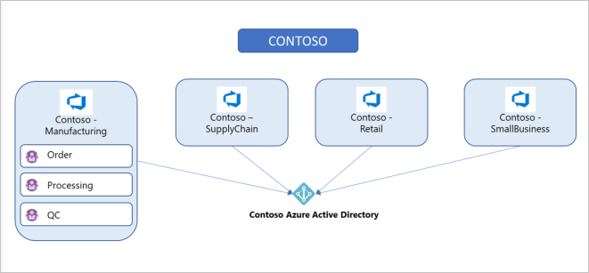
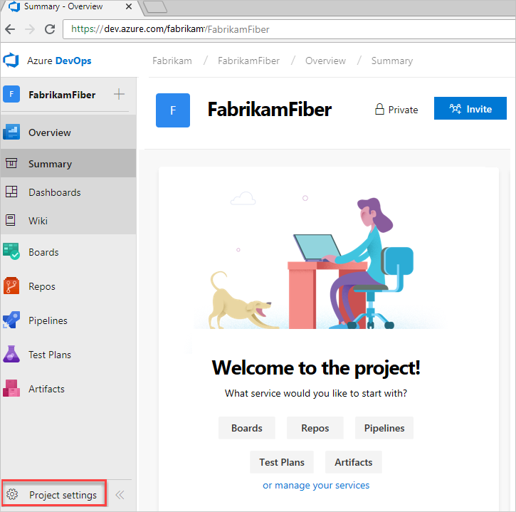
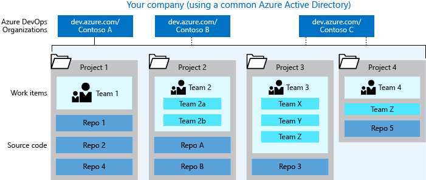
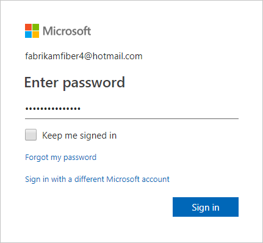

# Plan your organizational structure

[!INCLUDE [version-lt-eq-azure-devops](../includes/version-lt-eq-azure-devops.md)]

Use your business structure as a guide for the number of organizations, projects, and teams you create in Azure DevOps. This comprehensive planning guide helps you design optimal organizational structures that align development workflows with business objectives.  

[!INCLUDE [ai-assistance-mcp-server-tip](../includes/ai-assistance-mcp-server-tip.md)]

## Strategic planning framework

Use the following framework to make key decisions about your Azure DevOps structure at each level — organization, project, team, and repository.

### Primary structure decisions

Address these fundamental questions to guide your Azure DevOps structure:

**Organizational level:**
- [How many organizations do you need?](#how-many-organizations-do-you-need) - Consider security, compliance, and business unit separation.
- [How to map organizations to business units](#mapping-guidance-table) - Align with enterprise structure and governance needs.

**Project level:**
- [How many projects do you need?](#how-many-projects-do-you-need) - Balance collaboration with security and autonomy.
- [Project mapping strategies](#mapping-guidance-table) - Connect projects to business functions and team structures.

**Team and repository level:**
- [Team structure design](#create-a-team-for-each-distinct-product-or-feature-team) - Optimize for agile delivery and product ownership.
- [Repository organization](#structure-repos-and-version-control-within-a-project) - Support your development and deployment workflows.

### Supporting considerations

- **Access management**: Define who needs access to what information and resources.
- **Reporting requirements**: Plan for cross-team visibility and portfolio management.
- **Process standardization**: Promote consistent practices while allowing team flexibility.
- **Cultural alignment**: Foster an [agile mindset and collaborative culture](../boards/plans/agile-culture.md).

> [!TIP]
> Start with simpler structures and evolve as your organization grows. It's easier to split a large project than to merge separate organizations.

## Understanding Azure DevOps organizations

An organization in Azure DevOps serves as the top-level container for your projects, providing billing, security, and administrative boundaries. By using organizations, you can:

- **Centralize billing and licensing** across related projects and teams.
- **Establish security boundaries** with distinct access controls and policies.  
- **Provide administrative isolation** for different business units or compliance requirements.
- **Connect to identity providers** like Microsoft Entra ID for unified authentication.

### Organization benefits and free tier

Each organization includes free tier services for up to five users:

| Service | Free Tier Benefits |
|---------|-------------------|
| **Azure Pipelines** | One hosted job with 1,800 minutes per month for CI/CD plus one self-hosted job |
| **Azure Boards** | Work item tracking and Kanban boards for project management |
| **Azure Repos** | Unlimited private Git repositories for source control |
| **Azure Artifacts** | Package management for dependencies and build artifacts |
| **Stakeholder access** | Unlimited stakeholders for viewing and basic project participation |

[!INCLUDE [free-tier](../includes/free-tier.md)]

[!INCLUDE [loadtest-deprecated-include](../test/includes/loadtest-deprecated-include.md)]

**Common organization patterns:**
- **Single organization**: Use one organization for unified collaboration.
- **Business unit organizations**: Use separate organizations for distinct compliance or security requirements.
- **Geographic organizations**: Use regional separation for data residency or local governance.

## How many organizations do you need?

**Start with one organization** and expand only when you have specific business requirements that demand separation.

### Decision criteria for multiple organizations

Create more organizations when you need:

**Security and compliance separation:**
- Different regulatory requirements, such as SOX, HIPAA, or PCI-DSS
- Distinct customer data isolation requirements
- Separate audit trails and compliance reporting

**Business structure requirements:**
- Independent business units with separate IT governance
- Different billing and cost center requirements
- Distinct identity provider connections, such as different Microsoft Entra tenants

**Administrative boundaries:**
- Different administrator groups with no overlap
- Separate organizational policies and controls
- Independent service level agreements

### Evaluation framework

| Factor | Single Organization | Multiple Organizations |
|--------|-------------------|----------------------|
| **Collaboration** | Maximum visibility and sharing | Isolated, limited cross-organization sharing |
| **Administration** | Centralized, simpler management | Distributed, more administrative overhead |
| **Reporting** | Unified dashboards and analytics | Separate reporting systems |
| **Cost** | Single billing entity | Multiple billing entities |
| **Security** | Shared boundaries, unified policies | Hard boundaries, independent policies |

> [!IMPORTANT]
> For company-owned Microsoft Entra organizations, consider [restricting organization creation](../organizations/accounts/azure-ad-tenant-policy-restrict-org-creation.md) to protect intellectual property and maintain governance.

## What's a team?

A team is a unit that supports many [team-configurable tools](../organizations/settings/manage-teams.md). These tools help you plan and manage work, and make collaboration easier.

### Create a team for each distinct product or feature team

Each team owns its own backlog. To create a new backlog, you create a new team. [Configure teams and backlogs into a hierarchical structure](../boards/plans/configure-hierarchical-teams.md), so program owners can more easily track progress across teams, manage portfolios, and generate rollup data. When you create a team, you also create a team group. You can use this group in queries or to set permissions for your team.

## Understanding projects

Projects provide the container for your development work, containing these integrated services:

- **Azure Boards**: Agile planning with backlogs, sprints, and work item tracking.
- **Azure Pipelines**: Continuous integration and deployment automation.
- **Azure Repos**: Git or TFVC repositories for source code management.
- **Azure Test Plans**: Manual and automated testing integration.
- **Shared resources**: Wiki, dashboards, and project-level settings.

In the following example, Contoso Manufacturing uses four projects to organize different product lines:

### Project benefits and considerations

**Projects enable:**
- Shared iteration schedules and taxonomy across teams.
- Consistent process templates and work item types.
- Integrated reporting and portfolio management.
- Simplified user management and access control.

**Projects provide boundaries for:**
- Security and access permissions.
- Process customization and work tracking.
- Administrative policies and governance.
- Resource allocation and billing tracking.

## How many projects do you need?

Have at least one project to start using an Azure DevOps service, such as Azure Boards, Azure Repos, or Azure Pipelines. When you create your organization, you create a default project for yourself. In your default project, there's a code repo to start working in, a backlog to track work, and at least one pipeline to begin automating build and release.

Within an organization, you can use either of the following approaches:

* Create a single project that contains many repos and teams.
* Create many projects, each with its own set of teams, repos, builds, work items, and other elements.

Even if you have many teams working on hundreds of different applications and software projects, you can manage them within a single project in Azure DevOps. However, if you want to manage more granular security between your software projects and their teams, consider using many projects. At the highest level of isolation is an organization, where each organization is connected to a single Microsoft Entra tenant. A single Microsoft Entra tenant, however, can be connected to many Azure DevOps organizations.

::: moniker range="azure-devops"  

> [!NOTE]  
> If you enable the **Limit user visibility and collaboration to specific projects** preview feature for the organization, users added to the **Project-Scoped Users** group can't access projects that they aren't added to. For more information and important security-related call-outs, see [Manage your organization, Limit  user visibility for projects and more](manage-organization-collection.md#project-scoped-user-group). 

::: moniker-end  

### Project decision framework

Choose the appropriate project structure based on your collaboration needs:

**Single project approach:**
- **Best for**: Smaller organizations or teams with tight collaboration
- **Benefits**: Maximum visibility, shared resources, unified reporting
- **Consider when**: Teams work on related products with similar release cycles

**Multiple projects approach:**
- **Best for**: Independent teams with distinct requirements  
- **Benefits**: Better security boundaries, customizable processes, team autonomy
- **Consider when**: Different compliance needs or separate business units

Azure DevOps provides cross-project experiences for managing work across multiple projects.

**Consider multiple projects for:**
- Restricting or managing access to specific information
- Supporting custom work tracking processes for different business units
- Supporting separate business units with independent administrative policies
- Testing customizations or extensions before production rollout

> [!IMPORTANT]
> Git repository portability makes it easy to migrate repos (including full history) between projects. However, you can't migrate other history, such as push and pull requests, between projects.

When you map projects to business units, your company gets a single organization and sets up many projects with one or more projects representing a business unit. This organization contains all Azure DevOps assets of the company and is located within a given geography (for example, Europe). Consider the following guidance for mapping your projects to business units:

|                                                |                                                                                 **One project, many teams**                                                                                  |                                               **One organization, many projects, and teams**                                                |                                                                     **Many organizations**                                                                      |
|------------------------------------------------|----------------------------------------------------------------------------------------------------------------------------------------------------------------------------------------------|--------------------------------------------------------------------------------------------------------------------------------------------|-----------------------------------------------------------------------------------------------------------------------------------------------------------------|
|              **General guidance**              |                                                      Best for smaller organizations or larger organizations with highly aligned teams.                                                       |                                          Good when different efforts require different processes.                                          | Useful as part of legacy migrations and for hard security boundaries between organizations. Used with multiple projects and teams within each organization. |
|                   **Scale**                    |                                Supports tens of thousands of users and hundreds of teams, but best at this scale if all teams are working on related efforts.                                |                                         Same as with one project, but many projects might be easier.                                         |                                                                                                                                                                 |
|                  **Process**                   |                                                 Aligned processes across teams; team flexibility to customize boards, dashboards, and so on.                                                 |                 Independent processes for each project. For example, different work item types, custom fields, and so on.                  |                                                                     Same as many projects.                                                                      |
|               **Collaboration**                |                                                       Highest default visibility and reuse between work and assets of different teams.                                                       |                Good visibility and reuse are possible, but it's easier to hide assets between projects whether intentional.                |                                                Poor visibility, collaboration, and reuse between organizations.                                                 |
| **Roll-up reporting and portfolio management** |                                                              Best ability to roll up across teams and coordinate between teams.                                                              |                 Good reporting possible across projects. More difficult for cross-project roll-up and team coordination.                  |                                                        No roll-up or coordination between organizations.                                                        |
|             **Security/isolation**             |                                                   Can lock down assets at a team level, but default is open visibility and collaboration.                                                    |  Better ability to lock down between projects. By default, provides good visibility within projects and good isolation across projects.   |                          Hard boundaries across organizations; excellent isolation and minimal ability to share across organizations.                           |
|             **Context switching**              |                                                         Easiest for teams to work together and for users to switch between efforts.                                                          |                              Relatively easy for users to work together and switch contexts between efforts.                               |                                             More difficult for users having to work across different organizations.                                             |
|            **Information overload**            |                               By default, all assets are visible to users who make use of "favorites" and similar mechanisms to avoid "information overload."                               |                        Reduced risk of information overload; most project assets hidden across project boundaries.                         |                                        Assets across organizations are isolated, reducing risk of information overload.                                         |
|          **Administrative overhead**           | Much administration is delegated down to individual teams. Easiest for user licensing and org-level administration. More work might be needed if alignment is required between efforts. | More administration at the project level. More overhead, but can be useful when projects have different administrative needs. |                   As with more projects, there's more administrative overhead, which enables more flexibility between orgs.                   |

## Structure repos and version control within a project

Consider the specific strategic work scoped to one of the organizations you created previously and who needs access. Use this information to name and [create a project](../organizations/projects/create-project.md). This project has a URL defined under the organization you created it in and you can access it at `https://dev.azure.com/{organization-name}/{project-name}`.

Configure your project in **Project settings**.

For more information about managing projects, see [Manage projects in Azure DevOps](../organizations/projects/about-projects.md). You can move a project to a different organization by migrating the data. For more information about migrating your project, see the [Migration overview](../migrate/migration-overview.md).

## Repository strategy and version control

Configure your repository strategy based on team size, product architecture, and deployment requirements.

### Version control system selection

Choose between Git and Team Foundation Version Control (TFVC):

**Git repositories:**
- **Recommended approach** for modern development workflows
- Unlimited repositories per project
- Distributed version control with flexible branching
- Integrates with most development tools and CI/CD systems

**Team Foundation Version Control (TFVC):**  
- Centralized version control system
- Single repository per project with folder-based organization
- Suitable for teams that prefer centralized workflows

> [!TIP]
> Projects can use both Git and TFVC repositories if your teams have different workflow preferences.

### Repository organization patterns

**Monorepo strategy:**

- **Best for**: Small teams building momentum with related services
- **Benefits**: Simplified sharing and coordinated changes  
- **Challenges**: Knowledge complexity increases with team growth; unintended service coupling; difficult change tracking

**Separate repositories strategy:**
- **Best for**: Larger teams with independent service deployments
- **Benefits**: Clear service boundaries, easier onboarding, independent release cycles
- **Considerations**: Requires more initial setup but scales effectively with team growth.

> [!TIP] 
> Start with a monorepo for small teams and transition to separate repositories as your organization grows and complexity increases.

### Repository and project alignment strategy

**Single project with multiple repositories:**
- **Best for**: Products and services with coordinated release schedules
- **Benefits**: Shared processes, consistent access controls, streamlined administration
- **Use when**: Developers frequently work across multiple repos and require consistent tooling

**Multiple projects with dedicated repositories:**  
- **Best for**: Products with independent schedules or distinct requirements
- **Benefits**: Independent customization, separate governance, clear boundaries
> [!NOTE]
> Git repository portability allows easy migration between projects with full commit history.

**Decision factors for repository organization:**
- **Code dependencies**: Place independently deployable products and services in separate repos
- **Coordination needs**: Keep related codebases together when coordinated changes are expected  
- **Architecture**: Maintain existing monoliths in single repos; separate disconnected services
- **Team access**: Implement proper [permission management](../organizations/security/permissions.md) to control repo creation

> [!TIP]
> Consider [managing your permissions](../organizations/security/permissions.md), so not everyone in your organization can [create a repo](../repos/git/create-new-repo.md). If you have too many repos, it's hard to keep track of who owns which code or other content stored in those repos.

### Shared repo vs. forked repos

Use a shared repo within a trusted organization. Developers use branches to keep their changes separate from one another. With a good branching and release strategy, a single repo can support concurrent development for more than a thousand developers. For more information about branching and release strategy, see [Adopt a Git branching strategy and Release Flow: Our Branching Strategy](../repos/tfvc/branch-strategically.md).

Forks are useful when you're working with vendor teams that shouldn't have direct access to update the main repository. Forks are also useful in scenarios where many developers contribute infrequently, such as in an open-source project. When you work with forks, you might want to maintain a separate project to isolate the forked repos from the main repo. There's added administrative overhead, but it keeps the main project cleaner. For more information, see the [Forks article](../repos/git/forks.md).

The following image displays a sample of how your company could structure its organizations, projects, work items, teams, and repos.

### Managing temporary and shared resources

Consider how to manage temporary and shared resources effectively by using the following best practices:

- **Temporary environments:** Temporary environments are short-lived and used for tasks such as testing, development, or staging. To manage these environments efficiently:
  - **Separate repositories and pipelines:** Each temporary environment and its associated resources, such as Azure Functions, should have its own repository and pipeline. This separation means you can deploy and roll back the environment and its resources at the same time. It's easier to spin up and discard them as needed.
  - **Example:** Create a repository and pipeline specifically for your development environment, including all necessary resources such as Azure Functions, storage accounts, and other services.
- **Shared resources:** Shared resources are typically long-lived and used across multiple environments. These resources often have longer spin-up times and higher costs. To manage shared resources effectively:
  - **Separate repositories and pipelines:** Shared resources, such as Azure SQL Database, should have their own repository and pipeline. This separation makes sure that temporary environments can use these shared resources, making their deployments faster and more cost-effective.
  - **Example:** Create a repository and pipeline for your Azure SQL Database, which multiple temporary environments can use.
- **Shared infrastructure resources:** Shared infrastructure resources, such as virtual private clouds (VPCs) and subnets, also known as landing zones, should also have their own repositories and pipelines. This approach makes sure that you manage your infrastructure consistently and you can reuse it across different environments.
  - **Example:** Create a repository and pipeline for your VPC and subnet configuration, which other repositories and pipelines can reference.

## More about organizational structure

### Choose your organization administrator account type

When you create an organization, the credentials you use to sign in determine which identity provider your organization uses. Create your organization by using a Microsoft account or a Microsoft Entra instance. Use those credentials to sign in as an administrator to your new organization at `https://dev.azure.com/{YourOrganization}`.

#### Use your Microsoft account

Use your Microsoft account if you don't need to authenticate users for an organization by using Microsoft Entra ID. All users must sign in to your organization by using a Microsoft account. If you don't have one, [create a Microsoft account](https://login.live.com/login.srf?lw=1).

   

If you don't have a Microsoft Entra instance, create one for free from the [Azure portal](https://ms.portal.azure.com/) or use your Microsoft account to create an organization. Then, you can [connect your organization to Microsoft Entra ID](../organizations/accounts/connect-organization-to-azure-ad.md).

#### Use your Microsoft Entra account

You might already have a Microsoft Entra account if you use Azure or Microsoft 365. If you work for a company that uses Microsoft Entra ID to manage user permissions, you probably have a Microsoft Entra account.

If you don't have a Microsoft Entra account, [sign up for Microsoft Entra ID](https://ms.portal.azure.com/) to automatically connect your organization to your Microsoft Entra ID. All users must be members in that directory to access your organization. To add users from other organizations, use [Microsoft Entra B2B collaboration](/azure/active-directory/b2b/add-users-administrator).

Azure DevOps authenticates users through your Microsoft Entra ID, so that only users who are members in that directory have access to your organization. When you remove users from that directory, they can no longer access your organization. Only specific [Microsoft Entra administrators](/azure/active-directory/users-groups-roles/directory-assign-admin-roles) manage users in your directory, so administrators control who accesses your organization.

For more information on managing users, see [Manage users](../organizations/accounts/add-organization-users.md).

### Map organizations to business units

Each business unit within your company gets its own organization in Azure DevOps, along with its own Microsoft Entra tenant. You can [set up projects](#understanding-projects) within those individual organizations, as required, based on teams or ongoing work.

For a larger company, you can create multiple organizations by using different user accounts (most likely Microsoft Entra accounts). Consider what groups and users share strategies and work, and group them into specific organizations. 

For example, the fictional Fabrikam company created the following three organizations: 

- Fabrikam-Marketing
- Fabrikam-Engineering
- Fabrikam-Sales 

Each organization has a separate URL, such as:

- `https://dev.azure.com/Fabrikam-Marketing`
- `https://dev.azure.com/Fabrikam-Engineering`
- `https://dev.azure.com/Fabrikam-Sales`

The organizations are for the same company, but are mostly isolated from each other. You don't need to separate anything this way. Only create boundaries when it makes sense to your business. 

> [!TIP]
> You can more easily partition an existing organization with projects, than combine different organizations.

::: moniker range="azure-devops"

## Use AI to plan your organizational structure

When you configure the [Azure DevOps MCP Server](../mcp-server/mcp-server-overview.md), you can use AI assistants to analyze and plan your organizational structure through natural language prompts.

### Example prompts for organizational planning

| Task | Example prompt |
|------|----------------|
| Review current structure | `List all projects and teams in <Contoso> organization` |
| Analyze team setup | `Show all teams and their members in <Contoso> project` |
| Check area paths | `List all area paths configured in <Contoso> project` |
| Review iterations | `Show the iteration paths and schedule for <Contoso> project` |
| Assess project scope | `Show the number of work items, repos, and pipelines in each project in <Contoso> organization` |
| Find unused projects | `List projects in <Contoso> organization that have no recent commits or work item updates` |
| Compare team sizes | `Show the member count for every team across all projects in <Contoso> organization` |
| Spot area-path sprawl | `List area paths in <Contoso> project that have no work items assigned` |
| Plan a reorg | `Show which teams own each area path in <Contoso> project, and how many active work items each area has` |

::: moniker-end

## Related content  

- [Create an organization](../organizations/accounts/create-organization.md)
- [Create a project](../organizations/projects/create-project.md)
- [Connect your organization to Microsoft Entra ID](../organizations/accounts/connect-organization-to-azure-ad.md)
- [Set up billing](../organizations/billing/set-up-billing-for-your-organization-vs.md#set-up-billing)
- [Set user preferences](../organizations/settings/set-your-preferences.md)
