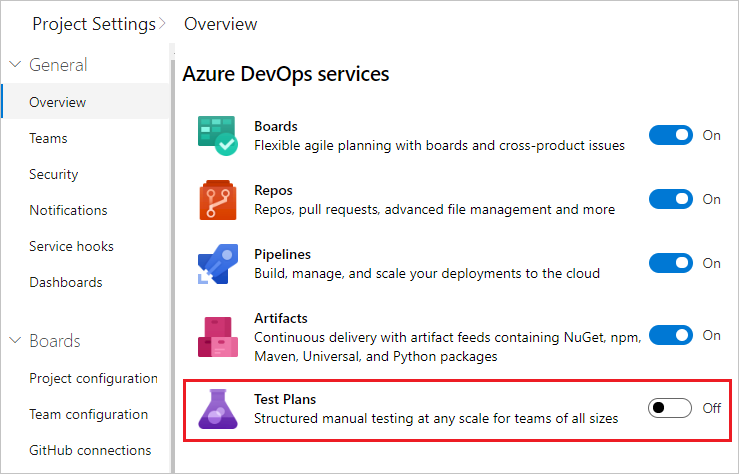
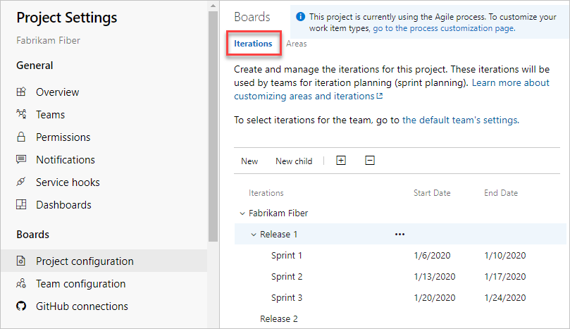

# Manage your project 

[!INCLUDE [version-vsts-tfs-all-versions](../includes/version-vsts-tfs-all-versions.md)]  

With most Azure DevOps Services, you can start using the service and configure resources as you go. No up-front work is required. Most settings define defaults.  

As an organization Owner or a Project Administrator, there are a few tasks you might want to do to ensure a smooth operational experience. If you need to manage an organization with a large user base, consider additional tasks to structure your projects to support multiple teams or software development applications.  

## Add users to your project 

::: moniker range="azure-devops"  
Ensure that all members of your organization or group are added to your organization and projects. For small projects, you can [invite users to your project or team](../security/add-users-team-project.md#invite-users-from-the-summary-page).

Larger enterprises may want to consider using Azure Active Directory to manage permissions and user access. To learn more, see [About organization management](../organizations/accounts/organization-management.md).

::: moniker-end  

::: moniker range="< azure-devops"
 
Ensure that all members of your organization or group are added to your organization and project. For small projects, you can [invite users to your project or team](../security/add-users-team-project.md#invite-users-from-the-summary-page). Larger organizations may want to consider using Azure Active Directory to keep the maintenance of managing permissions and user access. Typically, you should install Azure Active Directory before installing TFS. To learn more, see the following articles.

- [Install Azure Active Directory Domain Services (Level 100)](/windows-server/identity/ad-ds/deploy/install-active-directory-domain-services--level-100-)
- [Step-By-Step: Setting up Azure Active Directory in Windows Server 2016](/archive/blogs/canitpro/step-by-step-setting-up-active-directory-in-windows-server-2016)

::: moniker-end

To delegate the task of managing user access, add a user with Stakeholder or higher access to the [Project Collection Administrators group](../organizations/security/set-project-collection-level-permissions.md).

## Grant or restrict permissions  

Access to features and functions is controlled by access-level assignments, permissions, and security groups. To quickly understand the defaults configured for your project, see [Default permissions and access](../organizations/security/permissions-access.md). 

::: moniker range="azure-devops"  

> [!NOTE]  
> If the **Project-Scoped Users well known group to hide settings** preview feature is enabled for the organization, users added to the **Project-Scoped Users** group won't be able to access projects that they haven't been added to. To learn more, see [About projects and scaling your organization, Project-scoped Users group](../organizations/projects/about-projects.md#project-scoped-user-group).

::: moniker-end  

To delegate specific tasks to others, add them to a built-in or custom security group or add them to a specific role. To learn more, see the following articles.

- [Grant or restrict access to select features and functions](../organizations/security/restrict-access.md)  
- [Set permissions at the project level or project collection level](../organizations/security/set-project-collection-level-permissions.md)

To learn more about permissions and security, review the following articles:

- [About security and identity](../organizations/security/about-security-identity.md)  
- [About permissions and groups](../organizations/security/about-permissions.md)  
- [About security roles](../organizations/security/about-security-roles.md)  
- [About access levels](../organizations/security/access-levels.md)  

::: moniker range="azure-devops"

<a id="limit-identity-selection" /> 

## Limit identity search and selection  

For organizations that manage their users and groups using Azure Active Directory (Azure AD), people pickers provide support for searching all users and groups added to Azure AD, not just those added to your project. people pickers support the following Azure DevOps functions: 
- Selection of a user identity from a work tracking identity field such as **Assigned To**
- Selection of a user or group using **@mention** in a work item discussion or rich-text field, a pull request discussion, commit comments, or changeset or shelveset comments
- Selection of a user or group using **@mention** from a wiki page  

As shown in the following image, you simply start typing into a people picker box until you find a match to a user name or security group.
 
> [!div class="mx-imgBorder"]  
>   

To limit the identity selection to just those users and groups added to a project, perform the following procedure for your organization and projects. 

1. Enable the **Limit user visibility for projects** preview feature for the organization. To learn how, see [Manage or enable features](../project/navigation/preview-features.md#account-level). 
2. Add the users to your project(s) as described in [Add users to a project or team](../organizations/security/add-users-team-project.md). Users added to a team are automatically added to the project and team group. 
3. Open **Organizations Settings>Security>Permissions** and choose **Project-Scoped Users**. Choose the **Members** tab. Add all users and groups that you want to scope to the project(s) you've added them to. To learn more, see [Set permissions at the project- or collection-level](../organizations/security/set-project-collection-level-permissions.md). 
	The **Project-Scoped Users** group only appears under the **Permissions>Groups** once **Limit user visibility for projects** preview feature is enabled. 

::: moniker-end  

::: moniker range=">= tfs-2015"

## Share your project vision  

::: moniker-end

::: moniker range="azure-devops"  

Each project has a summary page that's useful for sharing information through **README** files. Or, redirect users to a project Wiki. For users who are new to your project, we recommend that you [set up your project summary page](../organizations/projects/project-vision-status.md) or [provision a Wiki](../project/wiki/wiki-create-repo.md). Use these features to share established processes and procedures for your project.

::: moniker-end  

::: moniker range=">= tfs-2015 < azure-devops"  
Each project has a summary page that's useful for sharing information through **README files**. For users who are new to your project, we recommend that you [set up your project summary page](../organizations/projects/project-vision-status.md). Use this feature to share established processes and procedures for your project. 

::: moniker-end

::: moniker range=">= azure-devops-2019"  

## Remove unused services 

To simplify the web portal user interface, you can disable select services. For example, if you use a project only to log bugs, then disable all services except for **Boards**.

This example shows that **Test Plans** is disabled:

> [!div class="mx-imgBorder"]
> 

::: moniker-end  

::: moniker range=">= tfs-2015"  

## Set DevOps policies 

Set policies to support collaboration across your teams, secure your projects, and automatically remove obsolete files. To set policies, review the following articles: 

::: moniker-end  

::: moniker range=">= azure-devops-2019"

- [Change application access policies for your organization](../organizations/accounts/change-application-access-policies.md)
- [Manage branch policies](../repos/git/branch-policies.md)  
- [Add Team Foundation Version Control (TFVC) check-in policies](../repos/tfvc/add-check-policies.md)  
- [Set build and release pipeline retention policies](../pipelines/policies/retention.md) 
- [Set test retention policies](../test/how-long-to-keep-test-results.md) 
::: moniker-end  

::: moniker range=">= tfs-2015 <= tfs-2018"

- [Manage branch policies](../repos/git/branch-policies.md)  
- [Add TFVC check-in policies](../repos/tfvc/add-check-policies.md)  
- [Set build and release pipeline retention policies](../pipelines/policies/retention.md) 
- [Set test retention policies](../test/how-long-to-keep-test-results.md) 
::: moniker-end  

## Define area and iteration paths to track work

If you support several products, you can assign work items by feature area by defining [area paths](../organizations/settings/set-area-paths.md). To assign work items to specific time intervals, also known as sprints, you configure [iteration paths](../organizations/settings/set-iteration-paths-sprints.md). To use the Scrum tools&mdash;sprint backlogs, taskboards, and team capacity&mdash;you need to configure several sprints. For an overview, see [About areas and iteration paths](../organizations/settings/about-areas-iterations.md).  

> [!div class="mx-tdBreakAll"] 
> |Iterations| Areas |
> |-------------|----------| 
> | |  | 

## Customize work-tracking processes

::: moniker range=">= azure-devops-2019"
  
All work-tracking tools are available immediately after you create a project. Often, one or more users may want to customize the experience to meet one or more business needs. Processes are easily customized through the user interface. However, you may want to establish a methodology for who manages the updates and evaluates requests.

To learn more, see the following articles:

- [About process customization and inherited processes](../organizations/settings/work/inheritance-process-model.md)  
- [Customize a project](../organizations/settings/work/customize-process.md)  
- [Add and manage processes](../organizations/settings/work/manage-process.md)

::: moniker-end  

::: moniker range="<= tfs-2018"

All work-tracking tools are available immediately after you create a project. Often, one or more users may want to customize the experience to meet one or more business needs. But, you may want to establish a methodology for who manages the updates and evaluates requests.

To learn more, see [On-premises XML process model](../reference/on-premises-xml-process-model.md).

::: moniker-end

## Review and update notifications

A number of notifications are predefined for each project you add. Notifications are based on subscription rules. Subscriptions arise from the following areas:

- [Out-of-the-box or default subscriptions](../notifications/oob-built-in-notifications.md).
- [Team, organization, and collection-level notifications](../notifications/manage-team-group-global-organization-notifications.md), managed by a team administrator or member of the Project Collection Administrators group.
- Project notifications, managed by a member of the Project Administrators group.

If users believe they're getting too many notifications, direct them to [opt out of a subscription](../notifications/manage-your-personal-notifications.md).

> [!div class="mx-imgBorder"]  
>    

::: moniker range="< azure-devops"  

## Configure an SMTP server

In order for team members to receive notifications, [you must configure an SMTP server](/azure/devops/server/admin/setup-customize-alerts).  

::: moniker-end  

## Add teams to scale your organization

We recommend that you add teams as your organization grows. Each team gets [access to their own set of customizable Agile tools](../organizations/settings/about-teams-and-settings.md).

To learn more, see the following articles:

- [About projects and scaling your organization](../organizations/projects/about-projects.md)
- [Add a team, move from one default team to several teams](../organizations/settings/add-teams.md)  
- [Add a team administrator](../organizations/settings/add-team-administrator.md)  

::: moniker range=">= tfs-2015"
  
## Install and manage extensions 

An extension is an installable unit that adds new capabilities to your projects. Azure DevOps extensions support the following functions:

- Planning and tracking of work items, sprints, scrums, and so on  
- Build and release flows
- Code testing and tracking
- Collaboration among team members

::: moniker-end

::: moniker range=">= tfs-2017"

For example, to support [code search](../project/search/functional-code-search.md), install the [Code Search extension](https://marketplace.visualstudio.com/items?itemName=ms.vss-code-search).

::: moniker-end  

::: moniker range=">= tfs-2015"  

You want to tell your users about extensions and that they can [request an extension](../marketplace/request-extensions.md). To install and manage extensions, you must be an organization Owner, a member of the Project Collection Administrators group. Or, you can get added to the [Manager role for extensions](../marketplace/how-to/grant-permissions.md).

::: moniker-end

::: moniker range="azure-devops"

## Set up billing

All organizations can add up to five users with Basic access and unlimited users with Stakeholder access. If you need to add more users or pay for additional services or extensions, [set up billing](../organizations/billing/set-up-billing-for-your-organization-vs.md).  

::: moniker-end

## Next steps  

> [!div class="nextstepaction"]
> [Share your project vision](../organizations/projects/project-vision-status.md)

## Related articles

::: moniker range="azure-devops"  

- [Project and team quick reference](../organizations/projects/project-team-quick-reference.md)  
- [Security & identity](../organizations/security/about-security-identity.md)
- [Organization management](../organizations/accounts/organization-management.md)
- [About user, team, project, and organization-level settings](../organizations/settings/about-settings.md)

::: moniker-end

::: moniker range="< azure-devops"  

- [Project and team quick reference](../organizations/projects/project-team-quick-reference.md)  
- [Security & identity](../organizations/security/about-security-identity.md)
- [Organization management](../organizations/accounts/organization-management.md)
- [About user, team, project, and organization-level settings](../organizations/settings/about-settings.md)
- [TFS administration](/azure/devops/server/index)

::: moniker-end
