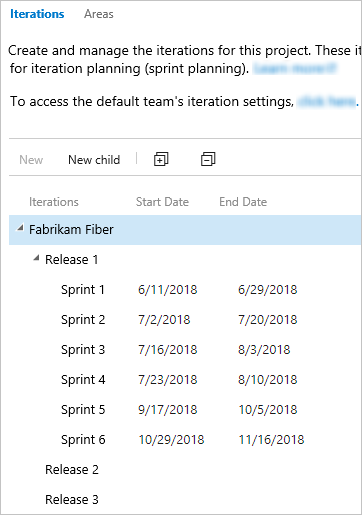

# Quickstart: Manage your project 

[!INCLUDE [version-vsts-tfs-all-versions](../_shared/version-vsts-tfs-all-versions.md)]  

With most Azure DevOps services, you can start using the service and configure resources as you go. No up-front work is required. Most settings define defaults.  

That said, as an organization owner or a project administrator, there are a few tasks you might want to do once your created your project to ensure a smooth operational experience. If you own a large organization, you'll want to consider additional tasks to structure your projects to support multiple teams or software development apps.  

## Add users to your project

::: moniker range="azure-devops"  
The first task is to ensure that all members of your organization or group are added to your organization and projects. For small groups, using [Microsoft Accounts](https://account.microsoft.com/account) to add users to your organization and projects works fine.

Larger enterprises may want to consider using Azure Active Directory to manage permissions and user access. To learn more, see the following articles:

- [Add organization users for Azure DevOps Services](../organizations/accounts/add-organization-users.md)
- [Manage user access through Azure Active Directory](../organizations/accounts/access-with-azure-ad.md)

::: moniker-end  

::: moniker range="<= azure-devops-2019"  
The first task is to ensure that all members of your organization or group are added to your organization and project. Larger organizations may want to consider using Azure Active Directory to keep the maintenance of managing permissions and user access. Typically, you should install Azure Active Directory prior to installing TFS. To learn more, see these articles:

- [Install Azure Active Directory Domain Services (Level 100)](/windows-server/identity/ad-ds/deploy/install-active-directory-domain-services--level-100-)
- [Step-By-Step: Setting up Azure Active Directory in Windows Server 2016](https://blogs.technet.microsoft.com/canitpro/2017/02/22/step-by-step-setting-up-active-directory-in-windows-server-2016/)

::: moniker-end

You can delegate the task to add users to an organization by adding a user with Stakeholder or Basic access to the [Project Collection Administrators group](../organizations/security/set-project-collection-level-permissions.md).

## Grant or restrict permissions

Access to features and functions is controlled by access-level assignments, permissions, and security groups. To quickly understand the defaults configured for your project, see [Default permissions and access](../organizations/security/permissions-access.md). 

If you decide that you want to delegate specific tasks to others, then you'll want to add them to a built-in or custom security group or add them to a specific role. To learn more, see these articles:

- [Grant or restrict access to select features and functions](../organizations/security/restrict-access.md)  
- [Set permissions at the project level or project collection level](../organizations/security/set-project-collection-level-permissions.md)

To learn more about permissions and security, review the following articles:

- [About security and identity](../organizations/security/about-security-identity.md)  
- [About permissions and groups](../organizations/security/about-permissions.md)  
- [About security roles](../organizations/security/about-security-roles.md)  
- [About access levels](../organizations/security/access-levels.md)  

::: moniker range=">= tfs-2015"

## Share your project vision and support collaboration

::: moniker-end

::: moniker range="azure-devops"  
Each project has a summary page where you can share information through **README** files or by pointing to a project Wiki. To orient users who are new to your project and share established processes and procedures, we recommend that you [set up your project summary page](../organizations/projects/project-vision-status.md) or [provision a Wiki](../project/wiki/wiki-create-repo.md).

::: moniker-end  

::: moniker range=">= tfs-2015 <= azure-devops-2019"  
Each project has a summary page where you can share information through **README files**. To orient users who are new to your project and share established processes and procedures, we recommend that you [set up your project summary page](../organizations/projects/project-vision-status.md).

::: moniker-end

::: moniker range=">= azure-devops-2019"  

## Remove unused services from the user interface

To simplify the web portal user interface, you can disable select services. For example, if you use a project only to log bugs, then you can remove all services except for **Boards**.

This example shows that **Test Plans** has been disabled:

> [!div class="mx-imgBorder"]
> 

::: moniker-end  

::: moniker range=">= tfs-2015"  
## Set code, test, and other policies 

There are several policies you can set to support collaboration across your teams, secure your projects, and automatically remove files that are no longer needed. To set policies, review the following articles: 

::: moniker-end  

::: moniker range="azure-devops"  
- [Change application access policies for your organization](../organizations/accounts/change-application-access-policies.md)
- [Manage branch policies](../repos/git/branch-policies.md)  
- [Add Team Foundation Version Control (TFVC) check-in policies](../repos/tfvc/add-check-policies.md)  
- [Set build and release pipeline retention policies](../pipelines/policies/retention.md) 
- [Set test retention policies](../test/how-long-to-keep-test-results.md) 
::: moniker-end  

::: moniker range=">= tfs-2015 <= tfs-2018"  
- [Manage branch policies](../repos/git/branch-policies.md)  
- [Add TFVC check-in policies](../repos/tfvc/add-check-policies.md)  
- [Set build and release pipeline retention policies](../pipelines/policies/retention.md) 
- [Set test retention policies](../test/how-long-to-keep-test-results.md) 
::: moniker-end  

## Define area and iteration paths for work tracking

If you support several products or feature areas, you can assign work items by feature area by setting up [area paths](../organizations/settings/set-area-paths.md). To assign work items to specific time intervals, also known as sprints, you'll want to configure [iteration paths](../organizations/settings/set-iteration-paths-sprints.md). To use the Scrum tools&mdash;sprint backlogs, taskboards, and team capacity&mdash;you need to configure several sprints. For an overview, see [About areas and iteration paths](../organizations/settings/about-areas-iterations.md).  

> [!div class="mx-tdBreakAll"] 
> |Iterations| Areas |
> |-------------|----------| 
> | |  | 

::: moniker range="azure-devops"
  
## Customize work-tracking processes

You and your teams can start using all work-tracking tools immediately after you create a project. But often, one or more users want to customize the experience to meet one or more business needs. Although you can customize the process easily through the user interface, you can establish a methodology for who manages the updates and evaluates requests.

> [!NOTE]
> By default, users granted Basic and Stakeholder access are granted permission to create, edit, and manage processes used to customize the work-tracking experience. If you want to lock down who is able to perform these tasks, you can set permissions at the organization level to **Deny**.  

To learn more, see the following articles:

- [About process customization and inherited processes](../organizations/settings/work/inheritance-process-model.md)  
- [Customize a project](../organizations/settings/work/customize-process.md)  
- [Add and manage processes](../organizations/settings/work/manage-process.md)

::: moniker-end  

::: moniker range="<= tfs-2018"

## Customize work-tracking processes

You and your teams can start using all work-tracking tools immediately after you create a project. But often, one or more users want to customize the experience to meet one or more business needs. You can establish a methodology for who manages the updates and evaluates requests.

To learn more, see [On-premises XML process model](../reference/on-premises-xml-process-model.md).

::: moniker-end

## Review and update notifications

A number of notifications are predefined for each project you add. Notifications are based on subscription rules. Subscriptions arise from the following areas:

- [Out-of-the-box or default subscriptions](../notifications/oob-built-in-notifications.md).
- [Team notifications](../notifications/howto-manage-team-notifications.md), managed by a team administrator.
- Project notifications, managed by a member of the Project Administrators group.
- [Organization and collection level notifications](../notifications/howto-manage-organization-notifications.md), managed by a member of the Project Collection Administrators group.

If users believe they're getting too many notifications, they can [opt out of a subscription](../notifications/howto-manage-personal-notifications.md).

> [!div class="mx-imgBorder"]  
>    

::: moniker range="<= azure-devops-2019"  

## Configure an SMTP server

In order for team members to receive notifications, [you must configure an SMTP server](/azure/devops/server/admin/setup-customize-alerts).  

::: moniker-end  

## Add teams to scale your organization

We recommend that you add teams as your organization grows. Each team gets [access to their own set of Agile tools](../organizations/settings/about-teams-and-settings.md) that they can customize.

To learn more, see the following articles:

- [About projects and scaling your organization](../organizations/projects/about-projects.md)
- [Add a team, move from one default team to several teams](../organizations/settings/add-teams.md)  
- [Add a team administrator](../organizations/settings/add-team-administrator.md)  

::: moniker range=">= tfs-2015"
  
## Install and manage extensions 

An extension is an installable unit that adds new capabilities to your projects. You can find extensions in the [Visual Studio Marketplace](https://marketplace.visualstudio.com/azuredevops), Azure DevOps tab to support the following functions:

- Planning and tracking of work items, sprints, scrums, etc.  
- Build and release flows.
- Code testing and tracking.
- Collaboration among team members.

::: moniker-end

::: moniker range=">= tfs-2017"

For example, to support [code search](../project/search/code-search.md), install the [Code Search extension](https://marketplace.visualstudio.com/items?itemName=ms.vss-code-search).

::: moniker-end  

::: moniker range=">= tfs-2015"  
You want to tell your users about extensions and that they can [request an extension](../marketplace/request-extensions.md). To install and manage extensions, you must be an organization owner, a member of the Project Collection Administrators group, or added to the [Manager role for extensions](../marketplace/how-to/grant-permissions.md).

::: moniker-end

::: moniker range="azure-devops"

## Set up billing

All organizations can add up to five users with Basic access and unlimited users with Stakeholder access. If you need to add more users or pay for additional services or extensions, [set up billing](../organizations/billing/set-up-billing-for-your-organization-vs.md).  

::: moniker-end

## Next steps  

> [!div class="nextstepaction"]
> [Manage projects](../organizations/projects/index.md)

## Related articles

::: moniker range="azure-devops"  

- [Security & identity](../organizations/security/index.md)
- [Organization management](../organizations/accounts/index.md)
- [About user, team, project, and organization-level settings](../organizations/settings/about-settings.md)

::: moniker-end

::: moniker range=">= tfs-2013 <= tfs-2018"  

- [Manage projects](../organizations/projects/index.md)
- [Security & identity](../organizations/security/index.md)
- [Organization management](../organizations/accounts/index.md)
- [About user, team, project, and organization-level settings](../organizations/settings/about-settings.md)
- [TFS administration](/azure/devops/server/index)

::: moniker-end