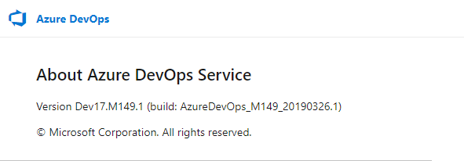
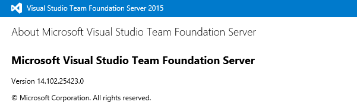

# How do I get support and provide feedback for Azure DevOps products?

[!INCLUDE [version-vsts-tfs-all-versions](../_shared/version-vsts-tfs-all-versions.md)]

> [!Important]
> Having problems? We can help. We offer a [live chat](https://visualstudio.microsoft.com/vs/support/#talktous) (English only) support option. Choose from **Technical Support**, **Sales Support**, **Visual Studio (For your Company)**, and **Account, Subscription, and Billing Support**. Select your country from the dropdown menu, and then select **Live Chat (English)**.

Share your feedback and ideas with us, or join our communities. We're always working to improve Azure DevOps, and we want you to be part of the process! 

Do you need to do any of the following?:

* **Get advice** Visit StackOverflow for [Azure DevOps](http://stackoverflow.com/questions/tagged/vsts) or [TFS](http://stackoverflow.com/questions/tagged/tfs).

* **Report a bug** Submit it through our Developer Community for [Azure DevOps](https://developercommunity.visualstudio.com/spaces/21/index.html) or [TFS](https://developercommunity.visualstudio.com/spaces/22/index.html).

* **Suggest a feature or a fix** Submit your idea or issue through our Developer Community for [Azure DevOps](https://developercommunity.visualstudio.com/content/idea/post.html?space=21) or [TFS](https://developercommunity.visualstudio.com/content/idea/post.html?space=22).

* **Find out what's new in Azure DevOps** Check out the [current Azure DevOps Release Notes](https://visualstudio.microsoft.com/team-services/release-notes/). These notes are updated every three weeks.

## Azure DevOps product support

The primary support venues for Azure DevOps and TFS are as follows:

* [Azure DevOps Support](https://azure.microsoft.com/support/devops/)
* [TFS Support](https://visualstudio.microsoft.com/team-services/tfs-support/)

For technical support:

* [Basic support](https://support.microsoft.com/oas/default.aspx?prid=15339)
* [Premium support](https://support.microsoft.com/oas/default.aspx?prid=15367)

For billing support:

* [Azure DevOps](https://portal.azure.com/#blade/Microsoft_Azure_Support/HelpAndSupportBlade) (from the Azure Support Portal)

### Get live help

We offer a [live chat](https://visualstudio.microsoft.com/vs/support/#talktous) (English only) support option. Choose from **Technical Support**, **Sales Support**, **Visual Studio (For your Company)**, and **Account, Subscription, and Billing Support**. Select your country from the dropdown menu, and then select **Live Chat (English)**.

## Documentation feedback

All docs on docs.microsoft.com have a ratings tool in the lower right-hand corner of the page. It asks "Is this content helpful?" Answer **Yes** or **No** depending on your experience.

You can add more detailed feedback by selecting the **Tell us more** link after selecting **Yes** or **No**. Check an appropriate box and add what we can do to improve the content for you! Although we cannot reply back, we collect and review these regularly, and use your sentiments in our content planning.

## Tips for effective feedback

If you just want to vent about the product or the docs, that's okay. It helps us a lot to know when you're happy or unhappy with an experience. For the most impact, though, provide details so we can better understand what we're doing right or wrong.

* Provide a little context. What problem were you trying to solve? At what point did it go wrong?
* What's your role? We don't need personal or professional details. Are you a dev? A manager? A business owner? When we understand our audience, we can come up with better solutions for you and other customers doing similar work.
* What version of the product were you using? What other products were you using with it?

The best feedback we get is clear and precise. For example:

* Product feedback: "I'm a project manager for a small start-up. I am using Azure DevOps. I am trying to create work item templates through the UI, but my changes don't seem to persist. It's not clear what I'm doing wrong."
* Doc feedback: "I'm a dev in a big organization that works on Java apps. I tried to use Maven with your build system in TFS 2017 Update 1 (15.112.26307.0), but I couldn't get the configuration shown in the docs to work."

The more details, the better!

<a id="platform-version" />

## What platform/version am I using? 

You can tell what platform you use from the URL you use to connect to Azure DevOps Services, Azure DevOps Server, or Team Foundation Server.

### Azure DevOps Services

An Azure DevOps URL consists of an organization name and dev.azure.com, for example: ```https://dev.azure.com/{yourorganization}```.  

To learn the version number, enter the following address in a web browser:

`https://dev.azure.com/{yourorganization}/_home/About`


A page similar to the following opens showing the version number.




### Azure DevOps Server, Team Foundation Server 

An on-premises URL consists of a server name, port number, and collection name, for example: 

`https://ServerName:8080/tfs/CollectionName`

To learn the version number, enter the following address in a web browser:

```
https://ServerName:8080/tfs/_home/About
```

A page similar to the following opens showing the version number.



>  [!div class="mx-tdCol2BreakAll"]  
> |On-premises release | Update | Version number |
> |-------------|--------|----------------|
> |**Azure DevOps Server 2019** | RTW  | 17.143.28511.3 (Dev17.M143) |
> |**TFS 2018** |2018.3 |16.131.28106.2 |
> |  |2018.2 |16.131.27701.1 |
> |  |2018.1 |16.122.27409.2 |
> |  | RTW | 16.122.27102.1 |
> |  | RC2 | 16.122.26918.3 |
> |  | RC1 | 16.121.26818.0 |
> |**TFS 2017**  | Update 3 | 15.117.27024.0 |
> |  | Update 3 RC | 15.117.26912.0 |
> |  | Update 2 | 15.117.26714.0 |
> |  | Update 1 | 15.112.26307.0 |
> |  | RTW | 15.105.25910.0 |
> |  | RC1 | 15.103.25603.0 | 
> |**TFS 2015**   | Update 3 | 14.102.25423.0 | 
> |  | Update 2.1 | 14.95.25229.0  | 
> |   | Update 2  | 14.95.25122.0  | 
> |   | Update 2 RC 2  | 14.95.25029.0  | 
> |   | Update 2 RC 1  | 14.95.25005.0  | 
> |   | Update 1  | 14.0.24712.0  | 
> |   | Update 1 RC 2  | 14.0.24626.0  | 
> |   | Update 1 RC 1  | 14.0.24606.0  | 
> |   | RTM  | 14.0.23128.0  | 
> |   | RC2  | 14.0.23102.0  | 
> |   | RC  | 14.0.22824.0  | 
> |   | CTP  | 14.0.22604.0  | 
> | **TFS 2013**  | Update 5  | 12.0.40629.0 | 
> |   | Update 4  | 12.0.31101.0 | 	
> |   | Update 4 RC  | 12.0.31010.0 | 	
> |   | Update 3  | 12.0.30723.0 | 
> |   | Update 3 RC | 12.0.30626.0 | 
> |   | Update 2  | 12.0.30324.0 | 
> |   | RTM  | 12.0.21005.1 | 
> |   | RC  | 12.0.20827.3 | 
> | **TFS 2012**  | Update 4  | 11.0.61030.0| 
> |   | Update 3  | 11.0.60610.1 | 
> |   | Update 2 | 11.0.60315.1 | 
> |   | CU 1  | 11.0.60123.100 | 
> |   | Update 1  | 11.0.51106.1| 
> |   | RTM   | 11.0.50727.1 | 
> | **TFS 2010** |  CU 2  | 10.0.40219.371 | 
> |   | SP1  | 10.0.40219.1| 
> |   | RTM   | 10.0.30319.1| 
> | **TFS 2008**|  SP1  | 9.0.30729.1 | 
> |           | RTM   | 9.0.21022.8| 
> | **TFS 2005** | SP1    | 8.0.50727.762| 
> |          |  RTM  | 8.0.50727.147| 

## Related articles

* [Azure DevOps features timeline](../extend/support/release-notes.md)
* [Report a problem with Visual Studio](/visualstudio/ide/how-to-report-a-problem-with-visual-studio-2017)
