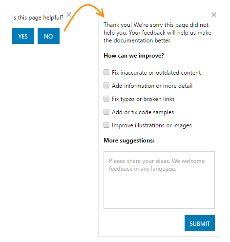
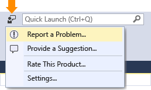
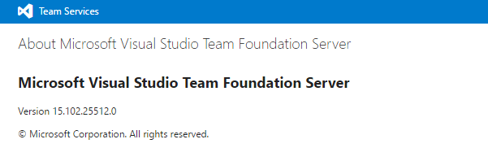

# Provide product and content feedback  

[!INCLUDE [temp](../work/_shared/dev15-version-header.md)] 

We welcome your feedback. Tell us your ideas for improving our content or products. 

If you have product feedback&mdash;such as a feature request, complaint, or bug&mdash;you'll want to go to the right place to enter it. Or, post a question or search one of the forums to find your answer.  

Here are the quick-access links to use:

> [!div class="mx-tdBreakAll"]  
> |Content feedback  |Product feedback  |Service & support |  Community forums  | 
> |-------------|----------|---------|---------|  
> |- [Rate a topic](#content-feedback)<br/>-[Provide feedback](#content-feedback)<br/><br/>**Blogs & videos**<br/>- [Visual Studio](https://blogs.msdn.microsoft.com/visualstudio/)<br/>- [devops](https://blogs.msdn.microsoft.com/visualstudioalm/)<br/>- [Brian Harry's](https://blogs.msdn.microsoft.com/bharry/)<br/>- [TFS support](https://blogs.msdn.microsoft.com/tfssetup/)<br/>- [DevOps videos](https://channel9.msdn.com/DevOps) |- [VSTS](http://visualstudio.uservoice.com/forums/330519-team-services)<br/>- [TFS](http://visualstudio.uservoice.com/forums/330519-team-services)<br/>- [Visual Studio](https://visualstudio.uservoice.com/forums/121579-visual-studio)<br/>- [Visual Studio Code](http://visualstudio.uservoice.com/forums/293070-visual-studio-code)<br/>- [Visual Studio Feedback Center](http://developercommunity.visualstudio.com/) |- [Service issue](https://support.microsoft.com/en-us/getsupport?tenant=ClassicCommercial&locale=en-us&supportregion=en-us&pesid=15339&oaspworkflow=start_1.0.0.0&ccsid=636036154608504739)<br/>- [Subscriber support](https://www.visualstudio.com/en-us/support/subscription-support-vs)<br/>- [Billing support](https://portal.azure.com/#blade/Microsoft_Azure_Support/HelpAndSupportBlade)<br/>- [Product downloads](https://www.visualstudio.com/downloads/download-visual-studio-vs)<br/>- [VSTS status](https://blogs.msdn.microsoft.com/vsoservice/)<br/>- [Azure status](https://azure.microsoft.com/en-us/status/)<br/>-[Licensing white paper](https://www.microsoft.com/EN-US/privacystatement/OnlineServices/Default.aspx)<br/>- [Privacy policy](https://www.microsoft.com/EN-US/privacystatement/OnlineServices/Default.aspx) |- [Visual Studio](https://social.msdn.microsoft.com/Forums/vstudio/en-US/home)<br/>- [VSTS & TFS](https://social.msdn.microsoft.com/Forums/vstudio/en-US/home?forum=TFService)<br/>- [General](https://social.msdn.microsoft.com/Forums/vstudio/home?forum=tfsgeneral)<br/>- [Source code & version control](https://social.msdn.microsoft.com/Forums/vstudio/home?forum=tfsversioncontrol)<br/>- [Project management & work items](https://social.msdn.microsoft.com/Forums/vstudio/home?forum=tfsworkitemtracking)<br/>- [Process templates](https://social.msdn.microsoft.com/Forums/vstudio/home?forum=tfsprocess)<br/>- [Reporting](https://social.msdn.microsoft.com/Forums/vstudio/home?forum=tfsreporting)<br/>- [Build & release management](https://social.msdn.microsoft.com/Forums/vstudio/home?forum=tfsbuild)<br/>- [Eclipse & cross platform](https://social.msdn.microsoft.com/Forums/vstudio/home?forum=tee)<br/>-[Setup & administration](https://social.msdn.microsoft.com/Forums/vstudio/home?forum=tfsadmin)<br/>- [Stack Overflow, VSTS](http://stackoverflow.com/questions/tagged/vs-team-services)<br/>- [Stack Overflow, TFS](http://stackoverflow.com/questions/tagged/tfs) | 


> [!NOTE]   
> This topic primarily supports users of VSTS and Team Foundation Server. For similar content for using Visual Studio, see [Talk to us](https://docs.microsoft.com/visualstudio/ide/how-to-report-a-problem-with-visual-studio-2017)   


 


## Content feedback  

Help us improve our content by rating it and giving us feedback. 

&#160;&#160;&#160;*Can't find an answer you're looking for?*<br/> 
&#160;&#160;&#160;*Want more detailed examples?*<br/> 
&#160;&#160;&#160;*Want to know if a specific version is supported?* 

Use our content feedback channel to let us know (Is this page helpful?) located at the bottom-right of the page. This button appears for all topics under visualstudio.com/docs. If you're looking for an answer and you can't find it, let us know and we'll work to update the topic with an answer. Simply click Yes or /No to rate the topic and fill out the form. 

  

About half of the feedback we get is product related. Customers want to know if a feature is supported, or they suggest a new feature. If that's what you want to do, we suggest you submit a request for a new feature through our [UserVoice channel](http://visualstudio.uservoice.com/forums/330519-team-services), or ask a question in one of our [forums](https://social.msdn.microsoft.com/Forums/vstudio/home?forum=TFService) to learn if a feature is supported. 

### Print a topic 

You can print most topics using your browser's print function. Most of the latest browser versions for Edge  and Chrome provide various options to simplify the contents prior to printing. These browsers also support saving the topic as a pdf file.   
 
## Product feedback, report an issue  

You can provide feedback for any Visual Studio product at the [Developer Community](https://developercommunity.visualstudio.com/). Or, from within Visual Studio, you can report a problem and review other trending issues. 



To learn more about reporting a problem, see [Report a problem with Visual Studio](https://docs.microsoft.com/visualstudio/ide/how-to-report-a-problem-with-visual-studio-2017)  
 
 
## Learn about the latest updates 

Every three weeks or so we update VSTS and provide a summary of new and updated features through our [Product features timeline](https://www.visualstudio.com/news/release-archive-vso). 

<a id="platform-version">  </a>
## Platforms and version support 

We add new features all the time, especially to our VSTS cloud offering. Later, most of these features make there way into our on-premises TFS product. To learn about whats new and coming, check out the [Features timeline pages](https://www.visualstudio.com/en-us/news/release-archive-vso). 

Our content supports both platforms&mdash;VSTS and TFS&mdash; and multiple versions of TFS. At the top of each topic, you'll see a platform/version heading to alert you as to which platforms and versions are supported. For example: 

  

In general, a feature is supported for all subsequent versions of TFS, unless specifically noted. Some topics include a link to previous versions which describe how the feature worked for an earlier version of TFS. 

If the platform-version heading is missing, and you're unsure of whether it's supported, click the Yes/No link and let us know through our content feedback channel. 
  
### What platform/version am I using? 

You can tell what platform you use from the URL you use to connect to VSTS or TFS. 

**VSTS**
A VSTS URL consists of an account name and visual studio.com, for example: ```https://{youraccount}.visualstudio.com```.  

To learn the version number, enter the following address in a web browser:     
```
https://AccountName.visualstudio.com/_home/About
```  
A page similar to the one shown will open showing the version number.  

  


**TFS**  

A TFS URL consists of a server name and collection, for example: ```https://ServerName:8080/tfs/CollectionName```.  

To learn the version number, enter the following address in a web browser:
```
https://ServerName:8080/tfs/_home/About
```
A page similar to the one shown will open showing the version number.  

  


|&#160;&#160;TFS release&#160;&#160;|&#160;&#160;Update&#160;&#160;|&#160;&#160;Version number&#160;&#160;| 
|-------------|--------|----------------| 
|TFS 2017.1   | RTW | 15.112.26307.0 |
|TFS 2017   | RTW | 15.105.25910.0 |
|TFS 2017   | RC1 | 15.103.25603.0 | 
|TFS 2015   | Update 3 | 14.102.25423.0 | 
|  | Update 2.1 | 14.95.25229.0  | 
|   | Update 2  | 14.95.25122.0  | 
|   | Update 2 RC 2  | 14.95.25029.0  | 
|   | Update 2 RC 1  | 14.95.25005.0  | 
|   | Update 1  | 14.0.24712.0  | 
|   | Update 1 RC 2  | 14.0.24626.0  | 
|   | Update 1 RC 1  | 14.0.24606.0  | 
|   | RTM  | 14.0.23128.0  | 
|   | RC2  | 14.0.23102.0  | 
|   | RC  | 14.0.22824.0  | 
|   | CTP  | 14.0.22604.0  | 
| TFS 2013  | Update 5  | 12.0.40629.0 | 
|   | Update 4  | 12.0.31101.0 | 	
|   | Update 4 RC  | 12.0.31010.0 | 	
|   | Update 3  | 12.0.30723.0 | 
|   | Update 3 RC | 12.0.30626.0 | 
|   | Update 2  | 12.0.30324.0 | 
|   | RTM  | 12.0.21005.1 | 
|   | RC  | 12.0.20827.3 | 
| TFS 2012  | Update 4  | 11.0.61030.0| 
|   | Update 3  | 11.0.60610.1 | 
|   | Update 2 | 11.0.60315.1 | 
|   | CU 1  | 11.0.60123.100 | 
|   | Update 1  | 11.0.51106.1| 
|   | RTM   | 11.0.50727.1 | 
| TFS 2010 |  CU 2  | 10.0.40219.371 | 
|   | SP1  | 10.0.40219.1| 
|   | RTM   | 10.0.30319.1| 
| TFS 2008|  SP1  | 9.0.30729.1 | 
|           | RTM   | 9.0.21022.8| 
| TFS 2005 | SP1    | 8.0.50727.762| 
|          |  RTM  | 8.0.50727.147| 


<!---
TFS 2015 is associated with version number beginning with 14: 

TFS 2015: Version 14


Version 14.95.25122.0  

Version 15.102.25507.0
-->


## Developer community - get involved 
You can view code from other developers and share your own examples using these websites:  

- [Github, Microsoft repo](https://github.com/Microsoft): Open source git hub repository from Microsoft
- [Github, Microsoft Azure repo](https://github.com/Azure ): APIs, SDKs and open source projects from Microsoft Azure
- [Developer code samples](https://code.msdn.microsoft.com/): Download code samples and applications for Windows 8, Windows Phone, Microsoft Azure, Office, SharePoint, Silverlight and other products. You can also explore the Official Visual Studio C#, VB.NET, and 101 LINQ samples.
- [CodePlex](http://www.codeplex.com/): Microsoft's free open source project hosting site. You can create projects to share with the world, collaborate with others on their projects, and download open source software.

 
## Related notes 
- [Report a problem with Visual Studio](https://docs.microsoft.com/visualstudio/ide/how-to-report-a-problem-with-visual-studio-2017)  
