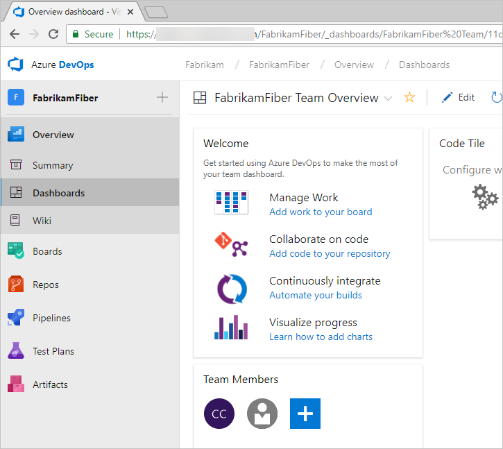
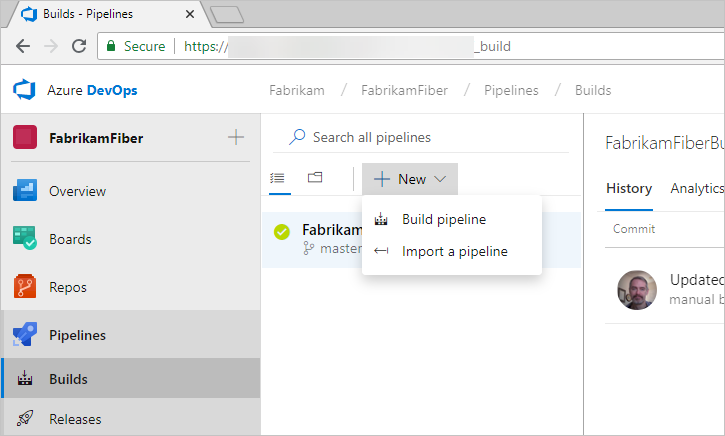
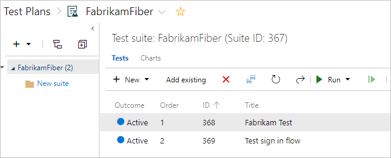
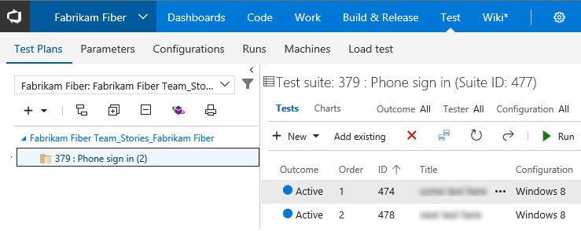
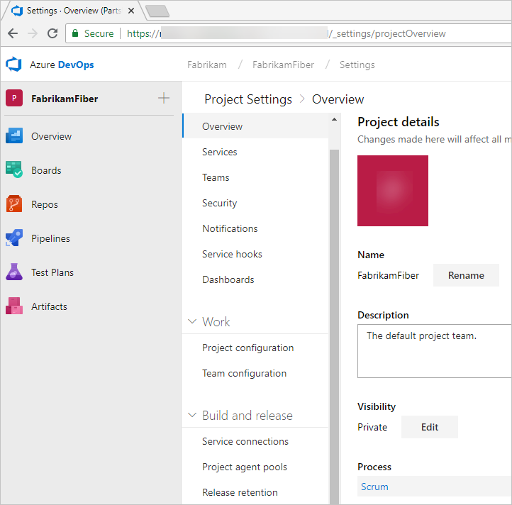
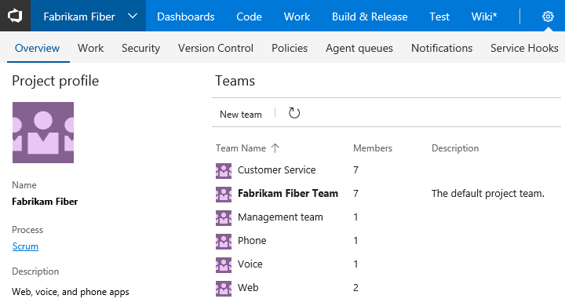

# What features and services do I get with Azure DevOps and TFS?

[!INCLUDE [temp](../_shared/version-vsts-tfs-all-versions.md)]

With Azure DevOps Services and Team Foundation Server (TFS), you gain an integrated set of services and tools to manage your software projects, from planning and development through testing and deployment. Services are delivered through a client/server model. Many of them are delivered through an easy-to-use web interface that you can access from all major browsers. Some services, such as source control, build pipelines, and work tracking, can also be managed through a client.  

Access web services through the following areas, as shown in the following image.

::: moniker range=">= azure-devops-2019"

::: moniker-end

::: moniker range="<= tfs-2018"

  

::: moniker-end

Many of our services are either free for small teams or available through a subscription model or per-use model. You can exercise a hybrid approach where you use on-premises TFS to manage your code and work, and you purchase cloud build or testing services on an as-needed basis.  

For information about client tools, see [Tools](tools.md).

<!---
###Video overview
 (Video ala Robert's 1.5 min Commit)
-->

## Dashboards

From **Dashboards**, you gain access to user-configurable dashboards.

::: moniker range=">= azure-devops-2019"

::: moniker-end

::: moniker range="<= tfs-2018"

::: moniker-end

You can perform the following tasks in **Dashboards**:

- Add, configure, and manage dashboards
- Configure widgets that you add to dashboards
- Quickly navigate to different areas of your project

To learn more, see [Dashboards](../report/dashboards/dashboards.md).

## Source control

::: moniker range=">= azure-devops-2019"

From **Repos**, you gain access to your source control Git-based or Team Foundation Version Control (TFVC) repositories to support version control of your software projects. These repositories are private.

::: moniker-end

::: moniker range="<= tfs-2018"

From **Code**, you gain access to your source control Git-based or TFVC repositories to support version control of your software projects. These repositories are private.

::: moniker-end

From Azure Repos for Git, you can perform the following tasks:

- Review, download, and edit files, and review the change history for a file  
- Review and manage commits that have been pushed
- Review, create, approve, comment on, and complete pull requests  
- Add and manage Git tags

To learn more, see the overviews for [Git](../repos/git/overview.md) or [TFVC](../repos/tfvc/overview.md).

## Plan and track work

::: moniker range=">= azure-devops-2019"

From **Boards**, you gain access to Agile tools to support planning and tracking work.

::: moniker-end

::: moniker range="<= tfs-2018"

From **Work**, you gain access to Agile tools to support planning and tracking work.

::: moniker-end

Specifically, you can perform the following tasks:

- Add and update work items
- Define work item queries, and create status and trend charts based on those queries
- Manage your product backlog
- Plan sprints by using sprint backlogs
- Review sprint tasks and update tasks through the task boards
- Visualize the workflow and update the status by using Kanban boards
- Manage portfolios by grouping stories under features and grouping features under epics

See [Backlogs, boards, and plans](../boards/backlogs/backlogs-boards-plans.md) for an overview of each.

## Continuous integration and deployment  

::: moniker range=">= azure-devops-2019"

**Azure Pipelines** provides an integrated set of features to support building and deploying your applications.

::: moniker-end

::: moniker range="<= tfs-2018"

**Azure Pipelines** provides an integrated set of features to support building and deploying your applications.

::: moniker-end

Use pipelines to implement continuous integration and continuous delivery.

- **Build automation**: Define the steps to take during build and the triggers that initiate a build.
- **Release management**: Supports a rapid release cadence and management of simultaneous releases. You can configure release pipelines that represent your environments from development to production. Run automation to deploy your app to each environment. Add approvers to sign off that the app has been successfully deployed in an environment. Create your release manually or automatically from a build. Then track your releases as they are deployed to various environments.

To learn more, see [Continuous integration on any platform](../pipelines/overview.md).

## Manual, exploratory, and load testing  

Test features support manual and exploratory testing, load or performance testing, and continuous testing.  

::: moniker range=">= azure-devops-2019"

**Test Plans** supports creating and managing manual tests.

::: moniker-end

::: moniker range="<= tfs-2018"

**Test** supports creating and managing manual tests.

::: moniker-end

With test features, you gain access to the following features:

- Customization of workflows with test plan, test suite, and test case work items  
- End-to-end traceability from requirements to test cases and bugs with requirement-based test suites  
- Criteria-based test selection with query-based test suites
- Excel-like interface with the grid for easy creation of test cases  
- Reusable test steps and test data with shared steps and shared parameters
- Sharable test plans, test suites, and test cases for reviewing with stakeholders  
- Browser-based test execution on any platform  
- Real-time charts for tracking test activity 

To learn more, see [Testing overview](../test/index.md).

## Collaboration services

The following services work across the previously mentioned services to support:

::: moniker range=">= azure-devops-2019"

- Team dashboards
- Project wiki
- Discussion within work item forms
- Linking of work items, commits, pull requests, and other artifacts to support traceability
- Alerts and change notifications managed per user, team, project, or organization
- Ability to request and manage feedback
- Analytics service, analytic views, and Power BI reporting

::: moniker-end

::: moniker range="tfs-2018"

- Dashboards 
- Project wiki
- Discussion within work item forms
- Linking of work items, commits, pull requests, and other artifacts to support traceability
- Alerts and change notifications managed per user, team, project, or project collection
- Ability to request and manage feedback
- SQL Server Reporting

::: moniker-end

::: moniker range="tfs-2017"

- Dashboards
- Discussion within work item forms
- Linking of work items, commits, pull requests and other artifacts to support traceability
- Alerts and change notifications managed per user, team, project, or project collection  
- Ability to request and manage feedback
- Team (chat) rooms
- SQL Server Reporting

> [!NOTE]  
> Team rooms are deprecated for TFS 2017.2. Instead, we recommend that you [use service hooks to integrate with Microsoft Teams](../service-hooks/services/teams.md).
::: moniker-end

::: moniker range="tfs-2015"

- Dashboards
- Linking of work items, commits, pull requests, and other artifacts to support traceability
- Alerts and change notifications managed per user or for teams  
- Ability to request and manage feedback
- Team (chat) rooms
- SQL Server Reporting

::: moniker-end

::: moniker range="tfs-2013"

- Team home page  
- Linking of work items, commits, pull requests, and other artifacts to support traceability
- Alerts and change notifications managed per user or for teams  
- Ability to request and manage feedback
- Team (chat) rooms
- SQL Server Reporting

::: moniker-end

## Service hooks

Service hooks enable you to perform tasks on other services when events happen within your project hosted on Azure DevOps Services or TFS. For example, you can send a push notification to your team's mobile devices when a build fails. Service hooks can also be used in custom apps and services as a more efficient way to drive activities when events happen in your projects.

The following services are available as the target of service hooks. To learn about other apps and services that integrate with Azure DevOps Services or TFS, visit the [Visual Studio Marketplace](https://marketplace.visualstudio.com/azuredevops), Azure DevOps tab.

For the latest set of supported services, see [Integrate with service hooks](../service-hooks/index.md).

## Cloud-hosted services based on usage

The following services support your DevOps operations:

- Cloud-based, Microsoft-hosted build and deployment agents  
- On-premises self-hosted agents to support build and deployment  
- Cloud-based performance/load testing so you can load test your code by simulating high traffic  

To learn more, see [Pricing](https://visualstudio.microsoft.com/team-services/pricing/).

## Azure cloud-hosted services

Azure provides cloud-hosted services to support application development and deployment. You can make use of these services solely or in combination with Azure DevOps Services or TFS.

To browse the directory of integrated services, features, and bundled suites, see [Azure products](https://azure.microsoft.com/services/).  

For continuous delivery to Azure from Azure DevOps Services, see [Automatically build and deploy to Azure web apps or cloud services](https://azure.microsoft.com/documentation/articles/cloud-services-continuous-delivery-use-vso/).

## Administrative services

There are features and tasks associated with administering a collaborative software development environment. You perform most of these tasks through the web portal. To learn more, see [About user, team, project, and organization-level settings](../organizations/settings/about-settings.md).

::: moniker range=">= azure-devops-2019"

::: moniker-end

::: moniker range="<= tfs-2018"

::: moniker-end

## Related articles

- [Understand differences between Azure DevOps Services and TFS](about-azure-devops-services-tfs.md)
- [Key concepts](concepts.md)  
- [Client-server tools](tools.md)
- [Software development roles](roles.md)  
- [Pricing](https://visualstudio.microsoft.com/team-services/pricing/)
- [Azure DevOps data protection overview](../articles/team-services-security-whitepaper.md)

<!---
**System Center integration**: Enables a release pipeline to connect to a System Center Virtual Machine Manager (SCVMM) server to easily provision virtual machines and perform actions on them such as managing checkpoints, starting and **VMware Resource Deployment**: Connect to a VMware vCenter Server from Azure DevOps Services or TFS to provision, start, stop, or snapshot VMware virtual machines. 
-->
