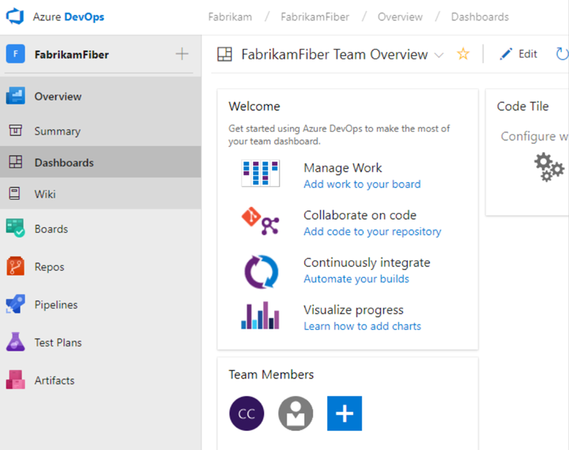

# Overview of services

[!INCLUDE [version-lt-eq-azure-devops](../includes/version-lt-eq-azure-devops.md)]

Azure DevOps offers a spectrum of service models to accommodate the unique needs of every team, from free access for small teams to versatile subscription and pay-per-use plans for comprehensive project management.

- **End-to-end project management:** Azure DevOps stands as a cohesive suite of services designed to support the complete lifecycle of your software projects. It encompasses everything from initial planning and development, through rigorous testing, to final deployment.

- **Client/server model delivery:** Azure DevOps operates on a client/server model, offering flexibility in how you interact with its services. The web interface, compatible with all major browsers, provides a convenient way to utilize most services. Additionally, certain services like source control, build pipelines, and work tracking offer client-based management options for enhanced control.

- **Flexible and scalable service options:**
  - Azure DevOps caters to teams of all sizes by offering a range of service options. For small teams, many services are complimentary, ensuring that you have access to robust project management tools without any initial investment.
  - For larger teams or more advanced needs, services are accessible through a subscription model or on a pay-per-use basis. This flexibility allows you to scale your usage according to project demands and budget constraints.
  - Hybrid approach: Embrace the best of both worlds with Azure DevOps’ hybrid model. Manage your code and tasks using an on-premises deployment for maximum control and security. When you need more resources, tap into cloud-based build or testing services. This approach ensures you only pay for what you use, optimizing your operational efficiency.

- **Azure DevOps navigation:** The left navigational bar in Azure DevOps is your gateway to its extensive features. It allows for intuitive access and management of the various services provided.

    :::row:::
       :::column span="1":::  
          :::image type="content" source="../organizations/projects/media/about-projects/services-hubs-vert.png" alt-text="Screenshot of services on the left navigational menu.":::
       :::column-end:::
       :::column span="1":::
    - [Dashboards](../report/dashboards/overview.md) 
    - [Wiki](../project/wiki/about-readme-wiki.md)
    - [Boards](../boards/get-started/what-is-azure-boards.md)
    - [Repos](..//repos/get-started/what-is-repos.md)
    - [Pipelines](../pipelines/get-started/pipelines-get-started.md)
    - [Test Plans](../test/overview.md)
    - [Artifacts](../artifacts/start-using-azure-artifacts.md)
    :::column-end:::
    :::row-end:::

For more information, see [Tools and clients that connect to Azure DevOps](tools.md).

## Dashboards

Azure DevOps provides a powerful dashboard interface that allows you to create a personalized view of your project’s data and workflows. Here’s how you can make the most of the Dashboards feature:

- **Add, configure, and manage dashboards:** Create multiple dashboards to reflect different aspects of your project. You can customize each dashboard by adding and arranging various widgets that display project data in real-time.
- **Configure widgets:** Enhance your dashboards with widgets that provide insights into your project. Choose from a wide range of widgets to display information such as build status, test results, and work item queries.
- **Navigate quickly:** Use dashboards as a central hub for navigating to various areas of your project. Set up links and shortcuts that allow you to access important sections of Azure DevOps with just a selection.
- **Use extensibility points:** Use Azure DevOps extensibility points to further customize your dashboards. You can add new capabilities by integrating non-Microsoft services or creating your own extensions1.

For more information, see the [Dashboards documentation](../report/dashboards/dashboards.md).

## Boards

In the dynamic world of software development, efficient information sharing and meticulous tracking of work, tasks, issues, and code defects are essential. While tools like Microsoft Excel, Microsoft Project, or various bug tracking systems were used historically, the adoption of Agile methodologies revolutionizes planning and development processes.

**Azure Boards provides the following Agile tools designed to streamline planning and tracking across your projects:**

- **Work item management:** Seamlessly add and update various work items to keep your project organized and on track.
- **Queries and charts:** Define custom queries for work items and generate insightful status and trend charts to visualize progress.
- **Backlog handling:** Efficiently manage your product backlog, ensuring that priorities are clear and actionable.
- **Sprint planning:** Utilize sprint backlogs to plan and execute sprints with precision, aligning your team’s efforts with project goals.
- **Task board utilization:** Review and update sprint tasks through interactive task boards that reflect real-time changes.
- **Workflow visualization:** Monitor your project’s workflow and update statuses using intuitive boards that provide a clear view of the development pipeline.
- **Portfolio management:** Organize your work hierarchically, grouping user stories under features and features under epics to maintain a structured overview.
- **Scrum meetings:** Use task boards during daily Scrum meetings to assess completed, remaining, or blocked work, fostering a collaborative and responsive team environment.

Azure Boards supports various work item types, each associated with a specific set of fields that can be updated as progress is made. These work types give you a tailored approach to tracking different aspects of your project.

**Agile support:** Whether you’re practicing Scrum, Kanban, or Scrumban, Azure Boards offers backlogs and boards to facilitate these methodologies, empowering your team to deliver results effectively.

Project managers and developers can share information and track progress using the comprehensive backlogs and boards. Azure Boards provides a complete picture of your project’s status, enabling teams to monitor trends and make informed decisions.

For an in-depth understanding of how backlogs, boards, and plans can transform your project management experience, see [Backlogs, boards, and plans](../boards/backlogs/backlogs-boards-plans.md)

## Repos

Source or version control systems are pivotal in enabling developers to collaborate seamlessly on codebases and maintain a comprehensive history of changes. These systems are indispensable for projects involving multiple developers, ensuring consistency and coordination throughout the development process.

:::image type="content" source="media/repos-git-hub.png" alt-text="Screenshot of Azure Repos landing page.":::

Azure DevOps supports two primary types of source control to suit diverse project needs, [Git](../repos/git/index.yml) and [Team Foundation Version Control (TFVC)](../repos/tfvc/index.yml).

### Git

Git is a version control system where each developer has a local copy of the entire repository, which allows for offline work and easy branching and merging. Git is the default choice for new projects and is recommended for its flexibility and robustness1.

> [!NOTE]
> Git in Azure DevOps is standard Git. You can use Visual Studio with third-party Git services. You can also use third-party Git clients with Azure DevOps Server.

**You can do the following tasks with Azure Repos for Git:**

- **Review files:** Examine the details and history of changes made to each file within your repository.
- **Download and edit files:** Obtain a local copy of files from the repository and make necessary modifications.
- **Manage commits:** Keep track of commits pushed to the repository, ensuring a clear history of code changes.
- **Use pull requests:** Participate in the collaborative code review process by creating, approving, commenting on, and completing pull requests.
- **Use Git tags:** Organize and mark specific points in your repository’s history using Git tags for easy reference.

### TFVC

Team Foundation Version Control (TFVC) is a centralized version control system that simplifies code management. Developers work with a single version of each file on their local machines, while the server retains the full history of changes, providing a single source of truth.

**TFVC includes the following key features:**

- **Single version workflow:** Each developer’s machine holds the current version of files, reducing complexity and ensuring consistency across the team.
- **Server-side history:** All historical data, including changes and versions, are securely stored on the server, preserving the integrity of your project’s evolution.
- **Path-based branching:** Branches are created and managed on the server using a path-based approach, allowing for clear organization and straightforward merging processes.

## Pipelines

Achieving rapid and reliable software releases is a hallmark of modern development practices, and Azure Pipelines stands at the forefront of this endeavor by automating the build, test, and release processes.

- **Automated builds:** Set up your Azure Pipelines to trigger automated builds upon code check-ins, ensuring that every change is promptly integrated and verified.
- **Test integration:** Incorporate test runs post-build to validate changes, maintaining high code quality and detecting issues early.
- **Release pipelines:** Manage the deployment of your software builds across various environments, from staging to production, with Azure Pipelines’ robust release management capabilities.

**Azure Pipelines includes the following features:**

- **Continuous integration (CI):** Implement CI to automatically merge code changes into a central repository, followed by automated builds and tests.
- **Continuous delivery (CD):** Ensure that your software can be reliably released at any time with CD practices, streamlining the path from development to production.
- **Build automation:** Customize your build process with defined steps and triggers, creating a consistent and repeatable build environment.
- **Release management:** Oversee simultaneous releases with configurable release pipelines that mirror your development lifecycle, from development environments to production.
- Deployment Automation: Automate the deployment process, reducing manual efforts and the potential for errors.
- **Approval workflows:** Integrate approval workflows to validate successful deployments, adding a layer of verification before promoting builds.
- **Release tracking:** Monitor your releases as they progress through different environments, gaining visibility into the deployment pipeline.

For a detailed guide on implementing continuous integration and delivery with Azure Pipelines, see [Continuous integration on any platform](../pipelines/get-started/what-is-azure-pipelines.md).

> [!div class="mx-imgBorder"] 
> 

## Test Plans

Azure Test Plans is a comprehensive service designed to facilitate the creation, management, and execution of various testing methodologies, including manual, exploratory, and automated tests.

**Azure Test Plans includes the following key features:**

- **Workflow customization:** Tailor your testing workflow with customizable test plans, suites, and cases, ensuring alignment with your project’s needs.
- **Traceability:** Achieve end-to-end traceability, linking requirements directly to test cases and bugs, with requirement-based test suites.
- **Test selection:** Utilize query-based test suites for criteria-based test selection, streamlining the testing process.
- **User-friendly interface:** Benefit from an Excel-like grid interface, simplifying the creation and management of test cases.
- **Reusable elements:** Enhance efficiency with reusable test steps and shared parameters, promoting consistency across tests.
- **Collaboration:** Share test plans, suites, and cases with stakeholders for review and feedback, fostering a collaborative testing environment.
- **Cross-platform execution:** Execute tests directly from your browser on any platform, which offers flexibility and convenience.
- **Activity monitoring:** Monitor testing activities with real-time charts, providing visibility into test progress and outcomes.

For a detailed exploration of how Azure Test Plans can streamline your testing processes, see the[Azure Test Plans documentation](../test/index.yml).

## Collaboration services

Azure DevOps enhances team collaboration through the following services designed to streamline communication and project tracking:

**[Team dashboards](../report/dashboards/dashboards.md):** Create and customize dashboards to provide your team with real-time visibility into project metrics and progress.
- **[Project wiki](../project/wiki/manage-wikis.md):** Document your project’s details, guidelines, and knowledge base in a centralized, easily accessible wiki.
- **[Work item discussions:](../boards/work-items/work-item-fields.md):** Facilitate conversations directly within work item forms, enabling contextual and timely communication.
- **Traceability links:** Establish links between [work items](../boards/backlogs/add-link.md), [commits](../repos/git/commits.md), [pull requests](../repos/git/pull-requests.md), and more, ensuring comprehensive traceability across your project.
- **[Alerts and notifications](../organizations/notifications/about-notifications.md):** Set up personalized alerts and change notifications to keep team members informed about project updates and changes.
Feedback management: Streamline the process of [requesting](../test/request-stakeholder-feedback.md), [providing](provide-feedback.md), and managing feedback to continuously improve project outcomes.
- **[Analytics](../report/powerbi/analytics-security.md) and [Reporting](../report/powerbi/access-analytics-power-bi.md):** Use the analytics service and Power BI reporting for insights into project performance and make data-driven decisions.

These collaboration services are integral to maintaining a cohesive and informed team, capable of responding swiftly to project demands and opportunities.

## Service hooks

Service hooks in Azure DevOps empower you to automate and streamline interactions with other services, responding swiftly to events within your projects. For instance, you can configure service hooks to send immediate push notifications to your team’s devices if a build process encounters an error.

**Utilize service hooks in the following ways:**

- **Custom apps integration:** Integrate service hooks with your custom applications to initiate actions automatically, enhancing efficiency, and project responsiveness.
- **Service targets:** Designate various services as targets for your service hooks, allowing for a wide range of automated responses to project events.
For a comprehensive list of services that can be integrated with Azure DevOps via service hooks, and to explore other apps and services that complement Azure DevOps, see the [Visual Studio Marketplace](https://marketplace.visualstudio.com/azuredevops). To stay updated on the newest services supported by service hooks, see the [Integrate with service hooks](../service-hooks/overview.md) documentation.

## Azure cloud-hosted services

Azure offers a robust array of cloud-hosted services that are essential for the development and deployment of applications. These services can be utilized independently or with Azure DevOps to create a seamless workflow.

**Key benefits:**

- **Comprehensive support:** Azure’s services provide the infrastructure and platform support necessary for the entire application lifecycle.
- **Integration with Azure DevOps:** Combine these services with Azure DevOps for an integrated experience that covers source control, CI/CD, and more.

To explore the full range of services, features, and suites that integrate seamlessly with your development process, see the [Azure products](https://azure.microsoft.com/services/) directory. 

## Administrative services

Managing a collaborative software development environment is streamlined with Azure DevOps, which offers various features and tasks tailored for administration. These tools are designed to facilitate the oversight of your projects and teams effectively.

**Accessible administration:**

- **Web portal management:** Perform most administrative tasks conveniently through the Azure DevOps web portal, ensuring you have control at your fingertips.
- **Comprehensive settings:** Access detailed settings for users, teams, projects, and organizations, allowing for granular management of your development environment.

For a deeper understanding of the administrative capabilities available to you, including how to configure and manage various levels of settings, see [About user, team, project, and organization-level settings](../organizations/settings/about-settings.md). 

## Related articles

- [Azure DevOps Services **vs.** Azure DevOps Server](about-azure-devops-services-tfs.md)
- [Client-server tools](tools.md)
- [Software development roles](roles.md)  
- [Azure DevOps pricing](https://azure.microsoft.com/pricing/details/devops/azure-devops-services/)
