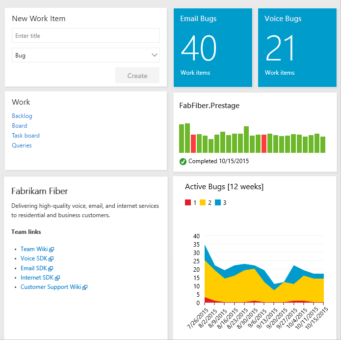

# What do I get with VSTS or TFS?
 
[!INCLUDE [temp](../_shared/version-vsts-tfs-all-versions.md)]

With VSTS and TFS, you gain an integrated set of services and tools to manage your software projects, from planning and development through testing and deployment. Services are delivered through a client-server model, many of which are delivered through an easy-to-use web interface that you can access from all major browsers. Some services, such as source control, build pipelines, and work tracking can also be managed through a client.  

Web services are access through the following main hubs as shown in the following image.

  

Many of our services are either free for small teams or available through a subscription model or per use model. Where needed, you can exercise a hybrid approach where you use an on-premises TFS to manage your code and work, and purchase cloud build or testing services on an as needed basis.  

For information about client tools, see [Tools](tools.md).

<!---
###Video overview
 (Video ala Robert's 1.5 min Commit)
-->

## Dashboards

From the **Dashboards** hub you gain access to user-configurable dashboards.   

Tasks you can perform in this hub include:

- Add, configure, and manage dashboards   
- Configure widgets that you add to dashboards 	
- Quickly navigate to different areas of your team project 
 

To learn more, see [Dashboards](../report/dashboards/dashboards.md). 

## Code

From the **Code** hub you gain access to your source control Git-based or TFVC repositories to support version control of your software projects. These repositories are private.   

From the Code hub for Git you can perform these tasks:

- Review, download, and edit files and review the change history for a file  
- Review and manage commits that have been pushed       
- Review, create, approve, comment, and complete pull requests  
- Add and manage Git tags   

To learn more, see the overviews for [Git](../repos/git/overview.md) or [TFVC](../repos/tfvc/overview.md). 

## Plan and track work

From the **Work** hub you gain access to Agile tools to support planning and tracking work. 

Specifically, from the **Work** you can perform these tasks:

- Add and update work items 
- Define work item queries and create status and trend charts based on those queries 			
- Manage your product backlog   					
- Plan sprints using sprint backlogs 
- Review sprint tasks and update tasks through the task boards				
- Visualize the work flow and update status using Kanban boards	 				
- Manage portfolios by grouping stories under features and features under epics   

See [Backlogs, boards, and plans](../work/backlogs/backlogs-boards-plans.md) for an overview of each.   
 
## Build & Release

The **Build & Release** hub provides an integrated set of features to support building and deploying your applications. 

Use this hub to implement continuous integration and continuous delivery.

- **Build automation**: Define the steps to take during build and the triggers that will initiate a build. 
- **Release management**: Supports a rapid release cadence and management of simultaneous releases. You can configure release pipelines that represent your environments from development to production. Run automations to deploy your app to each environment. Add approvers to sign off that the app has been successfully deployed in an environment. Create your release manually or automatically from a build. Then track your releases as they are deployed to various environments.

To learn more, see [Continuous integration on any platform](../pipelines/overview.md). 

## Test

Test features support manual and exploratory testing, load or performance testing, and continuous testing.  Here we show the **Test** hub that support creating and managing manual tests.  

Test **Test** hub provides support for the following:

- Customization of workflows with test plan, test suite and test case work items  
- End-to-end traceability from requirements to test cases and bugs with requirement-based test suites  
- Criteria-based test selection with query-based test suites    
- Excel-like interface with the grid for easy test case creation  
- Reusable test steps and test data with shared steps and shared parameters   
- Sharable test plans, test suites and test cases for reviewing with stakeholders  
- Browser-based test execution on any platform  
- Real-time charts for tracking test activity.  

To learn more, see [Testing overview](../test/index.md).

## Collaboration services

In addition to the above "hub" services, the following services work across hubs to support:

- Linking of work items, commits, pull requests and other artifacts to support traceability
- Alerts and change notifications managed per user or for teams  
- Request and manage feedback   
- Team (chat) rooms 	 
- Reporting    						

>[!NOTE]  
>Team rooms are deprecated for TFS 2017.2. Instead, we recommend you [use service hooks to integrate with Microsoft Teams](../service-hooks/services/teams.md). 

## Service hooks

Service hooks enable you to perform tasks on other services when events happen within your team project hosted on VSTS or TFS. For example, you can send a push notification to your team's mobile devices when a build fails. Service hooks can also be used in custom apps and services as a more efficient way to drive activities when events happen in your projects.

The following services are available as the target of service hooks. To learn about others apps and services that integrate with our VSTS or TFS, visit the [Visual Studio Marketplace](https://marketplace.visualstudio.com)

For the latest set of supported services, see [Integrate with service hooks](../service-hooks/index.md)

## Cloud-hosted services based on usage   

The following services support your DevOps operations.

- Cloud-based build and deployment Microsoft-hosted agents  
- On-premises self-hosted agents to support build and deployment  
- Cloud-based performance/load testing lets you load test your code by simulating high traffic  

To learn more, see [Pricing](https://visualstudio.microsoft.com/team-services/pricing/).

## Azure services

Azure provides a number of cloud-hosted services to support application development and deployment. You can make use of these services solely or in combination with VSTS or TFS. 

To browse Azure's directory of integrated services, features, and bundled suites, see [Azure products](https://azure.microsoft.com/services/).  

For continuous delivery to Azure from VSTS, see [Automatically build and deploy to Azure web apps or cloud services](https://azure.microsoft.com/documentation/articles/cloud-services-continuous-delivery-use-vso/). 

## Administrative services

There are a number of features and tasks associated with administrating a collaborate software development environment. You perform most of these tasks through the web portal.   

> [!div class="mx-tdBreakAll"]  
> |Organization Management (VSTS)  | Administration (TFS)  | 
> |-------------|----------| 
> |- Manage users, access, and billing - Add and manage team projects and teams - Customize work tracking processes - Manage build retention policies - Add and manage build agent pools - Add and manage extensions|-Manage users, access, and permissions - Add and manage teams, team projects, and collections - Customize work tracking processes - Manage build retention policies - Add and manage build agent pools - Add and manage extensions - Configure an SMTP server (supports feedback requests and notification features) - Configure a backup schedule and manage database backups - Manage upgrades |

 
## Related notes

- [Key concepts](concepts.md)  
- [Client-server tools](tools.md) 
- [Software development roles](roles.md)  
- [Pricing](https://visualstudio.microsoft.com/team-services/pricing/)

<!---
**System Center integration**: Enables a release pipeline to connect to a System Center Virtual Machine Manager (SCVMM) server to easily provision virtual machines and perform actions on them such as managing checkpoints, starting and **VMware Resource Deployment**: Connect to a VMware vCenter Server from VSTS or TFS to provision, start, stop, or snapshot VMware virtual machines. 
-->
