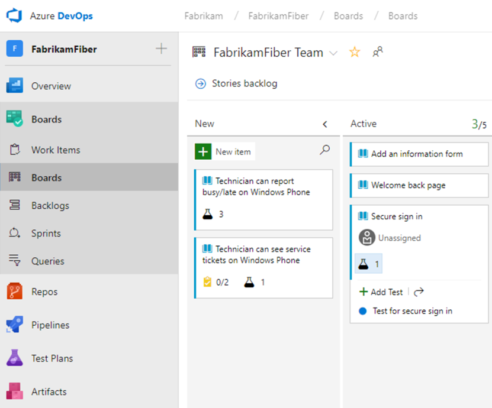
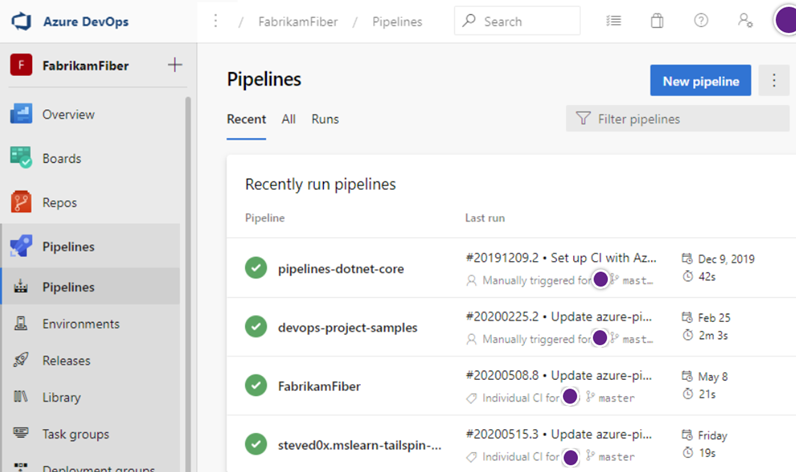

# Overview of services

[!INCLUDE [version-lt-eq-azure-devops](../includes/version-lt-eq-azure-devops.md)]

Azure DevOps provides an integrated set of services and tools to manage your software projects, from planning and development through testing and deployment. 

Azure DevOps delivers services through a client/server model. You can use most of the services via the web interface, which you can access from all major browsers. Some services, such as source control, build pipelines, and work tracking, can also be managed through a client.  

::: moniker range=">= azure-devops-2019"

Access Azure DevOps through the left navigational bar, as shown in the following image. 
For more information, see the following associated articles.

:::row:::
   :::column span="2":::  
      :::image type="content" source="../organizations/projects/media/about-projects/services-hubs-vert.png" alt-text="Screenshot of services on the left navigational menu.":::
   :::column-end:::
   :::column span="1":::
- [Dashboards](../report/dashboards/overview.md) 
- [Wiki](../project/wiki/about-readme-wiki.md)
- [Boards](../boards/get-started/what-is-azure-boards.md)
- [Repos](..//repos/get-started/what-is-repos.md)
- [Pipelines](../pipelines/get-started/pipelines-get-started.md)
- [Test Plans](../test/overview.md)
- [Artifacts](../artifacts/start-using-azure-artifacts.md)
:::column-end:::
:::row-end:::

::: moniker-end

::: moniker range="tfs-2018"
Access Azure DevOps through the top navigational bar, as shown in the following image. See the associated articles to jump to information for each major service.

 

- [Dashboards](../report/dashboards/overview.md) 
- [Repos](../repos/get-started/what-is-repos.md)
- [Boards](../boards/get-started/what-is-azure-boards.md)
- [Pipelines](../pipelines/get-started/pipelines-get-started.md)
- [Test Plans](../test/overview.md)
- [Wiki](../project/wiki/about-readme-wiki.md)
::: moniker-end

Many of our services are either free for small teams or available through a subscription model or per-use model. You can do a hybrid approach where you use an on-premises deployment to manage your code and work. Then, purchase cloud build or testing services on an as-needed basis.  

For more information about client tools, see [Tools and clients that connect to Azure DevOps](tools.md).
## Dashboards

Gain access to user-configurable dashboards from **Dashboards**.

::: moniker range=">= azure-devops-2019"

::: moniker-end

::: moniker range="tfs-2018"
:::image type="content" source="../report/dashboards/media/dashboard-view-with-widgets.png" alt-text="Screenshot of Dashboard overview.":::
::: moniker-end

You can do the following tasks in **Dashboards**:
- Add, configure, and manage dashboards
- Configure widgets that you add to dashboards
- Go to different areas of your project quickly

For more information, see [Dashboards](../report/dashboards/dashboards.md).

## Repos

Source or version control systems allow developers to collaborate on code and track changes made to the code base. Source control is an essential tool for multi-developer projects.

Our systems support two types of source control: [Git](../repos/git/index.yml) or [Team Foundation Version Control (TFVC)](../repos/tfvc/index.yml). You can check in files and organize files within folders, branches, and repositories in both systems.

### Git repos

With Git, each developer has a copy on their dev machine of the source repository, including all branch and history information. Each developer works directly with their own local repository and changes are shared between repositories as a separate step.

Developers commit each set of changes and do version control operations like history and compare without a network connection. When developers need to switch contexts, they create a private local branch, and can switch from one branch to another to pivot among different variations of the codebase. Later, they merge, publish, or dispose of the branch.

> [!NOTE]
> Git in Azure DevOps is standard Git. You can use Visual Studio with third-party Git services. You can also use third-party Git clients with Azure DevOps Server.

### TFVC

With TFVC, developers have only one version of each file on their dev machines. Historical data is maintained only on the server. Branches are path-based and created on the server.

### Access Git and TFVC

::: moniker range=">= azure-devops-2019"

From **Repos**, you gain access to your source control Git-based or Team Foundation Version Control (TFVC) repositories to support version control of your software projects. These repositories are private.

::: moniker-end

::: moniker range="tfs-2018"

From **Code**, you gain access to your source control Git-based or TFVC repositories to support version control of your software projects. These repositories are private.

:::image type="content" source="media/code-git-hub.png" alt-text="Screenshot of the Code, Git, files page.":::

::: moniker-end

From Azure Repos for Git, you can do the following tasks:

- Review, download, and edit files, and review the change history for a file  
- Review and manage commits that have been pushed
- Review, create, approve, comment on, and complete pull requests  
- Add and manage Git tags

## Boards

Software development projects require ways to easily share information and track the status of work, tasks, issues, or code defects. In the past, you might have used Microsoft Excel, Microsoft Project, a bug tracking system, or a combination of tools. Now, many teams have adopted Agile methods and practices to support planning and development.

::: moniker range=">= azure-devops-2019"

From **Boards**, you gain access to Agile tools to support planning and tracking work.

::: moniker-end

::: moniker range="tfs-2018"

From **Work**, you gain access to Agile tools to support planning and tracking work.

::: moniker-end

You can do the following tasks with boards.

- Add and update work items
- Define work item queries, and create status and trend charts based on those queries
- Manage your product backlog
- Plan sprints by using sprint backlogs
- Review sprint tasks and update tasks through the task boards
- Visualize the workflow and update the status by using Kanban boards
- Manage portfolios by grouping stories under features and grouping features under epics
- Use task boards during daily Scrum meetings to review work that's completed, remaining, or blocked

Our systems provide several types of work items that you use to track features, requirements, user stories, tasks, bugs, and issues. Each work item is associated with a work item type and a set of fields that can be updated, as progress is made.

For planning purposes, you have access to several types of backlogs and boards to support the main Agile methods—Scrum, Kanban, or Scrumban.

Project managers and developers share information by tracking work items on the backlogs and boards. Useful charts and dashboards complete the picture and help teams monitor progress and trends.

See [Backlogs, boards, and plans](../boards/backlogs/backlogs-boards-plans.md) for an overview of each.

## Pipelines

The rapid and reliable release of software comes from automating as many processes as possible. Our systems support build, test, and release automation.

- You can define builds to automatically run whenever a team member checks in code changes.
- Your build pipelines can include instructions to run tests after the build runs.
- Release pipelines support managing deployment of your software builds to staging or production environments.

::: moniker range=">= azure-devops-2019"
**Azure Pipelines** provides an integrated set of features to support building and deploying your applications.

> [!div class="mx-imgBorder"] 
> 
>
::: moniker-end

::: moniker range="tfs-2018"
**Azure Pipelines** provides an integrated set of features to support building and deploying your applications.

:::image type="content" source="media/services/build-release-hub.png" alt-text="Screenshot of build pipelines page.":::
::: moniker-end

Use pipelines to implement continuous integration and continuous delivery.
- **Build automation**: Define the steps to take during build and the triggers that start a build.
- **Release management**: Manage simultaneous releases. You can also do the following tasks:
    - Configure release pipelines that represent your environments from development to production
    - Run automation to deploy your app to each environment
    - Add approvers to confirm that the app has been successfully deployed in an environment
    - Create your release manually or automatically from a build
    - Track your releases as they're deployed to various environments

For more information, see [Continuous integration on any platform](../pipelines/get-started/what-is-azure-pipelines.md).

## Test Plans

::: moniker range=">= azure-devops-2019"

**Test Plans** supports creating and managing manual, exploratory, and continuous tests.

::: moniker-end

::: moniker range="tfs-2018"
**Test** supports creating and managing manual tests.

:::image type="content" source="media/services/test-hub.png" alt-text="Screenshot of Test hub.":::
::: moniker-end

With test features, you gain access to the following features:

- Customization of workflows with test plan, test suite, and test case work items  
- End-to-end traceability from requirements to test cases and bugs with requirement-based test suites  
- Criteria-based test selection with query-based test suites
- Excel-like interface with the grid for easy creation of test cases  
- Reusable test steps and test data with shared steps and shared parameters
- Sharable test plans, test suites, and test cases for reviewing with Stakeholders  
- Browser-based test execution on any platform  
- Real-time charts for tracking test activity

For more information, see [Azure Test Plans documentation](../test/index.yml).

## Collaboration services

Azure DevOps also provides the following collaboration services.

::: moniker range=">= azure-devops-2019"
- [Team dashboards](../report/dashboards/dashboards.md)
- [Project wiki](../project/wiki/manage-wikis.md)
- [Discussion within work item forms](../boards/work-items/work-item-fields.md)
- Linking of [work items](../boards/queries/link-work-items-support-traceability.md), [commits](../repos/git/commits.md), [pull requests](../repos/git/pull-requests.md), and other artifacts to support traceability
- [Alerts and change notifications](../organizations/notifications/about-notifications.md) managed per user, team, project, or organization
- Ability to [request](../test/request-stakeholder-feedback.md), [provide](provide-feedback.md), and manage feedback
- [Analytics service](../report/powerbi/analytics-security.md), [analytics views](../report/powerbi/analytics-views-manage.md), and [Power BI reporting](../report/powerbi/access-analytics-power-bi.md)
::: moniker-end

::: moniker range="tfs-2018"
- [Dashboards](../report/dashboards/dashboards.md)
- [Project wiki](../project/wiki/manage-wikis.md)
- [Discussion within work item forms](../boards/work-items/work-item-fields.md)
- Linking of [work items](../boards/queries/link-work-items-support-traceability.md), [commits](../repos/git/commits.md), [pull requests](../repos/git/pull-requests.md), and other artifacts to support traceability
- [Alerts and change notifications](../organizations/notifications/about-notifications.md) managed per user, team, project, or collection
- Ability to [request](../test/request-stakeholder-feedback.md), [provide](provide-feedback.md), and manage feedback
- [SQL Server Reporting](../report/sql-reports/analytics-insights-comparable-sql-reports.md)
::: moniker-end

## Service hooks

With service hooks, you can complete tasks on other services when events happen within your project hosted on Azure DevOps. For example, you can send a push notification to your team's mobile devices when a build fails. You can also use service hooks in custom apps and services as a more efficient way to drive activities in your projects.

The following services are available as the target of service hooks. For more information about other apps and services that integrate with Azure DevOps, visit the [Visual Studio Marketplace](https://marketplace.visualstudio.com/azuredevops).

For the latest set of supported services, see [Integrate with service hooks](../service-hooks/overview.md).

## Azure cloud-hosted services

Azure provides cloud-hosted services to support application development and deployment. You can make use of these services solely or in combination with Azure DevOps.

To browse the directory of integrated services, features, and bundled suites, see [Azure products](https://azure.microsoft.com/services/).  

For continuous delivery to Azure from Azure DevOps, see [Automatically build and deploy to Azure web apps or cloud services](/azure/cloud-services/cloud-services-choose-me).

## Administrative services

There are features and tasks associated with administering a collaborative software development environment. You can complete most of these tasks through the web portal. For more information, see [About user, team, project, and organization-level settings](../organizations/settings/about-settings.md).

## Related articles

- [Azure DevOps Services **vs.** Azure DevOps Server](about-azure-devops-services-tfs.md)
- [Client-server tools](tools.md)
- [Software development roles](roles.md)  
- [Azure DevOps pricing](https://visualstudio.microsoft.com/team-services/pricing/)
