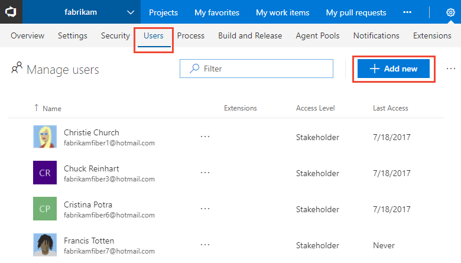

# Sign up for a free VSTS account and invite others to join your team  
**VSTS**
 
Sign up for a [VSTS](https://www.visualstudio.com/products/visual-studio-team-services-vs) 
account to upload and share code in a free unlimited private 
Git repository. You can then connect to your favorite development tool like Eclipse, Xcode, 
Visual Studio, IntelliJ, or Android Studio to work on apps anytime, anywhere. 


<a name="MicrosoftAccount"></a>
##	Sign up with a personal Microsoft account

0.	Go to [VSTS](https://go.microsoft.com/fwlink/?LinkId=307137&clcid=0x409). 
Enter your email address for your Microsoft account. 

	If you're a Visual Studio subscriber 
	and get VSTS as a benefit, 
	use the Microsoft account associated with your subscription. 

	

0.	On the Microsoft account sign-in page, 
enter your email address for your Microsoft account. 
Then enter your password, and finish signing in.

	

	If you don't have a Microsoft account, 
	you can create a Microsoft account at this time. 

0.	Name your  account. 
To manage your code, choose Git or Team Foundation Version Control.

	

	Learn which version control ([Git](../git/overview.md) 
	or [Team Foundation Version Control](../tfvc/overview.md)) 
	works best for you.

0.	Confirm your account's location. 

	
	
	VSTS will create your first team project as "MyFirstProject" 
	and will use Agile as your default work item process to organize your work. 
	Choose **Change details** to 
	rename your team project, change the account location, or select another process, like Scrum.

0.	After VSTS creates your account and team project, 
you can invite others to join your project, add code, or start planning and tracking using work items.

	

	Congratulations, you're now a VSTS account owner! 

	To sign in to your account at any time, go to ```https://{youraccount}.visualstudio.com```.

<a id="invite-others" />
## Invite others to join your team 

You provide others access to your account by adding their email address. 

0. Turn on **Streamlined User Management** for your account. 
 
	a. From your user account menu, click the **Preview features** option.   
	<!---  -->
	 

	b. In the first drop-down menu, choose the option for all accounts. 

	 

	>[!TIP]  
	>If you don't see the user/account menu option, then you aren't an account administrator. 

	c. Enable the **Streamlined User Management** option. 

	 

0. Click the  gear Settings icon, choose the Account Settings option, and then click Users to open the Manage users page. 

	  

0. Fill out the form. You can add several email addresses by separating them with a comma. Leave the Access level at Basic for those users who will contribute to the code base. To learn more, see [About access levels](../security/access-levels.md). 
 
	   

	> [!NOTE]   
	> You must add email addresses for 
	> ["personal" Microsoft accounts](https://www.microsoft.com/account) 
	> unless you plan to use [Azure Active Directory (Azure AD)](https://azure.microsoft.com/documentation/articles/active-directory-whatis/). 
	> to authenticates users and control account access.  
	> If your users don't have Microsoft accounts, 
	> have them [sign up](https://signup.live.com/).

## Next steps  
 
> [!div class="nextstepaction"]
> [Add code to your Git repository](code-with-git.md) 
> or 
> [Plan and track work](plan-track-work.md) 

For more information on managing users and account access, see [Add account users for VSTS](../accounts/add-account-users-from-user-hub.md).
 