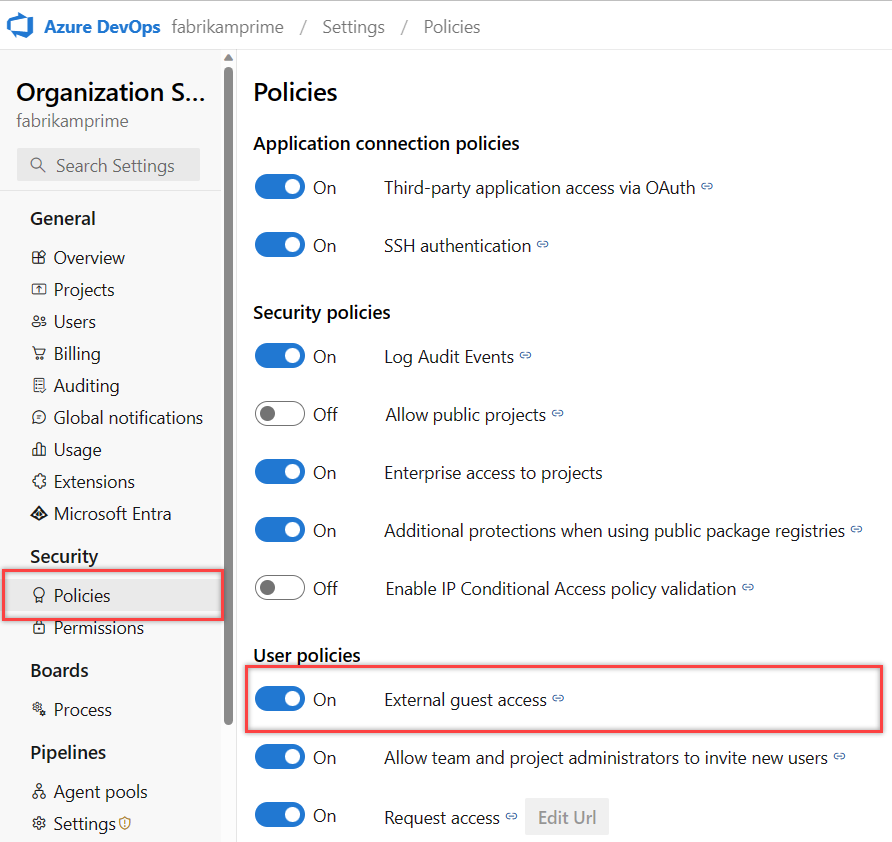

# Sign up for Azure DevOps

[!INCLUDE [version-eq-azure-devops](../includes/version-eq-azure-devops.md)]

When you sign up for Azure DevOps, you get the following tier of free services:

[!INCLUDE [free-tier](../includes/free-tier.md)]

You can sign up for Azure DevOps with either a [Microsoft](#sign-up-with-a-microsoft-account) or [GitHub](#sign-up-with-a-github-account) account. For more information, see What is [Azure DevOps?](what-is-azure-devops.md)
## Sign up with a Microsoft account

1. If you don't have one, [create a Microsoft account now](https://azure.microsoft.com/services/devops/).
2. Go to [Azure DevOps](https://azure.microsoft.com/services/devops/) and select **Start free**.
3. Enter your account credentials and go through the sign-up process.

Azure DevOps does the following tasks:
- Creates an organization.
- Creates a project named after your *newly created* Microsoft account.
   - If you signed up with an existing Microsoft account, you need to [create a project](../organizations/projects/create-project.md) next.

Sign in to your organization at any time `https://dev.azure.com/{Your_Organization}`.

## Sign up with a GitHub account

> [!NOTE]
> If your GitHub email address is already associated with an organization in Azure DevOps that's [connected to Azure Active Directory (Azure AD)](../organizations/accounts/connect-organization-to-azure-ad.md), you can't sign in with your GitHub account. You must sign in with your Azure AD account.

1. If you don't have one, [create a GitHub account now](https://github.com/join).
2. Go to [Azure DevOps](https://azure.microsoft.com/services/devops/) and select **Start free with GitHub**.
3. Enter your account credentials and go through the sign-up process. You're asked to **Authorize Microsoft-corp**.

Azure DevOps does the following tasks:
- Creates an organization. Sign in to your organization at any time `https://dev.azure.com/{Your_Organization}`.
- Turns on the *Invite GitHub users* policy by default. 
   
   Before you can invite users, you must create a project, as shown in **Next steps**. For more information about GitHub authentication, see [FAQs](../organizations/security/faq-github-authentication.yml).

## Next steps  
 
> [!div class="nextstepaction"]
> [Create a project](../organizations/projects/create-project.md)
> or
> [!div class="nextstepaction"]
> [Add users or groups to a team or project](../organizations/security/add-users-team-project.md)

## Related articles

- [Plan your organizational structure in Azure DevOps](plan-your-azure-devops-org-structure.md)
- [Change the location of your organization](../organizations/accounts/change-organization-location.md)
- [Add users to your organization](../organizations/accounts/add-organization-users.md)
- [GitHub authentication FAQs](../organizations/security/faq-github-authentication.yml)
