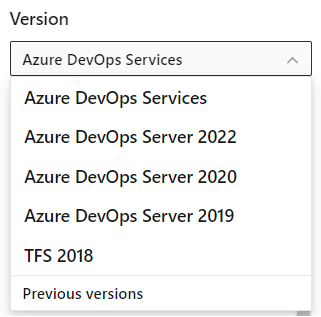

# Sign up, sign in to Azure DevOps

[!INCLUDE [version-vsts-only](../includes/version-vsts-only.md)]

Learn how to sign up for Azure DevOps for free. Also, sign in with a Microsoft or GitHub account, create an organization or project, and invite your teammates.

[!INCLUDE [acquisition-intro-devops](../includes/acquisition-intro-devops.md)]

[!INCLUDE [sign-up-msft-account](../includes/sign-up-msft-account.md)]

[!INCLUDE [sign-in-github-account](../includes/sign-in-github-account.md)]

[!INCLUDE [create-project](../includes/create-project.md)]

<a id="invite-others" />

[!INCLUDE [invite-teammates](../includes/invite-teammates.md)]

For more information about managing users and organization access, see [Add organization users for Azure DevOps](../organizations/accounts/add-organization-users.md).

## Choose your content version

This content supports a platform/version selector. Select from the Content version selector dropdown, located above the table of contents, to access the content that's specific to your version. The table of contents and content page refresh to show only that content specific to the selected version.

   > [!div class="mx-imgBorder"]  
   > 

## Next steps  
 
> [!div class="nextstepaction"]
> [Add code to your Git repository](code-with-git.md)
>
> [Plan and track work](../boards/get-started/plan-track-work.md)