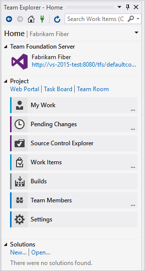

# Which tools and clients connect to Azure DevOps?

[!INCLUDE [temp](../_shared/version-vsts-tfs-all-versions.md)]

Learn about the tools and clients that can connect to Azure DevOps.

Our platform of software development tools began more than 20 years ago. We released Visual Basic and Visual Studio as an integrated development environment (IDE). Visual Studio supports many plug-ins that extend its functionality. In particular, the Team Explorer plug-in allows the Visual Studio client to connect to Azure DevOps to support source control, work tracking, build, and test operations.  

The available tools that communicate with Azure DevOps are included as follows:

- Desktop client developer tools
- Office integration tools
- Web-based tools
- Command-line tools
- Marketplace extensions
- REST APIs  

<!---
###Video overview
 (Video ala Robert's 1.5 min Commit)
Contrast service versus a tool
Clarify what the service provides 
IDE clients
Be clear about what they pay for and what is free

-->

## Desktop client developer tools

Developers have access to many tools through these versions of Visual Studio and plug-ins. To download any version of Visual Studio, go to the [Visual Studio Downloads page](https://visualstudio.microsoft.com/downloads/). To understand what features you get with the Visual Studio versions, see [Compare Visual Studio offerings](https://visualstudio.microsoft.com/vs/compare/).

- **Visual Studio Community**: A fully featured and extensible IDE for creating modern applications for Android, iOS, and Windows, including web applications and cloud services. (Replaces Visual Studio Express.)
- **Visual Studio Professional**: Development tools and services to support individual developers or small teams.
- **Visual Studio Enterprise**: Integrated, end-to-end development tools, and solutions for teams of any size and those with a need to scale. It supports designing, building, and managing complex enterprise applications.
- **Visual Studio Test Professional**: Provides access to Microsoft Test and development tools to support quality and collaboration throughout the development process.
- **Visual Studio Team Explorer**: Free solution for non-developers to interact with Team Foundation Server and Visual Studio Team Services.  
- **[Eclipse/Team Explorer Everywhere](../java/download-eclipse-plug-in.md)**: Free plug-in to support teams running Eclipse on Linux, macOS, or Windows that connect to Azure DevOps.  
- **[Android Studio with the Azure DevOps Services Plug-in for Android Studio](../java/download-android-studio-plug-in.md)**: Free plug-in to support Android developers and connect to Git repositories on Azure DevOps.
- **[IntelliJ with the Azure DevOps Services Plugin for IntelliJ](../java/download-intellij-plug-in.md)**: Free plug-in to support developers who use IntelliJ IDEA or Android Studio to connect to Git repositories on Azure DevOps.
- **[Visual Studio Code](../java/vscode-extension.md)**: Free, open-source code editor with a free extension to support connecting to Git repositories on Azure DevOps.  

**Team Explorer plug-in**

Team Explorer, a plug-in to all Visual Studio versions, connects Visual Studio to projects defined in Azure DevOps. You can manage source code, work items, and builds. To learn more, see [Work in Team Explorer](work-team-explorer.md).

> [!div class="mx-tdBreakAll"]  
> |Home page with Git |Home page with TFVC |
> |-------------|----------|
> | |  |

## Office integration tools

When you install any edition of Visual Studio or [Team Foundation Server Standalone Office Integration 2015 (free)](https://go.microsoft.com/fwlink/?LinkId=691127), the Team Foundation plug-in integrates work item tracking with select Office clients. The Team Foundation plug-in installs to your existing Office client. The plug-in supports Office 2007, Office 2010, or Office 2013 versions.

- [Excel](../boards/backlogs/office/bulk-add-modify-work-items-excel.md): Use Excel to add and bulk modify work items.  
- [Project](../boards/backlogs/office/create-your-backlog-tasks-using-project.md): By using Project, you can plan projects, schedule tasks, assign resources, and track changes. You have access to features that TFS doesn't support, such as a project calendar, Gantt charts, and resource views.
- [Project Professional](../reference/tfs-ps-sync/synchronize-tfs-project-server.md): With Project Professional and the Team Foundation Server Extensions for Project Server, you can manage projects that synchronize data that exists in both TFS and Project Server. Project managers and software development teams can use the tools that they prefer, work at the level of precision that supports their needs, and easily share information.
- [PowerPoint Storyboarding](../boards/backlogs/office/storyboard-your-ideas-using-powerpoint.md): Illustrate user stories and requirements by using PowerPoint. The Team Foundation plug-in installs to your existing PowerPoint client.

::: moniker range="= tfs-2017"
>[!IMPORTANT]
>Support for integrating TFS with Project Server is deprecated for TFS 2017. However, synchronization support is provided by a Microsoft partner. See [Synchronize TFS with Project Server](../reference/tfs-ps-sync/sync-ps-tfs.md) for details.
::: moniker-end

### Task-specific clients

The following clients support specific tasks, such as managing testing efforts, providing feedback, or modifying work items:

- [Microsoft Test Manager](https://msdn.microsoft.com/library/jj635157.aspx): Manage your test efforts, create and run manual tests, and create and track bugs that are found during test efforts. Test Manager is installed with Visual Studio Test Professional and Visual Studio Enterprise. 
- [Test & Feedback extension (previously called the Exploratory Testing extension)](../test/provide-stakeholder-feedback.md): This extension provides a lightweight plug-in to a web browser. Stakeholders can respond to feedback requests for user stories and features created in Azure DevOps. This extension is free to stakeholders. 
- [Microsoft Feedback Client](../project/feedback/give-feedback.md): Your stakeholders can use this client to record feedback for your application as video, audio, or type-written comments. This client is installed with all versions of Visual Studio, or it can be [installed from the free download](https://www.microsoft.com/download/details.aspx?id=48142). All feedback is stored in the work item data store and requires [stakeholders to have permissions](../project/feedback/give-permissions-feedback.md).  

::: moniker range="= tfs-2017" 
>[!IMPORTANT]
>Test Manager is deprecated for TFS 2017.  
::: moniker-end

## Browser-based web tools

### Web portal

The collaboration tools supported through the web portal are summarized under [Essential services](services.md). New features are deployed every three weeks for Azure DevOps Services, and quarterly for Azure DevOps Server. For release notes, see [Azure DevOps Services Features Timeline](../extend/support/release-notes.md).
 
You can use the following browsers to access the web portal:

Version        | Microsoft Edge        | Internet Explorer | Safari (Mac)   | Firefox     | Chrome
---------------|-------------|-------------------|----------------|-------------|-------------
Azure DevOps Services  | most recent | 11 and later      | 9.1 and later  | most recent | most recent
TFS 15         | most recent | 11 and later      | 9.1 and later  | most recent | most recent
TFS 2015       | most recent | 9 and later       | 5 and later    | most recent | most recent
TFS 2013       |             | 9 and later       | 5 and later    | most recent | most recent

Microsoft Edge, Firefox, and Chrome automatically update themselves, so Azure DevOps supports the most recent version.

To learn more, see [Web portal navigation](../project/navigation/index.md).

### Browser-based extensions

The following extensions are available from the Azure DevOps Marketplace and are built and maintained by the Azure DevOps Services product team:

- [Test Manager](https://marketplace.visualstudio.com/items?itemName=ms.vss-testmanager-web): Run tests by using your browser with simple pass/fail of steps, add comments/attachments, take screenshots, and file bugs. You can accomplish all of this  with automatic end-to-end traceability.  
- [Azure Artifacts](https://marketplace.visualstudio.com/items?itemName=ms.feed): Build packages of reusable code components and share them. The Azure Artifacts extension enables continuous delivery workflows by supporting multiple packaging protocols such as NuGet and npm. It makes packages available to your team, your builds, and your releases.
- [Code search](https://marketplace.visualstudio.com/items?itemName=ms.vss-code-search): Increase cross-team collaboration and code sharing by enabling developers to quickly locate relevant information within the code base of all projects hosted within an organization or collection. You can discover implementation examples, browsing definitions, and error text.
- [Work item search](https://marketplace.visualstudio.com/items?itemName=ms.vss-workitem-search): Quickly find relevant work items by searching across all work item fields over all projects in an organization. Perform full-text searches across all fields to efficiently locate relevant work items. Use inline search filters, on any work item field, to quickly narrow down a list of work items.  
  
Find additional extensions from the [Azure DevOps Marketplace](https://marketplace.visualstudio.com).

### Application monitoring tools

To monitor your applications, you can use Azure Application Insights for web apps or HockeyApp for mobile apps.  

#### Monitor web applications with Application Insights

Application Insights is an extensible application performance management (APM) service for web developers. Use it to monitor your live web application. Application Insights automatically detect performance anomalies. It includes powerful analytics tools to help you diagnose issues and to understand what users actually do with your app. Application Insights is designed to help you continuously improve performance and usability. It works for apps on a wide variety of platforms&mdash;including .NET, Node.js, and Java EE&mdash;hosted on-premises or in the cloud.  

With Application Insights, you can do the following:

- Gain actionable insights through application performance management and instant analytics
- Detect and diagnose exceptions and application performance issues
- Monitor Azure websites, including websites hosted in containers, plus websites on-premises and with other cloud providers
- Seamlessly integrate with your DevOps pipeline by using Azure DevOps Services, GitHub, and our webhooks
- Get started from within Visual Studio, or monitor existing apps without redeploying

To learn more, see [Microsoft Azure - Application Insights](https://azure.microsoft.com/services/application-insights/).

#### Monitor mobile applications with HockeyApp

With HockeyApp, you can develop, distribute, and beta test your mobile apps. HockeyApp supports the following apps and functionality:

- Android, Cordova, iOS, macOS, Unity, Windows, and Xamarin apps
- Live, reliable crash reports
- Collection of in-app feedback from real users
- Open-source SDKs to let you know what code is running in your apps
- Integration with your existing build system and work item management solution

To learn more, see [Microsoft Azure - HockeyApp](/azure/application-insights/app-insights-overview).

## Command-line tools

You can perform many code development and administrative tasks by using command-line tools, such as the following tools:

- [Git commands](../repos/git/command-prompt.md)
- [TFVC commands](../repos/tfvc/use-team-foundation-version-control-commands.md)

::: moniker range=">= tfs-2013 < azure-devops"
- [TFSConfig](/azure/devops/server/ref/command-line/tfsconfig-cmd)
- [TFSDeleteProject](/azure/devops/server/ref/command-line/tfsdeleteproject-cmd)
- [TFSSecurity](/azure/devops/server/ref/command-line/tfssecurity-cmd)
- [TFSServiceControl](/azure/devops/server/ref/command-line/tfsservicecontrol-cmd)
- [witadmin (work item tracking)](../reference/witadmin/witadmin-customize-and-manage-objects-for-tracking-work.md)
::: moniker-end

## Marketplace extensions

Visual Studio and Azure DevOps provide a wealth of features and functionality. They also provide a means to extend and share that functionality. 

Extensions are simple add-ons that you can use to customize and extend your DevOps and work tracking experiences. They're written with standard technologies&mdash;HTML, JavaScript, and CSS. You can develop your own extensions by using your preferred dev tools. 

You build extensions by using our RESTful API library. Publish your extensions to the Azure DevOps Marketplace, where you can privately maintain or share them with millions of developers who use Visual Studio and Azure DevOps.

To learn more, visit the [Azure DevOps Marketplace](https://marketplace.visualstudio.com) and see [Overview of extensions](../extend/index.md).

## REST APIs  
 
The Azure DevOps APIs are based on REST, OAuth, JSON, and service hooks&mdash;all standard web technologies broadly supported in the industry.

REST APIs are provided to support building extensions to Azure DevOps. To learn more, see [REST API overview](/rest/api/vsts/).

## Related articles

- [A tour of services](services.md)
- [Software development roles](roles.md)
- [Pricing](https://visualstudio.microsoft.com/team-services/pricing/)
- [Azure DevOps data protection overview](../organizations/security/data-protection.md)
