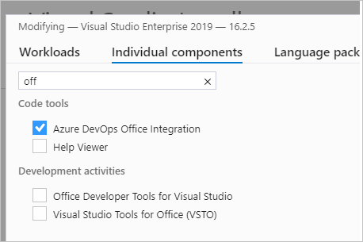

# Tools and clients that connect to Azure DevOps

[!INCLUDE [version-lt-eq-azure-devops](../includes/version-lt-eq-azure-devops.md)]

Our platform of software development tools began more than 20 years ago. We released Visual Basic and Visual Studio as an integrated development environment (IDE). Visual Studio supports many plug-ins that extend its functionality. In particular, the Team Explorer plug-in allows the Visual Studio client to connect to Azure DevOps to support source control, work tracking, build, and test operations.  
 

## Desktop client developer tools

Developers have access to many tools through these versions of Visual Studio and plug-ins. To download any version of Visual Studio, go to the [Visual Studio Downloads page](https://visualstudio.microsoft.com/downloads/). To understand what features you get with the Visual Studio versions, see [Compare Visual Studio offerings](https://visualstudio.microsoft.com/vs/compare/).

- **Visual Studio Community**: A fully featured and extensible IDE for creating modern applications for Android, iOS, and Windows, including web applications and cloud services. (Replaces Visual Studio Express.)
- **Visual Studio Professional**: Development tools and services to support individual developers or small teams.
- **Visual Studio Enterprise**: Integrated, end-to-end development tools and solutions for teams of any size, and with a need to scale. It supports designing, building, and managing complex enterprise applications.
- **Visual Studio Test Professional**: Provides access to Microsoft Test and development tools to support quality and collaboration throughout the development process.
- **[Visual Studio Code](https://code.visualstudio.com/docs)**: Free, open-source code editor with a free extension to support connecting to Git repositories on Azure DevOps.  
- **[Android Studio with the Azure DevOps Services Plug-in for Android Studio](/previous-versions/azure/devops/all/java/download-android-studio-plug-in)**: Free plug in to support Android developers and connect to Git repositories on Azure DevOps.
- **[IntelliJ with the Azure DevOps Services Plugin for IntelliJ](/previous-versions/azure/devops/all/java/download-intellij-plug-in)**: Free plug in to support developers who use IntelliJ IDEA or Android Studio to connect to Git repositories on Azure DevOps.

To get started with client libraries, see [Client library samples](../integrate/get-started/client-libraries/samples.md).

**Team Explorer plug-in**

Team Explorer, a plug-in to all Visual Studio versions, connects Visual Studio to projects defined in Azure DevOps. You can manage source code, work items, and builds. To learn more, see [Work in Team Explorer](work-team-explorer.md).

> [!div class="mx-tdBreakAll"]  
> |Home page with Git |Home page with TFVC |
> |-------------|----------|
> | |  |

**Visual Studio Git experience**  

Visual Studio 2019 and later versions provide a new Git experience through the **Git** menu as shown below. To learn more, see [Git experience in Visual Studio](/visualstudio/version-control/git-with-visual-studio) and [Side-by-side comparison of Git and Team Explorer](/visualstudio/version-control/git-team-explorer-feature-comparison).  

:::image type="content" source="media/tools/visual-studio-git-menu.png" alt-text="Screenshot of Visual Studio 2019 Git menu.":::

## Office integration tools

::: moniker range="= azure-devops"

You can integrate the following Microsoft Office tools with Azure DevOps.

- [Excel](../boards/backlogs/office/bulk-add-modify-work-items-excel.md): Use Excel to add and bulk modify work items.  

> [!IMPORTANT]
> Starting with Visual Studio 2019, the Team Foundation plug-in for Office is deprecating support for Microsoft Project. Project integration and the TFSFieldMapping command is not supported for Azure DevOps Server 2019 nor for Azure DevOps Services. However, you can continue to use Microsoft Excel.

::: moniker-end

::: moniker range="= azure-devops-2019"

- [Excel](../boards/backlogs/office/bulk-add-modify-work-items-excel.md): Use Excel to add and bulk modify work items.  

> [!TIP]
> Check to make sure the Azure DevOps Office Integration component is selected in the Visual Studio Installer, per the following example.
> 

::: moniker-end

::: moniker range="tfs-2018"

When you install any edition of Visual Studio or [Team Foundation Server Standalone Office Integration 2015 (free)](https://go.microsoft.com/fwlink/?LinkId=691127), the Team Foundation plug-in integrates work item tracking with select Office clients. The Team Foundation plug-in installs to your existing Office client. The plug-in supports Office 2007, Office 2010, or Office 2013 versions.

- [Excel](../boards/backlogs/office/bulk-add-modify-work-items-excel.md): Use Excel to add and bulk modify work items.  
- [Project](/previous-versions/azure/devops/boards/backlogs/office/create-your-backlog-tasks-using-project): By using Project, you can plan projects, schedule tasks, assign resources, and track changes. You have access to features that TFS doesn't support, such as a project calendar, Gantt charts, and resource views.
- [PowerPoint Storyboarding](/previous-versions/azure/devops/boards/backlogs/office/storyboard-your-ideas-using-powerpoint): Illustrate user stories and requirements by using PowerPoint. The Team Foundation plug-in installs to your existing PowerPoint client.

::: moniker-end

### Task-specific clients

The following clients support specific tasks, such as managing testing efforts, providing feedback, or modifying work items:

- [Azure Test Plans](../organizations/billing/try-additional-features-vs.md): Manage your test efforts, create and run manual tests, and create and track bugs that are found during test efforts.  
- [Test & Feedback extension (previously called the Exploratory Testing extension)](../test/perform-exploratory-tests.md): This extension provides a lightweight plug-in to a web browser. Stakeholders can respond to feedback requests for user stories and features created in Azure DevOps. This extension is free to Stakeholders. 
- [Microsoft Feedback Client](/previous-versions/azure/devops/project/feedback/give-feedback): Your Stakeholders can use this client to record feedback for your application as video, audio, or type-written comments. This client is installed with all versions of Visual Studio, or it can be [installed from the free download](https://www.microsoft.com/download/details.aspx?id=48142). All feedback is stored in the work item data store and requires [Stakeholders to have permissions](/previous-versions/azure/devops/project/feedback/give-permissions-feedback).  

## Browser-based web tools

### Web portal

The collaboration tools supported through the web portal are summarized under [Essential services](services.md). New features are deployed every three weeks for Azure DevOps Services, and quarterly for Azure DevOps Server. For release notes, see [Azure DevOps Services Features Timeline](/azure/devops/release-notes/features-timeline).
 
You can use the following browsers to access the web portal:

> [!div class="mx-tdCol2BreakAll"]
> |Version                 | Edge        | Internet Explorer | Safari (Mac)   | Firefox     | Chrome|
> |--------------------------|-------------|-------------------|----------------|-------------|-------------|
> |Azure DevOps Services Azure DevOps Server 2020.1 | Most recent | Not supported |14.1 and later | Most recent | Most recent |
> |Azure DevOps Server 2020 Azure DevOps Server 2019 TFS 2018 TFS 2017  | Most recent | 11 and later | 14.1 and later  | Most recent | Most recent|
> |TFS 2015                  | Most recent | 9 and later       | 5 and later    | Most recent | Most recent|
> |TFS 2013                  |             | 9 and later       | 5 and later    | Most recent | Most recent|

Microsoft Edge, Firefox, and Chrome automatically update themselves, so Azure DevOps supports the most recent version.

For more information, see [Web portal navigation](../project/navigation/index.md).

### Browser-based extensions

Several extensions are built and maintained by the Azure DevOps Services product team:

- [Code search](https://marketplace.visualstudio.com/items?itemName=ms.vss-code-search): Increase cross-team collaboration and code sharing. Enables developers to quickly locate relevant information within the code base of all projects that are hosted within an organization or collection. You can discover implementation examples, browsing definitions, and error text.
- [Work item search](https://marketplace.visualstudio.com/items?itemName=ms.vss-workitem-search): To quickly find relevant work items, search across all work item fields over all projects in an organization. Do full-text searches across all fields to efficiently locate relevant work items. Use inline search filters, on any work item field, to quickly narrow down a list of work items.  
  
Find more extensions in Azure DevOps **Organization settings** > **Extensions** > **Browse marketplace**. See also, [Overview of extensions for Azure Boards](../boards/extensions/index.md).

## Command-line tools

You can do many code development and administrative tasks by using the following command-line tools:

::: moniker range="azure-devops"

- [az devops commands](../cli/quick-reference.md)
- [Git commands](../repos/git/command-prompt.md)
- [TFVC commands](../repos/tfvc/use-team-foundation-version-control-commands.md)
- [TCM commands](../test/copy-clone-test-items.md)
- [Manage permissions with command line tool (az devops security)](../organizations/security/manage-tokens-namespaces.md) 
- [witadmin (work item tracking)](../reference/witadmin/witadmin-customize-and-manage-objects-for-tracking-work.md)

::: moniker-end

::: moniker range="< azure-devops"

- [Git commands](../repos/git/command-prompt.md)
- [TFVC commands](../repos/tfvc/use-team-foundation-version-control-commands.md)
- [TCM commands](../test/copy-clone-test-items.md)
- [witadmin (work item tracking)](../reference/witadmin/witadmin-customize-and-manage-objects-for-tracking-work.md)
- [TFSConfig](/azure/devops/server/command-line/tfsconfig-cmd)
- [TFSDeleteProject](/azure/devops/server/command-line/tfsdeleteproject-cmd)
- [TFSSecurity](/azure/devops/server/command-line/tfssecurity-cmd)
- [TFSServiceControl](/azure/devops/server/command-line/tfsservicecontrol-cmd)

::: moniker-end

## Integrated tool support for third-party applications

The following tools provide support for monitoring and interacting with Azure DevOps from a third-party application. 

- **Azure Boards**: 
	- [Use the Azure Boards app with Slack to manage work items](../boards/integrations/boards-slack.md)
	- [Use the Azure Boards app in Microsoft Teams](../boards/integrations/boards-teams.md)

- **Azure Repos**: 
	- [Azure Repos with Slack](../repos/integrations/repos-slack.md)
	- [Azure Repos with Microsoft Teams](../repos/integrations/repos-teams.md)

- **Azure Pipelines**: 
	- [Use Azure Pipelines with Microsoft Teams](../pipelines/integrations/microsoft-teams.md)
	- [Azure Pipelines with Slack](../pipelines/integrations/slack.md)
	- [Integrate with ServiceNow change management](../pipelines/release/approvals/servicenow.md)
	- [Continuously deploy from a Jenkins build](../pipelines/release/integrate-jenkins-pipelines-cicd.md)

## Marketplace extensions

Visual Studio and Azure DevOps provide a wealth of features and functionality. They also provide a means to extend and share that functionality. 

Extensions are simple add-ons that you can use to customize and extend your DevOps and work tracking experiences. They're written with standard technologies&mdash;HTML, JavaScript, and CSS. You can develop your own extensions by using your preferred dev tools. 

You build extensions by using our RESTful API library. Publish your extensions to the Azure DevOps Marketplace. You can privately maintain or share them with millions of developers who use Visual Studio and Azure DevOps.

To learn more, visit the [Azure DevOps Marketplace](https://marketplace.visualstudio.com) and see [Overview of extensions](../extend/overview.md).

## REST APIs  
 
The Azure DevOps APIs are based on REST, OAuth, JSON, and service hooks&mdash;all standard web technologies broadly supported in the industry.

REST APIs are provided to support building extensions to Azure DevOps. To learn more, see [REST API overview](/rest/api/azure/devops).

## Related articles

- [A tour of services](services.md)
- [Software development roles](roles.md)
- [Pricing](https://visualstudio.microsoft.com/team-services/pricing/)
- [Azure DevOps data protection overview](../organizations/security/data-protection.md)
