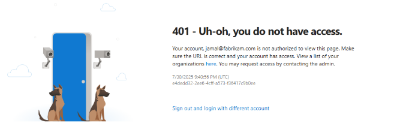

# Troubleshoot connecting to a project

[!INCLUDE [version-lt-eq-azure-devops](../includes/version-lt-eq-azure-devops.md)]

If you're experiencing issues connecting to a project in Azure DevOps, follow these troubleshooting steps to resolve common connectivity problems.

## Prerequisites

[!INCLUDE [prerequisites-project-member-only](../includes/prerequisites-project-member-only.md)]

::: moniker range=" azure-devops"

## Troubleshoot connectivity

To resolve connectivity issues, complete the following steps:

1. Sign out of your browser. To do so, select the [Visual Studio sign out](https://aka.ms/VsSignout) link.
2. Delete the cookies in your browser. To delete cookies in most browsers, select **Ctrl**+**Shift**+**Delete**.
3. Open Microsoft Edge and delete the browser cookies. The Visual Studio IDE uses Microsoft Edge cookies.
4. Close all browsers and close the Visual Studio IDE.
5. Use a private browser session to retry the connection. If the issue is with the Visual Studio IDE, remove the connection and then readd it in Team Explorer.

For more troubleshooting options, see [Switch organizations](#switch-organizations), further in this article. 

## Troubleshoot sign in

Two types of identities can sign in: Microsoft accounts and Microsoft Entra accounts. Depending on your account, you might experience the following error.

### 401 - Not Authorized

> [!div class="mx-imgBorder"]
> 

The most common error page is the *401 Not Authorized* error, which occurs when your identity doesn't have permissions to enter an organization. See the following common reasons for the error:

* Your identity isn't a member of the organization.
* Your identity has an invalid or missing license assignment.
* Your identity doesn't have enough memberships to access the resource. For example, membership to the Reader/Contributors group.
* Your identity is a B2B guest in the tenant, and the invitation isn't accepted.

If you think you're a member of the organization, but get this error page, [contact Support](https://developercommunity.visualstudio.com/spaces/21/index.html).

#### Scenario 1

Your work or school Microsoft Entra account doesn't have access, but your personal Microsoft account does.

> 401 - Work or school, or Personal account
> 
> [!div class="mx-imgBorder"]
> 

 A highly specific 401 error case. In this case, both a personal Microsoft account and a work or school account (Microsoft Entra ID) that have the same sign-in address exist. You signed in with your work or school account, but your personal account is the identity with access to the organization.

#### Mitigation

In some cases, you might not know you have two identities with the same sign-in address. It's possible that an administrator created the work or school Microsoft Entra account when you were added to Office 365 or Microsoft Entra ID.

To sign out of your current work or school Microsoft Entra account, select **Sign in with your personal MSA account**, and then sign in by using your personal Microsoft account. After authentication, you should have access to the organization.

* If you can't access to the organization, make sure that your Microsoft Entra ID still exists and that your work or school account is in the Microsoft Entra tenant.

> [!TIP]
> To avoid seeing this prompt, you can rename your Microsoft account. Then, only one identity, your work or school account, or Microsoft Entra account, uses your sign-in address.

#### Scenario 2

Your personal Microsoft account doesn't have access, but your Microsoft Entra account does. This scenario is an opposite version of the 401 error page. In this case, the personal account (Microsoft account identity) doesn't have access to the organization and the work or school account (Microsoft Entra identity) does. The same guidance from Scenario 1 applies, but in reverse.

> 401 - Work or school, or Personal account
> 
> [!div class="mx-imgBorder"]
> 

#### Mitigation

When you get redirected back to the original sign-in page, we recommend that you clear all cookies, and then reattempt to sign in. If that doesn't fix the issue, [contact Support](https://developercommunity.visualstudio.com/spaces/21/index.html).

## Unable to connect to Azure DevOps Services   
  
|Problem|Resolution|  
|-------------|----------------|  
|You don't have an active account or license.|Check with your administrator that you're a member of the account and have an active, valid license. For more information, see [Assign licenses to users](../organizations/accounts/add-organization-users.md).| 
|Your Azure DevOps Services organization is connected to the Microsoft Entra ID.|When your Azure DevOps Services organization is connected to a directory that is associated with a Microsoft 365 or Microsoft Azure subscription, only members in the directory can access the account.   Check with your directory administrator to have them [create an organizational account for you or add your account to the directory as external member](/azure/active-directory/active-directory-create-users).|  
|You can't switch between different organizational accounts.|If you work with several organizations that connect to different directories, such as accounts created from the Microsoft Azure portal, the sign out function might not work as expected. For example, you can't switch between different organizational accounts to connect to multiple accounts that are linked to directory tenants.   When this problem occurs, there's a flashing blank sign in dialog box. Then, you receive either TF31002 or TF31003 error after you connect to or add a new connection in the dialog box.   To resolve this problem, apply the most recent [Visual Studio update](https://visualstudio.microsoft.com/downloads) .   For more information, see [You can't switch between different organizational accounts in Visual Studio Codespace](/troubleshoot/visualstudio/general/cannot-switch-accounts).|  
|You want to sign in to Azure DevOps Services from Visual Studio using different credentials.|See [Connect to projects, Sign in with different credentials](../organizations/projects/connect-to-projects.md).|  

::: moniker-end

::: moniker range="< azure-devops"

## Troubleshoot Azure DevOps Server connectivity

Here's a list of the most frequently reported connection problems and what to do about them. Complete the list in the order indicated.

1. Verify that you have the required permissions.
    If the errors that you receive indicate read-only or blocked actions, you might not have permissions to act on the data.
2. Verify that your computer is connected to the network and that it can access network resources.
3. Verify that Azure DevOps Server isn't offline. Check with your Azure DevOps Server administrator.
4. Check whether your project was moved to another project collection in Azure DevOps Server. If it was moved, you must create a connection to the new server name.
5. Verify you're using a [supported version of Azure DevOps Server](/azure/devops/server/requirements).

## TF31002: Unable to connect
  
If you get this error from one computer but not others, or others aren't receiving this error, then check the following resolutions.  
  
|Problem|Resolution|  
|-------------|----------------|  
|Your password expired.|Verify that you entered your user ID and password correctly, and that your password didn't expire.|  
|You entered an incorrect server URL.|Verify that you entered the server URL correctly including the server name, port number, and protocol (http/https). For more information, see [Connect to projects](../organizations/projects/connect-to-projects.md).|  
|The configuration changed.|If the configuration for the on-premises Azure DevOps Server changed, you must create a new connection. You might also need to [clear the client cache](../organizations/projects/connect-to-projects.md).|  
|You work remotely and need to connect to an Azure DevOps Proxy server to check in files to Azure DevOps Server version control.| [Configure Visual Studio to connect to Azure DevOps Proxy](../organizations/projects/connect-to-projects.md).|  
|You're connecting to a later version of Azure DevOps Server than your Visual Studio client version.|Your version of Visual Studio or Team Explorer might be incompatible with Azure DevOps Server. You might need to install one or more General Distribution Release (GDR) packs. For more information, see [Requirements and compatibility](/azure/devops/server/requirements).|  
|Your firewall is blocking Azure DevOps.|See [Allow a program to communicate through Windows Firewall](/previous-versions/windows/it-pro/windows-server-2008-R2-and-2008/cc766312(v=ws.10)).|  
|Visual Studio stops responding when you run a query in Visual Studio.|Your computer might be configured to bypass the proxy server. Verify the configuration of the BypassProxyOnLocal setting on your computer. For more information, see [BypassProxyOnLocal Configuration](/previous-versions/visualstudio/visual-studio-2008/ee248646(v=vs.90)).|  
  
### Several users can't connect to Azure DevOps Server 
  
If the problem occurs on more than one computer, contact your administrator to confirm whether the server is operational and available on the network.  
  
As an administrator, check the event logs for the application-tier server to try to pinpoint the problem. Also, you can use the following table to determine whether the server is misconfigured. In the table, problems that are more likely to occur appear first. Try the resolutions in the order in which they appear, which increases the chance that you can solve the problem quickly.  
  
|Problem|Resolution|
|-------------|----------------|
|The *TFSService* account password is expired or incorrect.|Many services for Azure DevOps Server stop running when the service account expires. For more information, see [Change the service account or password for Azure DevOps Server](/azure/devops/server/admin/change-service-account-password).|  
|The application-tier server for Azure DevOps Server is unavailable.|Verify whether each required service is running. If a required service isn't running, you must restart it. If necessary, set it to start automatically. For more information, see [Stop and start services, application pools, and websites](/azure/devops/server/admin/stop-start-services-pools).|  
|The network is unavailable.|Verify whether your network is operational.|  
|A website identity for Azure DevOps Server is configured incorrectly.|Verify or correct the server binding assignments that are made to websites for Azure DevOps Server. |
|Access to a website for Azure DevOps Server is restricted.|Verify or correct restrictions that are made to those websites that are based on IP addresses and domain names. |  
|The firewall or ports are configured incorrectly.|Verify or correct port binding assignments for websites and port assignments for the firewall. First, you should open the administration console for Azure DevOps Server, display the Application Tier page, and review the URL assignments. If necessary, select **Change URL** to modify the URL of a website. Next, you should verify the port assignments for Internet Information Services (IIS) and the ports that are allowed through the firewall. For more information, see [Review Server Status and Settings](/azure/devops/server/admin/stop-start-services-pools) and [Verify or Correct Port Assignments](/azure/devops/server/architecture/required-ports).|  
|Trust relationships between domains aren't configured correctly.|If a group of users can't access Azure DevOps Server, you might have trust issues between domains.|  
|When users connect to different versions of Azure DevOps Server from Visual Studio, they can get the TF31002 error.|This error can occur because the GUIDs for one version are the same as another version of Azure DevOps Server. The local client cache gets confused because it tries to maintain the same GUID-based local cache for both versions.   To fix, run the **TFSConfig ChangeServerID** command. See [TFSConfig ChangeServerID command](/azure/devops/server/command-line/tfsconfig-cmd#changeserverid).|

::: moniker-end

::: moniker range="azure-devops"

## Switch organizations

When you use two or more organizations that are linked to Microsoft Entra ID, the sign out function might not work as expected. For example, you can't switch between different organizations to connect to multiple organizations that are linked to directory tenants.

When this problem occurs, a blank screen flashes several times. Then, one of the following error messages appears after you connect to or add a new connection in the **Connect to Azure DevOps Server** dialog box:

> TF31003: Either you have not entered the necessary credentials, or your user account does not have permission to connect to the Azure DevOps Server
> 
> TF31002: Unable to connect to this Azure DevOps Server

To resolve this issue, apply Visual Studio 2013.2 or install a later version from the [Visual Studio download website](https://visualstudio.microsoft.com/downloads).

Another solution is to delete your browser cookies. For more information, see the support article [You can't switch between different organizations in Visual Studio Codespaces](https://support.microsoft.com/help/2958966/you-can-t-switch-between-different-organizational-accounts-in-visual-s).

::: moniker-end

::: moniker range="< azure-devops"

## Connect to Azure DevOps Server with Secure Sockets Layer

If you connect to an Azure DevOps Server instance that has Secure Sockets Layer (SSL) configured, install a certificate and clear the client cache. For more information, see [Set up HTTPS with Secure Sockets Layer (SSL) for Azure DevOps Server - Configuring client computers](/azure/devops/server/admin/setup-secure-sockets-layer#config-client-computers). 

## Clear the cache on client computers

When the on-premises Azure DevOps Server configuration changes, such as when you move or split a project collection, clear the cache.

1. Sign in to your client computer for Azure DevOps Server by using the credentials of the user whose cache you want to clear.

2. Close any open instances of Visual Studio.

3. Open a browser and go to one of the following folders, depending on the operating system your computer runs on:

    - **Windows 10**
        *Drive*:\\Users\<i>UserName</i>\AppData\Local\Microsoft\Team Foundation\6.0\Cache

    - **Windows 8**
        *Drive*:\\Users\<i>UserName</i>\AppData\Local\Microsoft\Team Foundation\4.0\Cache  

    - **Windows 7 or Windows Vista**
        *Drive*:\\Users\<i>UserName</i>\AppData\Local\Microsoft\Team Foundation\2.0\Cache

4. Delete the contents of the Cache directory, including all subfolders.

::: moniker-end
