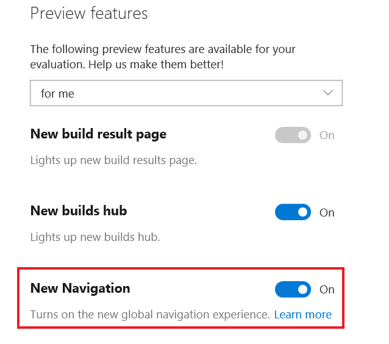

# Visual Studio Team Services is now Azure DevOps Services

[!INCLUDE [temp](../_shared/version-vsts-tfs-all-versions.md)]

On September 10, 2018, Microsoft renamed Visual Studio Team Services (VSTS) to Azure DevOps Services. For more information about this change, see [this blog post](https://aka.ms/azurevsts).

VSTS features are now separate services:

> [!div class="mx-tdBreakAll"]  
>| VSTS feature name    | Azure DevOps service name | Description |
> |----------------------|----------------------|-------------|
> | Build & release      | Azure Pipelines      | Continuous integration and continuous delivery (CI/CD) that works with any language, platform, and cloud. |
> | Code                 | Azure Repos          | Unlimited cloud-hosted private Git and Team Foundation Version Control (TFVC) repos for your project. |
> | Work                 | Azure Boards         | Work tracking with Kanban boards, backlogs, team dashboards, and custom reporting. |
> | Test                 | Azure Test Plans     | All-in-one planned and exploratory testing solution. |
> | Packages (extension) | Azure Artifacts      | Maven, npm, and NuGet package feeds from public and private sources. |

Currently, you can acquire only Azure Pipelines as a separate service. In the future, you'll be able to acquire each service separately or all together as Azure DevOps Services. If you are already a VSTS subscriber, you have access to all of the services now.  

> [!NOTE]   
> You can [disable select services from the user interface](../organizations/settings/set-services.md).

Follow the [Azure DevOps release notes](/azure/devops/release-notes/index) to get news on the latest updates.

## Can I still use visualstudio.com?

Yes. We've moved to the new `dev.azure.com` domain name as the primary URL for new organizations. (Specifically, it's `https://dev.azure.com/{your organization}/{your project}`.) If you want to change your URL to be based on `dev.azure.com` as the primary, an organization administrator can change this from the organization settings page.

We will continue to post news about this transition on the [Microsoft DevOps blog](https://blogs.msdn.microsoft.com/devops/) and in the [Azure DevOps release notes](/azure/devops/release-notes/index).

## Can I still use the old interface?

Yes. Although Azure DevOps Services features [redesigned navigation](https://blogs.msdn.microsoft.com/devops/2018/06/19/new-navigation/), you can still use the previous user interface by choosing your profile icon and selecting **Preview features** from the drop-down menu.

> [!div class="mx-imgBorder"]  
> 

Then, switch the **New Navigation** option to **Off**.

> [!div class="mx-imgBorder"] 
> 

Turning off **New Navigation** also changes the Azure DevOps Services names to the corresponding old VSTS feature names, such as **Work** instead of **Boards**.

To return to the Azure DevOps service-oriented UI, choose your profile icon, select **Preview features**, and re-enable **New Navigation**.

## What about Team Foundation Server (TFS)?

On November 19, 2018, [Azure DevOps Server 2019](/tfs/server/tfs-is-now-azure-devops-server) was announced as the next version of Team Foundation Server, our on-premises Agile workflow and DevOps product. Currently, the Azure DevOps Server 2019 Release Candidate 1 is available for preview.

Azure DevOps Server 2019 uses the new navigation user interface, with a vertical sidebar to navigate to the main service areas: **Boards**, **Repos**, **Pipelines**, and more. To learn more, see [Web portal navigation](../project/navigation/index.md). 