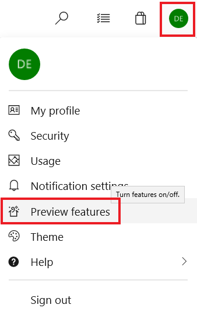

# What happened to VSTS?

On September 5th, 2018, Visual Studio Team Services was rebranded as "Azure DevOps", a set of DevOps services and features under the Azure brand. The individual features of VSTS are now branded as separate services, as follows:

| VSTS feature        | Azure DevOps service |
|---------------------|----------------------|
| Build & Release     | Azure Pipelines      |
| Code                | Azure Repos          |
| Work                | Azure Boards         |
| Test                | Azure Test Plans     |
| Package (extension) | Azure Artifacts      |

Each service can be acquired separately, or together as Azure DevOps Services. Since you are already a VSTS subscriber, you have access to all of the services.

Follow the [Azure DevOps Release Notes](/vsts/release-notes/index) to get news on the latest updates!

## I preferred the old user interface. How do I go back?

At this time, you can still use the old UI by choosing your profile icon and selecting **Preview features** from the drop-down menu.

> [!div class="mx-imgBorder"]  
> 

Then, toggle the **New Navigation** option to **Off**.

> [!div class="mx-imgBorder"] 
> 

This will also change the service names to their old VSTS feature names, such as **Work** instead of **Boards**.

To revert to the Azure DevOps service-oriented UI, choose your profile icon, select **Preview features**, and re-enable **New Navigation**. 

## What about Team Foundation Server (TFS)?

As of 9/5/2018, [Team Foundation Server](/tfs/index) (TFS) is unchanged and fully-supported as our on-prem Agile workflow and DevOps product. The latest version is TFS 2018, and the latest servicing update is **Team Foundation Server 2018 Update 3**, which released on **August 28, 2018**.
