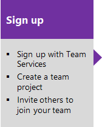
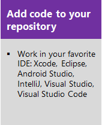

# What is Azure DevOps Services?

[!INCLUDE [version-vsts-only](../_shared/version-vsts-only.md)]

Azure DevOps Services is a cloud service for collaborating on code development. It provides an integrated set of features that you access through your web browser or IDE client. The following features are included:

- Git repositories for source control of your code
- Build and release services to support continuous integration and delivery of your apps
- Agile tools to support planning and tracking your work, code defects, and issues using Kanban and Scrum methods
- Many tools to test your apps, including manual/exploratory testing and continuous testing
- Highly customizable dashboards for sharing progress and trends
- Built-in wiki for sharing information with your team

The Azure DevOps ecosystem also provides support for adding extensions and integrating with other popular services, such as: Campfire, Slack, Trello, UserVoice, and more, and developing your own custom extensions.  

Choose Azure DevOps Services when you want the following results:

- Quick set-up
- Maintenance-free operations
- Easy collaboration across domains
- Elastic scale
- Rock-solid security ([learn more about data protection](../organizations/security/data-protection.md))

You also have access to cloud build and deployment servers, and application insights.

## Where do I start?

We've made it easy for you to start for free and try out our services.

Sign up for free by creating an organization. Then, either upload your code to share or source control. Begin tracking your work using Scrum, Kanban, or a combination of methods.

## Try next  

> [!div class="nextstepaction"]
> [Sign up and invite teammates](sign-up-invite-teammates.md)

## Related articles

- [A tour of services](services.md)
- [Client-server tools](tools.md)
- [Software development roles](roles.md)
- [Azure DevOps pricing](https://azure.microsoft.com/pricing/details/devops/azure-devops-services/)

<!---
[Small teams can start for free!](https://visualstudio.microsoft.com/products/visual-studio-team-services-vs.aspx)  
[DevOps overview for Azure DevOps Services and TFS](index.md)
*(c) 2016 Microsoft Corporation. All rights reserved. This document is
provided "as-is." Information and views expressed in this document,
including URL and other Internet Web site references, may change without
notice. You bear the risk of using it.*

*This document does not provide you with any legal rights to any
intellectual property in any Microsoft product. You may copy and use
this document for your internal, reference purposes.*
--> 
