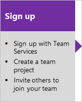
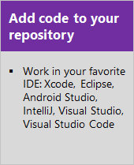

---
title: Plan, code, collaborate, ship applications
titleSuffix: Azure DevOps 
ms.custom: seodec18, contperf-fy21q3
description: Get an integrated set of features to help you plan, code, collaborate, and ship your applications faster.
ms.technology: devops-new-user
ms.author: chcomley
author: chcomley
ms.date: 01/22/2021
ms.topic: overview
monikerRange: '<= azure-devops'
---

# What is Azure DevOps?

[!INCLUDE [version-vsts-tfs-all-versions](../includes/version-vsts-tfs-all-versions.md)]

Azure DevOps provides developer services for support teams to plan work, collaborate on code development, and build and deploy applications. Azure DevOps supports a culture and set of processes that bring developers and project managers and contributors together to complete software development. It allows organizations to create and improve products at a faster pace than they can with traditional software development approaches.

You can work in the cloud using Azure DevOps Services or on-premises using Azure DevOps Server. For information on the differences between the cloud versus on-premises platforms, see [Azure DevOps Services and Azure DevOps Server](about-azure-devops-services-tfs.md).

Azure DevOps provides integrated features that you can access through your web browser or IDE client. You can use one or more of the following standalone services based on your business needs:

- **Azure Repos** provides Git repositories or Team Foundation Version Control (TFVC) for source control of your code. For more information about Azure Repos, see [What is Azure Repos?](../repos/get-started/what-is-repos.md).
- **Azure Pipelines** provides build and release services to support continuous integration and delivery of your applications. For more information about Azure Pipelines, see [What is Azure Pipelines?](../pipelines/get-started/what-is-azure-pipelines.md).
- **Azure Boards** delivers a suite of Agile tools to support planning and tracking work, code defects, and issues using Kanban and Scrum methods. For more information about Azure Boards, see [What is Azure Boards?](../boards/get-started/what-is-azure-boards.md).
- **Azure Test Plans** provides several tools to test your apps, including manual/exploratory testing and continuous testing. For more information about Azure Test Plans, see [Overview of Azure Test Plans](../test/overview.md)
- **Azure Artifacts** allows teams to share packages such as Maven, npm, NuGet, and more from public and private sources and integrate package sharing into your pipelines. For more information about Azure Artifacts, see [Overview of Azure Artifacts](../pipelines/artifacts/artifacts-overview.md).

You can also use the following collaboration tools:

- Customizable team dashboards with configurable widgets to share information, progress, and trends
- Built-in wikis for sharing information
- Configurable notifications

Azure DevOps supports adding extensions and integrating with other popular services, such as: Campfire, Slack, Trello, UserVoice, and more, and developing your own custom extensions.  

Azure DevOps Services supports integration with GitHub.com and GitHub Enterprise Server repositories. Azure DevOps Server supports integration with GitHub Enterprise Server repositories. For more information, see the following video, [Using GitHub with Azure DevOps](https://msit.microsoftstream.com/video/77d07845-8091-48df-8f56-adc1e5b4d8eb?referrer=https:%2F%2Fmicrosoft.sharepoint.com%2F).

## Choose Azure DevOps Services

Choose Azure DevOps Services when you want the following outcomes:

- Quick set-up
- Maintenance-free operations
- Easy collaboration across domains
- Elastic scale
- Rock-solid security

To learn more about data protection in Azure DevOps Services, see [Data protection overview](../organizations/security/data-protection.md).

Azure DevOps Services also gives you access to cloud build and deployment servers, and application insights.

We've made it easy for you to start for free and try out our services. Sign up for free by creating an organization. Then, either upload your code to share or source control. Begin tracking your work using Scrum, Kanban, or a combination of methods.

You can use all the services included with Azure DevOps, or choose just what you need to complement your existing workflows.

- **[Azure Boards](https://azure.microsoft.com/services/devops/boards/)**. Plan, track, and discuss work across your teams.
- **[Azure Pipelines](https://azure.microsoft.com/services/devops/pipelines/)**. Continuously build, test, and deploy to any platform and cloud.
- **[Azure Repos](https://azure.microsoft.com/services/devops/repos/)**. Get unlimited, cloud-hosted private Git repositories for your project.

## Choose Azure DevOps Server

Choose on-premises Azure DevOps Server when:

- You need your data to stay within your network.
- Your work tracking customization requirements are met better with the on-premises XML process model over the inheritance process model. The on-premises model supports modification of XML definition files.

When you deploy Azure DevOps Server, you can also configure the following servers or integration points:

- **Build server** supports on-premises and cloud-hosted builds.
- **SQL Server and SQL Analysis Server** support SQL Server Reports and the ability to create Excel pivot charts based on the cube.

Start for free by downloading [Azure DevOps Server Express](https://go.microsoft.com/fwlink/?LinkId=2041269&clcid=0x409). Then, either upload your code to share or source control. Or, begin tracking your work using Scrum, Kanban, or a combination of methods.

To learn more about managing Azure DevOps Server, see the [Administrative tasks quick reference](/azure/devops/server/admin/admin-quick-ref).

## Next steps  

> [!div class="nextstepaction"]
> [Sign up for Azure DevOps Services](sign-up-invite-teammates.md) or [Install Azure DevOps Server](/azure/devops/server/install/single-server)

## Related articles

- [A tour of services](services.md)
- [Client-server tools](tools.md)
- [Software development roles](roles.md)
- [Azure DevOps pricing](https://azure.microsoft.com/pricing/details/devops/azure-devops-services/)
- [Azure DevOps release notes](/azure/devops/release-notes/index)
- [Azure DevOps blog](https://blogs.msdn.microsoft.com/devops/)

<!---
[Small teams can start for free!](https://visualstudio.microsoft.com/products/visual-studio-team-services-vs.aspx)  
[DevOps overview for Azure DevOps](../get-started/index.yml)

*(c) 2016 Microsoft Corporation. All rights reserved. This document is
provided "as-is." Information and views expressed in this document,
including URL and other Internet Web site references, may change without
notice. You bear the risk of using it.*

*This document does not provide you with any legal rights to any
intellectual property in any Microsoft product. You may copy and use
this document for your internal, reference purposes.*
-->
