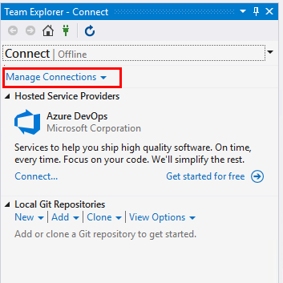
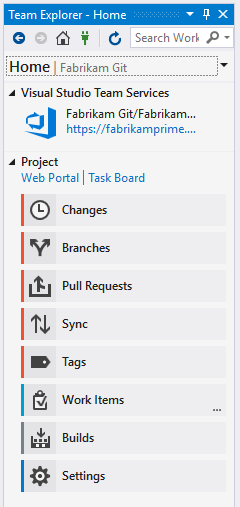
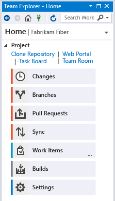
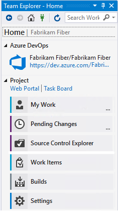
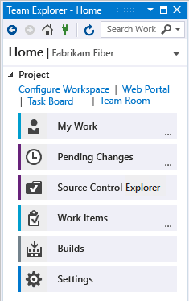
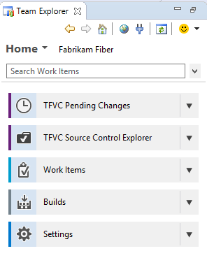

# Navigate in Visual Studio Team Explorer

**Visual Studio 2019 | Visual Studio 2017 | Visual Studio 2015**

You use Team Explorer to coordinate your code efforts with other team members to develop a software project. In addition, you can manage work and that is assigned to you, your team, or your projects. Team Explorer is a plug-in that installs with Visual Studio and Team Explorer Everywhere is a plug-in that installs with Eclipse. Developers can effectively collaborate using Team Explorer connected to projects hosted on Azure DevOps Services or an on-premises Azure DevOps Server (previously named Team Foundation Server (TFS)).

> [!TIP]
> You can install the latest version of Visual Studio clients from the [Visual Studio downloads page](https://visualstudio.microsoft.com/downloads/?utm_medium=microsoft&utm_source=docs.microsoft.com&utm_campaign=button+cta&utm_content=download+vs2017). 
> 
> Additional options for connecting to Azure DevOps Services or TFS include:  
> - [Team Explorer Everywhere](../java/download-eclipse-plug-in.md)
> - [Azure DevOps Plugin for Android Studio](../java/download-android-studio-plug-in.md)  
> - [Azure DevOps Plugin for IntelliJ](../java/download-intellij-plug-in.md)
> - [Visual Studio Code](../java/vscode-extension.md)  
> 
> For information about compatibility among client and server versions, see [Requirements and compatibility](/azure/devops/server/requirements).

If you don't need Visual Studio, but want to connect to a project in Azure DevOps, you can install the free [Visual Studio Community](https://visualstudio.microsoft.com/downloads/download-visual-studio-vs).

## Prerequisites 

- You must have a project in Azure DevOps. If you need to add a project, see [Create a project](../organizations/projects/create-project.md).
- You must be a member of the project you connect to. To get added, see [Add users to a project or team](../organizations/security/add-users-team-project.md).

## Connect to a project or repository

Team Explorer connects Visual Studio to projects in Azure DevOps. You can manage source code, work items, and builds. The operations available to you depend on which source control option&mdash;Git or Team Foundation version control (TFVC) &mdash;was selected to manage source code when the project was created.

> [!TIP]  
> If you open Visual Studio and the Team Explorer pane doesn't appear, choose the **View>Team Explorer** menu option from the tool bar.

From the **Connect** page, you can select the projects you want to connect to and quickly switch connection to a different project and or repository. For details, see [Connect to a project](../organizations/projects/connect-to-projects.md).

The Git and TFVC repos support different pages and functions. For a comparison of the two version control systems, see [Choosing the right version control for your project](../repos/tfvc/comparison-git-tfvc.md). 

## Git version control and repository 

The following images show the pages available when you connect to a Git repository from Team Explorer. 

>  [!div class="mx-tdCol2BreakAll"]  
> 
> |Visual Studio 2019| Visual Studio 2017 | Visual Studio 2015 |  
> |------|---------|---------|  
> |  | |  |  

To learn more about each page, see the following articles. 

<table width="100%">
<tbody valign="top">
<tr>
<th width="33%">Home &amp; Builds</th>
<th width="33%">Git version control</th>
<th width="34%">Work Items</th>
</tr>

<tr>
<td> 

<strong>Home</strong>

<ul>
<li><a href="../project/navigation/index.md" data-raw-source="[Web portal](../project/navigation/index.md)">Web portal</a></li>
<li><a href="../boards/sprints/task-board.md" data-raw-source="[Task Board](../boards/sprints/task-board.md)">Task Board</a></li>
<li><a href="../notifications/collaborate-in-a-team-room.md" data-raw-source="[Team Room](../notifications/collaborate-in-a-team-room.md)">Team Room</a></li>
</ul>

<strong>Builds</strong>

<ul>
<li><a href="../pipelines/tasks/index.md" data-raw-source="[Create build pipelines](../pipelines/tasks/index.md)">Create build pipelines</a></li>
<li><a href="../pipelines/overview.md" data-raw-source="[View and manage builds](../pipelines/overview.md)">View and manage builds</a></li>
<li><a href="../pipelines/agents/pools-queues.md" data-raw-source="[Manage the build queue](../pipelines/agents/pools-queues.md)">Manage the build queue</a></li>
<li><a href="../pipelines/apps/cd/azure/aspnet-core-to-acr.md#install-continuous-delivery-cd-tools-for-visual-studio-2017" data-raw-source="[Install Continuous Delivery (CD) Tools for Visual Studio](../pipelines/apps/cd/azure/aspnet-core-to-acr.md#install-continuous-delivery-cd-tools-for-visual-studio-2017)">Install Continuous Delivery (CD) Tools for Visual Studio</a></li>
<li><a href="../pipelines/apps/cd/azure/aspnet-core-to-acr.md#configure-and-execute-continuous-delivery-cd-for-your-app" data-raw-source="[Configure and execute Continuous Delivery (CD) for your app](../pipelines/apps/cd/azure/aspnet-core-to-acr.md#configure-and-execute-continuous-delivery-cd-for-your-app)">Configure and execute Continuous Delivery (CD) for your app</a></li>
</ul>
</td>

<td> 
<ul>
<li><a href="../repos/git/creatingrepo.md" data-raw-source="[Create a new repo](../repos/git/creatingrepo.md)">Create a new repo</a></li>
<li><a href="../repos/git/clone.md" data-raw-source="[Clone an existing repo](../repos/git/clone.md)">Clone an existing repo</a></li>
<li><strong>Changes</strong>: <a href="../repos/git/commits.md" data-raw-source="[Save work with commits](../repos/git/commits.md)">Save work with commits</a></li>
<li><strong>Branches</strong>: <a href="../repos/git/branches.md" data-raw-source="[Create work in branches](../repos/git/branches.md)">Create work in branches</a></li>
<li><strong>Pull Requests</strong>: <a href="../repos/git/pullrequest.md" data-raw-source="[Review code with pull requests](../repos/git/pullrequest.md)">Review code with pull requests</a></li>
<li><strong>Sync</strong>: <a href="../repos/git/pulling.md" data-raw-source="[Update code with fetch and pull](../repos/git/pulling.md)">Update code with fetch and pull</a></li>
<li><strong>Tags</strong>: <a href="../repos/git/git-tags.md" data-raw-source="[Work with Git tags](../repos/git/git-tags.md)">Work with Git tags</a></li>
<li><a href="../repos/git/git-config.md" data-raw-source="[Git preferences](../repos/git/git-config.md)">Git preferences</a></li>
<li><a href="../repos/git/command-prompt.md" data-raw-source="[Git command reference](../repos/git/command-prompt.md)">Git command reference</a></li>
</ul>
</td>

<td> 

<strong>Default experience</strong> (Visual Studio 2019 only)

<ul>
<li><a href="../boards/work-items/view-add-work-items.md" data-raw-source="[View and add work items](../boards/work-items/view-add-work-items.md)">View and add work items</a></li>
<li><a href="../boards/work-items/set-work-item-experience-vs.md" data-raw-source="[Set the Work Items experience in Visual Studio](../boards/work-items/set-work-item-experience-vs.md)">Set the Work Items experience in Visual Studio</a></li>
</ul>

<strong>Legacy experience</strong> (All versions of Visual Studio)

<ul>
<li><a href="../boards/backlogs/add-work-items.md" data-raw-source="[Add work items](../boards/backlogs/add-work-items.md)">Add work items</a></li>
<li><a href="../boards/queries/using-queries.md" data-raw-source="[Query editor](../boards/queries/using-queries.md)">Query editor</a></li>
<li><a href="../boards/queries/organize-queries.md" data-raw-source="[Query folders](../boards/queries/organize-queries.md)">Query folders</a></li>
<li><a href="../boards/queries/set-query-permissions.md" data-raw-source="[Query permissions](../boards/queries/set-query-permissions.md)">Query permissions</a></li>
<li><a href="../boards/backlogs/office/bulk-add-modify-work-items-excel.md" data-raw-source="[Open query in Excel](../boards/backlogs/office/bulk-add-modify-work-items-excel.md)">Open query in Excel</a></li>
<li><a href="../boards/backlogs/office/create-your-backlog-tasks-using-project.md" data-raw-source="[Open query in Project](../boards/backlogs/office/create-your-backlog-tasks-using-project.md)">Open query in Project</a></li>
<li><a href="../boards/queries/share-plans.md" data-raw-source="[Email query results using Outlook](../boards/queries/share-plans.md)">Email query results using Outlook</a></li>
<li><a href="../report/excel/create-status-and-trend-excel-reports.md" data-raw-source="[Create reports from query in Excel](../report/excel/create-status-and-trend-excel-reports.md)">Create reports from query in Excel</a> (TFS only)</li>
</ul>
</td>

</tr>
</tbody>
</table>

## Team Foundation version control 

The following images show the pages available when you connect to a TFVC repository from Team Explorer. 

>  [!div class="mx-tdCol2BreakAll"]  
> 
> |Visual Studio 2019| Visual Studio 2017 | Visual Studio 2015 |  
> |------|---------|---------|
> |  |  |  |  

To learn more about each page, see the following articles. 

<table width="100%">
<tbody valign="top">
<tr>
<th width="33%">Home &amp; Builds</th>
<th width="33%">TFVC</th>
<th width="34%">Work Items</th>
</tr>

<tr>
<td> 

<strong>Home</strong>

<ul>
<li><a href="../project/navigation/index.md" data-raw-source="[Web portal](../project/navigation/index.md)">Web portal</a></li>
<li><a href="../boards/sprints/task-board.md" data-raw-source="[Task Board](../boards/sprints/task-board.md)">Task Board</a></li>
<li><a href="../notifications/collaborate-in-a-team-room.md" data-raw-source="[Team Room](../notifications/collaborate-in-a-team-room.md)">Team Room</a></li>
</ul>

<strong>Builds</strong>

<ul>
<li><a href="../pipelines/tasks/index.md" data-raw-source="[Create build pipelines](../pipelines/tasks/index.md)">Create build pipelines</a></li>
<li><a href="../pipelines/overview.md" data-raw-source="[View and manage builds](../pipelines/overview.md)">View and manage builds</a></li>
<li><a href="../pipelines/agents/pools-queues.md" data-raw-source="[Manage the build queue](../pipelines/agents/pools-queues.md)">Manage the build queue</a></li>
<li><a href="../pipelines/apps/cd/azure/aspnet-core-to-acr.md#install-continuous-delivery-cd-tools-for-visual-studio-2017" data-raw-source="[Install Continuous Delivery (CD) Tools for Visual Studio](../pipelines/apps/cd/azure/aspnet-core-to-acr.md#install-continuous-delivery-cd-tools-for-visual-studio-2017)">Install Continuous Delivery (CD) Tools for Visual Studio</a></li>
<li><a href="../pipelines/apps/cd/azure/aspnet-core-to-acr.md#configure-and-execute-continuous-delivery-cd-for-your-app" data-raw-source="[Configure and execute Continuous Delivery (CD) for your app](../pipelines/apps/cd/azure/aspnet-core-to-acr.md#configure-and-execute-continuous-delivery-cd-for-your-app)">Configure and execute Continuous Delivery (CD) for your app</a></li>
</ul>
</td>

<td> 
<ul>
<li><a href="../repos/tfvc/share-your-code-in-tfvc-vs.md#configure-your-workspace" data-raw-source="[Configure workspace](../repos/tfvc/share-your-code-in-tfvc-vs.md#configure-your-workspace)">Configure workspace</a></li>
<li><strong>My Work</strong>: <a href="../repos/tfvc/suspend-your-work-manage-your-shelvesets.md" data-raw-source="[Suspend/resume work](../repos/tfvc/suspend-your-work-manage-your-shelvesets.md)">Suspend/resume work</a>  &#124; <a href="../repos/tfvc/day-life-alm-developer-suspend-work-fix-bug-conduct-code-review.md" data-raw-source="[Code review](../repos/tfvc/day-life-alm-developer-suspend-work-fix-bug-conduct-code-review.md)">Code review</a></li>
<li><strong>Pending Changes</strong>: <a href="../repos/tfvc/develop-code-manage-pending-changes.md" data-raw-source="[Manage pending changes](../repos/tfvc/develop-code-manage-pending-changes.md)">Manage pending changes</a> &#124; <a href="../repos/tfvc/suspend-your-work-manage-your-shelvesets.md" data-raw-source="[Find shelvesets](../repos/tfvc/suspend-your-work-manage-your-shelvesets.md)">Find shelvesets</a> &#124; <a href="../repos/tfvc/resolve-team-foundation-version-control-conflicts.md" data-raw-source="[Resolve conflicts](../repos/tfvc/resolve-team-foundation-version-control-conflicts.md)">Resolve conflicts</a></li>
<li><strong>Source Control Explorer</strong>: <a href="../repos/tfvc/add-files-server.md" data-raw-source="[Add/view files and folders](../repos/tfvc/add-files-server.md)">Add/view files and folders</a></li>
<li><a href="/azure/devops/repos/tfvc/add-check-policies" data-raw-source="[Add Check-In Policies](/azure/devops/repos/tfvc/add-check-policies)">Add Check-In Policies</a></li>
<li><a href="/azure/devops/repos/tfvc/use-team-foundation-version-control-commands" data-raw-source="[Version control commands](/azure/devops/repos/tfvc/use-team-foundation-version-control-commands)">Version control commands</a></li>
</ul>
</td>

<td> 

<strong>Default experience</strong> (Visual Studio 2019 only)
 
<ul>
<li><a href="/azure/devops/boards/work-items/view-add-work-items" data-raw-source="[View and add work items](/azure/devops/boards/work-items/view-add-work-items)">View and add work items</a></li>
<li><a href="/azure/devops/boards/work-items/set-work-item-experience-vs" data-raw-source="[Set the Work Items experience in Visual Studio](/azure/devops/boards/work-items/set-work-item-experience-vs)">Set the Work Items experience in Visual Studio</a></li>
</ul>

<strong>Legacy experience</strong> (All versions of Visual Studio)
 
<ul>
<li><a href="../boards/backlogs/add-work-items.md" data-raw-source="[Add work items](../boards/backlogs/add-work-items.md)">Add work items</a></li>
<li><a href="../boards/queries/using-queries.md" data-raw-source="[Query editor](../boards/queries/using-queries.md)">Query editor</a></li>
<li><a href="../boards/queries/organize-queries.md" data-raw-source="[Query folders](../boards/queries/organize-queries.md)">Query folders</a></li>
<li><a href="../boards/queries/set-query-permissions.md" data-raw-source="[Query permissions](../boards/queries/set-query-permissions.md)">Query permissions</a></li>
<li><a href="../boards/backlogs/office/bulk-add-modify-work-items-excel.md" data-raw-source="[Open query in Excel](../boards/backlogs/office/bulk-add-modify-work-items-excel.md)">Open query in Excel</a></li>
<li><a href="../boards/backlogs/office/create-your-backlog-tasks-using-project.md" data-raw-source="[Open query in Project](../boards/backlogs/office/create-your-backlog-tasks-using-project.md)">Open query in Project</a></li>
<li><a href="../boards/queries/share-plans.md" data-raw-source="[Email query results using Outlook](../boards/queries/share-plans.md)">Email query results using Outlook</a></li>
<li><a href="../report/excel/create-status-and-trend-excel-reports.md" data-raw-source="[Create reports from query in Excel](../report/excel/create-status-and-trend-excel-reports.md)">Create reports from query in Excel</a> (TFS only)</li>

</ul>
</td>

</tr>
</tbody>
</table>

## Team Explorer plug-in for Eclipse

If you work in Eclipse or on a non-Windows platform, you can [install the Team Explorer plug-in for Eclipse](/../java/download-eclipse-plug-in#_install-the-tee-plugin-for-eclipse). Once installed, you can share your Eclipse projects by adding them to Azure DevOps Services or TFS using [Git](../repos/git/share-your-code-in-git-eclipse.md) or [TFVC](../repos/tfvc/share-your-code-in-tfvc-eclipse.md).

> [!div class="mx-tdBreakAll"]  
> |Home page with Git (Eclipse) |Home page with TFVC (Eclipse) |
> |-------------|----------|
> | | |

To learn more about each page, see the following articles. 

<table width="100%">
<tbody valign="top">
<tr>
<th width="33%">Home &amp; Builds</th>
<th width="33%">Version control</th>
<th width="34%">Work Items</th>
</tr>

<tr>
<td> 

<strong>Home</strong>
 
<ul>
<li><a href="../project/navigation/index.md" data-raw-source="[Web portal](../project/navigation/index.md)">Web portal</a></li>
</ul>

<strong>Builds</strong>
 
<ul>
<li><a href="../pipelines/tasks/index.md" data-raw-source="[Create build pipelines](../pipelines/tasks/index.md)">Create build pipelines</a></li>
<li><a href="../pipelines/overview.md" data-raw-source="[View and manage builds](../pipelines/overview.md)">View and manage builds</a></li>
<li><a href="../pipelines/agents/pools-queues.md" data-raw-source="[Manage the build queue](../pipelines/agents/pools-queues.md)">Manage the build queue</a></li>
<li><a href="../pipelines/apps/cd/azure/aspnet-core-to-acr.md#install-continuous-delivery-cd-tools-for-visual-studio-2017" data-raw-source="[Install Continuous Delivery (CD) Tools for Visual Studio](../pipelines/apps/cd/azure/aspnet-core-to-acr.md#install-continuous-delivery-cd-tools-for-visual-studio-2017)">Install Continuous Delivery (CD) Tools for Visual Studio</a></li>
<li><a href="../pipelines/apps/cd/azure/aspnet-core-to-acr.md#configure-and-execute-continuous-delivery-cd-for-your-app" data-raw-source="[Configure and execute Continuous Delivery (CD) for your app](../pipelines/apps/cd/azure/aspnet-core-to-acr.md#configure-and-execute-continuous-delivery-cd-for-your-app)">Configure and execute Continuous Delivery (CD) for your app</a></li>
</ul>
</td>

<td> 

<strong>Git repo</strong>
 
<ul>
<li><a href="../repos/git/share-your-code-in-git-eclipse.md" data-raw-source="[Share your code](../repos/git/share-your-code-in-git-eclipse.md)">Share your code</a></li>
<li><a href="../repos/git/git-config.md" data-raw-source="[Git preferences](../repos/git/git-config.md)">Git preferences</a></li>
<li><a href="../repos/git/command-prompt.md" data-raw-source="[Git command reference](../repos/git/command-prompt.md)">Git command reference</a></li>
</ul>

<strong>TFVC repo</strong>
 
<ul>
<li><a href="../repos/tfvc/share-your-code-in-tfvc-eclipse.md" data-raw-source="[Share your code](../repos/tfvc/share-your-code-in-tfvc-eclipse.md)">Share your code</a></li>
<li><a href="../repos/tfvc/develop-code-manage-pending-changes.md" data-raw-source="[Pending changes](../repos/tfvc/develop-code-manage-pending-changes.md)">Pending changes</a></li>
<li><a href="../repos/tfvc/add-files-server.md" data-raw-source="[Source Control Explorer](../repos/tfvc/add-files-server.md)">Source Control Explorer</a></li>
<li><a href="../repos/tfvc/add-check-policies.md" data-raw-source="[Add Check-In Policies](../repos/tfvc/add-check-policies.md)">Add Check-In Policies</a></li>
<li><a href="../repos/tfvc/use-team-foundation-version-control-commands.md" data-raw-source="[Version control commands](../repos/tfvc/use-team-foundation-version-control-commands.md)">Version control commands</a></li>
</ul>
</td>

<td> 
<ul>
<li><a href="../boards/backlogs/add-work-items.md" data-raw-source="[Add work items](../boards/backlogs/add-work-items.md)">Add work items</a></li>
<li><a href="../boards/queries/using-queries.md" data-raw-source="[Query editor](../boards/queries/using-queries.md)">Query editor</a></li>
<li><a href="../boards/queries/organize-queries.md" data-raw-source="[Query folders](../boards/queries/organize-queries.md)">Query folders</a></li>
<li><a href="../boards/queries/set-query-permissions.md" data-raw-source="[Query permissions](../boards/queries/set-query-permissions.md)">Query permissions</a></li>
</ul>
</td>

</tr>
</tbody>
</table>

::: moniker range=">= tfs-2018 <= azure-devops-2019"

## Reports 

> [!NOTE]  
> Some pages, such as **Reports**, only appear when an on-premises TFS is configured with the required resources, such as SQL Server Reporting Services and SharePoint.

The **Reports** page opens the [Reporting Services report site](../report/sql-reports/reporting-services-reports.md). This page appears only when your project has been configured with SQL Server Analysis Services and Reporting Services. Also, the option to **Create Report in Microsoft Excel** appears only when reporting has been configured for the project.

If your project is missing one or more pages, you may be able to [add functionality to your on premises TFS deployment](/azure/devops/server/admin/config-tfs-resources).

::: moniker-end

::: moniker range=">= tfs-2013 <= tfs-2017"

## Reports and Documents  

> [!NOTE]  
> Some pages, such as **Reports** and **Documents**, only appear when an on-premises TFS is configured with the required resources, such as SQL Server Reporting Services and SharePoint.

The **Reports** page opens the [Reporting Services report site](../report/sql-reports/reporting-services-reports.md). This page appears only when your project has been configured with SQL Server Analysis Services and Reporting Services. Also, the option to **Create Report in Microsoft Excel** appears only when reporting has been configured for the project.

From the **Documents** page, you can [open project portal](../report/sharepoint-dashboards/share-information-using-the-project-portal.md) and [manage documents and document libraries](../report/sharepoint-dashboards/manage-documents-and-document-libraries.md). This page appears only if your project has been configured with a SharePoint Products portal.

If your project is missing one or more pages, you may be able to [add functionality to your on premises TFS deployment](/azure/devops/server/admin/config-tfs-resources).

::: moniker-end

## Settings  

From the **Settings** page, you can configure administrative features for either a project or project collection. To learn more about each page, see the following articles. Most of the links open to a web portal administration page. Not all settings are available from the Team Explorer plug-in for Eclipse. 

<table width="100%">
<tbody valign="top">
<tr>
<th width="33%">Project</th>
<th width="34%">Project Collection</th>
<th width="33%">Other</th>
</tr>

<tr>
<td> 
<ul>
<li><a href="../organizations/security/set-project-collection-level-permissions.md" data-raw-source="[Security, Group Membership](../organizations/security/set-project-collection-level-permissions.md)">Security, Group Membership</a></li>
<li><a href="../organizations/security/set-git-tfvc-repository-permissions.md" data-raw-source="[Security, Source Control (TFVC)](../organizations/security/set-git-tfvc-repository-permissions.md)">Security, Source Control (TFVC)</a></li>
<li><a href="../organizations/settings/set-area-paths.md" data-raw-source="[Work Item Areas](../organizations/settings/set-area-paths.md)">Work Item Areas</a></li>
<li><a href="../organizations/settings/set-iteration-paths-sprints.md" data-raw-source="[Work Item Iterations](../organizations/settings/set-iteration-paths-sprints.md)">Work Item Iterations</a></li>
<li><a href="../report/sharepoint-dashboards/configure-or-add-a-project-portal.md" data-raw-source="[Portal Settings](../report/sharepoint-dashboards/configure-or-add-a-project-portal.md)">Portal Settings</a></li>
<li><a href="../notifications/howto-manage-team-notifications.md" data-raw-source="[Project Alerts](../notifications/howto-manage-team-notifications.md)">Project Alerts</a></li>
</ul>
</td>

<td> 
<ul>
<li><a href="../organizations/security/set-project-collection-level-permissions.md" data-raw-source="[Security, Group Membership](../organizations/security/set-project-collection-level-permissions.md)">Security, Group Membership</a></li>
<li><a href="../repos/tfvc/decide-between-using-local-server-workspace.md" data-raw-source="[Source Control (TFVC)](../repos/tfvc/decide-between-using-local-server-workspace.md)">Source Control (TFVC)</a></li>
<li><a href="../boards/work-items/guidance/manage-process-templates.md" data-raw-source="[Process Template Manager](../boards/work-items/guidance/manage-process-templates.md)">Process Template Manager</a></li>
</ul>
</td>

<td> 
<ul>
<li><a href="../repos/git/git-config.md" data-raw-source="[Git Global Settings](../repos/git/git-config.md)">Git Global Settings</a></li>
<li><a href="../repos/git/git-config.md" data-raw-source="[Git Repository Settings](../repos/git/git-config.md)">Git Repository Settings</a></li>
</ul>
</td>

</tr>
</tbody>
</table>

To learn more about settings, see [About team, project, and organizational-level settings](../organizations/settings/about-settings.md).

## Refresh Team Explorer or Team Explorer Everywhere

If data doesn't appear as expected, the first thing to try is to refresh your client. Refreshing your client updates the local cache with changes that were made in another client or in TFS. To refresh Team Explorer, do one of the following actions:

- To refresh a page that you are currently viewing, choose  **Refresh** icon in the menu bar (or choose the F5 key).
- To refresh the project you currently have selected, choose  **Home**, and then choose  **Refresh** icon (or choose the F5 key).
- To refresh the set of teams defined for the project that you currently have selected, choose the Connect icon, and then choose  **Refresh** icon (or choose the F5 key).

[!INCLUDE [temp](_shared/when-to-refresh-client.md)]

[!INCLUDE [temp](../_shared/images-not-appearing-vs.md)] 

## Related articles

- [Troubleshoot connection](troubleshoot-connection.md?toc=/azure/devops/user-guide/toc.json&bc=/azure/devops/user-guide/breadcrumb/toc.json)  
- [Create a project](../organizations/projects/create-project.md)

### Additional tools provided with TFS Power Tools 

By installing [TFS Power Tools](https://marketplace.visualstudio.com/items?itemName=TFSPowerToolsTeam.MicrosoftVisualStudioTeamFoundationServer2015Power), you gain access to these additional tools through the Team Explorer plug-in for Visual Studio:

-   Process Template Editor
-   Additional check-in policies for Team Foundation Version Control
-   Team Explorer enhancements including Team Members
-   Team Foundation Power Tool Command Line
-   Test Attachment Cleaner
-   Work Item Templates

Additional requirements may apply.
