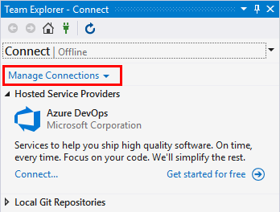

# Navigate in Visual Studio Team Explorer

[!INCLUDE [version-lt-eq-azure-devops](../includes/version-lt-eq-azure-devops.md)] 
[!INCLUDE [version-vs-gt-eq-2019](../includes/version-vs-gt-eq-2019.md)]

You use Team Explorer to coordinate your code efforts with other team members to develop a software project. In addition, you can manage work and that is assigned to you, your team, or your projects. Team Explorer is a plug-in that installs with Visual Studio. Developers can effectively collaborate using Team Explorer connected to projects hosted on Azure DevOps Services or an on-premises Azure DevOps Server.

> [!TIP]
> You can install the latest version of Visual Studio clients from the [Visual Studio downloads page](https://visualstudio.microsoft.com/downloads/?utm_medium=microsoft&utm_source=learn.microsoft.com&utm_campaign=button+cta&utm_content=download+vs2017). 
> 
> Additional options for connecting to Azure DevOps Services or TFS include:  
> - [Azure DevOps Plugin for Android Studio](/previous-versions/azure/devops/all/java/download-android-studio-plug-in)  
> - [Azure DevOps Plugin for IntelliJ](/previous-versions/azure/devops/all/java/download-intellij-plug-in)
> - [Visual Studio Code](https://code.visualstudio.com/docs)  
> 
> For information about compatibility among client and server versions, see [Requirements and compatibility](/azure/devops/server/requirements).

If you don't need Visual Studio, but want to connect to a project in Azure DevOps, you can install the free [Visual Studio Community](https://visualstudio.microsoft.com/downloads/download-visual-studio-vs).

## Prerequisites 

- You must have a project in Azure DevOps. If you need to add a project, see [Create a project](../organizations/projects/create-project.md).
- You must be a member of the project you connect to. To get added, see [Add users to a project or team](../organizations/security/add-users-team-project.md).

## Connect to a project or repository

Team Explorer connects Visual Studio to projects in Azure DevOps. You can manage source code, work items, and builds. The operations available to you depend on which source control option&mdash;Git or Team Foundation version control (TFVC) &mdash;was selected to manage source code when the project was created.

> [!TIP]  
> If you open Visual Studio and the Team Explorer pane doesn't appear, choose the **View>Team Explorer** menu option from the tool bar.

From the **Connect** page, you can select the projects you want to connect to and quickly switch connection to a different project and or repository. For details, see [Connect to a project](../organizations/projects/connect-to-projects.md).

The Git and TFVC repos support different pages and functions. For a comparison of the two version control systems, see [Choosing the right version control for your project](../repos/tfvc/comparison-git-tfvc.md). 

## Git version control and repository 

The following image shows the pages available when you connect to a Git repository from Visual Studio Team Explorer. 

[!INCLUDE [temp](../repos/git/includes/note-new-git-tool.md)] 

 

To learn more about each page, see the following articles. 

:::row:::
   :::column span="1":::
      **Home and Builds**
   :::column-end:::
   :::column span="1":::
      **Git version control**
   :::column-end:::
   :::column span="1":::
      **Work items** 
   :::column-end:::
:::row-end:::
---
:::row:::
   :::column span="1":::
      **Home** 
      - [Web portal](../project/navigation/index.md) 
      - [Task Board](../boards/sprints/task-board.md)
       
      **Builds** 
      - [Create build pipelines](../pipelines/tasks/index.md) 
      - [View and manage builds](../pipelines/get-started/what-is-azure-pipelines.md) 
      - [Manage the build queue](../pipelines/agents/pools-queues.md) 
   :::column-end:::
   :::column span="1":::
      - [Create a new repo](../repos/git/creatingrepo.md) 
      - [Clone an existing repo](../repos/git/clone.md) 
      - **Changes**: [Save work with commits](../repos/git/commits.md) 
      - **Branches**: [Create work in branches](../repos/git/create-branch.md) 
      - **Pull Requests**: [Review code with pull requests](../repos/git/pull-requests.md)" 
      - **Sync**: [Update code with fetch and pull](../repos/git/pulling.md) 
      - **Tags**: [Work with Git tags](../repos/git/git-tags.md) 
      - [Git preferences](../repos/git/git-config.md) 
      - [Git command reference](../repos/git/command-prompt.md) 
   :::column-end:::
   :::column span="1":::
      **Default experience** (Visual Studio 2019 and later versions) 
      - [View and add work items](../boards/work-items/view-add-work-items.md) 
      - [Set the Work Items experience in Visual Studio](../boards/work-items/set-work-item-experience-vs.md)  
         
      **Legacy experience** (All Visual Studio versions)
      - [Add work items](../boards/backlogs/add-work-items.md) 
      - [Query editor](../boards/queries/using-queries.md) 
      - [Query folders](../boards/queries/organize-queries.md) 
      - [Query permissions](../boards/queries/set-query-permissions.md) 
      - [Open query in Excel](../boards/backlogs/office/bulk-add-modify-work-items-excel.md) 
      - [Email query results using Outlook](../boards/queries/share-plans.md) 
      - [Create reports from query in Excel](/previous-versions/azure/devops/report/admin/create-status-and-trend-excel-reports) 
   :::column-end:::
:::row-end:::

## Team Foundation version control 

The following image shows the pages available when you connect to a TFVC repository from Visual Studio Team Explorer. 

  

To learn more about each page, see the following articles. 

:::row:::
   :::column span="1":::
      **Home and Builds**
   :::column-end:::
   :::column span="1":::
      **TFVC**
   :::column-end:::
   :::column span="1":::
      **Work items** 
   :::column-end:::
:::row-end:::
---
:::row:::
   :::column span="1":::
      **Home** 
      - [Web portal](../project/navigation/index.md) 
      - [Task Board](../boards/sprints/task-board.md) 
       
      **Builds** 
      - [Create build pipelines](../pipelines/tasks/index.md) 
      - [View and manage builds](../pipelines/get-started/what-is-azure-pipelines.md) 
      - [Manage the build queue](../pipelines/agents/pools-queues.md) 
   :::column-end:::
   :::column span="1":::
      - [Configure workspace](../repos/tfvc/share-your-code-in-tfvc-vs.md#configure-your-workspace) 
      - [Suspend/resume work](../repos/tfvc/suspend-your-work-manage-your-shelvesets.md), [Code review](../repos/tfvc/day-life-alm-developer-suspend-work-fix-bug-conduct-code-review.md)  
      - **Pending Changes**: [Manage pending changes](../repos/tfvc/develop-code-manage-pending-changes.md), [Find shelvesets](../repos/tfvc/suspend-your-work-manage-your-shelvesets.md), [Resolve conflicts](../repos/tfvc/resolve-team-foundation-version-control-conflicts.md) 
      - **Source Control Explorer**: [Add/view files and folders](../repos/tfvc/add-files-server.md) 
      - [Add Check-In Policies](../repos/tfvc/add-check-policies.md) 
      - [Version control commands](../repos/tfvc/use-team-foundation-version-control-commands.md) 
   :::column-end:::
   :::column span="1":::
      **Default experience** (Visual Studio 2019 and later versions) 
      - [View and add work items](../boards/work-items/view-add-work-items.md) 
      - [Set the Work Items experience in Visual Studio](../boards/work-items/set-work-item-experience-vs.md)  
         
      **Legacy experience** (All Visual Studio versions)
      - [Add work items](../boards/backlogs/add-work-items.md) 
      - [Query editor](../boards/queries/using-queries.md) 
      - [Query folders](../boards/queries/organize-queries.md) 
      - [Query permissions](../boards/queries/set-query-permissions.md) 
      - [Open query in Excel](../boards/backlogs/office/bulk-add-modify-work-items-excel.md) 
      - [Email query results using Outlook](../boards/queries/share-plans.md) 
      - [Create reports from query in Excel](/previous-versions/azure/devops/report/admin/create-status-and-trend-excel-reports) 
   :::column-end:::
:::row-end:::
 

 

::: moniker range="< azure-devops"

## Reports 

> [!NOTE]  
> Some pages, such as **Reports**, only appear when an on-premises TFS is configured with the required resources, such as SQL Server Reporting Services.

The **Reports** page opens the [Reporting Services report site](/previous-versions/azure/devops/report/sql-reports/reporting-services-reports). This page appears only when your project has been configured with SQL Server Analysis Services and Reporting Services. Also, the option to **Create Report in Microsoft Excel** appears only when reporting has been configured for the project.

If your project is missing one or more pages, you may be able to [add functionality to your on premises TFS deployment](/azure/devops/server/admin/admin-quick-ref).

::: moniker-end

## Settings  

From the **Settings** page, you can configure administrative features for either a project or project collection. To learn more about each page, see the following articles. Most of the links open to a web portal administration page. Not all settings are available from the Team Explorer plug-in for Eclipse. 

:::row:::
   :::column span="":::
      **Project**  
      - [Security, Group Membership](../organizations/security/change-project-level-permissions.md)
      - [Security, Source Control (TFVC)](../repos/tfvc/set-tfvc-repository-permissions.md)  
      - [Work Item Areas](../organizations/settings/set-area-paths.md)  
      - [Work Item Iterations](../organizations/settings/set-iteration-paths-sprints.md)  
      - [Portal Settings](../project/configure-or-add-a-project-portal.md)  
      - [Project Alerts](../organizations/notifications/manage-team-group-global-organization-notifications.md)  

   :::column-end:::
   :::column span="":::
      **Project Collection**  
      - [Security, Group Membership](../organizations/security/change-organization-collection-level-permissions.md) 
      - [Source Control (TFVC)](../repos/tfvc/decide-between-using-local-server-workspace.md) 
      - [Process Template Manager](../boards/work-items/guidance/manage-process-templates.md)  
         
      **Other**  
      - [Git Global Settings](../repos/git/git-config.md)  
      - [Git Repository Settings](../repos/git/git-config.md)  
   :::column-end:::
:::row-end:::

To learn more about settings, see [About team, project, and organizational-level settings](../organizations/settings/about-settings.md).

## Refresh Team Explorer  

If data doesn't appear as expected, the first thing to try is to refresh your client. Refreshing your client updates the local cache with changes that were made in another client or in Azure DevOps. To refresh Team Explorer, do one of the following actions:

- To refresh a page that you are currently viewing, choose :::image type="icon" source="../boards/media/icons/te-refresh-query-icon.png" border="false"::: **Refresh** in the menu bar (or choose **F5**).
- To refresh the project you currently have selected, choose :::image type="icon" source="media/work-team-explorer/IC547418.png" border="false"::: **Home**, and then choose  **Refresh** (or choose **F5**).
- To refresh the set of teams defined for the project that you currently have selected, choose **Connect**, and then choose :::image type="icon" source="../boards/media/icons/te-refresh-query-icon.png" border="false"::: **Refresh** (or enter **F5**).

[!INCLUDE [temp](includes/when-to-refresh-client.md)]

[!INCLUDE [temp](../includes/images-not-appearing-vs.md)] 

## Related articles

- [Troubleshoot connection](troubleshoot-connection.md)  
- [Create a project](../organizations/projects/create-project.md)
 