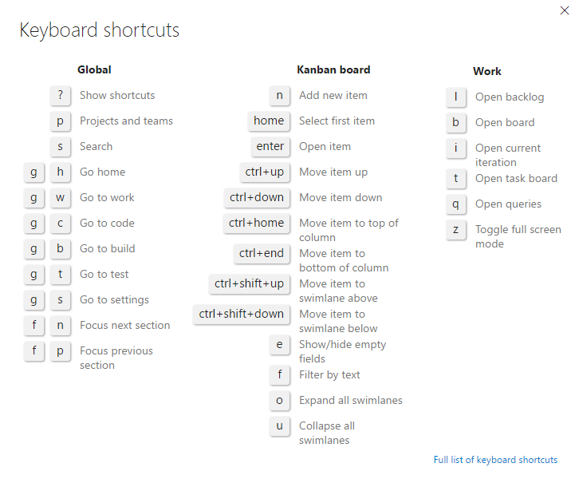

### Kanban board controls

| Control                  | Function                      |
|--------------------------|-------------------------------|
| Backlog               | [Switch to backlog view](../backlogs/create-your-backlog.md)           |
| Board    | Switch to Kanban board view            | 
|  | [Filter by keyword or tag](../kanban/filter-kanban-board.md#text-filter)   |  
|  | [Filter by field](../kanban/filter-kanban-board.md#field-filter)   | 
|   | [Enable live updates](#live-updates)  |
|  | Customize the board and configure team settings: [Cards](../customize/customize-cards.md)  &#124; [Card reordering](#reorder-cards) &#124; [Columns](../kanban/add-columns.md)  &#124; [Swimlanes](../kanban/expedite-work.md)  &#124; [CFD chart](../../report/guidance/cumulative-flow.md) &#124; [Backlogs](../customize/select-backlog-navigation-levels.md) &#124; [Working days](../customize/set-working-days.md) &#124; [Working with bugs](../customize/show-bugs-on-backlog.md)   |
|  /    | Enter or exit full screen mode      |   
 

Enter **?** to open the Kanban board keyboard shortcuts.  

>[!NOTE]  
><b>Feature availability: </b>Global keyboard shortcuts are available from Team Services and the web portal for TFS 2015.2 or later version.  

  
  

