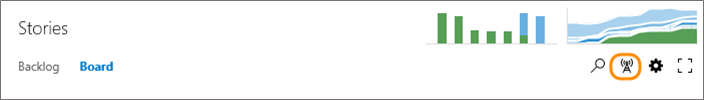

### Enable live updates 

>[!NOTE]  
><b>Feature availability: </b> This feature is supported from VSTS and TFS 2017 and later versions.   

Enable live updates to automatically refresh your Kanban board when changes occur. With live updates enabled, you no longer have to press F5 to see the latest changes. 

  

As one team member updates the status of a work item, other team members will see those updates in real time as they occur.  

  

