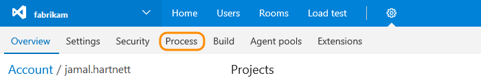
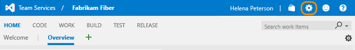
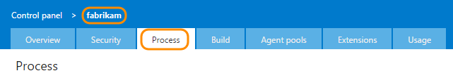
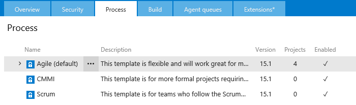

0. To open the admin context from the user context, click the  gear Settings icon and choose Account settings.
 
	>[!IMPORTANT]  
	>If you don't see the Account settings option, then you're working from an on-premises TFS. The Process page isn't supported. You must use the features supported for the On-premises XML process model as described in [Customize your work tracking experience](../customize/customize-work.md).
	
	 

0. Click Process.   

	  

<!---
<ol>
<li>

To start, open the Process hub within the admin context. The steps differ depending on which navigation experience you are using.

 

<ul class="nav nav-pills" style="padding-right:15px;padding-left:15px;padding-bottom:5px;vertical-align:top;font-size:18px;">
<li style="float:left;" data-toggle="collapse" data-target="#open-admin">Open the Process page in the admin context</li>
<li style="float: right;"><a style="max-width: 374px;min-width: 120px;vertical-align: top;background-color:#AEAEAE;margin: 0px 0px 0px 8px;min-width:90px;color: #fff;border: solid 2px #AEAEAE;border-radius: 0;padding: 2px 6px 0px 6px;outline-style:none;height:32px;font-size:14px;font-weight:400" data-toggle="pill" href="#old-nav">Old navigation</a></li>
<li class="active" style="float: right"><a style="max-width: 374px;min-width: 120px;vertical-align: top;background-color:#007acc;margin: 0px 0px 0px 0px;min-width:90px;color: #fff;border: solid 2px #007acc;border-radius: 0;padding: 2px 6px 0px 6px;outline-style:none;height:32px;font-size:14px;font-weight:400" data-toggle="pill" href="#new-nav">New navigation enabled</a></li>

</ul>
 

 

To open the admin context from the user context, click the  gear Settings icon.
 

 

Click the account name to open the collection-level settings, and then open the Process tab. 
 
 

 

<blockquote>**Tip**:  To enable or disable the new navigation experience, open your user account menu. For more information, see [Work in the web portal, Admin context](../../connect/work-web-portal.md#admin-context).  </blockquote>

Choose the Account settings option from the project/team menu.

Click Process. 
 

  

 

<li>
You'll see the three default system processes. The lock icon indicates that you're not able to customize these processes.
 

  

</li>
</ol> 

-->