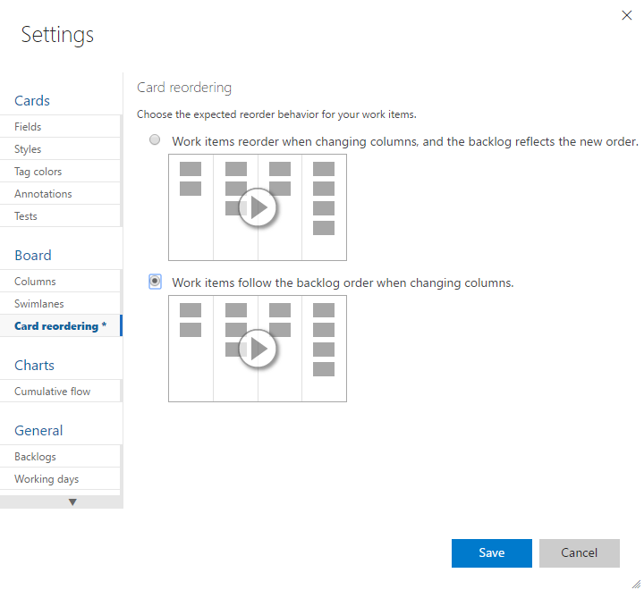

### Reorder cards  
<blockquote style="font-size: 13px"><b>Feature availability: </b> This feature is currently supported from Team Services or an on-premises TFS 2015.1 or later version. </blockquote>  

You can drag any work item to any column or swimlane on the Kanban board. You can even change the order of items as you move a card to a new column.   

#### Set card reordering team preference  

<blockquote style="font-size: 13px"><b>Feature availability: </b> This feature is currently supported only from Team Services or to an on-premises application server that's been upgraded to TFS 2015 Update 2 or later version.  </blockquote>  

If you want to preserve the backlog priority when you move a card to a new column, you can change the Kanban board card reordering setting for your team. 

1. To open, click the  gear icon from your team's Kanban board.  

	  

	If you're not a team admin, [get added as one](../scale/manage-team-assets.md#add-team-admin). Only team and project admins can set team settings.  

2. From the Card reordering page you can choose between the two supported behaviors.    
	   

	The setting you choose applies to all active Kanban boards for your team.  

<blockquote style="font-size: 13px"><b>Note: </b> The last column, typically the Closed or Done column, is always ordered by Closed Date with recently Closed showing at the top. In all other columns, cards are ordered by the backlog order or they are reorder based on the Card reordering setting selected. </blockquote>  

