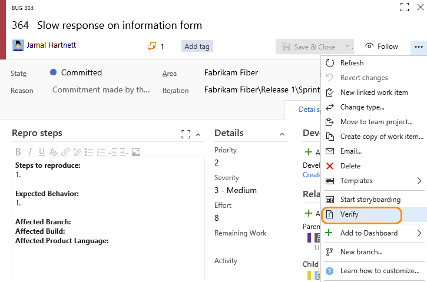

###Verify a bug, re-run tests defined for web apps 

>[!NOTE]   
><b>Feature availability: </b>The **Verify** option is available from the bug work item form from VSTS and the web portal for TFS 2017.1 or later versions.  

Choose the **Verify** option to re-run tests which identified the bug. You can invoke the Verify option from the bug work item form context menu to launch the relevant test case in the web runner. Perform your validation using the web runner and update the bug work item directly within the web runner.

  
 
To learn more about running test from the web portal, see [Run tests for web apps](../../manual-test/getting-started/run-manual-tests.md).
