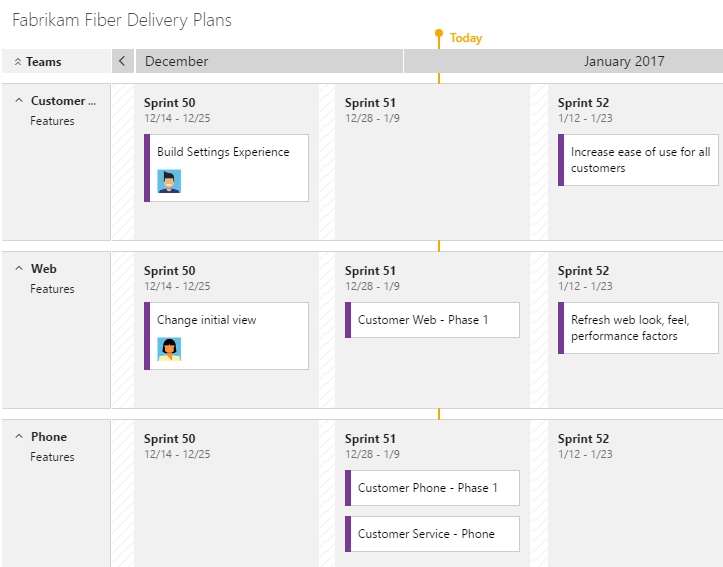

# Backlogs, boards, and plans  

<b>Team Services | TFS 2017 | TFS 2015 | TFS 2013</b> 

What can you do from a backlog view versus a board view? How do these differ from plans? How do changes you make in one show up on the other? What customizations can you make for each? 

Which view should you use to work with Agile methods? 

#### In a nutshell...  

-  Backlogs display work items as a list and boards display them as cards  
-  You use your product backlog to quickly plan and prioritize your work  
-  You use your sprint backlogs and task boards when you work in Scrum   
-  You use your Kanban board to update work status and when you employ Kanban methods   
-  Each backlog is associated with a board, changes to priority order you make in one are reflected in its corresponding board  
-  Plans allow you to review the deliverables for several teams across sprints and a calendar schedule Delivery Plans are available for Team Services and TFS 2017.2 and later versions. You access them by [installing the Marketplace Plans extension](https://marketplace.visualstudio.com/items?itemName=ms.vss-plans)
-  Backlogs, boards, and plans are configurable for each team.  
 

With list backlogs you can quickly develop your project plan; group and prioritize work; and perform bulk updates on selected work items. With boards, you can quickly update status and fields displayed for each work item. 

And with plans, you can monitor progress, deliverables, and dependencies across several teams.  

You access your backlogs and boards from the **Work** hub. When you work from the Stories (Agile) or Backlog items (Scrum) pages, you have access to the product backlog and Kanban board. When you work from a sprint page, you have access to the sprint backlog and task board. For an overview of working in Scrum or Kanban, see [Get started with Agile project management](agile-project-management.md).

  

## Three classes of backlogs, two types of boards  

To manage work, you have access to three classes of backlogs&mdash;portfolio, product, and sprint&mdash;and two types of boards&mdash;Kanban and task. Backlogs list work items, boards display work items as cards. Backlog and board views provide similar and distinct features to support planning and tracking. 

You use work items to share information, assign work to team members, track dependencies, organize work, and more. You can apply different filters to your backlogs and boards to just show those items of interest. 

### Portfolio, product, and sprint backlogs 
Portfolio backlogs typically track high-level features, scenarios, or epics. Your product backlog contains a prioritized list of user stories, deliverables, or work you plan to build or fix. Portfolio backlogs help you organize your product backlog into a hierarchy of elements. Sprint backlogs contain just those items that each team is working on during a scheduled sprint or iteration period. 

For details about working in each type of backlog, see [Create your backlog](backlogs/create-your-backlog.md), [Define features and epics](backlogs/define-features-epics.md), and [Sprint planning (sprint backlogs)](scrum/sprint-planning.md). 

>[!TIP]  
>You can't sort a backlog by column. However, you can use the Create Query option on each backlog to create a query that you can sort on any field column you choose. To learn more about queries, see [Use the query editor to list and manage queries](./track/using-queries.md).  

### Kanban and task boards
Kanban and task boards support visualizing the flow of work and monitoring metrics to optimize that flow. Kanban boards track requirements, are sprint-independent, and you monitor the flow through the cumulative flow chart. Task boards track tasks defined for a sprint and you monitor the flow via the sprint burndown chart. 

For details about working in each type of board, see [Kanban basics](kanban/kanban-basics.md) and [Task board](scrum/task-board.md). 

### Feature support across backlogs and boards
The following table indicates those elements or tasks associated with each type of backlog and board. 


<div style="font-size:90%">


<table width="100%"> 
<tbody valign="top">
<tr>
<th width="25%">Associated element or task</th>
<th width="15%">Backlog type:<br/>Portfolio</th>
<th width="15%">Backlog type:<br/>Product</th>
<th width="15%">Board type:<br/>Kanban</th>
<th width="15%">Backlog type:<br/>Sprint</th>
<th width="15%">Board type:<br/>Task</th>
</tr>

<tr>
<td>Corresponding backlog or board type</td>
<td>Kanban</td>
<td>Kanban</td>
<td>Portfolio or product</td>
<td>Task</td>
<td>Sprint</td>
</tr>

<tr>
<td>Add items and child items<br/>(see notes 1, 2)</td>
<td>Yes</td>
<td>Yes</td>
<td>Yes</td>
<td>Yes</td>
<td>Yes</td>
</tr>

<tr>
<td>Reorder items</td>
<td>Yes</td>
<td>Yes</td>
<td>Yes</td>
<td>Yes</td>
<td>Yes</td>
</tr>

<tr>
<td>Map items</td>
<td>Yes (except the top-level portfolio backlog)</td>
<td>Yes</td>
<td>No</td>
<td>No</td>
<td>No</td>
</tr>


<tr>
<td>Filter</td>
<td>Text or tags</td>
<td>Text or tags</td>
<td>Text or select fields</td>
<td>Text</td>
<td>Backlog items or people</td>
</tr>


<tr>
<td>Show/hide parents</td>
<td>Yes (except the top-level portfolio backlog)</td>
<td>Yes</td>
<td>No</td>
<td>No</td>
<td>No</td>
</tr>

<tr>
<td>Show/hide in progress items<br/>(see note 3)</td>
<td>Yes</td>
<td>Yes</td>
<td>No</td>
<td>No</td>
<td>No</td>
</tr>

<tr>
<td>Forecast</td>
<td>No</td>
<td>Yes</td>
<td>No</td>
<td>No</td>
<td>No</td>
</tr>


<tr>
<td>Customize: show bugs (see note 1)</td>
<td>No </td>
<td>Yes </td>
<td>Yes </td>
<td>Yes </td>
<td>Yes </td>
</tr>

<tr>
<td>Customize: Columns</td>
<td>Yes, see [Column options](#column-options)</td>
<td>Yes, see [Column options](#column-options)</td>
<td>Yes, see [Add columns](kanban/add-columns.md)</td>
<td>Yes, see [Column options](#column-options)</td>
<td>Yes, see [Customize workflow](process/customize-process-workflow.md)</td>
</tr>

<tr>
<td>Customize: Add more backlog or board views </td>
<td>Yes, see [Select backlog navigation levels](customize/select-backlog-navigation-levels.md)</td>
<td>Yes, when you add another team (see note 4)</td>
<td>Yes, see [Select backlog navigation levels](customize/select-backlog-navigation-levels.md)</td>
<td>Yes, see [Schedule sprints](scrum/define-sprints.md)</td>
<td>Yes, see [Schedule sprints](scrum/define-sprints.md)</td>
</tr>

<tr>
<td>[Customize: cards](customize/customize-cards.md)</td>
<td>n/a</td>
<td>n/a</td>
<td>Yes</td>
<td>n/a</td>
<td>Yes</td>
</tr>


<tr>
<td>Charts </td>
<td>[Cumulative flow](../report/guidance/cumulative-flow.md)<br/>[Velocity](scrum/velocity-and-forecasting.md)</td>
<td>[Cumulative flow](../report/guidance/cumulative-flow.md)<br/>[Velocity](scrum/velocity-and-forecasting.md)</td>
<td>[Cumulative flow](../report/guidance/cumulative-flow.md)<br/>[Velocity](scrum/velocity-and-forecasting.md)</td>
<td>[Sprint burndown](scrum/sprint-burndown.md) </td>
<td>[Sprint burndown](scrum/sprint-burndown.md) </td>
</tr>

<tr>
<td>Duration (see note 5) </td>
<td>Project or release</td>
<td>Project</td>
<td>Project</td>
<td>Sprint</td>
<td>Sprint</td>

</tr>
</tbody>
</table>


<p><b>Notes:</b></p>
<ol>
<li>Each team can determine how they want to track bugs: as requirements, as tasks, or not at all. When tracked as requirements, they appear in your product backlog, sprint backlogs, and Kanban board. When tracked as tasks, they appear in your sprint backlogs and task boards. For details, see [Show bugs on backlogs and boards](customize/show-bugs-on-backlog.md).</li>
<li>Work items that appear on each team backlog and board meet the criteria defined for the [team selected area and iteration paths](#team-assignments).</li>
<li>The "In progress items Show/Hide" control is another filter you can apply to your product and portfolio backlogs. This control essentially shows or hides those work items where work has begun. It's useful to show/hide In Progress items when [forecasting sprint work](scrum/velocity-and-forecasting.md).</li>
<li>When you [add a team](scale/multiple-teams.md), you essentially add another product backlog associated with that team. Each team can then manage their own set of sprint backlogs and portfolio backlogs. See [Configure team settings](scale/manage-team-assets.md) for details. </li> 
<li>Duration refers to how you use your backlog or board to plan and track work over time. Once you change the State of a work item to done or completed, it no longer appears on a portfolio or project backlog. As you complete each sprint, the system maintains a history of your activity. You can review past sprints and sprint burndown charts by choosing the sprint listed under the Past section. For more information, see [Sprint burndown](scrum/sprint-burndown.md#current-and-past-sprint-burndown-charts).</li>
</ol>
</div>

<div style="clear:left;font-size:100%">
</div>


<a id="plans">  </a>
## Review team deliverables using Delivery Plans   

With Delivery Plans, you gain  tailor-made views across several teams and their development backlogs&mdash;stories, features, or epics.  You can use these views to drive alignment across teams by overlaying several backlogs onto your delivery schedule. 

> [!NOTE]  
> **Feature availability**: Delivery Plans, a [Visual Studio Marketplace extension](https://marketplace.visualstudio.com/items?itemName=ms.vss-plans), is available for Team Services and TFS 2017.2 and later versions. All users with [basic access](connect/change-access-levels.md) can view, add, and configure Delivery Plans. Stakeholders, however, don’t have access to Delivery Plans.  

When you configure a plan, you select the team or teams and backlog levels of interest. To learn more about Delivery Plans, see [Review team plans](scale/review-team-plans.md). 

 


 
<a id="team-assignments">  </a>
## Work item tracking, Agile tools, and team default assignments

What work items appear on team backlogs and boards? When you add work items to a backlog or board, how are team defaults used to assign field values? 

Depending on the size of your organization and your tracking needs, you can set up a team structure similar to the one shown. You do this by defining teams and their associated area path(s). 

 

For example, each feature team can be associated with a single feature area path&mdash;such as *Customer Profile*, *Shopping Cart*, *Email*&mdash;or several area paths. Each management team, which focuses on a set of features, can choose several area paths to monitor. This allows each feature team to have their distinct backlog to plan, prioritize, and track their work. And, portfolio or product owners can create their vision, road map, and goals for each release, monitor progress across their portfolio of projects, and manage risks and dependencies. To learn more, see [Portfolio management](scale/portfolio-management.md). 

>[!NOTE]  
>Some features are available only from Team Services or TFS 2017 and later versions. For details, see [Set team defaults](scale/set-team-defaults.md).

When you define a team, you define the team's: 
- Selected area path(s) 
- Default area path
- Selected iteration path(s)
- Backlog iteration path 
- Default iteration path 

All Agile tools reference the area path(s) defined for a team. For example, one team might handle all work assigned to *Customer Profile* and *Shopping Cart*, while another team only manages work assigned to the *Email* area path.  Also, the set of work items that appear on a backlog or board depend on the current State of a work item or it's parent-child status.   

In addition, several tools reference the team's default iteration and associated iteration paths or sprints. For example, when you add new work items from a backlog or board view, or from a team dashboard, the system assigns the team's default area path and default iteration path to these work items. 

<div style="font-size:90%">

<table valign="top" width="100%" > 
<tr valign="top" > 
<th width="20%">Agile tool</th>
<th width="18%">Area path (see note 1)</p></th>
<th width="32%">Iteration path</p></th>
<th width="30%">State</p></th>
</tr>
<tr valign="top" > 
<td>Portfolio or product backlogs</td>
<td>Selected area path(s)</td>
<td>Equal to or under team's [backlog iteration path](scale/set-team-defaults.md#set-backlog-iteration)</td>
<td>Active (corresponds to a Proposed or InProgress state category, see notes 2, 3)</td>
</tr>


<tr valign="top" > 
<td>Kanban boards (see note 4)</td>
<td>Selected area path(s)</td>
<td>Equal to or under team's [backlog iteration path](scale/set-team-defaults.md#set-backlog-iteration)</td>
<td>Any state (see notes 3, 5)</td>
</tr>

<tr valign="top" > 
<td>Sprint backlogs (see note 4)</td>
<td>Selected area path(s)</td>
<td>Team's selected iteration paths</td>
<td>Any state (see notes 3, 5)</td>
</tr>


<tr valign="top" > 
<td>Task boards (see note 4)</td>
<td>Selected area path(s)</td>
<td>Team's selected iteration paths</td>
<td>Any state (see notes 3, 5)</td>
</tr>

<tr valign="top" > 
<td>New work item widget</td>
<td>Default area path</td>
<td>Default iteration path</td>
<td>n/a</td>
</tr>

</table>

<p><b>Notes:</b><p>
<ol>
<li>Agile tools filter items based on the team's selected area path(s). Teams can choose [whether to include or exclude items assigned to subarea paths](scale/set-team-defaults.md#team-area-paths).</li>
<li>Work items whose State equals Closed, Done, or Removed (corresponding to a Completed category state) don't appear on portfolio and product backlogs.</li>
<li>You can add custom workflow states and assign them to one of three state categories. The [state categories](concepts/workflow-and-state-categories.md) determine which work items appear on backlog and board views. </li>
<li>Kanban boards, sprint backlogs, and task boards only show the last node in a hierarchy, called the leaf node. For example, if you link items within a hierarchy that is four levels deep, only the items at the fourth level appear on the Kanban board, sprint backlog, and task board. To learn more, see [parent-child links between items](#leaf-nodes).</li>
<li>Work items whose State equals Removed don't appear on boards.</li> 
</ol>
</div>

<div style="clear:left;font-size:100%">
</div>

<a id="display-hierarchy">  </a>
## Fix "Ordering backlog items is disabled" 

When a sprint backlog contains same-category, nested  work items&mdash;as described in the next section, [How backlogs and boards display hierarchical (nested) items](#nested)&mdash;the system disables the drag-and-drop reorder feature. It does this as it determines that not all items display under these circumstances.  

To fix this, take the following actions: 

1. Click the **Create query** link on the backlog page. 
    
	

2. Open the query (click the link that appears). 

3. Review the list of items to determine which items are nested. For example, the following query shows that a bug is a child of a user story. Because the team has configured their backlog to display user stories and bugs at the same level (Requirements category), this corresponds to a nested item that disables the ordering feature. 

	

4. Remove all parent-child links that exist among nested items. 

5. Return to the backlog page and refresh the page. 
 
<a id="nested">  </a>
### How backlogs and boards display hierarchical (nested) items 
 
While you can create a hierarchy of backlog items, tasks, and bugs&mdash;we don't recommend that you create same-category hierarchies. That is, don't create parent-child links among work items of the same type, such as story-story, bug-bug, task-task. The reason is that the Kanban board, sprint backlog, and task board only show the last node in a same-category hierarchy, called the leaf node. For example, if you link items within a same-category hierarchy that is four levels deep, only the items at the fourth level appear on the Kanban board, sprint backlog, and task board.  

Instead of nesting requirements, bugs, and tasks, we recommend that you maintain a flat list. In other words, only create parent-child links one level deep between items that belong to a different category. Use the Feature work item type when you want to group user stories (Agile), product backlog items (Scrum), or requirements (CMMI). You can [quickly map product backlog items to features](backlogs/organize-backlog.md), which creates parent-child links in the background.    

 

<a id="leaf-nodes">  </a>
### When you track bugs as requirements

As mentioned previously, [each team can choose how they want to track bugs](customize/show-bugs-on-backlog.md) to behave like requirements, or tasks, or as neither. 

When you make a bug or requirement a child of another bug or requirement, all items appear on the product backlog page, but only the child bug or requirement appears on the Kanban board. For example, the third user story, *Interim save on long form*, has a child bug, *Save takes too long*. 

The child bug, *Save takes too long*, appears on the Kanban board, but not the parent user story.  

**All bugs and requirements appear on the backlog**  

  

**Only leaf nodes appear on the Kanban board**  

  

<a id="bugs-as-tasks">  </a>
### When you track bugs as tasks

When you choose to have bugs appear in the backlog with tasks, linking tasks and bugs to their parent requirements groups them accordingly on the sprint backlog and task board.  

However, if you create parent-child links between a requirement and a bug, and the bug and a task, as shown here, the task will appear on the sprint backlog and task board, but not the bug. 

**Hierarchy of items assigned to the sprint backlog**  

   

**Only leaf nodes appear on the sprint backlog**  

  

**Only leaf nodes appear on the task board**   
  

Is there a workaround to display intermediate nodes within a hierarchy?  Not at this time. You can always check the entire list of items assigned to a sprint by using the **Create Query** link. 


## Related notes   
Now that you understand how backlogs, boards, and plans work, [get started using them to plan and track your work](agile-project-management.md).

A few things to keep in mind...
- Every team owns their own backlog, to add a new set of backlogs and boards, you [add a new team](scale/multiple-teams.md) 
- To have work performed by several teams roll up to a portfolio backlog, you'll want to [setup the team hierarchy](scale/portfolio-management.md)   
- Every backlog has a corresponding [Kanban board](kanban/kanban-basics.md) you can use to track progress and update status  
- Each team can control how [bugs show up on their backlogs ](customize/show-bugs-on-backlog.md)  
- When you add child items they're linked to their parent using parent-child links which support hierarchical views and [tree queries](track/using-queries.md#tree-query)    
- If you need more than three backlog levels, you can add more based on the process model you use: 
	- **Inheritance**: [Customize your backlogs or boards for a process](process/customize-process-backlogs-boards.md)  
	- **Hosted XML or On-premises XML**: [Add portfolio backlogs](customize/add-portfolio-backlogs.md).  
 

Additional topics of interest:

<div style="float:left;width:170px;margin:3px;font-size:90%">
<p style="font-weight:bold;padding-bottom:0px;text-align:center;">Navigate</p>
- [Connect to a team project](../connect/connect-team-projects.md)   
- [Work from the account hub](../connect/account-home-pages.md)  
- [Work in the web portal](../connect/work-web-portal.md)   
- [Work in Team Explorer](../connect/work-team-explorer.md)   
- [User focused features](../connect/user-focused-features.md)     
</div>

<div style="float:left;width:250px;margin:3px;font-size:90%">
<p style="font-weight:bold;padding-bottom:0px;text-align:center;">Manage</p>
- [Add work items](backlogs/add-work-items.md)   
- [Use a template to pre-populate fields](productivity/work-item-template.md)   
- [Change, move, or delete a work item](backlogs/remove-delete-work-items.md)      
</div>

<div style="float:left;width:160px;margin:3px;font-size:90%">
<p style="font-weight:bold;padding-bottom:0px;text-align:center;">Track</p>
- [Queries (work items)](track/using-queries.md)   
- [Charts](../report/charts.md)   
- [Dashboards](../report/dashboards.md)   
- [Follow work items](../collaborate/follow-work-items.md)   
- [Alerts](track/alerts-and-notifications.md)     
- [Tag work items](track/add-tags-to-work-items.md)   
- [History & audit](track/history-and-auditing.md)      
</div>


<div style="float:left;width:200px;margin:8px;font-size:90%">
<p style="font-weight:bold;padding-bottom:0px;text-align:center;">Customize</p>
- [Customize work tracking](./customize/customize-work.md)   
- [Modify area and iteration paths](./customize/modify-areas-iterations.md)   
- [Add Agile teams](./scale/multiple-teams.md)  
- [Set team defaults](./scale/set-team-defaults.md)      
</div>    


<div style="clear:left;font-size:100%">
</div>

### Additional tools from the Marketplace 

You may find additional tools to help plan and track your work from the [Visual Studio Marketplace](https://marketplace.visualstudio.com/search?target=VSTS&category=Plan%20and%20track&sortBy=Downloads).


[!INCLUDE [temp](../_shared/switch-team-context.md)]  

<a id="column-options">  </a>
### Column options 
From each backlog page, you can add or remove columns. Or, you can drag a column to a new position. Start by opening the Column Options.  Unlike a query result, you can't sort a backlog by column. However, you can use the Create Query option on each backlog to create a query that you can sort on any field column you choose.

Each user can set their own column options which persist for each product or portfolio backlog across user sessions.  

  

 


<a id="task-board-items"/> 
### Task board items versus query list items

You may notice and wonder why the items shown on the task board may differ from those listed in a query created from its corresponding sprint backlog. 

It's possible to assign tasks to an iteration but not have them linked to a parent backlog item. These items will show up in the created query, but might not show up on the task board itself. The system runs the query and then applies a few background processes before displaying the task board items.

>[!NOTE]  
>Appearance of task and child items on the task board may differ depending on whether you work in Team Services or TFS. 

These reasons can cause work items that belong to the Task Category to not appear on a sprint backlog or task board: 

- The task hasn't been linked to a parent backlog item. Only those bugs and tasks that you have linked to a parent product backlog item (Scrum), user story (Agile), or requirement (CMMI) whose iteration path is set to the sprint will appear on the sprint backlog page. 
	>[!NOTE]  
	>In Team Services and TFS 2015.2 and later versions, tasks not linked to a parent appear under an *Unparented* section. 

- The task is a parent of another task, or the user story is a parent of another user story. If you've created a hierarchy of tasks or user stories, [only the child-level tasks or the child-level stories at the bottom of the hierarchy appear](#leaf-nodes). 

- The task's linked parent corresponds to a backlog item defined for another team. Or, the area path of the task's parent backlog item differs from the task's area path.  
	>[!NOTE]  
	>In Team Services and TFS 2015.2 and later versions, tasks linked to a parent work item assigned to another team's area path will appear under the *Unparented* section.

 
 

### In Progress items filter
 
The In progress items Show/Hide filter causes some backlog items to display or not display. Bugs and other backlog items aren't listed when In progress items=Hide and their assigned State corresponds to In Progress state category. Bugs in a New state will display, however, bugs in an Assigned state won't. 

Set ```In progress items=Show``` to see all active bugs and other items on your backlog. See also [Create your backlog](backlogs/create-your-backlog.md) and [Backlogs and board views](backlogs-boards-plans.md).


 