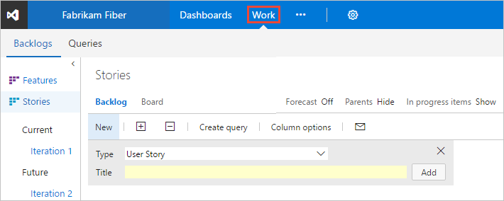

#  About backlogs

**VSTS | TFS 2017 | TFS 2015 | TFS 2013**  

You plan and track your project using the suite of Agile tools you access from the web portal. Agile tools support the core Agile methods&mdash;Scrum and Kanban&mdash;used by software development teams today. Scrum tools support defining and managing work within sprints, setting capacity, and tracking tasks. Kanban tools allow you to manage a continuous flow of work via an interactive sign board.  

You access all Agile tools from the **Work** hub. If you're new to Agile, see [What is Agile?](https://www.visualstudio.com/learn/what-is-agile/) for an overview.

  

Most Agile tools are [scoped to a team](../../teams/about-teams-and-settings.md?toc=/vsts/work/backlogs/toc.json). This supports team autonomy as well as scaling the system. 
 

You build your project plan by creating a backlog of work items that represent the features, requirements, user stories, or other work to perform. Portfolio backlogs provide support for organizing work in a hierarchical fashion and tracking major product initiatives or scenarios that rely on many stories or requirements.  Different types of work items help you track different types of work, such as user stories, tasks, bugs, issues, and more. 

## Related notes

You access tools provided by VSTS and TFS by connecting from a client to the server, either in the cloud or on-premises. Some web portal tools require additional Visual Studio Subscriptions or Advanced/VS Enterprise access.  To learn more, see [Permissions and access for work tracking](../../security/permissions-access-work-tracking.md). 

For an overview of all your customization options, see [Customize your work tracking experience](../customize/customize-work.md). 

