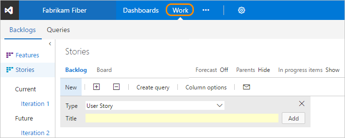
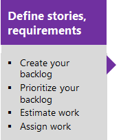

# Backlogs, work items, and Agile project management 

[!INCLUDE [temp](../_shared/version-vsts-tfs-all-versions.md)]

You plan and track your project using the suite of Agile tools you access from the web portal. Agile tools support the core Agile methods&mdash;Scrum and Kanban&mdash;used by software development teams today. Scrum tools support defining and managing work within sprints, setting capacity, and tracking tasks. Kanban tools allow you to manage a continuous flow of work via an interactive sign board.  

You access all Agile tools from **Work**. If you're new to Agile, see [What is Agile?](/azure/devops/agile/what-is-agile) for an overview.

product backlog page" style="border: 1px solid #C3C3C3;" />  

> [!NOTE]
>To understand the differences between backlogs, boards and Delivery plans, see [Backlogs, boards, and plans](backlogs-boards-plans.md). 
 

## Define work items and create your backlog  

You build your project plan by creating a backlog of work items that represent the features, requirements, user stories, or other work to perform. Portfolio backlogs provide support for organizing work in a hierarchical fashion and tracking major product initiatives or scenarios that rely on many stories or requirements.  Different types of work items help you track different types of work, such as user stories, tasks, bugs, issues, and more. 

## Try this next  

Take these tools for a test run by [signing up for a free VSTS organization](../../organizations/accounts/create-organization-msa-or-work-student.md). From there, you're ready to [create your backlog](create-your-backlog.md).  

Once you've started tracking work, you'll want to monitor and track progress, identify trends, and share your plans. See [Charts, dashboards, and widgets](../../report/overview.md). 

## Related articles

You access tools provided by VSTS and TFS by connecting from a client to the server, either in the cloud or on-premises. Some web portal tools require additional Visual Studio Subscriptions or Advanced/VS Enterprise access. To learn more, see [Permissions and access for work tracking](../../organizations/security/permissions-access-work-tracking.md). 

For an overview of all your customization options, see [Customize your work tracking experience](../customize/customize-work.md). 

 

 