# Bulk modify work items  

[!INCLUDE [temp](../_shared/version-vsts-tfs-all-versions.md)]

<!--- UPDATES REQUIRED FOR MULTI-VERSION  TAGGING -->  

Use bulk modify when you need to quickly make the same change to a number of work items. For example, you might want to change the priority of several bugs or reassign several tasks to the same team member. Use the web portal to quickly modify one or more fields for work items that will contain the same value. Use [Excel](../backlogs/office/bulk-add-modify-work-items-excel.md) to update multiple fields with different values. 

With bulk modify, you can edit fields, add or remove tags, reassign work, or move work to a specific sprint. You can also use bulk modify to change the work item type or move work items to other team projects. The options available to you depend on the platform you work from and the permissions you've been granted.

In this topic you'll learn:  

> [!div class="checklist"] 
> * How to multi-select work items from a list and open the context menu  
> * Edit one or more fields of several work items    
> * Add or remove tags from several work items  
> * Assign work from a backlog to a sprint using drag-and-drop 

>[!NOTE]  
>**Feature availability:**&#160;&#160;The following features are available from VSTS (cloud service) or from the web portal of the listed on-premises TFS version or a later version. Those not annotated are available from all platforms and versions. Visit the [Visual Studio Downloads page](https://www.visualstudio.com/downloads/download-visual-studio-vs) to get the latest TFS update. Additional resources may be required as annotated. To determine your platform or TFS version, see [Provide product and content feedback](../../user-guide/provide-feedback.md#platform-version).  

All of the following actions can be performed by team members that belong to the Contributors group. Members provided with Stakeholder access can perform multi-select, bulk edit, change type, email, and copy as HTML/copy to clipboard actions. For details, see [Work as a stakeholder](../../security/get-started-stakeholder.md).  

> [!div class="mx-tdBreakAll"]  
> |Multi-select work items|Bulk edit/update/delete|Copy, clone, change type, move, or email work items|  
> |-------------|----------|---------|  
> |- [Multi-select-query results](#multi-select) - [Multi-select-backlog](#multi-select) (TFS 2015.1)  **Link work items**
  - [Link to a new item](add-link.md#link) - [Link to an existing item](add-link.md#link) - [New branch](connect-work-items-to-git-dev-ops.md) (TFS 2017) 1|- [Edit field(s)](#edit) - [Assign to](#assign-to) - [Move to iteration](#move-iteration) - [Change position](create-your-backlog.md#move-items-priority-order) - [Change parent](organize-backlog.md#reparent) - [Add/remove tags](#tags) (TFS 2017) - [Update from template](work-item-template.md) (VSTS) 1 - [Delete](remove-delete-work-items.md#delete) 1|- [Clone or copy a single item](copy-clone-work-items.md#copy-clone) 2 - [Copy as HTML/Copy to clipboard](copy-clone-work-items.md#html) - [Email selected item(s)](../track/share-plans.md) 3 - [Change work item type](remove-delete-work-items.md#change-type) (VSTS) 1 - [Move items to another team project](remove-delete-work-items.md#move) (VSTS)&#160;1, 4|                

**Notes:**  
1. You can't perform certain functions on work items whose WITs belong to the [Hidden Types Category](../work-items/agile-glossary.md#hidden-types). This includes all work items that track tests&mdash;such as test cases, shared steps, and shared parameters&mdash;code review requests and responses, and feedback requests and responses. 
2. You can choose to copy or clone a single work item from a query results list or from the [Actions menu of the work item form](remove-delete-work-items.md). You can only perform a clone or copy action for a single work item. Choose Copy work item when you want to create a copy of a work item and change its work item type. Choose Clone when you want to create another instance of the work item without changes to its work item type. 
3. For on-premises TFS, you must have an [SMTP server configured for your deployment](../../tfs-server/admin/setup-customize-alerts.md). 
4. You must be a member of the Project Administrators group or be [granted explicit permissions to move work items](../../security/set-permissions-access-work-tracking.md#move-delete-permissions).  

[!INCLUDE [temp](../_shared/image-differences.md)]  

  

## Multi-select work items   

>[!NOTE]  
><b>Feature availability: </b> Multi-select of work items on the backlog and sprint backlogs is supported from VSTS and TFS 2015 Update 1 or later version. This feature works in the same way as multi-select works within query results.   

You can use bulk modify by selecting work items from the backlog page or query results list. From the backlog page context menu, you can change the backlog priority of several items (Change position or Move to position),  assign them to a team member, move them to a different sprint, or [map them to a feature](organize-backlog.md#mapping).

The menu options available to you change depending on the platform you work from and whether you work from a backlog page or query results list.  

#### VSTS 

<table valign="top">
<tr valign="top">
<td>

Backlog menu 

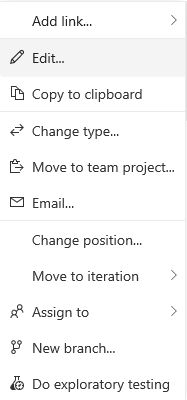  
</td>

<td>

Query results multi-select menu 

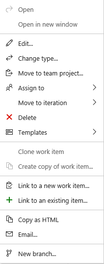 
</td>
</tr>
</table>

#### TFS 2017  

<table valign="top">
<tr valign="top">
<td>

Backlog multi-select menu 

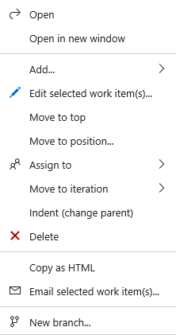  
</td>

<td>

Query results multi-select menu 

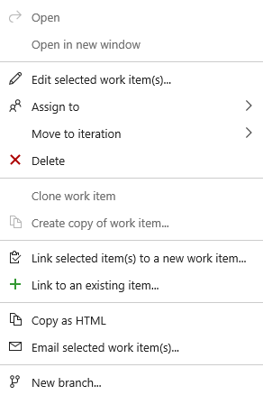  
</td>
</tr>
</table>

#### TFS 2015  

<table valign="top">
<tr valign="top">
<td>

Backlog multi-select menu

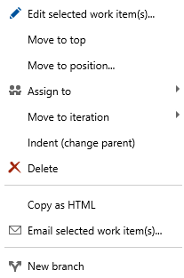 
</td>

<td>

Query results multi-select menu

  
</td>
</tr>
</table>
 

### To multi-select and open the context menu 

To select several items in a sequence, hold down the shift key. To select several non-sequential items, use the Ctrl key. Then, you can either drag the selected items to a new position within the backlog, to a different sprint. 

To open the context menu, click () or (), and then choose the option from the menu. 

Here, we use the context menu to move several non-sequential items to the current sprint.

#### VSTS and TFS 2017 

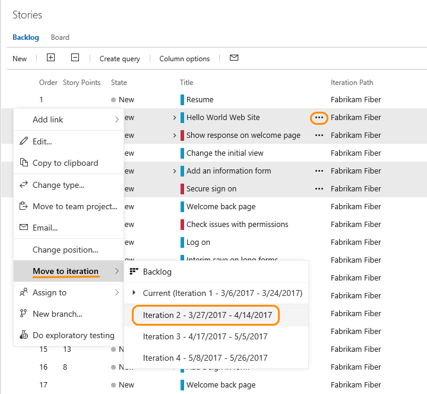

#### TFS 2015 and TFS 2013

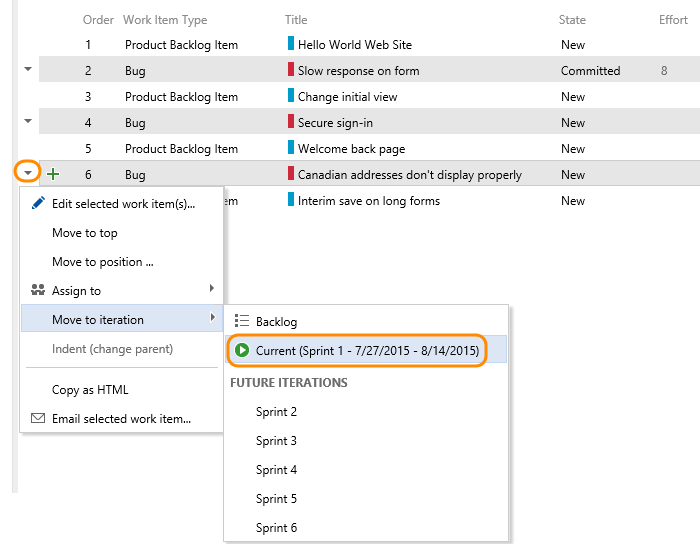

>[!TIP]  
>Use the backlog <b>Create Query</b> feature to create a query with the backlog items. You can then open the query within the web portal or [Excel](../backlogs/office/bulk-add-modify-work-items-excel.md) to perform bulk updates.  

  
## Bulk edit work items   

To start a bulk edit, begin by [multi-selecting](#multi-select) the work items you want to modify, either from the query results or the backlog. You can craft your query using the [query editor or search box](../track/using-queries.md).  

<!---
Select the work items you want to modify. 

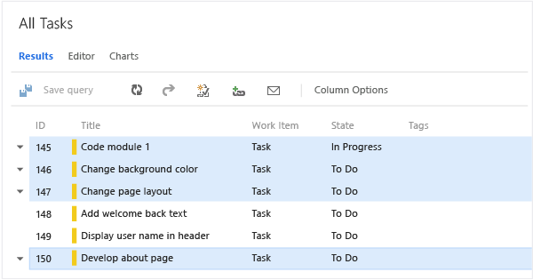
-->

 
  
### Reassign work items or edit a field  
With work items selected, open the context menu for any selected item, and reassign all of them. By doing this, you can quickly assign them to a member of your team or to another sprint or iteration. 

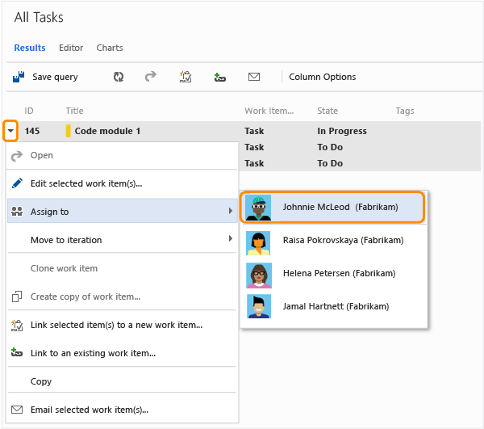  

To learn more about the Assign To and Iteration Path fields, see [Query by assignment, workflow or Kanban board changes](../track/query-by-workflow-changes.md#workflow-fields) and [Schedule sprints](../scrum/define-sprints.md).

  
### Edit fields  

To assign or modify several fields, choose Edit from the context menu of one of the selected work items. Enter a value for each field that you want to update.  

#### VSTS and TFS 2017 

1. For audit purposes, you can type a description for your bulk update task. To learn more about each field, see the [Work item field index](../work-items/guidance/work-item-field.md). 

	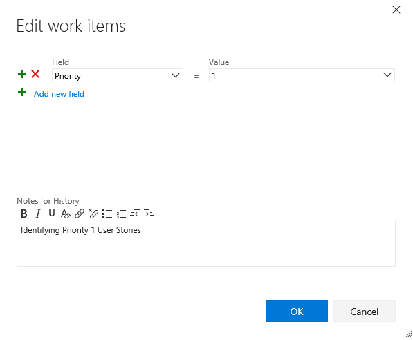

2. From the Query results page, you must save all work items that you bulk-modified. When you bulk modify items from the backlog, they are automatically saved. Work items shown in bold text indicate that local changes have not yet been saved to the data store.  

	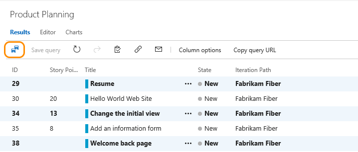

#### TFS 2015 and TFS 2013

1. For audit purposes, you can type a description for your bulk update task. To learn more about each field, see the [Work item field index](../work-items/guidance/work-item-field.md). 

	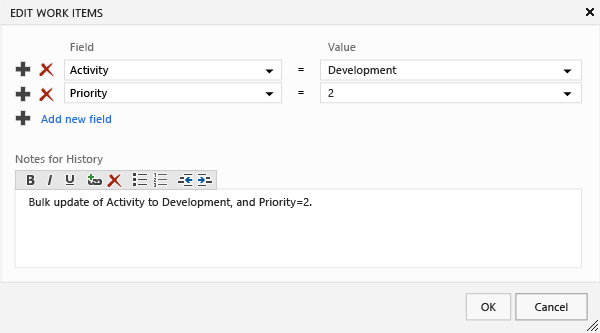

2. Save all work items that you bulk-modified. Work items shown in bold text indicate that local changes have not yet been saved to the data store.  

	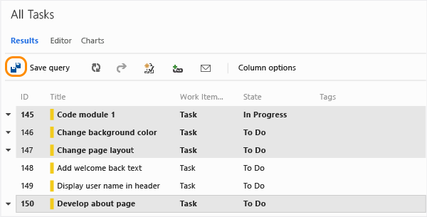  

[!INCLUDE [temp](../_shared/assign-to-sprint.md)]

## Bulk modify tags 
 
>[!NOTE]  
><b>Feature availability: </b> Bulk update of work items to add or remove tags from the web portal is currently supported only from VSTS and TFS 2015 Update 2 or later version.  To bulk edit work items when connecting to TFS 2015 Update 1 or earlier versions, [use Excel](../backlogs/office/bulk-add-modify-work-items-excel.md). 

From the Edit work items dialog, select Tags (Add) or Tags (Remove).  

Here we choose to add the Beta tag to the selected work items. 

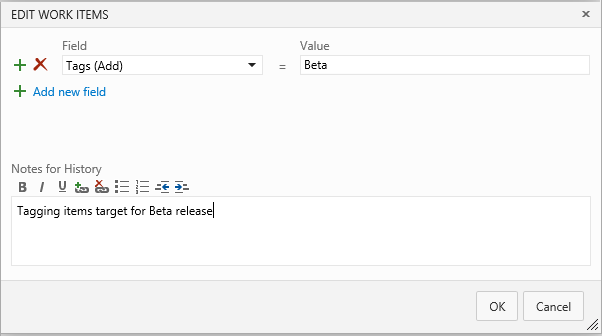  

## Related notes

To add fields or customize a work item form, see [Customize your work tracking experience](../customize/customize-work.md). The method you use depends on the process model that supports your team project.  

 
### Migrate or change a large number of work items 

For large scale, organizational moves, use the REST API calls for [Work item batch operations](https://visualstudio.com/integrate/api/wit/batch.md). 

>[!NOTE]  
>At this time, you can't move work items to a different VSTS account or TFS collection. You can only migrate work item information by exporting and then importing them using [Excel](../backlogs/office/bulk-add-modify-work-items-excel.md). 

### Add multiple values to a field (TFS)   
If you have implemented a [custom control that supports multiple values](https://marketplace.visualstudio.com/items?itemName=ms-devlabs.vsts-extensions-multivalue-control), you can use Excel to bulk edit the field, but you can't modify it using the web portal. In the web portal, you can only select a single value for the field.   

 