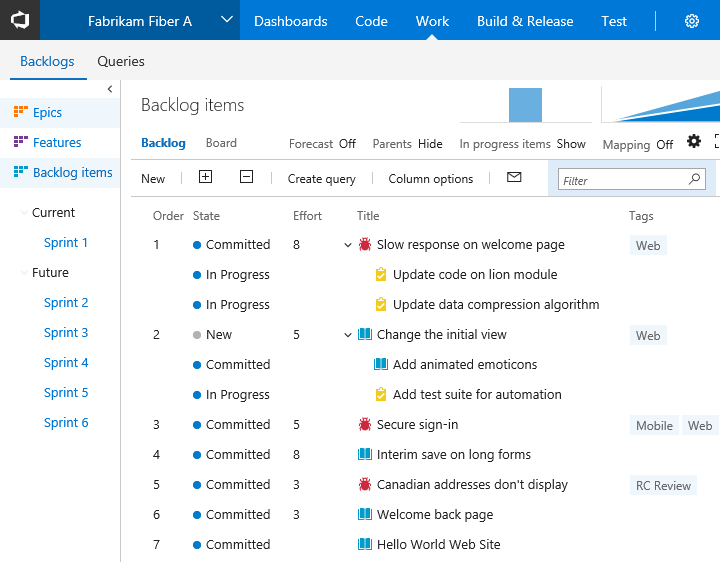

# Create your backlog

**Team Services | TFS 2017 | TFS 2015 | TFS 2013**  

Your product backlog corresponds to your project plan, the roadmap for what your team plans to deliver. 
Once defined, you have a prioritized list of features and requirements to build. Your backlog also provides a 
repository of all the information you need to track and share with your team.

A great backlog conveys customer needs and value. Over the course of the project, your team will add detailed 
information to each backlog item, break them down into smaller items, prioritize and estimate them, and finally, 
implement them and deliver the results to your customers.

>[!NOTE]  
>Your product backlog is one of three classes of backlogs available to you. For an overview of the features supported on each backlog and the two types of boards, see [Backlogs, boards, and plans](../backlogs-boards-plans.md).  

Here's a view of a backlog based on the Scrum process template. This particular backlog includes both product backlog items 
(PBIs)&mdash;shown here with blue bars&mdash;and bugs&mdash;shown with red bars. These are just two of several work item types that you 
have available to plan and track your project. Because each work item type has its own color assignment, you can quickly 
differentiate the types of work in the list.

[!INCLUDE [temp](../_shared/image-differences.md)]  

  

Your backlog consists of a list of [work items](add-work-items.md). 
You use work items to share information, assign work to team members, track dependencies, organize work, 
and more. Because the most important work appears at the top of the list, your team always knows what to work on next.


>[!NOTE]  
>Depending on the process you chose when creating your team project&mdash;[Agile](../guidance/agile-process.md), [Scrum](../guidance/scrum-process.md), or [CMMI](../guidance/cmmi-process.md)&mdash;
the items in your backlog may be called product backlog items (PBIs), user stories, or requirements. All three are similar: they describe the customer value to be delivered and the work to be performed.   
>
>By default, PBIs and bugs appear on Scrum backlogs, user stories on Agile backlogs, and requirements on CMMI backlogs. Each team can [choose how they want to treat bugs: either as requirements or tasks](../customize/show-bugs-on-backlog.md).  
 

## Convert ideas into backlog items or stories
Building your backlog starts by quickly capturing the requirements you want for your product. 

To define or manage the product backlog, you should be a member of the team and belong to the Contributors group. If you don't have access to the team project, [get invited to the team](../scale/multiple-teams.md#add-team-members).  

### Open your backlog from the web portal

You access your product backlog from the Work hub, Backlogs page.  

<div style="background-color: #f2f0ee;padding-top:10px;padding-bottom:10px;">

<ul class="nav nav-pills" style="padding-right:15px;padding-left:15px;padding-bottom:5px;vertical-align:top;font-size:18px;">

<li style="float:left;" data-toggle="collapse" data-target="#open-backlog">Open product backlog</li> 

<li style="float: right;"><a style="max-width: 374px;min-width: 120px;vertical-align: top;background-color:#AEAEAE;margin: 0px 0px 0px 8px;min-width:50px;color: #fff;border: solid 2px #AEAEAE;border-radius: 0;padding: 2px 6px 0px 6px;outline-style:none;height:32px;font-size:12px;font-weight:400" data-toggle="pill" href="#open-backlog-tfs-2015-13">TFS 2015, TFS 2013</a></li>

<li class="active" style="float: right"><a style="max-width: 374px;min-width: 120px;vertical-align: top;background-color:#007acc;margin: 0px 0px 0px 0px;min-width:90px;color: #fff;border: solid 2px #007acc;border-radius: 0;padding: 2px 6px 0px 6px;outline-style:none;height:32px;font-size:12px;font-weight:400" data-toggle="pill" href="#open-backlog-team-services">Team Services, TFS 2017</a></li>

</ul>
 
<div id="open-backlog" class="tab-content collapse in fade" style="background-color: #ffffff;margin-left:5px;margin-right:5px;padding: 5px 5px 5px 5px;">


<div id="open-backlog-team-services" class="tab-pane fade in active"> 

 

<p>The URL follows this pattern:</p>
<ul>
<li>Visual Studio Team Services: ```https://{account}.visualstudio.com/{project name}/_backlogs```</li>
<li>Team Foundation Server (on-premises): ```http://{server}:8080/tfs/DefaultCollection/{project name}/_backlogs```</li>
</ul>

<p>If you don't see the team or team project you want, click the  Team Services icon to [browse all team projects and teams](/docs/connect/account-home-pages). </p> 
<p>If you don't have a team project yet, create one in [Visual Studio Team Services](../../setup-admin/team-services/set-up-vs.md) or set one up in an [on-premises TFS](../../setup-admin/create-team-project.md). </p>  

</div>

<div id="open-backlog-tfs-2015-13" class="tab-pane fade"> 


  

<p>The URL follows this pattern:</p>
<p>```http://{server}:8080/tfs/DefaultCollection/{project name}/_backlogs```</p>

<p>If you don't see the team or team project you want, open the team project/team drop-down menu and select the team project/team that you've recently visited. If you don't see the team or team project you want, choose **Browse all** to browse all team projects and teams. </p>

 

<p>If you don't have a team project yet, create one in [Visual Studio Team Services](../../setup-admin/team-services/set-up-vs.md) or set one up in an [on-premises TFS](../../setup-admin/create-team-project.md). </p>  

</div>


</div>
</div> 

 

### Build your backlog
Begin building your backlog by entering a title and click Add. Repeat this step until you've captured all your main ideas. 


> [!TIP]  
> Your backlog shows work that you are planning to do or have started working on. As soon as the State of a work item is set to Done or Completed, the work item no longer shows up on your backlog. You can use the [backlog controls](#backlog-controls) to filter or change your view.     
  

  

If you've already defined a long list of items, you don't have to reenter them one at a time. Instead, use [Microsoft Excel](../office/bulk-add-modify-work-items-excel.md) to quickly import them to your backlog.

<a id="move-items-priority-order">  </a>
##Move items into priority order
After you've got some items on your backlog, you can order them and create a prioritized list of work. Frequently reviewing and prioritizing your backlog can help your team know what's most important to deliver next.

Reorder your backlog by simply dragging work items. Or, if you prefer the keyboard, hold the Alt key  and use the up and down arrows.

  


>[!NOTE]  
>You can't sort your backlog on a column. If you want to view a sorted listed, click **Create query**, save and open the query, and then sort the query results. To learn more about queries, see [Use the query editor to list and manage queries](../track/using-queries.md).


<a id="estimates">  </a>
## Add details and estimates
Getting your backlog built and prioritized provides the high level roadmap. 
However, before your team can actually start work on any item, they'll need 
more details. You capture these details within the work item form.


>[!TIP]  
>To plan a sprint, at a minimum you should estimate the effort involved to implement each backlog item. You capture effort in the following fields within the work item form: Effort (Scrum), Story Points (Agile), or Size (CMMI) fields. 

Open each item (double-click, or press Enter to open the selected item) and add all the info you want to track. Enter as much detail as the team needs to understand the scope, estimate the work required, develop tests, and ensure that the end product meets acceptance criteria.  

>[!NOTE]  
><b>Feature availability: </b>From the web portal for Team Services and TFS 2017, you'll have access to the [new form with the new work tracking experience](../backlogs/add-work-items.md). For TFS 2015 and earlier versions, the old form is supported.   
	
<div style="background-color: #f2f0ee;padding-top:10px;padding-bottom:10px;">
	<ul class="nav nav-pills" style="padding-right:15px;padding-left:15px;padding-bottom:5px;vertical-align:top;font-size:18px;">
	<li style="float:left;" data-toggle="collapse" data-target="#pbi-form">Product backlog item form</li> 
	<li style="float: right;"><a style="max-width: 374px;min-width: 120px;vertical-align: top;background-color:#AEAEAE;margin: 0px 0px 0px 8px;min-width:50px;color: #fff;border: solid 2px #AEAEAE;border-radius: 0;padding: 2px 6px 0px 6px;outline-style:none;height:32px;font-size:12px;font-weight:400" data-toggle="pill" href="#pbi-form-tfs-2015-13">Old form</a></li>
	<li class="active" style="float: right"><a style="max-width: 374px;min-width: 120px;vertical-align: top;background-color:#007acc;margin: 0px 0px 0px 0px;min-width:90px;color: #fff;border: solid 2px #007acc;border-radius: 0;padding: 2px 6px 0px 6px;outline-style:none;height:32px;font-size:12px;font-weight:400" data-toggle="pill" href="#pbi-form-team-services">New form</a></li>
	</ul> 
<div id="pbi-form" class="tab-content collapse in fade" style="background-color: #ffffff;margin-left:5px;margin-right:5px;padding: 5px 5px 5px 5px;">
<div id="pbi-form-team-services" class="tab-pane fade in active"> 
<p>For details on adding work items using the new form, see [add work items](add-work-items.md).</p>  

  
 
</div>
	
<div id="pbi-form-tfs-2015-13" class="tab-pane fade"> 
<p>For details on adding work items using the old form, see [add work items (TFS)](add-work-items.md).</p>  

   
	</div>
	</div>
	</div> 

 

<table valign="top" width="100%">
<tbody valign="top" >
<tr>
<th width="16%">Field</th>
<th width="84%">Usage</th>
</tr>
<tr>
<td>[Effort](../track/query-numeric.md)</td> 
<td>
<a name="estimates"></a>
<p>Provide a relative estimate of the amount of work required to complete a PBI. For user stories and requirements, you capture estimates in the Story Points and Size fields.</p> 
<p>Most Agile methods recommend setting estimates for backlog items based on relative size of work. Such methods include powers of 2 (1, 2, 4, 8) and the Fibonacci sequence (1, 2, 3, 5, 8, etc.). You can use any method that works for your team.</p>
<p>Use any numeric unit of measurement your team prefers. Some options are story points, time, or other relative numeric value. The estimates you set for Effort, Size, or Story Points are used in [calculating team velocity and in forecasting sprints](../scrum/velocity-and-forecasting.md).</p>
</td> 
</tr>

<tr>
<td>[Business Value](../track/query-numeric.md)</td> 
<td>Specify a priority that captures the relative value of a PBI compared to other PBIs. The higher the number, the greater the business value.<br />Use this field when you want to capture a priority separate from the changeable backlog stack ranking.</td> 
</tr>

<tr>
<td>[Description](../track/titles-ids-descriptions.md)</td> 
<td>Provide enough detail to create shared understanding of scope and to support estimation efforts. Focus on the user, what they want to accomplish, and why. Don't describe how to develop the product. Do provide sufficient details so that your team can write tasks and test cases to implement the item.</td> 
</tr>

<tr>
<td>[Acceptance Criteria](../track/titles-ids-descriptions.md) </td> 
<td>Define what "Done" means by describing the criteria that the team should use to verify whether the PBI or the bug fix has been fully implemented.<br />
Before work begins on a PBI or bug, describe the [criteria for customer acceptance](#acceptance) as clearly as possible. Conversations between the team and customers to determine the acceptance criteria help ensure a common understanding within the team to meet customers' expectations. Also, this info provides the basis for acceptance testing.</td> 
</tr>

</tbody>
</table>
 

### Group backlog items under parent features  

In addition to adding items to your backlog, you may want to group items in your backlog, break backlog items into smaller items, or [capture and manage spikes](#spikes) in your backlog. Breaking backlog items into smaller items minimizes the size variability of estimates. When estimates around effort or story points vary widely, it's harder to plan consistently and gain good metrics around team velocity.  

To group backlog items within a hierarchy, you can use the mapping feature to [map PBIs/user stories/requirements to features](organize-backlog.md). Another way to group items and filter your backlog is by [tagging items](../track/add-tags-to-work-items.md).  

- Use Features to track a related set of backlog items/stories that  together comprise a major feature to be delivered. 
- Use Epics to track a related set of Features that together deliver a major scenario. 

>[!NOTE]  
>[Defining Features or Epics is entirely optional](define-features-epics.md). You define them when they support your ability to group and track work. 
 
Lastly, if you work with several teams, and each team wants their own backlog view, you can [create additional teams](../scale/multiple-teams.md). Each team gets access to a set of Agile tools focused on their work based on their team's default area path.  

## Try this next
Now that you've got a working backlog in place, your team can begin work on the top priority items. From here, it's time to make the decision on how you want to work as a team: Scrum or Kanban? You can use these methods independently or together.

Teams that want the least overhead in terms of tracking and estimating may prefer Kanban. Teams that like to work at a steady cadence and plot the details of their sprint plan may prefer Scrum and sprint planning.

With [Kanban](../kanban/kanban-basics.md), teams focus on the flow of work from start to finish - limiting work in progress in order to optimize flow and deliver the highest priority items as quickly as possible.

With [Sprint planning](../scrum/sprint-planning.md), teams define a sprint schedule: a time-boxed set of periods for planning and developing. Using the sprint backlog, they plan their sprints by assigning items to the sprint and defining the tasks required to develop each item. Task boards, capacity charts, and sprint burndown charts all help to keep the team aware of progress throughout the sprint cycle.

## Related notes
As you can see, your backlog is the best place to start to plan and manage your project. A few things to keep in mind&hellip;  
- Every team owns their own backlog, to create a new backlog you [create a new team](../scale/multiple-teams.md) 
- Every backlog has a corresponding [Kanban board](../kanban/kanban-basics.md) you can use to track progress and update status  
- The [team's default area and iteration path](../scale/set-team-defaults.md) determines which work items appear on the backlog and Kanban board - you can easily decide to include or exclude work items under a specific area path   
-  Each team can control how [bugs show up on their backlogs and boards](../customize/show-bugs-on-backlog.md)   
- For an overview of all team assets and how to configure them, see [Configure team settings](../scale/manage-team-assets.md)   
- To have work performed by several teams roll up in to a portfolio backlog, you'll want to [setup the team hierarchy](../scale/portfolio-management.md) 

To add fields or work item types, see [Customize your work tracking experience](../customize/customize-work.md).

To track your work and use other resources available to you, see these topics: 

<div style="float:left;width:260px;margin:3px;font-size:90%">
<p style="font-weight:bold;padding-bottom:0px;text-align:center;">Manage</p>
<ul style="padding-left:10px">
 <li style="margin-bottom:2px">[Add work items](add-work-items.md)</li>
 <li style="margin-bottom:2px">[Manage bugs](manage-bugs.md)</li>
 <li style="margin-bottom:2px">[Copy or clone a work item](copy-clone-work-items.md#copy-clone)</li>
 <li style="margin-bottom:2px">[Change, move, or delete a work item](remove-delete-work-items.md)</li>
 <li style="margin-bottom:2px">[Pre-populate fields using a template](../productivity/work-item-template.md)</li>
 <li style="margin-bottom:2px">[Integrate with Git](connect-work-items-to-git-dev-ops.md)</li>
 <li style="margin-bottom:2px">[Productivity tips](../productivity/productivity-tips.md)</li>
 <li style="margin-bottom:2px">[Work item field index](../guidance/work-item-field.md)</li>
</ul>
</div>

<div style="float:left;width:260px;margin:3px;font-size:90%">
<p style="font-weight:bold;padding-bottom:0px;text-align:center;">Track</p>
<ul style="padding-left:20px">
<li style="margin-bottom:2px">[Queries (work items)](../track/using-queries.md)</li>
 <li style="margin-bottom:2px">[Charts](../../Report/charts.md)</li>
 <li style="margin-bottom:2px">[Dashboards](../../Report/dashboards.md)</li>
 <li style="margin-bottom:2px">[Share work plans](../track/share-plans.md)</li>
 <li style="margin-bottom:2px">[Follow a work item or pull request](../../collaborate/follow-work-items.md)</li>
 <li style="margin-bottom:2px">[Alerts](../track/alerts-and-notifications.md) </li> 
 <li style="margin-bottom:2px">[Tag work items](../track/add-tags-to-work-items.md)</li>
 <li style="margin-bottom:2px">[History & audit](../track/history-and-auditing.md)</li>
</ul>
</div>


<div style="clear:left;font-size:100%">
</div>


<a id="backlog-controls">  </a>
### Backlog controls  

Once you've defined your backlog, you can use the following controls to change or filter the view. 

> [!IMPORTANT]  
> If you set the **In progress** control to **Hide**, then items that are no longer in the New, Approved, or Proposed states won't appear in the backlog. 
>
> Also, even if you have show parents turned on, the **Create query** and mail  controls will only list items at the currently selected level.      

| Control                  | Function                      |
|--------------------------|-------------------------------|
| Backlog               | Switch to backlog view           |
| Board    | [Switch to Kanban board view](../kanban/kanban-basics.md)  |
| Forecast | [Turn forecasting Off/On](../scrum/velocity-and-forecasting.md) |
| Mapping | [Turn mapping Off/On](organize-backlog.md)   |
| Parents | [Show/Hide parents](organize-backlog.md) |
| In progress items | [Show/Hide in progress items](../scrum/velocity-and-forecasting.md)   |
|     | [Configure team settings](../scale/manage-team-assets.md#team-settings)  |
|  /      | Enter or exit full screen mode      |
|  /    | Expand or collapse one level of the tree hierarchy    |
|   | Email a copy of your backlog      |
|   | [Turn tag filtering On/Off ](../track/add-tags-to-work-items.md)  |  


See also [Keyboard shortcuts](../../reference/keyboard-shortcuts.md).    


[!INCLUDE [temp](../_shared/filter-backlog-or-board.md)]  

[!INCLUDE [temp](../_shared/assign-to-sprint.md)]  

[!INCLUDE [temp](../_shared/multi-select-bulk-modify.md)]  


<a name="project-management-queries"></a>
### Track progress with queries  

To monitor progress of your project, you can open and modify shared queries. Available predefined queries differ based on the process used (Agile, Scrum, CMMI) to create your team project. See [Use the query editor to list and manage queries](../track/using-queries.md) to learn more about customizing and defining new queries.   


<div style="float:left;width:150px;margin:3px;font-size:90%">
<p style="font-weight:bold;padding-bottom:0px;text-align:center;">[Agile](../guidance/agile-process.md)</p>
<ul style="padding-left:20px">
 <li style="margin-bottom:2px">Product Backlog</li>
 <li style="margin-bottom:2px">Product Planning </li>

</ul>
</div>

<div style="float:left;width:150px;margin:3px;font-size:90%">
<p style="font-weight:bold;padding-bottom:0px;text-align:center;">[Scrum](../guidance/scrum-process.md)</p>
<ul style="padding-left:20px">
 <li style="margin-bottom:2px">Product Backlog</li>
</ul>
</div>

<div style="float:left;width:200px;margin:3px;font-size:90%">
<p style="font-weight:bold;padding-bottom:0px;text-align:center;">[CMMI](../guidance/cmmi-process.md)</p>
<ul style="padding-left:20px">
 <li style="margin-bottom:2px">Customer Requirements</li>
 <li style="margin-bottom:2px">Open Requirements</li>
 <li style="margin-bottom:2px">Product Requirements</li>
</ul>
</div>

<div style="clear:left;font-size:100%">
</div>


<a name="product-owner-role"></a>
### Role of the product owner  
Product owners play an important role in Scrum, primarily as the interface between customers and the team. To enable product owners to perform the following responsibilities, they need to be added to the Contributors group. 

* Analyzing customer requirements and articulate them as user stories, features, or requirements  
* Building, prioritizing, and refining the product backlog  
* Representing customer and stakeholder requirements to the team and responding to questions your team has about them  
* Meeting regularly with stakeholders to address their needs and keep them informed  
* Helping stakeholders understand the decisions underlying the priority order of your backlog  
* Responding to any and all requests from your team for more information concerning backlog priorities and requirements  

If they will also be responsible for configuring team settings, [add them as a team administrator](../scale/manage-team-assets.md).  

A product owner can reduce the need for detailed specifications by being more responsive to the team's questions about implementation details and clearly articulating acceptance criteria within each requirement.


 
<a name="acceptance"></a>
### Acceptance criteria
Acceptance criteria define what "Done" means by describing the conditions that the team should use to verify whether a requirement or bug fix has been fully implemented. You can capture these criteria in the work item. Clear acceptance criteria help with estimating and developing requirements and with testing.

Product owners are the ultimate deciders of the criteria that create customer value.

<blockquote style="font-size: 13px"><p>**Tips from the trenches: Start to love and embrace acceptance criteria.**</p> <p>Ask 10 mature agile teams "How do you know when you're 
'<a href="http://blogs.msdn.com/controlpanel/blogs/posteditor.aspx/done%20done%20agile">done done</a>'?" 
and you'll get the same answer from each one. . . get serious about writing acceptance criteria.</p>
<p>Acceptance criteria are the handshake between the product owner and the team on what "done done" really means.  
Until the acceptance criteria are met, the team isn't done with the story. Period. 
However, the value of acceptance criteria only starts here.
</p><p>
Acceptance criteria provide the stage for some of most meaningful conversations and interactions 
that can happen on an agile team. On my own team we routinely have some of our best interactions as 
we start digging into the acceptance criteria for each story on our backlog. 
Inevitably we all start with our own ideas about what "done" means for a given story. 
</p>
<p>However, as we begin to discuss the acceptance criteria presented by the product owner what 
ensues is a series of "<a href="http://www.bing.com/search?q=Ah-ha moments">ah-ha moments</a>." 
A shared understanding of the story begins to emerge. A comment one team member might elicit 
the following response from someone else. . .  "Ah-ha, great point. . . I never thought of that."
</p><p>Regardless of who is being enlightened, the power is in the fact that the product owner and 
the team are building together a shared understanding of what "done" means for each backlog item.
And, this is happening before the team has written a single line of code. . .  before any work has been done. . .  
before commitments have been made. . .  and before the sprint has begun.</p>
<p>By collaborating on acceptance criteria the team is minimizing risk and greatly increasing the chance of delivering successfully. 
I don't think it's a coincidence that the first bullet in the 
<a href="http://agilemanifesto.org/">Agile Manifesto</a> states ". . . we have come to value 
<b>individual and interactions</b> over processes and tools".
Agile teams work together. And by working together, they create better software.</p> 
<p>Start learning to love acceptance criteria and see if your team isn't more successful delivering software.</p>

<p>--Aaron Bjork, Principal Product Manager, Visual Studio Cloud Services, first published in the 
blog post: <a href="http://blogs.msdn.com/b/aaronbjork/archive/2010/05/04/msf-agile-5-0-tip-5-learn-to-love-acceptance-criteria.aspx">
Agile Tip #5 – Learn to Love Acceptance Criteria</a></p> 

</blockquote>  


<a name="spikes"></a>
### Capture and manage spikes
In addition to new features and requirements to build, you can capture non-feature work that still needs to be done for a healthy ecosystem of delivery. This work can include necessary research, design, exploration, or prototyping. Any work done that doesn't directly lead to shippable software can be considered and captured as a spike.

As the need to perform this work arises, capture it along with other items on your backlog. To track that it is a spike, you can either preface the title with the word "[Spike]" or add the tag "Spike" to the work item.  


### Treat bugs like requirements or tasks
You have a choice as to how you want to manage bugs. Some teams like to track bugs along with requirements on the backlog. Other teams like to track bugs as tasks performed in support of a requirement, and have them appear on their [task board](../scrum/task-board.md).

If you're using the Scrum process, your default setup is to track bugs along with PBIs. However, if you're working in a team project based on the [Agile or CMMI processes](../guidance/choose-process.md), bugs don't automatically appear on your backlog.

Talk with your team to determine how they want to manage bugs and then [change your team settings](../customize/show-bugs-on-backlog.md) accordingly.

<a name="manage-impediments"></a>
###Manage issues or impediments
If you have known issues you want to track, you can do so by defining an impediment (Scrum) or issue (Agile or CMMI).  


<div style="background-color: #f2f0ee;padding-top:10px;padding-bottom:10px;">

<ul class="nav nav-pills" style="padding-right:15px;padding-left:15px;padding-bottom:5px;vertical-align:top;font-size:18px;">

<li style="float:left;" data-toggle="collapse" data-target="#add-impediment">Add an impediment </li> 

<li style="float: right;"><a style="max-width: 374px;min-width: 120px;vertical-align: top;background-color:#AEAEAE;margin: 0px 0px 0px 8px;min-width:50px;color: #fff;border: solid 2px #AEAEAE;border-radius: 0;padding: 2px 6px 0px 6px;outline-style:none;height:32px;font-size:12px;font-weight:400" data-toggle="pill" href="#add-impediment-tfs-2015-13">TFS 2015, TFS 2013</a></li>

<li class="active" style="float: right"><a style="max-width: 374px;min-width: 120px;vertical-align: top;background-color:#007acc;margin: 0px 0px 0px 0px;min-width:90px;color: #fff;border: solid 2px #007acc;border-radius: 0;padding: 2px 6px 0px 6px;outline-style:none;height:32px;font-size:12px;font-weight:400" data-toggle="pill" href="#add-impediment-team-services">Team Services, TFS 2017</a></li>

</ul>
 
<div id="add-impediment" class="tab-content collapse in fade" style="background-color: #ffffff;margin-left:5px;margin-right:5px;padding: 5px 5px 5px 5px;">

<div id="add-impediment-team-services" class="tab-pane fade in active"> 

<p>From the Work hub, choose Impediment from the New Work Item list of options. Click the  pin icon to have it show up within the Work hub drop down menu. </p>

  

<p>Or, from the Queries page, you can add a new work item. </p>

  


</div>

<div id="add-impediment-tfs-2015-13" class="tab-pane fade"> 

<p>From the Queries page, choose Impediment from the **New** drop down menu.</p>

  

 
</div>


</div>
</div> 


Don't confuse impediments with bugs. You track impediments that may cause problems with delivering one or more requirements. For example, you may have to address feature ambiguity, personnel or resource issues, problems with environments, or other risks that impact scope, quality, or schedule. Other issues that deserve tracking are decisions that require several stakeholders or product teams to weigh in on.
Impediments and issues represent unplanned activities. Resolving them requires more work beyond what's tracked for actual requirements. Using the impediment work item type helps you track and manage these issues until you can resolve and close them.

Impediments and issues don't appear on your backlog. Instead, you track them using [queries](../track/using-queries.md). If you want them to appear on your backlog, or you want to track other work item types on your backlog, see [Customize your work tracking experience](../customize/customize-work.md).


 


[!INCLUDE [temp](../_shared/help-support-shared.md)]  