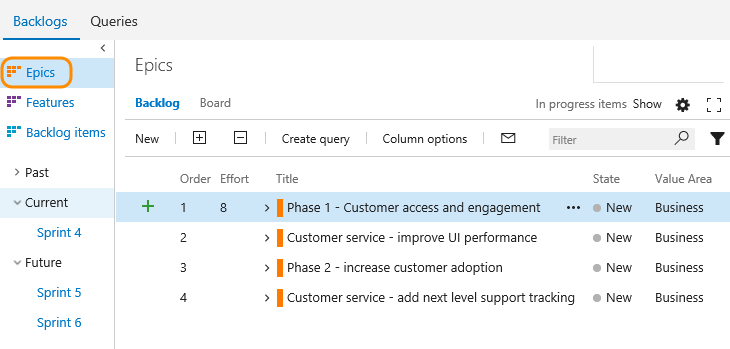
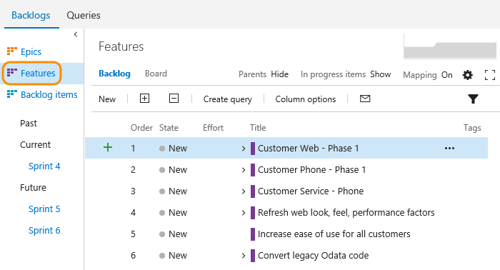
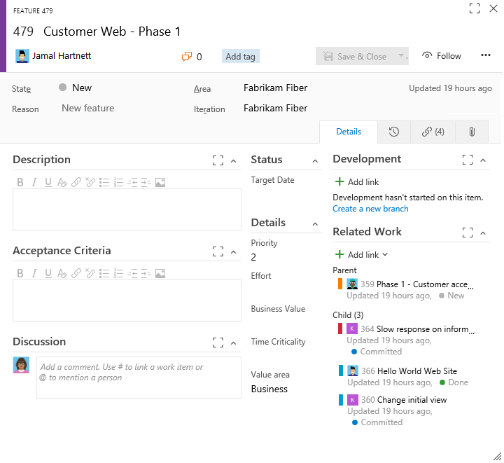
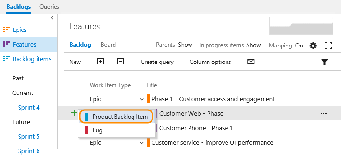
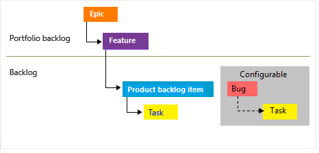

---
title: Define features and epics | VSTS & TFS  
description:  Define features and epics to group backlog items and track high level items 
ms.technology: vs-devops-wit
ms.prod: vs-devops-alm
ms.assetid: 9B517FEE-14FA-41FA-87CD-99D33168D01E  
ms.manager: douge
ms.author: kaelli
ms.topic: get-started-article
ms.date: 05/18/2017
--- 

# Define features and epics  

[!INCLUDE [temp](../_shared/dev15-version-header.md)]

While many teams can work with a flat list of items, sometimes it helps to group related items into a hierarchical structure. 
Perhaps you like to start with a big picture and break it down into smaller deliverables. 
Or, you've got an existing backlog and now need to organize it.   

No matter your starting point, you can use portfolio backlogs to bring more order to your backlog. 
Use your backlogs to plan your project and to:  
*	Manage a portfolio of features that are supported by different development and management teams  
*	Group items into a release train  
*	Minimize size variability of your deliverables by breaking down a large feature into smaller backlog items     

Use this topic to learn how to: 
> [!div class="checklist"]   
> * View a backlog or portfolio backlog  
> * Add features and epics  
> * Add child items   

With portfolio backlogs you can quickly add and group items into a hierarchy, drill up or down within the hierarchy, reorder and reparent items, and filter hierarchical views. Portfolio backlogs are one of three classes of backlogs available to you. For an overview of the features supported on each backlog and the two types of boards, see [Backlogs, boards, and plans](backlogs-boards-plans.md).  

<a id="view-portfolio-backlog" />
## View a backlog or portfolio backlog 
To focus on one level of a backlog at a time, click the name of the backlog you want to view. If you don't see all three backlog levels&mdash;
Epics, Features, and Backlog items&mdash;
you can [enable them for your team](../customize/select-backlog-navigation-levels.md). 

For example, when you click Epics, you'll see a list of all Epics in your team's active area paths. From there, you can drill down to see child features and backlog items.  

  

Click Features to see a list of all features in your team's active area paths.  

>[!NOTE]  
>**Feature availability**: Epics are supported on VSTS and TFS 2015 and later versions. Each team can choose the backlog levels that are active as described in [Select backlog navigation levels for your team](../customize/select-backlog-navigation-levels.md).  

## Add features and epics 
Just as you can [add items to your product backlog](create-your-backlog.md), you can add items to your features and epics backlogs. 
Here, we've added six features. 

  

You can add epics in the same way. Simply open the Epics backlog.  

Open each item (double-click, or press Enter to open the selected item) and add all the info you want to track. Enter as much detail as the team needs to understand the scope, estimate the work required, develop tests, and ensure that the end product meets acceptance criteria.

>[!NOTE]  
>**Reminder:** The following screenshots illustrate the work item form for VSTS. Your forms may differ depending on what you have enabled, what process you chose when creating your team project&mdash;[Agile](../work-items/guidance/agile-process.md), [Scrum](../work-items/guidance/scrum-process.md), or [CMMI](../work-items/guidance/cmmi-process.md)&mdash;and what platform you're working from, VSTS and TFS.  

 
 
<table>
<tbody valign="top">
<tr>
<th>Field</th>
<th>Usage</th>
</tr>
<tr>
<td>
[Value Area](../track/planning-ranking-priorities.md)
</td>
<td>The area of customer value addressed by the epic, feature, or backlog item. Values include:  
<ul>
<li><b>Architectural</b> – technical services to implement business features that deliver solution </li> 
<li><b>Business</b> (Default) – services that fulfill customers or stakeholder needs that directly deliver customer value to support the business </li>
</ul>
</td>
</tr>
<tr>
<td>
[Effort](../track/query-numeric.md) 
[Story Points](../track/query-numeric.md) 
[Size](../track/query-numeric.md)
</td>
<td>
Provide a relative estimate of the amount of work required to complete a Feature or Epic. Use any numeric unit of measurement your team prefers. Some options are [story points, time, or other relative unit](create-your-backlog.md#estimates). 

</td>
</tr>

<tr>
<td>

[Business Value](../track/query-numeric.md)
</td>
<td>
Specify a priority that captures the relative value of an Epic, Feature, or backlog item compared to other items of the same type. The higher the number, the greater the business value. Use this field when you want to capture a priority separate from the changeable backlog stack ranking.

</td>
</tr>

<tr>
<td>
[Time Criticality](../track/planning-ranking-priorities.md)
</td>
<td>
A subjective unit of measure that captures the how the business value decreases over time. Higher values indicate that the Epic or Feature is inherently more time critical than those items with lower values. 
</td>
</tr>
<tr>
	<td>
[Target Date](../track/query-by-date-or-current-iteration.md)
</td>
	<td>
Specify the date by which the feature should be implemented.
</td></tr>

</tbody>
</table>

## Add child items
With your features defined, you're ready to add child items to them. From any backlog, you can add child items. 
You can add features to epics, and backlog items to features. 
 
Here we add a product backlog item as a child to the Customer Web - Phase 1 feature. 

  

Whenever you see the plus  , you can add a child item. 
The work item always corresponds to the hierarchy of work item types that are defined for your team project.   

For Scrum team projects, your hierarchy is as shown: 

 

Because [teams can also set bugs as tasks](../customize/show-bugs-on-backlog.md), bugs can be added as children of PBIs. 

The work item types you'll see depends on the [process you selected to create your team project](../work-items/guidance/choose-process.md). 

If you want bugs to show up on your backlog and you're not seeing them, [enable them for your team](../customize/show-bugs-on-backlog.md). 

 
## Try this next  

Portfolio backlogs are not only a great way to organize your project plan, but also a great way to provide visibility of project plans across enterprise teams. With portfolio backlogs, management teams can gain insight into project status across all their development teams. 

> [!div class="nextstepaction"]
> [Organize your backlog](organize-backlog.md)

## Related notes  

- [Product backlog controls](product-backlog-controls.md)
- [Filter product and portfolio backlogs ](filter-backlogs.md)
- [Select backlog navigation levels for your team](../customize/select-backlog-navigation-levels.md)   
- [Work with multi-team ownership of backlog items](work-multi-team-ownership-backlogs.md)  
- [Backlog keyboard shortcuts](backlogs-keyboard-shortcuts.md)

> [!NOTE]
> To understand the features supported on each backlog and board, and how each display hierarchical items, see [Backlogs, boards, and plans](backlogs-boards-plans.md). To learn how to track progress across teams, see [Visibility across teams](../scale/visibility-across-teams.md).    
  

