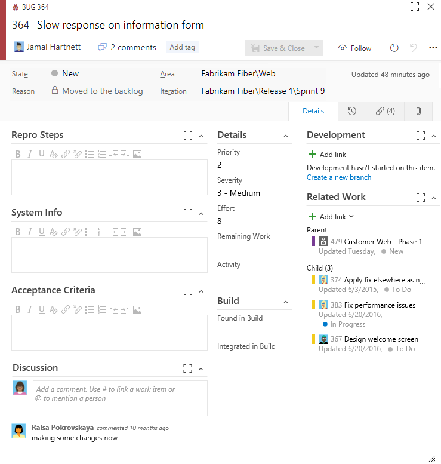
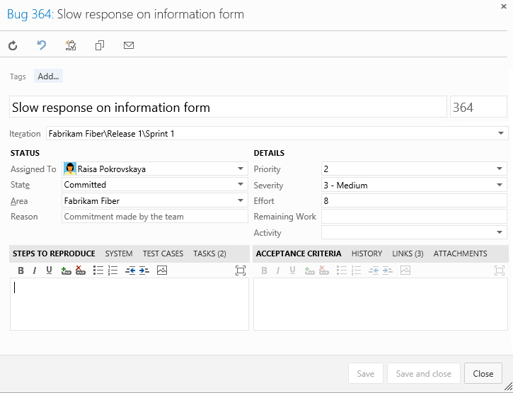
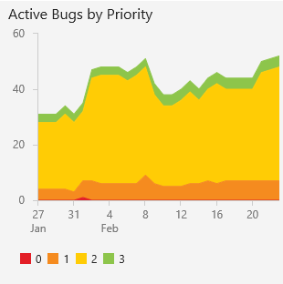
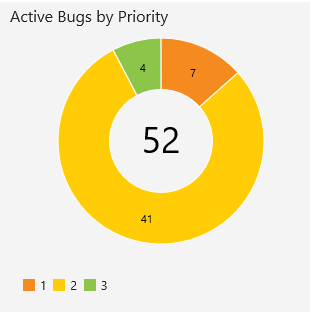

# Manage bugs

[!INCLUDE [temp](../_shared/version-vsts-tfs-all-versions.md)]
      
How do you track and manage defects in your code? How do you make sure software problems and customer feedback get addressed in a timely manner to support high-quality software deployments? And, how do you do this while making good progress on new features? 

At a minimum, you need a way to capture your software issues, prioritize them, assign them, and track progress. Moreover, you'll want to manage your bugs in ways that align with your Agile practices. 

In a nutshell, you manage bugs through the following tasks: 

> [!div class="checklist"]   
> * Capture information using the bug work item type  
> * Triage bugs by assigning a priority 
> * Update bug status throughout the bug lifecycle  
> * Monitor bug assignments and trends    

<!--- TBD  --> 
In addition, you can: 
- Capture bugs using test tools
- Configure how your team manages bugs&mdash;along with requirements or with tasks 
- Define queries and create charts of bug status, assignments, and trends
- Manage duplicate bugs by linking and closing one of them    
- Re-run test cases in the web runner using the Verify option 
- Automatically capture bugs when using the Test & Feedback extension  
- Customize the bug template  
- Interface with UserVoice or Zendesk. 

>[!NOTE]  
>Depending on the process chosen to create your team project&mdash;[Agile](../work-items/guidance/agile-process.md), [Scrum](../work-items/guidance/scrum-process.md), or [CMMI](../work-items/guidance/cmmi-process.md)&mdash;
the items in your backlog may be called product backlog items (PBIs), user stories, or requirements. All three are similar: they describe the customer value to be delivered and the work to be performed.   
>
>By default, product backlog items (PBIs) and bugs appear on Scrum backlogs, user stories on Agile backlogs, and requirements on CMMI backlogs. Each team can choose how [bugs show up on their backlogs and boards](../customize/show-bugs-on-backlog.md). 


## Capture bugs  
You can track bugs in much the same way that you track product backlog items (PBIs) or user stories. Using the bug work item form, you capture the code defect in the Title, Steps to Reproduce, and other fields.  

You can create bugs from the [web portal](add-work-items.md), Visual Studio/Team Explorer, a [work item template](work-item-template.md), or through one of the testing tools.  

### Bug work item form 

The bug work item form tracks similar information to the one shown for the Scrum process.  

>[!NOTE]  
>The images you see from your web portal may differ from the images you see in this topic. These differences result from updates made to VSTSor your on-premises TFS, options that you or your admin have enabled, and which process was chosen when creating your team project&mdash;[Agile](../work-items/guidance/agile-process.md), [Scrum](../work-items/guidance/scrum-process.md), or [CMMI](../work-items/guidance/cmmi-process.md). 


#### VSTS, TFS 2018, TFS 2017 (new form enabled)

The new web form provides a number of experiences not provided with the old web form. To learn more, see [New work item experience](../customize/process/new-work-item-experience.md). 


</div>

#### TFS 2015, TFS 2013 (old web form) 

To learn more about working in the web form for TFS 2015 or earlier versions, see [Add work items to plan and track your project](add-work-items-tfs.md). 




### Fields specific to bugs

When defining a bug, use these fields to capture both the initial issue and ongoing discoveries made when triaging, investigating, fixing, and closing the bug.  

<table>
<tbody valign="top">
<tr>
<th>
<p>Field/tab</p>
</th>
<th>
<p>Usage</p>
</th>
</tr>
<tr>
<td>
[Steps to Reproduce](../track/titles-ids-descriptions.md) (friendly name=Repro Steps)
</td>
<td>
<p>Capture enough information so that other team members can understand the full impact of the problem as well as whether they have fixed the bug. This includes actions taken to find or reproduce the bug and expected behavior. </p>
<p>Describe the criteria that the team should use to verify whether the code defect is fixed. </p>
</td>
</tr>

<tr>
<td>
<p>[System Info](../track/titles-ids-descriptions.md)</p>
</td>
<td>
<p>Information about the software and system configuration that is relevant to the test.</p>
</td>
</tr>

<tr>
	<td><p>[Acceptance Criteria](../track/titles-ids-descriptions.md)  </p></td>
	<td><p>Provide the criteria to be met before the bug or user story can be closed. Before work begins, describe the customer acceptance criteria as clearly as possible. The acceptance criteria can be used as the basis for acceptance tests so that you can more effectively evaluate whether an item has been satisfactorily completed.</p>

</td>
</tr>
<tr>
<td>
<p>[Found In Build](../track/build-test-integration.md)</p>
<p>[Integrated in Build](../track/build-test-integration.md)</p>
</td>
<td>
<p>When Test Manager creates bugs, it automatically populates **System Info** and **Found in Build** with information about the software environment and build where the bug occurred. To learn more about defining the software environments, see [Test different configurations](../../manual-test/test-different-configurations.md).</p>
<p>When you resolve the bug, use **Integrated in Build** to indicate the name of the build that incorporates the code that fixes the bug. </p>
<p>**On-premises TFS only:** To access a drop-down menu of all builds that have been run, you can update the ```FIELD``` definitions for Found in Build and Integrated in Build to reference a global list. The global list is automatically updated with each build that is run. To learn more, see [Query based on build and test integration fields](../track/build-test-integration.md)<. </p>
<p>For information about how to define build names, see [build number format options](../../build-release/concepts/definitions/build/options.md). </p>
</td>
</tr>

<tr>
<td>
[Priority](../track/planning-ranking-priorities.md) <sup>1</sup>
</td>
<td>
<p>A subjective rating of the bug as it relates to the business or customer requirements. Priority indicates the order in which code defects should be fixed. You can specify the following values:</p>
<ul>
  <li>
      **1**: Product cannot ship without the successful resolution of the work item, and it should be addressed as soon as possible.
  </li>
  <li>
      **2**: Product cannot ship without the successful resolution of the work item, but it does not need to be addressed immediately.
  </li>
  <li>
      **3**: Resolution of the work item is optional based on resources, time, and risk.
  </li>
</ul>
</td>
</tr>

<tr>
<td>
[Severity](../track/planning-ranking-priorities.md) <sup>1</sup>
</td>
<td>
A subjective rating of the impact of a bug on the project or software system. For example: If clicking a remote link (a rare event) causes an application or web page to crash (a severe customer experience), you might specify Severity = 2 - High and Priority = 3.  Allowed values and suggested guidelines are:
<ul>
  <li>
      **1 - Critical**: Must fix. A defect that causes termination of one or more system components or the complete system, or causes extensive data corruption. And, there are no acceptable alternative methods to achieve required results.
  </li>
  <li>
      **2 - High**: Consider fix. A defect that causes termination of one or more system components or the complete system, or causes extensive data corruption. However, an acceptable alternative method exists to achieve required results.
  </li>
  <li>
      **3 - Medium**: (Default) A defect that causes the system to produce incorrect, incomplete or inconsistent results.
  </li>
  <li>
      **4 - Low**: A minor or cosmetic defect that has acceptable workarounds to achieve required results. 
  </li>
</ul>
</td>
</tr>

</tbody>
</table>  
 
<sup>1</sup> To change the menu selection or pick list, see [Customize the work tracking experience](../customize/customize-work.md). The customization method depends on the process model used by your team project. 

For information about fields specific to the CMMI process, see [Bugs, issues, and risks field reference](../work-items/guidance/cmmi/guidance-bugs-issues-risks-field-reference-cmmi.md). For information about all other fields, see [Work item field index](../work-items/guidance/work-item-field.md). 


Add and review comments made about the work being performed by going to the discussion section. 


> [!TIP]
> Use the [Discussion section](../work-items/work-item-form-controls.md#discussion) to add and review comments made about the work being performed to resolve the bug. This feature is only available from the new web form.   


## Capture bugs using test tools

You can create bugs during test sessions using one of the following tools: 
- **Test & Feedback extension**: see [Exploratory testing with the Test & Feedback extension](../../manual-test/connected-mode-exploratory-testing.md)   
- **Test Runner**: see [Update an existing bug while using Test Runner](https://msdn.microsoft.com/library/dd286731.aspx).  


<a id="triage"> </a>
## Triage bugs  
 
Once you've started coding and testing, you'll want to hold periodic triage meetings to review and prioritize your bugs. How frequently you meet and for how long depends on your situation. Typically, the project owner runs the bug triage meetings, and team leads, business analysts and other stakeholders who can speak about specific project risks attend them.  

The project owner can create or open a shared query for new and reopened bugs to generate a list of bugs to be triaged.  

### Bug queries
Open a shared query or [use the query editor](../track/using-queries.md) to create useful bug queries, such as the following:
- Active bugs by priority (```State <> Done``` or ```State <> Closed```)
- In Progress bugs (```State = Committed``` or ```State = Active```)
- Bugs to fix for a target release (```Tags Contains RTM```)
- Recent bugs - bugs opened within the last 3 weeks (```Created Date > @Today-21```) 

Once you have the queries of interest to your team, you can [create status or trend charts](../../report/dashboards/charts.md) that you can also pin to a [team dashboard](../../report/dashboards/dashboards.md).  

### Triage mode in query results

From the query results page, you can quickly move up and down within the list of bug work items using the up and down arrows. As you review each bug, you can assign it, add details, or set priority. 

To learn more, see [Triage work items](../track/triage-work-items.md). 


### Assign bugs to a sprint  
Once bugs have been triaged, it's time to assign them to a sprint to get fixed. By addressing a set of bugs to get fixed every sprint, your team can keep the total number of bugs to a reasonable size.  

When bugs appear on the product backlog, you can [assign bugs to sprints in the same way you do PBIs and user stories](../scrum/sprint-planning.md) during your sprint planning sessions. 

When bugs are treated as tasks, they're often automatically linked to a PBI or user story. So, assigning their parent PBI or user story to a sprint will [assign the linked bugs to the same sprint as the parent PBI or user story](../scrum/task-board.md) during your sprint planning sessions. 
 
Your team should consider fixing all bugs found during a sprint when testing a feature in development.  

>[!TIP]
>If you work from VSTS and TFS 2015.1 and later versions, you can 
>[drag-and-drop work items onto a sprint from any backlog or board](../scrum/define-sprints.md#drag-drop-to-sprint).   


<a id="fix-resolve-close">  </a>
## Fix, resolve and close bugs (update status) 

Bug fixes that involve more than a single section of code may require significant regression testing and may involve other team members. Record any conversations that relate to assessing the risk of bug fixes in the bug work item history.


### Bug workflow lifecycle  

Once you fix a bug, you should update its workflow State. State choices vary depending on the process you use&mdash;[Scrum](../work-items/guidance/scrum-process.md), 
[Agile](../work-items/guidance/agile-process.md), or [CMMI](../work-items/guidance/cmmi-process.md). The following images illustrate the workflow lifecycle defined for the default bug workflow for the Agile, Scrum, and CMMI processes. 

| Agile | Scrum | CMMI | 
|------------|------------|-----------| 
|  |  |   |  

For Scrum bugs, you simply change the State from Committed (similar to Active) to Done. For Agile and CMMI, you first resolve the bug, indicating that the bug has been fixed. Typically, the person who created the bug then verifies the fix and updates the State from Resolved to Closed. If more work has been found after a bug has been resolved or closed, it can be reactivated by setting the State to Committed or Active. 


### Verify a fix 
To verify a fix, a developer or tester should attempt to reproduce the bug and look for additional unexpected behavior. If necessary, they should reactivate the bug.

When verifying a bug resolution, you may find that the bug was not completely fixed or you may disagree with the resolution. In this case, discuss the bug with the person who resolved it, come to an agreement, and possibly reactivate the bug. If you reactivate a bug, include the reasons for reactivating the bug in the bug description.

[!INCLUDE [temp](../_shared/verify-bug-test-runner.md)]

<a id="close">  </a>
### Close a bug  
You close a bug once it's verified as fixed. However, you may also close a bug for one of these reasons:

- Deferred - deferring a fix until the next product release
- Duplicate - bug has already been reported, you can link each bug with the Duplicate/Duplicate of link type and close one of the bugs  
- As Designed - feature works as designed
- Cannot Reproduce - tests prove that the bug can't be reproduced
- Obsolete - the bug's feature is no longer in the product
- Copied to Backlog - a PBI or user story has been opened to track the bug

It's always a good idea to describe any additional details for closing a bug in the Discussion field (new web form) or the History field (old web form) to avoid future confusion as to why the bug was closed. 

## Monitor bug status, assignments, and trends  

You can track the bug status, assignments, and trends using queries which you can then chart and add to a dashboard. 

For example, here are two examples showing active bugs by priority trend and a snapshot of bugs by priority.

      

To learn more about queries, charts, and dashboards; see [Create managed queries](../track/example-queries.md) and [Charts](../../report/dashboards/charts.md), and [Dashboards](../../report/dashboards/dashboards.md).    

## Customize the bug form

You can add fields, change the bug workflow, or customize the bug form. The method you use depends on the process model used by your team project. For details, see [Customize the work tracking experience](../customize/customize-work.md). 


## Related topics 

To track your bugs and integrate with other resources available to you, see these topics: 

- [Triage work items](../track/triage-work-items.md)
- [Scrum and working with sprints best practices](../scrum/best-practices-scrum.md)  
- [Follow a work item or pull request](../../collaborate/follow-work-items.md)
- [Move, change type, or delete work items](remove-delete-work-items.md)
- [Pre-populate fields using a template](work-item-template.md)
- [Copy or clone a work item](copy-clone-work-items.md#copy-clone)

### Integrate & Test resources
- [UserVoice](../../service-hooks/services/uservoice.md)  
- [Zendesk](../../service-hooks/services/zendesk.md)  
- [Developer testing tools scenarios and capabilities](https://docs.microsoft.com/visualstudio/test/developer-testing-scenarios)  
- [Run tests for desktop apps](../../manual-test/getting-started/run-manual-tests.md#run-desktop)  
  


### Pre-defined SQL Server bug reports (on-premises TFS only)

<!---
If you work from VSTS, you can use Power BI to access [bug reports and dashboards](../../report/powerbi/report-on-vso-with-power-bi-vs.md).
-->

If you work from an on-premises TFS and you have SQL Server Analysis Services and SQL Server Reporting Services configured for your team project, you have access to the following reports (Agile and CMMI processes only).  

- [Bug Status](../../report/sql-reports/bug-status-report.md)  
- [Bug Trends](../../report/sql-reports/bug-trends-report.md)  
- [Reactivations](../../report/sql-reports/reactivations-report.md)  

To learn how to add SQL Server reports for a team project, see [Add reports to a team project](../../report/admin/add-reports-to-a-team-project.md).  


###Use SonarQube to help manage technical debt

SonarQube provides a way of automatically measuring some technical debt. SonarQube finds important violations of best coding practices. You implement Sonar to ensure that developers follow important code metrics like appropriate class and method size or low cyclomatic complexity (a quantitative measure of the number of linearly independent paths through a program's source code).  

By integrating your on-premises TFS with a SonarQube server, you can get the following data:  
- Results of .Net and JavaScript code analysis  
- Code clone analysis  
- Code coverage data from tests  
- Metrics for .Net and JavaScript  

See [Technical Debt Management: Announcing SonarQube integration with MSBuild and Team Build](http://blogs.msdn.com/b/visualstudioalm/archive/2015/05/05/technical-debt-management-announcing-sonarqube-integration-with-msbuild-and-team-build.aspx) for details.


