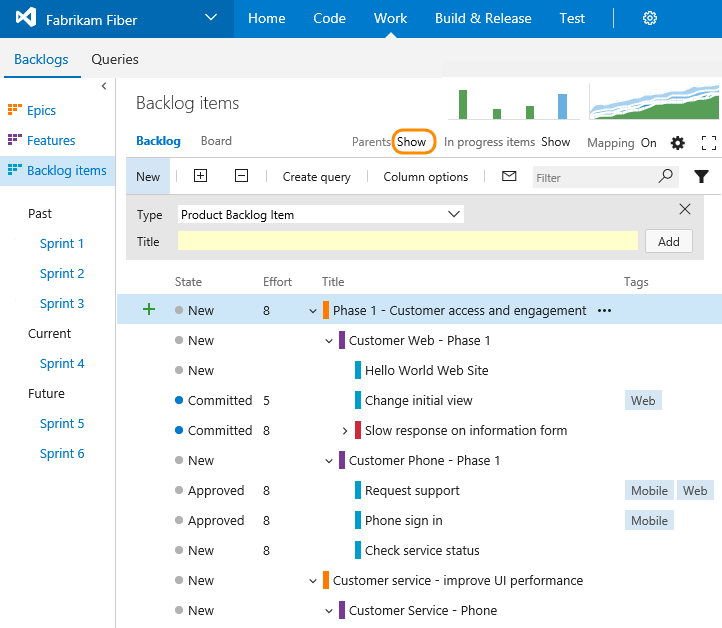
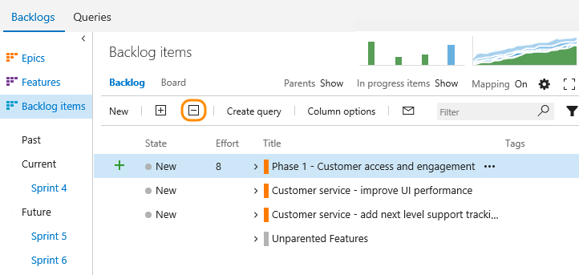
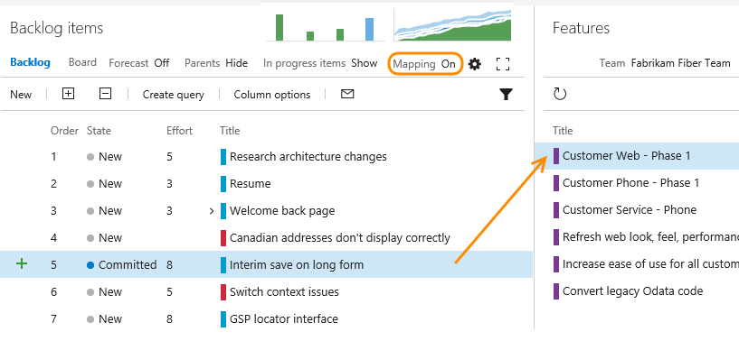
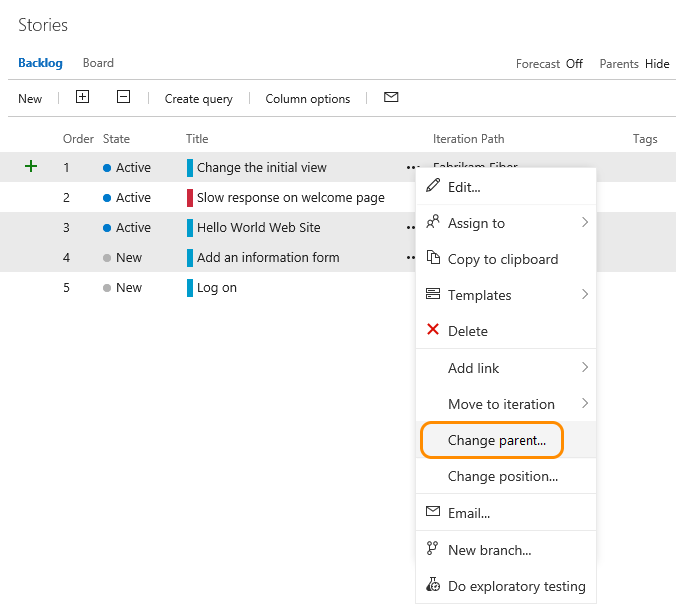

# Organize your backlog, map child work items to parents 

[!INCLUDE [temp](../_shared/version-vsts-tfs-all-versions.md)]

After you've added [features or epics](define-features-epics.md) to your portfolio backlog, you can quickly organize your backlog by mapping backlog items to them. With features and epics, you can quickly add and group items into a hierarchy, drill up or down within the hierarchy, reorder and reparent items, and filter hierarchical views.   
 

In this topic you'll learn:  

> [!div class="checklist"] 
> * How to change the backlog view to show the tree hierarchy  
> * How to group backlog items under a feature or epic using the Mapping pane  
> * How to reparent items using drag-and-drop or the **Change parent** option       

## Show parents and expand the tree hierarchy  
From the product backlog page, set Parents to Show when you want to drill up or down within the hierarchy, set Parents to Show. You can also drag and drop items to reparent items from this view. 

  

Use the expand  and collapse  icons to expand or collapse one level of the hierarchy. 
  
  

## Map items to group them under a feature or epic 
If you've already created your backlog, and now you want to organize it, you can do that most easily by mapping them.   

To map a backlog item under a feature, you first turn mapping on from your backlog (Backlog items, Stories, or Requirements). Next, find the Unparented backlog items group by turning the Parents control to Show. Unparented backlog items will appear at the end of the parented set of backlog items. 
 
Drag items that are currently unparented to the feature under which they belong. Also, you can drag a backlog item to a different feature to change its parent. This mapping creates parent-child links from feature to user stories, which is captured in the  (links) tab.

  

>[!NOTE]  
><b>Feature availability: </b> Multi-select of work items on the backlog and sprint backlogs is supported from VSTS and TFS 2015.1 or later versions. This feature works in the same way as [multi-select works within query results](../backlogs/bulk-modify-work-items.md).   

It's the same process to map features to epics. From the Features backlog, drag features to an epic listed under the mapping pane.  

## Change parent (re-parent) and reorder items
When you need to change the order or grouping, simply drag the item to its new location. 

You can re-parent an item using the mapping pane, or simply drag it within the hierarchy to change its parent.  

  

 You can only re-parent backlog items under other features, and features under other epics. 

Also, to change an item's priority within a group, you can drag the item up or down within its hierarchical group. 
This works the same as when you [moved items into priority order on your product backlog](create-your-backlog.md).   

### Change parent of multiple backlog items 

>[!NOTE]  
><b>Feature availability: </b> The **Change parent&hellip;** menu option from the backlog page is supported from VSTS. 

From the product backlog you can multi-select several work items and choose **Change parent&hellip;** to link the items to a parent work item item. 

 

## Related topics  

- [Define features and epics](define-features-epics.md)
- [Work with multi-team ownership of backlog items](work-multi-team-ownership-backlogs.md)
- [Select backlog navigation levels for your team](../customize/select-backlog-navigation-levels.md)
- [Product backlog controls](product-backlog-controls.md)
- [Filter product and portfolio backlogs ](filter-backlogs.md)
- [Backlog keyboard shortcuts](backlogs-keyboard-shortcuts.md)

[!INCLUDE [temp](../_shared/image-differences.md)]
