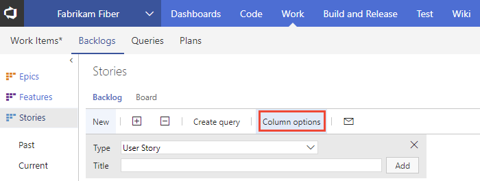
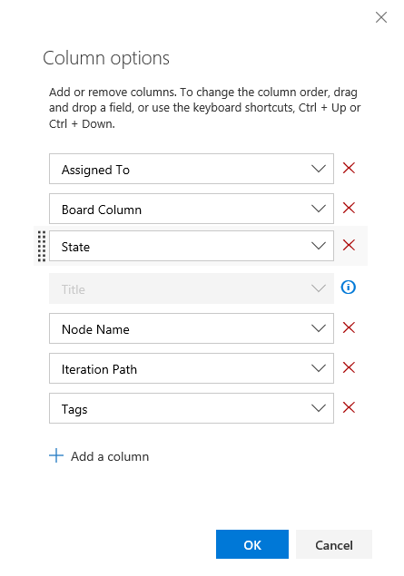
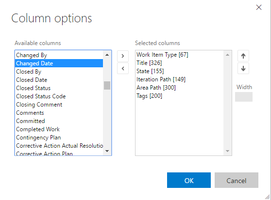
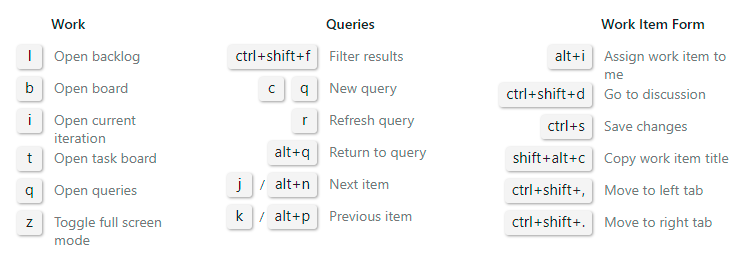

# Change column options 

[!INCLUDE [temp](../_shared/version-vsts-tfs-all-versions.md)]

From each backlog page or query, you can add or remove columns. Or, you can drag a column to a new position. Your settings persist for each page you customize and are only valid for your views.    

Start by opening the **Column Options** dialog. Each user can set their own column options which persist for each product or portfolio backlog across user sessions.    

 

> [!TIP]    
> Unlike a query result, you can't sort a backlog by a column. However, you can use the **Create Query** link on each backlog to create a query that you can sort on any field column you choose.

## VSTS 

In the Column options dialog, click **Add a column** to add a field that isn't shown. To change the order of the fields, drag-and-drop the field where you want it within the set of selected fields. And, to remove a field, click the .

 

##TFS 

Find the field you want to add from the Available columns set and click **>** (greater-than character) to move it into the Selected columns. You can then change the order of the columns with the / up and down arrows. To remove a field, select it and then click the **<** (less-than character).  
 
 

## Change the column order, column width, or sort options

You can change the column order, column size, or sort options by using the following keyboard commands:
- To change the column order, click on the field and drag it to a new location
- To re-size a column, click the column divider to the right of the field and drag to a new location  
- For query results:
	- Add the field as a column in order to sort by that field 
	- To sort by a column, hold down the shift key and click on the field
	- To reverse the sort order, shift-click on the field 
	- To sort by multiple columns, shift-click on each column in the order you want to sort   

For additional keyboard shortcuts, enter **Shift-?** to display available commands based on the page you're on. For example:

 

## Related notes
- [Backlogs, boards, and plans](backlogs-boards-plans.md)   
- [Use the query editor to create managed queries](../track/using-queries.md)  
- [Keyboard shortcuts for VSTS, TFS, and Team Explorer](../../collaborate/keyboard-shortcuts.md)
