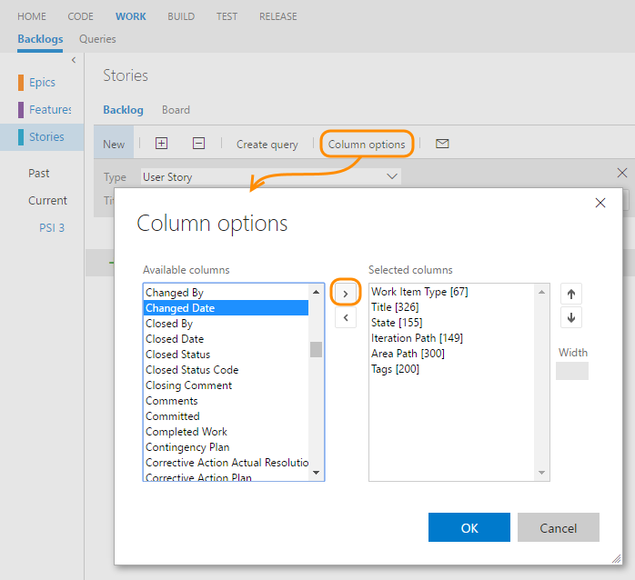

# Change column options 

[!INCLUDE [temp](../_shared/version-vsts-tfs-all-versions.md)]

From each backlog page or query, you can add or remove columns. Or, you can drag a column to a new position. 

Start by opening the Column Options.  Unlike a query result, you can't sort a backlog by column. However, you can use the Create Query option on each backlog to create a query that you can sort on any field column you choose.

Each user can set their own column options which persist for each product or portfolio backlog across user sessions.  

 

## Related notes
- [Backlogs, boards, and plans](backlogs-boards-plans.md)   
- [Use the query editor to create managed queries](../track/using-queries.md)  
